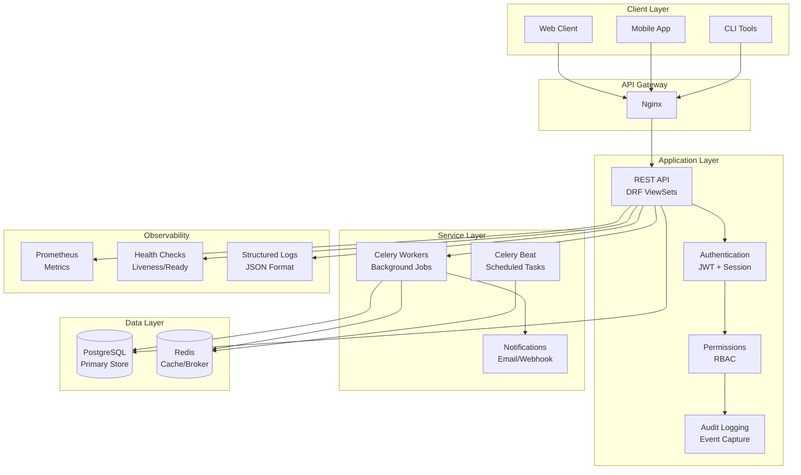
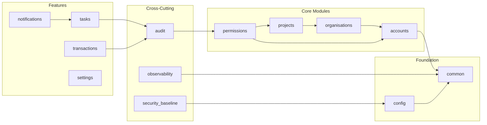
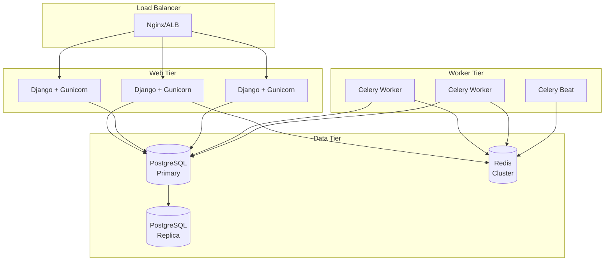

# Architecture Overview

This document provides a high-level view of the Django Core-App platform architecture.

## Platform Vision

Django Core-App is an enterprise-ready Django foundation providing:

- **Authentication & User Management** - Email-based auth with secure password handling
- **Multi-Tenant Organizations** - Hierarchical organization and project structure
- **Role-Based Access Control** - Granular permissions with inheritance
- **Audit Logging** - Immutable activity tracking
- **Task Scheduling** - Celery-based background processing
- **Security Baseline** - Constitutional enforcement and ASVS compliance
- **Observability** - Health checks, metrics, and structured logging

## Core Principles

### 1. Modular Design

Each Django app has a single responsibility and can be used independently:

```
src/
├── accounts/        # User authentication
├── organisations/   # Multi-tenancy
├── projects/        # Workspaces
├── permissions/     # RBAC
├── audit/           # Event logging
├── tasks/           # Background jobs
├── notifications/   # Multi-channel delivery
└── observability/   # Health & metrics
```

### 2. Security-First

- Secure defaults for all settings
- Constitutional enforcement engine
- Password breach detection
- Rate limiting built-in

### 3. Observability Built-In

- Prometheus metrics at `/metrics`
- Health checks at `/health/live` and `/health/ready`
- Structured JSON logging with correlation IDs
- Audit trail for all operations

## Technology Stack

| Layer | Technology | Purpose |
|-------|------------|---------|
| Language | Python 3.12+ | Core runtime |
| Framework | Django 5.1+ | Web framework |
| API | Django REST Framework 3.14+ | REST API layer |
| Database | PostgreSQL 13+ | Primary data store |
| Cache | Redis 6+ | Caching and rate limiting |
| Task Queue | Celery 5.3+ | Background processing |
| Type Safety | mypy 1.8+ | Static type checking |
| Testing | pytest 8.0+ | Test framework |

## High-Level Architecture



## Module Dependencies



## Deployment Topology



## Key Design Decisions

| Decision | ADR | Summary |
|----------|-----|---------|
| JWT Authentication | [ADR-013](../adr/013-jwt-authentication-strategy.md) | Stateless auth with refresh tokens |
| RBAC Model | [ADR-002](../adr/002-role-based-access-control.md) | Hierarchical permission inheritance |
| Password Validation | [ADR-001](../adr/001-password-validation-strategy.md) | Breach detection + complexity rules |
| URL Versioning | [ADR-014](../adr/014-url-based-api-versioning.md) | `/api/v1/` prefix for API versioning |
| Retry Policies | [ADR-016](../adr/016-notification-retry-policies.md) | Exponential backoff for notifications |

## Next Steps

- [Layers](layers.md) - Detailed layer architecture
- [Data Model](data-model.md) - Entity relationships
- [Request Flow](request-flow.md) - Request lifecycle
- [Security Model](security-model.md) - Security architecture
