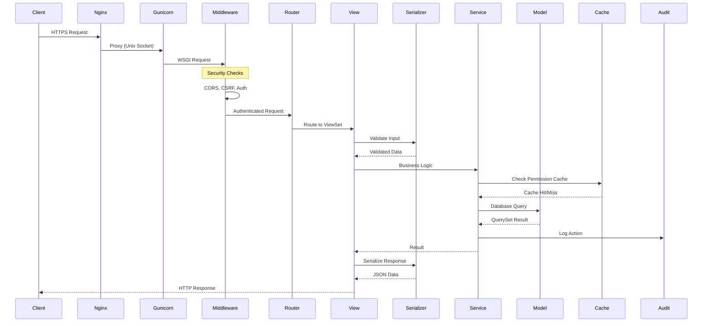
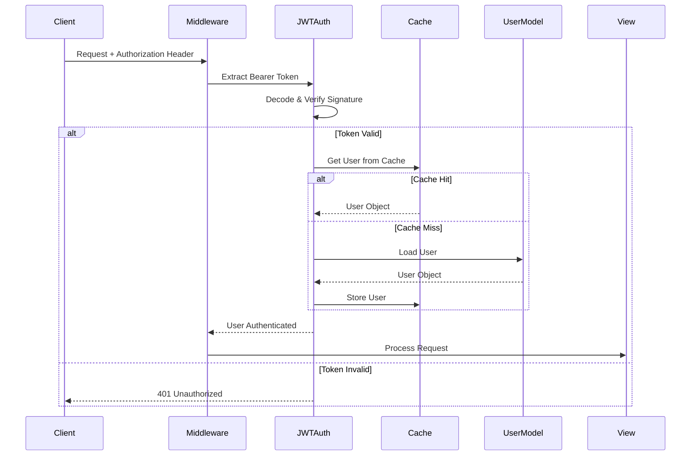
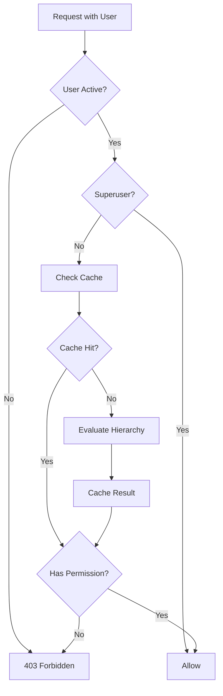
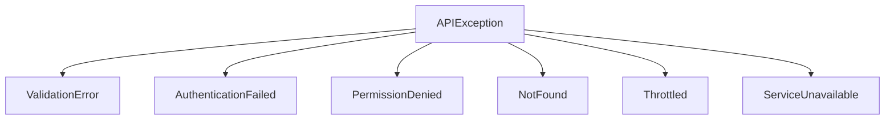
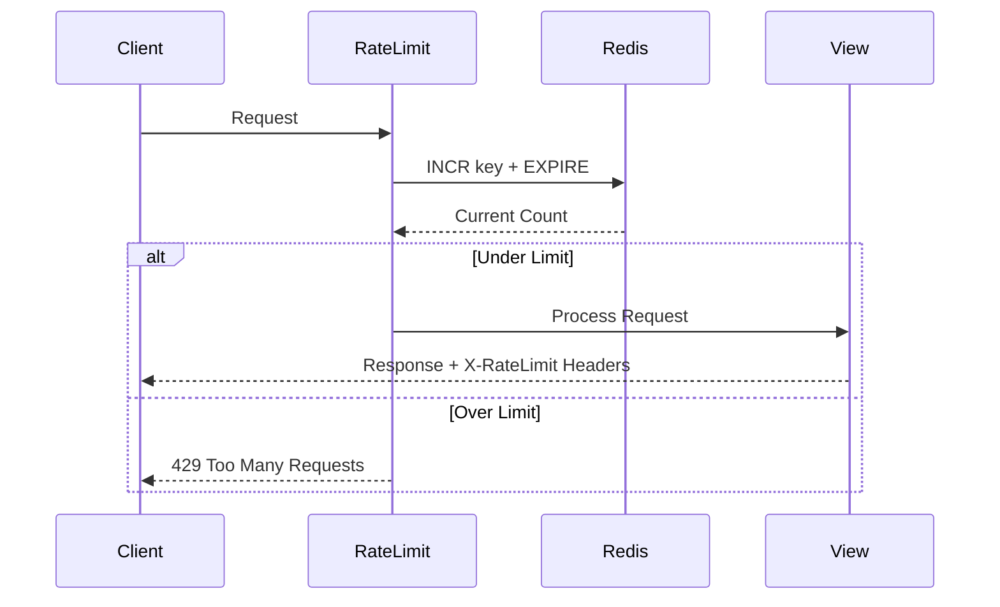

# Request Flow

This document describes how HTTP requests flow through Django Core-App.

## Request Lifecycle



## Middleware Stack

Django Core-App uses a carefully ordered middleware stack:

```python
MIDDLEWARE = [
    # 1. Security headers
    'django.middleware.security.SecurityMiddleware',

    # 2. CORS (before CSRF)
    'corsheaders.middleware.CorsMiddleware',

    # 3. Whitenoise for static files
    'whitenoise.middleware.WhiteNoiseMiddleware',

    # 4. Session handling
    'django.contrib.sessions.middleware.SessionMiddleware',

    # 5. Locale detection
    'django.middleware.locale.LocaleMiddleware',

    # 6. Common utilities
    'django.middleware.common.CommonMiddleware',

    # 7. CSRF protection
    'django.middleware.csrf.CsrfViewMiddleware',

    # 8. Authentication
    'django.contrib.auth.middleware.AuthenticationMiddleware',

    # 9. JWT token processing
    'accounts.middleware.JWTAuthenticationMiddleware',

    # 10. Request logging
    'audit.middleware.RequestLoggingMiddleware',

    # 11. Rate limiting
    'security_baseline.middleware.RateLimitMiddleware',
]
```

### Middleware Responsibilities

| Order | Middleware | Responsibility |
|-------|------------|----------------|
| 1 | SecurityMiddleware | HTTPS redirect, security headers |
| 2 | CorsMiddleware | CORS preflight handling |
| 3 | WhiteNoiseMiddleware | Serve static files |
| 4 | SessionMiddleware | Session cookie management |
| 5 | LocaleMiddleware | `Accept-Language` detection |
| 6 | CommonMiddleware | URL normalization |
| 7 | CsrfViewMiddleware | CSRF token validation |
| 8 | AuthenticationMiddleware | Django session auth |
| 9 | JWTAuthenticationMiddleware | JWT token validation |
| 10 | RequestLoggingMiddleware | Request/response audit |
| 11 | RateLimitMiddleware | Rate limit enforcement |

---

## Authentication Flow

### JWT Authentication



### Token Structure

```json
{
  "header": {
    "alg": "RS256",
    "typ": "JWT"
  },
  "payload": {
    "sub": "user-uuid",
    "email": "user@example.com",
    "org": "org-uuid",
    "exp": 1699999999,
    "iat": 1699996399
  }
}
```

---

## Permission Evaluation



### Permission Cache Key

```python
def get_cache_key(user_id, permission, scope_type, scope_id):
    """Build cache key for permission lookup."""
    return f"perm:{user_id}:{permission}:{scope_type}:{scope_id}"

# Example: perm:uuid:project.view:project:proj-uuid
```

### Hierarchical Inheritance

```python
def evaluate_permission(user, permission, resource):
    """Evaluate permission with inheritance."""
    # 1. Check resource-level permission
    if has_direct_permission(user, permission, resource):
        return True

    # 2. Check project-level permission
    if resource.project:
        if has_project_permission(user, permission, resource.project):
            return True

    # 3. Check organization-level permission
    if resource.organisation:
        if has_org_permission(user, permission, resource.organisation):
            return True

    return False
```

---

## Error Handling

### Standard Error Response

```json
{
  "type": "validation_error",
  "code": "invalid_input",
  "message": "Validation failed",
  "details": [
    {
      "field": "email",
      "code": "invalid",
      "message": "Enter a valid email address"
    }
  ],
  "request_id": "req_abc123"
}
```

### Exception Hierarchy



### Custom Exception Handler

```python
# src/api/exceptions.py
def custom_exception_handler(exc, context):
    """Handle exceptions with structured response."""
    response = exception_handler(exc, context)

    if response is not None:
        response.data = {
            'type': get_error_type(exc),
            'code': getattr(exc, 'code', 'error'),
            'message': str(exc),
            'details': getattr(exc, 'details', []),
            'request_id': context['request'].META.get('X-Request-ID'),
        }

    return response
```

---

## Rate Limiting

### Rate Limit Flow



### Rate Limit Headers

```http
X-RateLimit-Limit: 1000
X-RateLimit-Remaining: 995
X-RateLimit-Reset: 1699999999
Retry-After: 60
```

### Configuration

```python
# Different limits per endpoint
RATE_LIMITS = {
    'auth.login': '5/minute',
    'auth.register': '3/minute',
    'api.default': '1000/hour',
    'api.search': '100/minute',
}
```

---

## Request Context

### Request ID Tracking

Every request gets a unique ID for tracing:

```python
class RequestIDMiddleware:
    def __call__(self, request):
        request_id = request.META.get(
            'HTTP_X_REQUEST_ID',
            str(uuid.uuid4())
        )
        request.id = request_id

        response = self.get_response(request)
        response['X-Request-ID'] = request_id
        return response
```

### Audit Context

```python
# Captured for every request
audit_context = {
    'request_id': request.id,
    'user_id': request.user.id,
    'ip_address': get_client_ip(request),
    'user_agent': request.META.get('HTTP_USER_AGENT'),
    'method': request.method,
    'path': request.path,
}
```

---

## Related Documentation

- [Layers](layers.md) - Architecture layers
- [Security Model](security-model.md) - Security architecture
- [ADR-013: JWT Authentication Strategy](../adr/013-jwt-authentication-strategy.md)
- [ADR-014: URL-based API Versioning](../adr/014-url-based-api-versioning.md)
