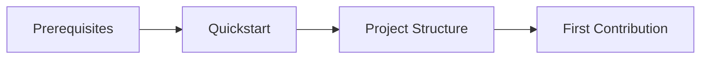

# Getting Started

Welcome to Django Core-App! This section will help you get up and running quickly.

## Recommended Reading Order

-   :material-clock-fast:{ .lg .middle } **Quickstart**

    ---

    Get a local development environment running in under 15 minutes. Includes Docker and non-Docker setup options.

    [:octicons-arrow-right-24: Quickstart Guide](quickstart.md)

-   :material-tools:{ .lg .middle } **Prerequisites**

    ---

    Required software and tools with version requirements. Install these before starting.

    [:octicons-arrow-right-24: Prerequisites](prerequisites.md)

-   :material-folder-open:{ .lg .middle } **Project Structure**

    ---

    Understand the codebase layout, directory conventions, and where to find things.

    [:octicons-arrow-right-24: Project Structure](project-structure.md)

-   :material-git:{ .lg .middle } **First Contribution**

    ---

    Step-by-step guide to making your first code contribution, from fork to merged PR.

    [:octicons-arrow-right-24: First Contribution](first-contribution.md)

## Quick Start Path

1. **Check [Prerequisites](prerequisites.md)** - Ensure you have Python 3.12+, PostgreSQL, and Redis
2. **Follow [Quickstart](quickstart.md)** - Get the project running locally (~15 minutes)
3. **Explore [Project Structure](project-structure.md)** - Understand how the code is organized
4. **Make your [First Contribution](first-contribution.md)** - Submit your first PR

## Need Help?

-   :material-bug:{ .lg .middle } **[Troubleshooting](../troubleshooting/index.md)**

    ---

    Common issues and solutions for local development

-   :material-help-circle:{ .lg .middle } **[Contributing Guide](../contributing/index.md)**

    ---

    Development guidelines, code style, and PR process

-   :material-school:{ .lg .middle } **[Architecture](../architecture/index.md)**

    ---

    System design and how components fit together

