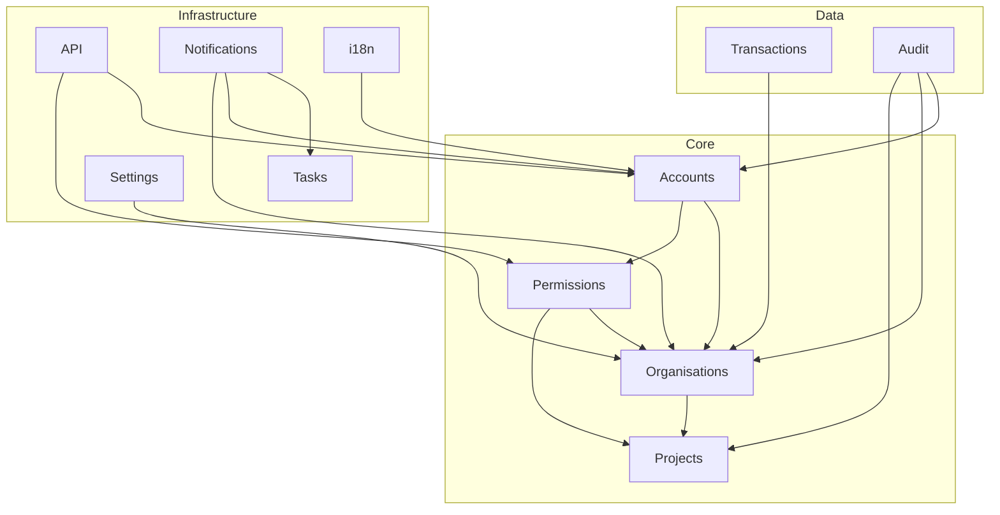

# Module Reference

Documentation for each Core module, including purpose, models, API endpoints, and configuration.

## Core Modules

| Module | Description | Status |
|--------|-------------|--------|
| [Accounts](accounts.md) | User authentication and management | ✓ |
| [Organisations](organisations.md) | Multi-tenant organisation management | ✓ |
| [Projects](projects.md) | Project and workspace management | ✓ |
| [Permissions](permissions.md) | Hierarchical role-based access control | ✓ |
| [Audit](audit.md) | Audit logging and event tracking | ✓ |
| [Tasks](tasks.md) | Background task scheduling (Celery) | ✓ |
| [Notifications](notifications.md) | Notification delivery system | ✓ |
| [Transactions](transactions.md) | Credits and transaction ledger | ✓ |
| [Settings](settings.md) | Configuration and feature flags | ✓ |
| [I18n](i18n.md) | Internationalization preferences | ✓ |
| [API](api.md) | REST API foundation (DRF) | ✓ |

## Module Dependencies



## Module Documentation Structure

Each module document follows a consistent structure:

1. **Overview** - Purpose and key concepts
2. **Configuration** - Settings and environment variables
3. **Models** - Database entities and relationships
4. **API Endpoints** - REST endpoints (with Swagger links)
5. **Usage Examples** - Common patterns and code samples
6. **Related Features** - Links to ADRs and related modules

## Quick Reference

### Authentication

```python
from accounts.models import User
from accounts.permissions import IsAdmin

# Check user roles
if user.is_superadmin:
    pass  # Platform admin
elif user.is_admin:
    pass  # Tenant admin
```

### Permissions

```python
from permissions.evaluator import PermissionEvaluator

evaluator = PermissionEvaluator()
if evaluator.check_permission(user, 'project.delete', project):
    project.delete()
```

### Multi-Tenancy

```python
from organisations.models import Organisation

# User's organizations
orgs = Organisation.objects.filter(
    memberships__user=user,
    memberships__is_active=True,
)
```

### Audit Logging

```python
from audit.api import audit_log

audit_log.record(
    'resource.created',
    user=request.user,
    organization=org,
)
```

## Related Documentation

- [Architecture Overview](../architecture/overview.md) - System architecture
- [Architecture Layers](../architecture/layers.md) - Layered design
- [Data Model](../architecture/data-model.md) - Entity relationships
