# System Visualisatie

## Overzicht
Dit document biedt visuele schema's van de Django Core-App architectuur, bedoeld voor zowel technische als niet-technische stakeholders.

---

## 1. High-Level Architectuur: De 3 Lagen

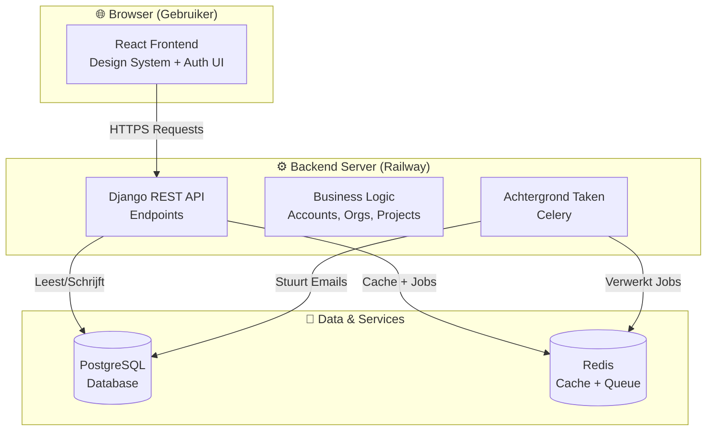

**Wat betekent dit?**
- **🌐 Browser**: Wat de gebruiker ziet (knoppen, formulieren, lijsten).
- **⚙️ Backend**: De "hersenen" die beslissingen nemen en data verwerken.
- **💾 Database**: Waar alle data permanent wordt opgeslagen (gebruikers, projecten, bestanden).

---

## 2. Data Hiërarchie: Wie Hoort Bij Wie?

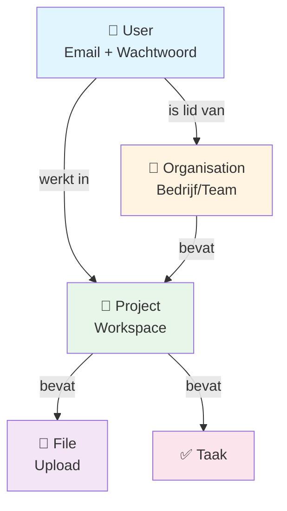

**Voorbeeld (Voetbal Liga):**
- 👤 **User**: "Jan de Scheidsrechter"
- 🏢 **Organisation**: "Eredivisie"
- 📁 **Project**: "Seizoen 2025/2026"
- 📎 **File**: "Wedstrijdverslag Ajax-Feyenoord.pdf"

### 2.1 Permissions Hierarchy

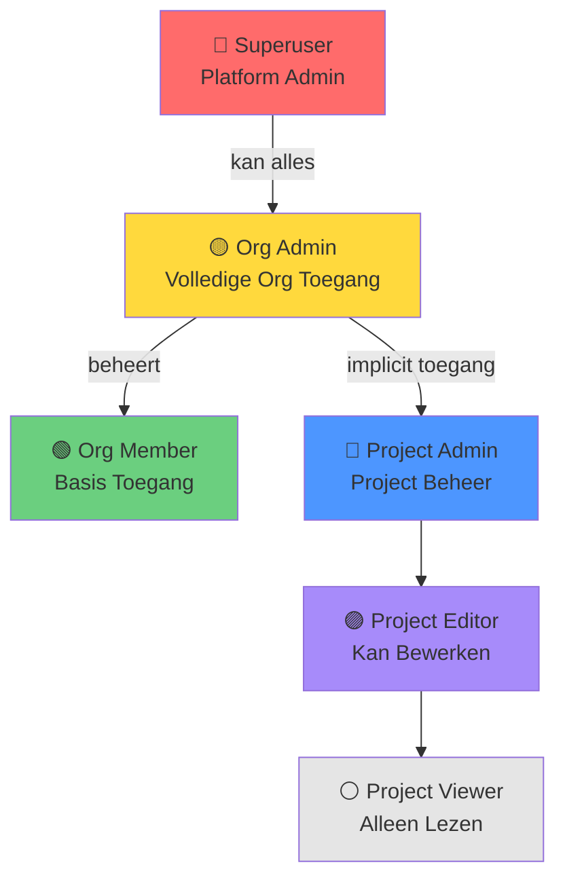

**Rechten Overzicht:**
- 🔴 **Superuser**: Ziet alles, kan alles. Bedoeld voor platform onderhoud.
- 🟡 **Org Admin**: Volledige controle over 1 organisatie. Kan projecten aanmaken, leden uitnodigen.
- 🟢 **Org Member**: Basis toegang. Kan projecten zien (tenzij private).
- 🔵 **Project Admin**: Kan project settings wijzigen, leden toevoegen.
- 🟣 **Project Editor**: Kan bestanden uploaden, taken aanmaken.
- ⚪ **Project Viewer**: Alleen lezen, geen wijzigingen.

---

## 3. Wat Gebeurt Er Bij Login?

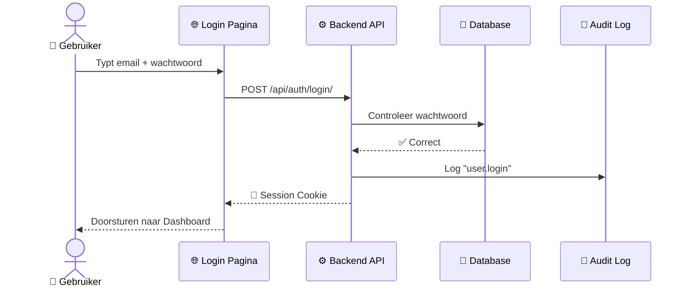

**Stap-voor-stap:**
1. Gebruiker typt inloggegevens.
2. Frontend stuurt verzoek naar Backend.
3. Backend checkt wachtwoord in Database.
4. Als correct: maak sessie aan.
5. Alles wordt gelogd voor beveiliging.

---

## 4. Wat Gebeurt Er Bij Bestand Uploaden?

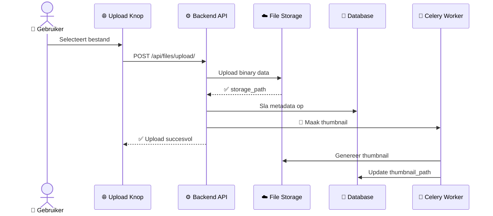

**Stap-voor-stap:**
1. Gebruiker klikt "Upload" en kiest bestand.
2. Backend slaat bestand op in Cloud Storage (S3/R2).
3. Metadata (naam, grootte, type) gaat naar Database.
4. **Achtergrond taak** maakt thumbnail (zodat pagina niet "bevriest").
5. Thumbnail wordt later toegevoegd.

---

## 5. Feature Capabilities Overzicht

### 5.1 Dark/Light Mode (Theming)

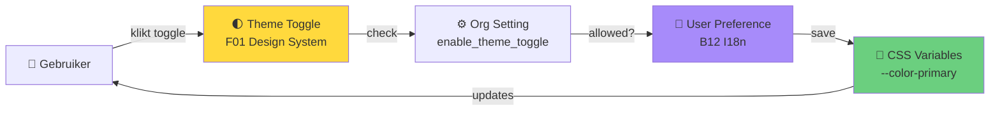

**Hoe het werkt:**
1. Gebruiker klikt op 🌓 toggle in de UI (F01 Design System).
2. Check of `Organisation.enable_theme_toggle = True`.
3. Sla voorkeur op in `B12 I18n Preferences`.
4. Update CSS custom properties (`--color-primary`, `--bg-color`, etc.).
5. Alle componenten gebruiken deze variabelen en updaten automatisch.

### 5.2 Credits & Usage Tracking

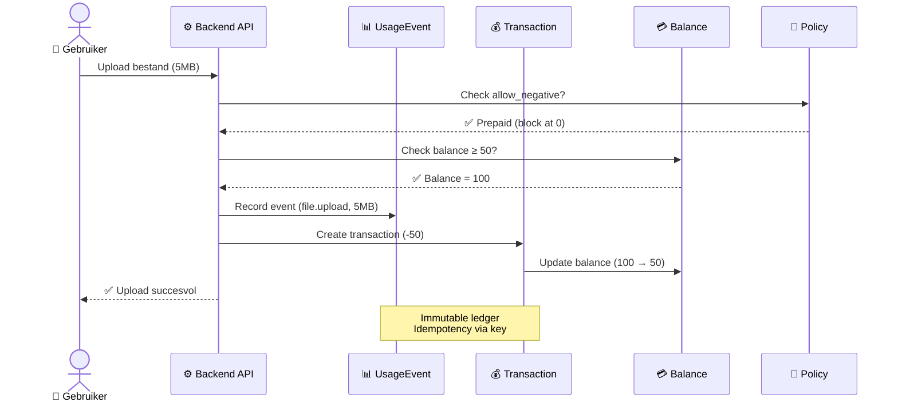

**Transactie Flow:**
1. **Check Policy**: Is negatief toegestaan? (Prepaid vs Postpaid)
2. **Check Balance**: Genoeg credits?
3. **Record Usage**: Log de actie in `UsageEvent`.
4. **Create Transaction**: Voeg transactie toe aan ledger (signed amount).
5. **Update Balance**: Trek credits af van `CreditsBalance`.

### 5.3 Notificatie Delivery Pipeline

```mermaid
graph TB
    TRIGGER[🔔 Trigger Event<br/>"File uploaded"]
    TYPE[📋 NotificationType<br/>default/password_reset]
    CHANNEL{📡 Channel?}
    EMAIL[📧 Email<br/>Celery Task]
    INAPP[📱 In-App<br/>DB Record]
    WEBHOOK[🔗 Webhook<br/>HTTP POST]
    RETRY[🔄 Retry Policy<br/>3x with backoff]

    TRIGGER --> TYPE
    TYPE --> CHANNEL
    CHANNEL -->|email| EMAIL
    CHANNEL -->|in_app| INAPP
    CHANNEL -->|webhook| WEBHOOK
    EMAIL --> RETRY
    WEBHOOK --> RETRY
    RETRY -->|failed 3x| INAPP

    style TRIGGER fill:#ffd93d
    style EMAIL fill:#ff6b6b
    style INAPP fill:#6bcf7f
    style WEBHOOK fill:#4d96ff
```

**Notification Flow:**
1. Trigger event (file upload, comment, etc.).
2. Lookup `NotificationType` (heeft default channel).
3. Route naar channel: Email, In-App, of Webhook.
4. Email/Webhook: Async via Celery met retry policy.
5. In-App: Direct opslaan in DB, verschijnt in F04 Notification Hub.
6. Failed deliveries: Fallback naar In-App.

### 5.4 Search Ranking & Filtering

```mermaid
graph LR
    QUERY[🔍 Search Query<br/>"Ajax wedstrijd"]
    INDEX[📚 FTS Index<br/>PostgreSQL]
    RANK[📊 Ranking<br/>ts_rank]
    FILTER[🔒 Access Filter<br/>Permissions]
    RESULTS[📝 Results<br/>Sorted]

    QUERY --> INDEX
    INDEX --> RANK
    RANK --> FILTER
    FILTER --> RESULTS

    style QUERY fill:#ffd93d
    style RANK fill:#a78bfa
    style FILTER fill:#ff6b6b
    style RESULTS fill:#6bcf7f
```

**Search Process:**
1. Query komt binnen (`/api/search/?q=keyword`).
2. PostgreSQL Full-Text Search (B24) zoekt in index.
3. Ranking op basis van relevance (`ts_rank`).
4. **Permissions Filter (B08)**: Verwijder results waar user geen toegang tot heeft.
5. Return sorted results.

---

## 6. De Volledige Module Kaart

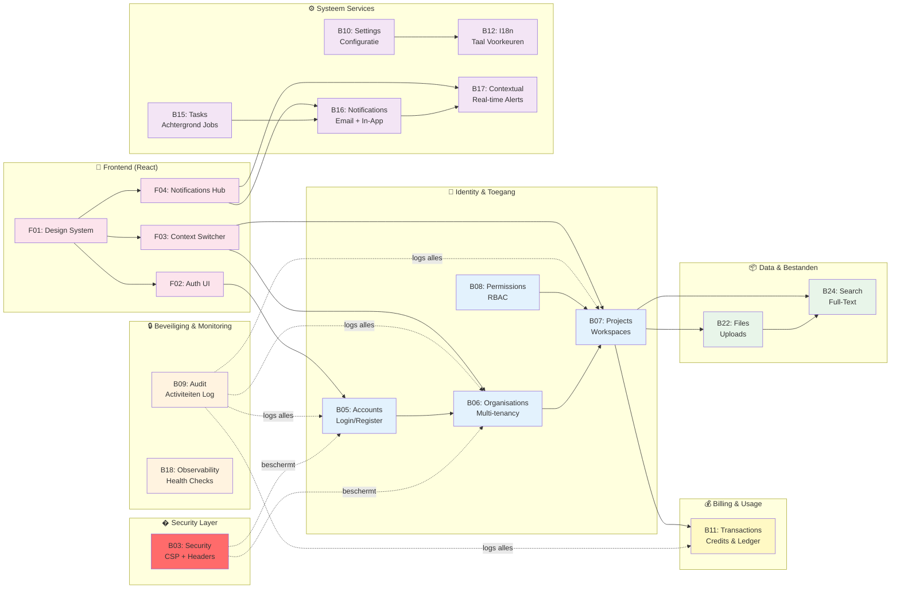

**Legenda:**
- **Rode vakken**: Security laag (beschermt alles)
- **Blauwe vakken**: Wie heeft toegang?
- **Oranje vakken**: Wat wordt gelogd en gemonitord?
- **Paarse vakken**: Hoe werkt het systeem?
- **Gele vakken**: Billing en usage tracking
- **Groene vakken**: Waar is de data?
- **Roze vakken**: Wat ziet de gebruiker?

---

## 7. Deployment: Hoe Draait Het In Productie?

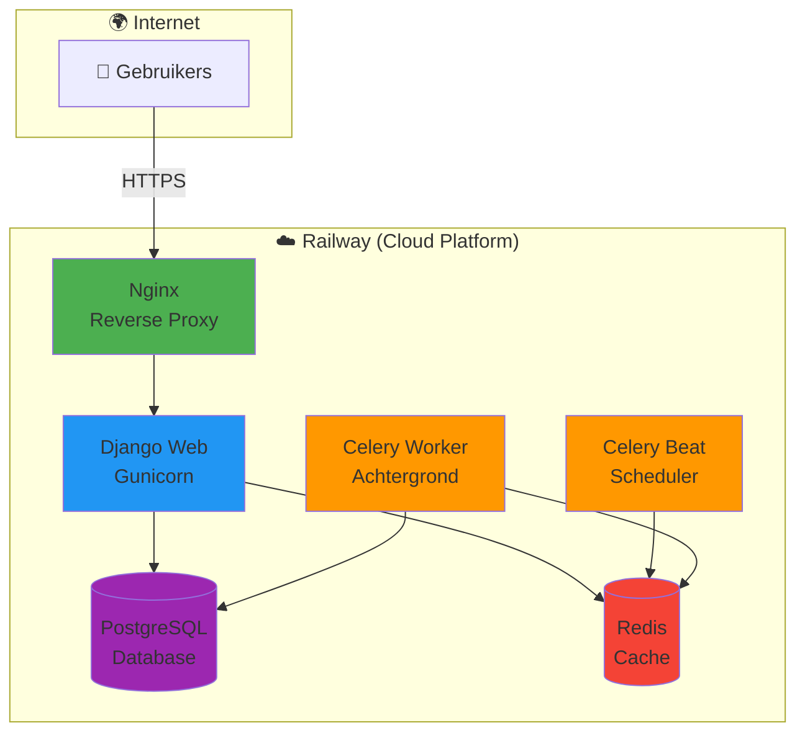

**Wat betekent dit?**
- **Nginx**: "Portier" die requests ontvangt en doorstuurt.
- **Django Web**: Verwerkt pagina's en API requests.
- **Celery Beat**: "Wekker" die elke 10 minuten taken start.
- **Celery Worker**: Voert zware taken uit (emails, thumbnails).
- **PostgreSQL**: De "kluis" met alle data.
- **Redis**: "Snelle plank" voor tijdelijke data en job queue.

---

## 8. Typische Gebruikers Journey

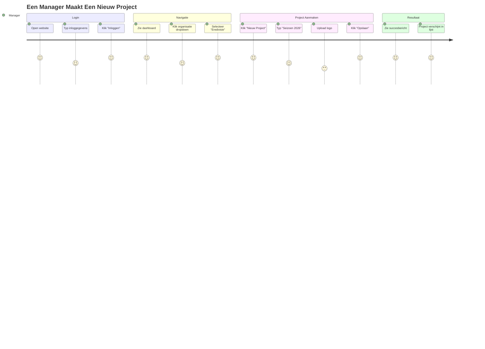

**Score Legenda:**
- 5 = 😄 Makkelijk
- 3 = 😐 Neutraal
- 1 = 😞 Moeilijk

---

## 9. Wat Komt Er Nog? (Roadmap)

### 🚧 In Ontwikkeling

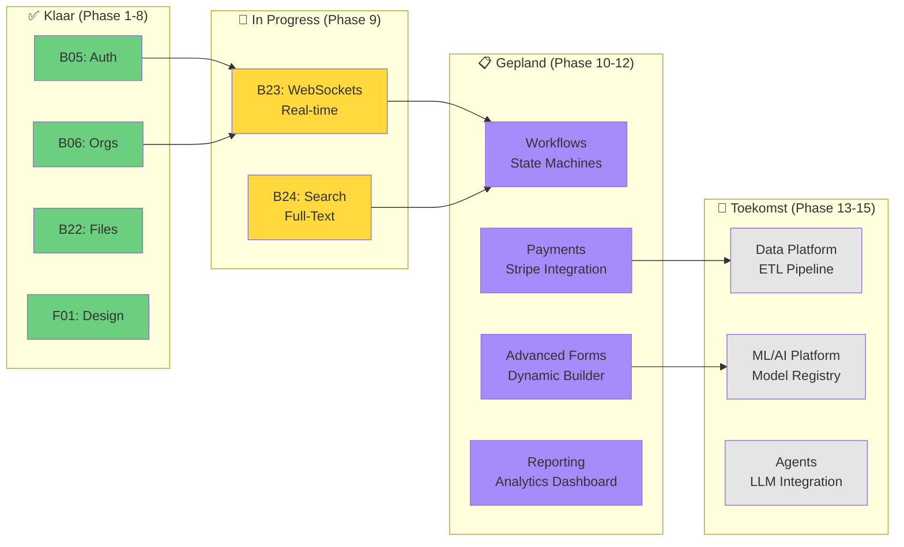

### 🚧 Phase 9: Backend Infrastructure (Q1 2026)

**B23: Real-time Infrastructure (WebSockets)**
- Live notificaties zonder pagina refresh
- Real-time collaboration ("User X is typing...")
- Django Channels + Redis

**B24: Full-Text Search (In Progress)**
- Zoeken over Projects, Files, Comments
- Elasticsearch migratie (nu: PostgreSQL FTS)
- Faceted search (filter op type, datum, owner)

### 📋 Phase 10-12: Advanced Features (Q2-Q3 2026)

**Workflows & State Machines**
- Approval flows ("Manager moet goedkeuren")
- Custom pipelines per Organisatie
- Audit trail per workflow step

**Payment Integration**
- Stripe checkout
- Subscription management
- Invoice generation

**Advanced Forms**
- Drag-and-drop form builder
- Conditional logic ("Toon veld X als Y = Z")
- Form versioning

**Reporting & Analytics**
- Pre-built dashboards (usage, costs, activity)
- Export naar PDF/Excel
- Scheduled reports via email

### 🔮 Phase 13-15: Data & AI Platform (Q4 2026+)

**Data Foundations**
- ETL pipeline voor data aggregatie
- Data lineage tracking
- Data validation rules

**ML/AI Platform**
- Model training infrastructure
- Feature engineering pipeline
- A/B testing framework

**AI Agents**
- LLM integration (OpenAI, Anthropic)
- Custom AI assistants per Organisatie
- Retrieval-Augmented Generation (RAG)

### ⏳ Tijdlijn

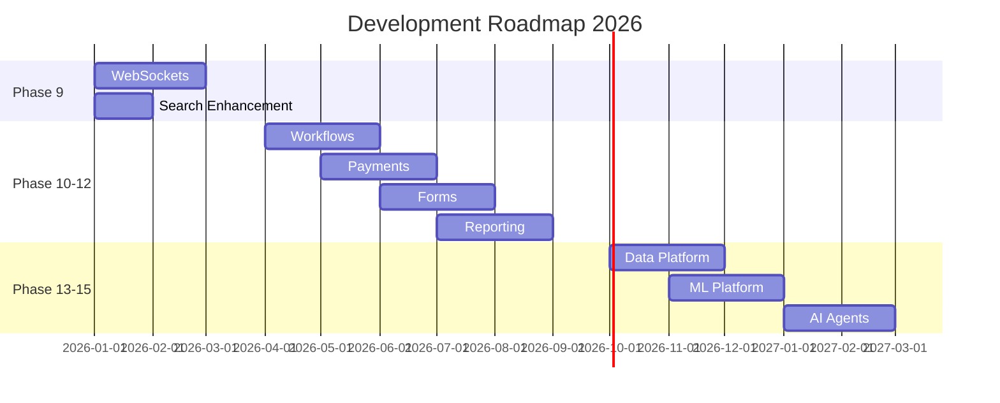

---

## 10. Veelgestelde Vragen (Non-Technical)

### "Waar staat mijn data?"
Op **Railway's PostgreSQL servers** in de cloud. Dit wordt automatisch elke dag gebackupt.

### "Wat gebeurt er als de server crasht?"
Railway detecteert dit binnen 30 seconden en start automatisch een nieuwe server op. Data blijft behouden.

### "Kan ik zien wie wat heeft gedaan?"
Ja! **B09 Audit Logging** slaat elke belangrijke actie op (wie, wat, wanneer). Dit is onveranderbaar voor compliance.

### "Hoe werkt de billing/credits?"
**B11 Transactions** houdt bij hoeveel credits een Organisatie heeft en trekt credits af bij gebruik (file uploads, API calls, etc.). Het systeem kan voorkomen dat gebruikers acties uitvoeren als credits op zijn (prepaid) of negatief laten gaan (postpaid).

### "Kunnen verschillende teams verschillende rechten hebben?"
Ja! **B08 Permissions** biedt Role-Based Access Control (RBAC). Je kunt rollen toekennen op 3 niveaus:
- **Global**: Platform administrators
- **Organisation**: Organisatie admins en members
- **Project**: Project-specifieke rechten (viewer, editor, admin)

### "Hoeveel gebruikers kan het aan?"
De huidige setup ondersteunt **~1000 gelijktijdige gebruikers**. Bij groei kan Railway automatisch opschalen.

### "Is het veilig?"
Ja! **B03 Security Baseline** zorgt voor:
- ✅ HTTPS (versleutelde verbinding)
- ✅ CSP (Content Security Policy tegen XSS)
- ✅ CSRF bescherming (geen kwaadaardige requests)
- ✅ Password hashing (wachtwoorden zijn niet leesbaar)
- ✅ Security headers (HSTS, X-Frame-Options)
- ✅ Audit logs (alles wordt geregistreerd)

---

## Bronnen
- Technische details: [architecture.md](architecture.md)
- Module overzicht: [../04-modules/index.md](../04-modules/index.md)
- Railway setup: [../07-operations/railway-integration.md](../07-operations/railway-integration.md)
