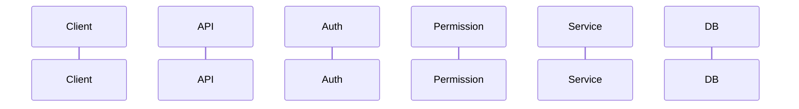

# Work Package Prompt: WP04 – Architecture Documentation

## Objectives & Success Criteria

**Goal**: Document system architecture with Mermaid diagrams for visual clarity.

**Success Criteria**:
- Developers understand high-level platform architecture
- Request flow is visualized with Mermaid diagrams
- Data model shows entity relationships
- ADRs are discoverable and indexed

## Context & Constraints

**Reference Documents**:
- `kitty-specs/021-docs-examples/spec.md` - User Story 3, FR-031 through FR-036
- `docs/adr/*.md` - Existing 18 ADRs to index
- `kitty-specs/*/spec.md` - Feature specs for architecture context

**Dependencies**: WP01 (directory structure), WP02 (getting started)

**Diagram Standard**: Mermaid code blocks (GitHub-renderable)

## Subtasks & Detailed Guidance

### T025 – Write `docs/architecture/overview.md`

**Purpose**: High-level platform architecture overview.

**Content Structure**:
1. **Platform Vision**: What is django-core?
2. **Core Principles**:
   - Modular design
   - Security-first
   - Observability built-in
3. **Tech Stack Summary**:
   - Python 3.12+, Django 5.1+
   - PostgreSQL, Redis
   - Celery for async tasks
4. **High-Level Diagram** (Mermaid):
   ```mermaid
   graph TB
       subgraph "Core Platform"
           API[API Layer]
           Auth[Authentication]
           Perms[Permissions]
           Audit[Audit Logging]
           Tasks[Task Queue]
       end
       subgraph "Data Layer"
           PG[(PostgreSQL)]
           Redis[(Redis)]
       end
   ```

**Files**: `docs/architecture/overview.md`

### T026 – Write `docs/architecture/layers.md` [P]

**Purpose**: Explain the layered architecture.

**Content**:
1. **Presentation Layer**: REST API (DRF)
2. **Business Logic Layer**: Services, permissions
3. **Data Access Layer**: Django ORM, models
4. **Infrastructure Layer**: Celery, Redis, logging

**Include** layer interaction diagram (Mermaid).

**Files**: `docs/architecture/layers.md`

### T027 – Write `docs/architecture/data-model.md` [P]

**Purpose**: Document entity relationships.

**Content**:
1. **Core Entities**: User, Organisation, Project
2. **Permission Model**: Role, RoleAssignment
3. **Audit Trail**: AuditEvent
4. **ER Diagram** (Mermaid):
   ```mermaid
   erDiagram
       User ||--o{ Organisation : member
       Organisation ||--o{ Project : contains
       User ||--o{ RoleAssignment : has
       Role ||--o{ RoleAssignment : assigned
   ```

**Files**: `docs/architecture/data-model.md`

### T028 – Write `docs/architecture/request-flow.md` [P]

**Purpose**: Document typical API request lifecycle.

**Content**:
1. **Request Entry**: URL routing
2. **Authentication**: JWT verification
3. **Permission Check**: Hierarchical access control
4. **Business Logic**: View/serializer processing
5. **Audit Logging**: Event capture
6. **Response**: Serialization

**Include** sequence diagram (Mermaid):


**Files**: `docs/architecture/request-flow.md`

### T029 – Write `docs/architecture/async-patterns.md`

**Purpose**: Document Celery task patterns.

**Content**:
1. **Task Registration**: How to create tasks
2. **Task Types**: Regular, periodic, chained
3. **Error Handling**: Retries, dead letter
4. **Monitoring**: Task observability
5. **Best Practices**: Idempotency, timeouts

**Files**: `docs/architecture/async-patterns.md`

### T030 – Write `docs/architecture/security-model.md`

**Purpose**: Document security architecture.

**Content**:
1. **Authentication**: JWT strategy (ADR-013)
2. **Authorization**: RBAC model (ADR-002)
3. **Password Security**: Validation strategy (ADR-001)
4. **Rate Limiting**: Request throttling
5. **Security Headers**: CSP, CORS

**Files**: `docs/architecture/security-model.md`

### T031 – Write `docs/architecture/adr/index.md` [P]

**Purpose**: ADR index with categories and summaries.

**Content Structure**:
1. **What is an ADR?**: Brief explanation
2. **ADR Template**: Link to template
3. **Categories**:
   - Authentication & Authorization
   - Data Management
   - API Design
   - Notifications
   - Security
4. **ADR Table**: ID, Title, Status, Date

**Files**: `docs/architecture/adr/index.md`

### T032 – Update `docs/architecture/index.md`

**Purpose**: Architecture section landing page.

**Content**:
- Overview of architecture documentation
- Links to each architecture document
- Quick navigation guide

**Files**: `docs/architecture/index.md`

### T033 – Migrate ADRs to new location

**Purpose**: Move ADRs from `docs/adr/` to `docs/architecture/adr/`.

**Steps**:
1. Create `docs/architecture/adr/` directory
2. Copy all ADR files
3. Update any cross-references
4. Keep old location as symlink or redirect

**Files**: `docs/architecture/adr/*.md`

## Risks & Mitigations

| Risk | Mitigation |
|------|------------|
| Diagrams become stale | Use automated diagram generation where possible |
| Architecture changes | Link diagrams to source code comments |

## Definition of Done Checklist

- [ ] T025: overview.md provides high-level view
- [ ] T026: layers.md explains architecture layers
- [ ] T027: data-model.md shows entity relationships
- [ ] T028: request-flow.md visualizes request lifecycle
- [ ] T029: async-patterns.md documents Celery usage
- [ ] T030: security-model.md documents security architecture
- [ ] T031: ADR index categorizes all decisions
- [ ] T032: index.md links all architecture docs
- [ ] T033: ADRs migrated to new location
- [ ] All Mermaid diagrams render in GitHub
- [ ] `tasks.md` updated with completion status

## Review Guidance

- Verify diagrams match actual code structure
- Check ADR references are accurate
- Confirm technical accuracy with feature specs

## Activity Log

- 2025-12-04T21:30:00Z – system – lane=planned – Prompt created.
- 2025-12-05T12:23:34Z – system – shell_pid= – lane=done – Code review approved: All architecture documentation complete
