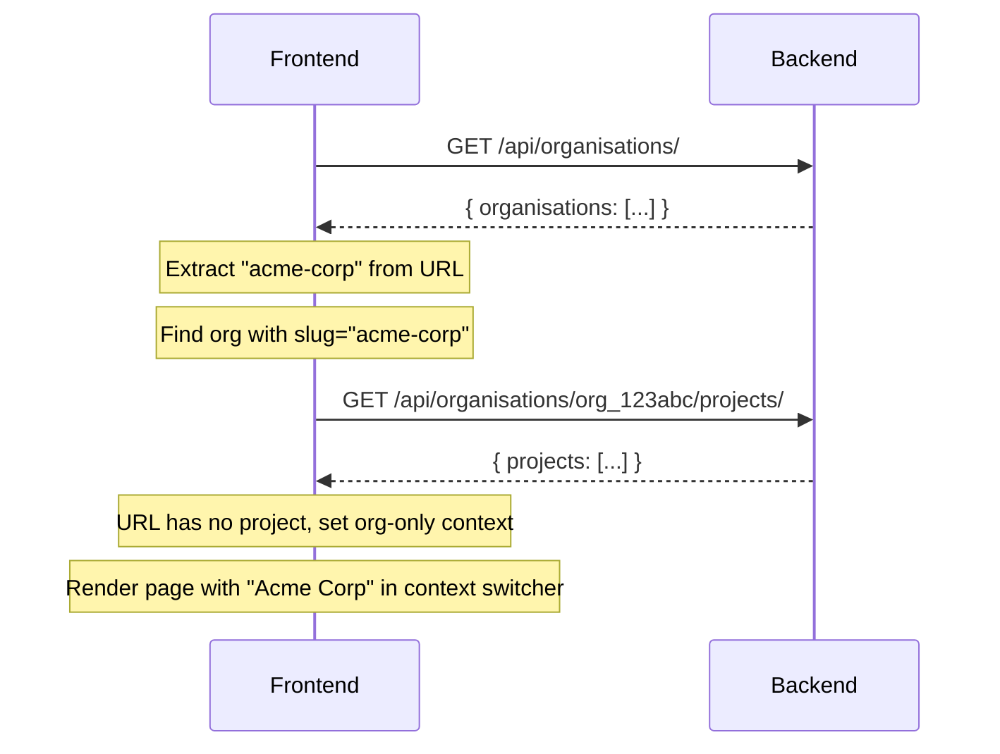
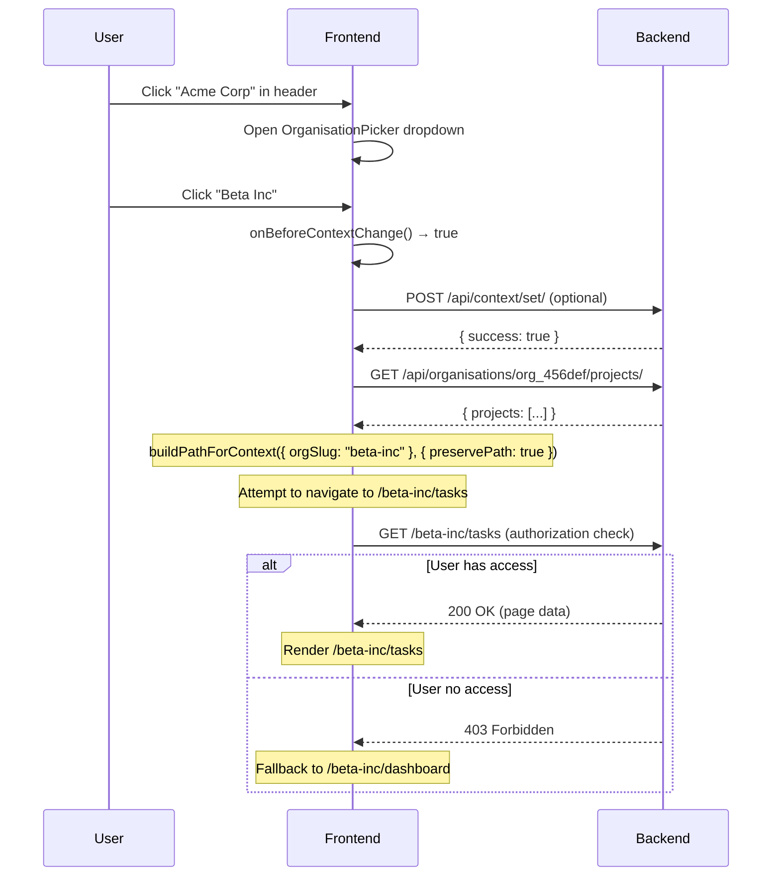
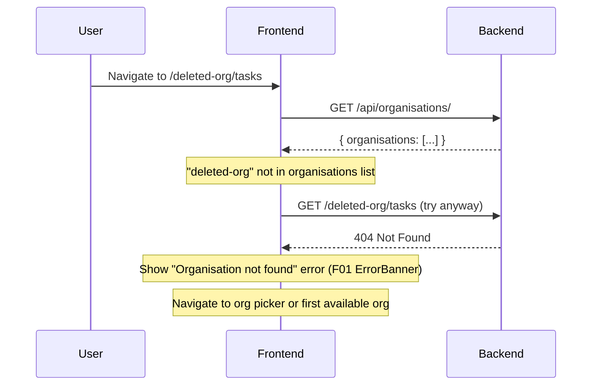

# API Contracts: Multi-Tenancy Context Switcher
*Path: kitty-specs/024-multi-tenancy-context/contracts/api-contracts.md*

**Feature**: F03 Multi-Tenancy Context Switcher
**Date**: 2025-12-09
**Backend Integration**: B06 (Organisations), B07 (Projects), B08 (Authorization), B13 (API Baseline)

## Overview

This document specifies the backend API endpoints required for the context switcher to function. All endpoints must follow B13 API baseline standards (JSON envelopes, CSRF protection, standardized error format).

**Authorization**: All endpoints enforce B08 authorization rules. Only organisations and projects the authenticated user has access to are returned.

---

## Endpoints

### 1. List Organisations

Get all organisations the authenticated user has access to.

**Endpoint**: `GET /api/organisations/`

**Authentication**: Required (session or token)

**Authorization**: B08 - Returns only orgs where user has any role

**Request**:
```http
GET /api/organisations/ HTTP/1.1
Host: api.example.com
Cookie: sessionid=...
X-CSRFToken: ...
```

**Success Response** (200 OK):
```json
{
  "organisations": [
    {
      "id": "org_123abc",
      "name": "Acme Corporation",
      "slug": "acme-corp",
      "logo": "https://cdn.example.com/logos/acme.png",
      "metadata": {
        "isPinned": false,
        "lastVisitedAt": "2025-12-08T14:30:00Z"
      }
    },
    {
      "id": "org_456def",
      "name": "Beta Inc",
      "slug": "beta-inc",
      "logo": null,
      "metadata": {
        "isPinned": true,
        "lastVisitedAt": "2025-12-09T09:15:00Z"
      }
    }
  ]
}
```

**Error Responses**:

| Status | Scenario | Response Body |
|--------|----------|---------------|
| 401 | Not authenticated | `{ "error": { "code": 401, "message": "Authentication required" } }` |
| 500 | Server error | `{ "error": { "code": 500, "message": "Internal server error" } }` |

**Notes**:
- Empty list is valid (user has no org access yet)
- `metadata` fields (`isPinned`, `lastVisitedAt`) are optional
- Results should be ordered by: `isPinned DESC`, `lastVisitedAt DESC`, `name ASC`

---

### 2. List Projects

Get all projects in a specific organisation that the user has access to.

**Endpoint**: `GET /api/organisations/{org_id}/projects/`

**Authentication**: Required

**Authorization**: B08 - Returns only projects where user has any role in this org

**Request**:
```http
GET /api/organisations/org_123abc/projects/ HTTP/1.1
Host: api.example.com
Cookie: sessionid=...
X-CSRFToken: ...
```

**Success Response** (200 OK):
```json
{
  "projects": [
    {
      "id": "proj_789ghi",
      "name": "Website Redesign",
      "slug": "website-redesign",
      "organisationId": "org_123abc",
      "metadata": {
        "isArchived": false,
        "lastVisitedAt": "2025-12-09T10:00:00Z"
      }
    },
    {
      "id": "proj_012jkl",
      "name": "Mobile App",
      "slug": "mobile-app",
      "organisationId": "org_123abc",
      "metadata": {
        "isArchived": false,
        "lastVisitedAt": "2025-12-07T16:45:00Z"
      }
    }
  ]
}
```

**Error Responses**:

| Status | Scenario | Response Body |
|--------|----------|---------------|
| 401 | Not authenticated | `{ "error": { "code": 401, "message": "Authentication required" } }` |
| 403 | User has no access to this org | `{ "error": { "code": 403, "message": "You do not have access to this organisation" } }` |
| 404 | Organisation not found | `{ "error": { "code": 404, "message": "Organisation not found" } }` |
| 500 | Server error | `{ "error": { "code": 500, "message": "Internal server error" } }` |

**Notes**:
- Empty list is valid (org has no projects, or user has org access but no project access)
- `metadata.isArchived` can be used to filter out archived projects client-side
- Results should be ordered by: `isArchived ASC`, `lastVisitedAt DESC`, `name ASC`

---

### 3. Get Current Context (Optional)

Get the user's currently active organisation and project context.

**Endpoint**: `GET /api/context/current/`

**Authentication**: Required

**Authorization**: N/A (returns user's own context)

**Request**:
```http
GET /api/context/current/ HTTP/1.1
Host: api.example.com
Cookie: sessionid=...
X-CSRFToken: ...
```

**Success Response** (200 OK):
```json
{
  "organisationId": "org_123abc",
  "projectId": "proj_789ghi"
}
```

**Or (no context set)**:
```json
{
  "organisationId": null,
  "projectId": null
}
```

**Error Responses**:

| Status | Scenario | Response Body |
|--------|----------|---------------|
| 401 | Not authenticated | `{ "error": { "code": 401, "message": "Authentication required" } }` |
| 500 | Server error | `{ "error": { "code": 500, "message": "Internal server error" } }` |

**Notes**:
- This endpoint is **optional**. If not implemented, frontend will use URL-based context or prompt user to select.
- `projectId` can be null even if `organisationId` is set (org-only context).
- Context is stored per-user in the backend (e.g., in B06 user profile or separate context model).

---

### 4. Set Current Context (Optional)

Set the user's currently active organisation and project context (for server-side memory).

**Endpoint**: `POST /api/context/set/`

**Authentication**: Required

**Authorization**: B08 - User must have access to the specified org/project

**Request**:
```http
POST /api/context/set/ HTTP/1.1
Host: api.example.com
Content-Type: application/json
Cookie: sessionid=...
X-CSRFToken: ...

{
  "organisationId": "org_123abc",
  "projectId": "proj_789ghi"
}
```

**Or (org-only context)**:
```json
{
  "organisationId": "org_123abc",
  "projectId": null
}
```

**Success Response** (200 OK):
```json
{
  "success": true
}
```

**Error Responses**:

| Status | Scenario | Response Body |
|--------|----------|---------------|
| 400 | Invalid request body | `{ "error": { "code": 400, "message": "Invalid request", "fieldErrors": { "organisationId": ["This field is required"] } } }` |
| 401 | Not authenticated | `{ "error": { "code": 401, "message": "Authentication required" } }` |
| 403 | User has no access to org/project | `{ "error": { "code": 403, "message": "You do not have access to this organisation or project" } }` |
| 404 | Org or project not found | `{ "error": { "code": 404, "message": "Organisation or project not found" } }` |
| 500 | Server error | `{ "error": { "code": 500, "message": "Internal server error" } }` |

**Notes**:
- This endpoint is **optional**. If not implemented, frontend will remember last-visited project in localStorage.
- Backend should validate that `projectId` belongs to `organisationId` if both are provided.
- Setting context does NOT perform authorization checks for specific resources; it only records user preference.

---

## CSRF Protection

All mutating requests (POST, PUT, PATCH, DELETE) must include:

1. **Cookie**: `csrftoken=...` (Django sets this automatically)
2. **Header**: `X-CSRFToken: <token-value>` (extracted from cookie)

The shared `@django-core/api-client` package will handle this automatically.

---

## Error Response Format (B13 Standard)

All error responses follow this structure:

```typescript
{
  "error": {
    "code": number,        // HTTP status code
    "message": string,     // User-facing error message
    "fieldErrors"?: {      // Field-specific validation errors (optional)
      [fieldName: string]: string[]
    },
    "formErrors"?: string[] // Form-level validation errors (optional)
  }
}
```

**Example**:
```json
{
  "error": {
    "code": 403,
    "message": "You do not have access to this organisation",
    "fieldErrors": {},
    "formErrors": []
  }
}
```

---

## Rate Limiting

Backend should implement rate limiting on these endpoints to prevent abuse:

- **List Organisations**: 100 requests / minute / user
- **List Projects**: 100 requests / minute / user
- **Get/Set Context**: 200 requests / minute / user

If rate limit exceeded, return:
```json
{
  "error": {
    "code": 429,
    "message": "Too many requests. Please try again in 60 seconds."
  }
}
```

---

## Pagination

**For MVP**: Pagination is NOT required. Frontend will handle large lists via virtualization.

**Future Enhancement**: If organisations or projects exceed 1000+ items, consider:

```http
GET /api/organisations/?page=2&page_size=100
```

Response:
```json
{
  "organisations": [...],
  "pagination": {
    "page": 2,
    "pageSize": 100,
    "totalPages": 10,
    "totalCount": 987
  }
}
```

---

## Search/Filter (Future)

**For MVP**: Search is client-side (3-char minimum, 300ms debounce).

**Future Enhancement**: If search needs to be server-side:

```http
GET /api/organisations/?search=acme
```

Backend performs case-insensitive substring match on `name` and `slug`.

---

## Example Integration Flow

### 1. Initial Page Load (URL: `/acme-corp/tasks`)



### 2. User Switches Organisation (Acme → Beta)



### 3. Deep Link with Invalid Context (URL: `/deleted-org/tasks`)



---

## Testing Checklist

### Backend Implementation

- [ ] All endpoints return correct HTTP status codes
- [ ] CSRF protection enforced on POST requests
- [ ] B08 authorization checks on all endpoints
- [ ] Error responses follow B13 envelope format
- [ ] Rate limiting configured and tested
- [ ] Metadata fields (`isPinned`, `lastVisitedAt`) populated correctly
- [ ] Slug uniqueness enforced (org slugs globally, project slugs per-org)

### Frontend Integration

- [ ] Shared api-client handles CSRF tokens automatically
- [ ] Error normalizer extracts user-facing messages from B13 envelopes
- [ ] 401 responses trigger redirect to login
- [ ] 403/404 responses show appropriate fallback UIs
- [ ] Network errors (timeout, offline) handled gracefully with retry action
- [ ] Context memory (last-visited project) uses backend if available, falls back to localStorage

---

## Summary

This contract defines:
- ✅ 4 backend endpoints (2 required, 2 optional)
- ✅ B13-compliant request/response formats
- ✅ CSRF protection requirements
- ✅ B08 authorization integration
- ✅ Error handling patterns
- ✅ Rate limiting expectations
- ✅ Future enhancement paths (pagination, server-side search)

Frontend (`@django-core/context-switcher`) will integrate via shared `@django-core/api-client` package, ensuring consistent CSRF handling and error normalization across all API calls.
