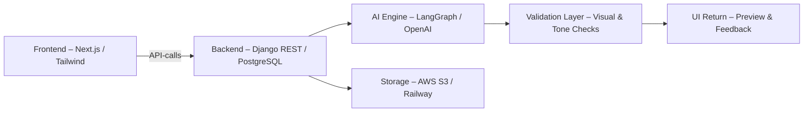
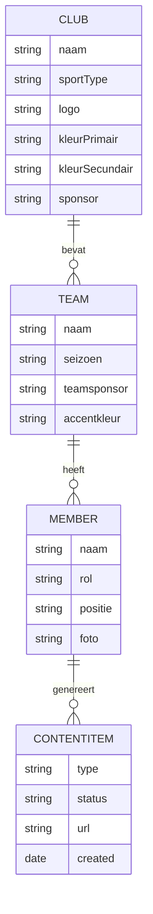
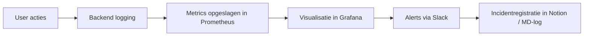

# 🧭 TeamReel – Blauwdruk

> **Professionele clubcontent. In vijf minuten. In jouw stijl.**

---

## 1. Doel van deze blauwdruk
De TeamReel-blauwdruk geeft een overzicht van de technische architectuur, AI-workflows en datastromen binnen het platform. Het document vormt de schakel tussen strategie (Businessplan), ontwerp (Functional Design) en uitvoering (Technical Design + Projectplan).

> **Kernboodschap:** *Eén ecosysteem – modulair, veilig en consistent.*

---

## 2. Architectuuroverzicht

Het TeamReel-platform bestaat uit drie lagen: **Frontend**, **Backend** en **AI & Data Services**.
Alle lagen communiceren via RESTful API’s en gebruiken gedeelde tokens en designprincipes uit de *Style Foundation*.

### Kernprincipes
- **Modulair:** elke functie is een losse service (AI, Auth, Credits, UI).
- **Schaalbaar:** horizontale opschaling via Railway of AWS.
- **Veilig:** JWT-authenticatie, SSL, en geautomatiseerde CI/CD-controles.
- **Herbruikbaar:** alle UI-elementen volgen tokens (`tokens.json`).

> **Kernboodschap:** *Architectuur met de eenvoud van een startup en de robuustheid van een platform.*

---

## 3. Systeemlagen

| Laag | Technologie | Functie | Communicatie |
|------|--------------|----------|---------------|
| **Frontend** | Next.js + Tailwind | Dashboard, AI Studio, gebruikersflows | REST API + tokens |
| **Backend** | Django REST Framework | Datamodel, API’s, authenticatie | JSON-responses |
| **AI-engine** | LangGraph + OpenAI API | Genereren van visuals en video’s | Prompt-workflows |
| **Database** | PostgreSQL | Clubs, teams, spelers, content, credits | ORM + SQL |
| **Storage** | AWS S3 / Railway | Opslag voor beelden en video’s | Signed URLs |
| **Monitoring** | Grafana + Sentry | Logging, performance en incidentbeheer | Webhooks |
| **CI/CD** | GitHub Actions | Build, test en deploy | YAML workflows |

> **Kernboodschap:** *Elke laag is onafhankelijk te testen en te vervangen.*

---

## 4. Datamodel & Lifecycle

De datastroom binnen TeamReel verloopt volgens de hiërarchie **Club → Team → Lid → Content**.
Alle entiteiten zijn functioneel én visueel met elkaar verbonden.

### Data Lifecycle
1. **Input:** gebruiker voert data in via UI of upload.
2. **Validatie:** backend controleert volledigheid en rechten.
3. **AI-verrijking:** data wordt verwerkt in de AI-engine.
4. **Output:** content (beeld/video) wordt opgeslagen en teruggekoppeld.
5. **Feedbackloop:** gebruiker beoordeelt en AI leert van correcties.

> **Kernboodschap:** *Elke datapunt leeft – van invoer tot AI-feedback.*

---

## 5. AI-workflowstructuur

De AI-laag van TeamReel is ontworpen als een reeks microflows die samen één eindresultaat opleveren.

```mermaid
flowchart LR
A[Input Club- & Teamdata] --> B[AI Preprocessor – Template selecteren]
B --> C[Prompt Engine – LangGraph]
C --> D[Generatie – Visual of Video]
D --> E[Validation Layer – Kleur & Logo Check]
E --> F[Output opslaan in S3]
F --> G[Preview in AI Studio]
G --> H[Gebruiker keurt goed of vraagt hergeneratie]
H --> I[Feedback opgeslagen in LangGraph Memory]
```

Elke flow is **herhaalbaar, meetbaar en uitbreidbaar**. Promptparameters en stijltokens zijn vastgelegd in `/ai/prompts/config.json`.

> **Kernboodschap:** *AI is geen black box, maar een gecontroleerde workflow.*

---

## 6. API-overzicht

| Endpoint | Methode | Doel | Authenticatie |
|-----------|----------|------|----------------|
| `/api/clubs/` | GET / POST | Beheer clubs en huisstijl | JWT |
| `/api/teams/` | GET / POST / PUT | Beheer teams, spelers en sponsors | JWT |
| `/api/members/` | GET / POST | Spelers en rollen beheren | JWT |
| `/api/content/` | POST | Start AI-flow en genereer content | JWT |
| `/api/credits/` | GET / PATCH | Controleer of update credits | JWT |
| `/api/reports/` | GET | Exporteer statistieken | JWT |
| `/api/auth/magiclink/` | POST | Inloggen zonder wachtwoord | Public |

Alle routes volgen REST-conventies en zijn versiebeheerd (`/api/v1/`). Nieuwe features worden toegevoegd onder `/api/v2/` zonder bestaande endpoints te breken.

> **Kernboodschap:** *API’s zijn stabiel, voorspelbaar en uitbreidbaar.*

---

## 7. Beveiliging & Privacy

| Domein | Maatregel | Toelichting |
|---------|------------|-------------|
| **Authenticatie** | JWT + Magic Link | Geen wachtwoorden, veilige tokens |
| **Data** | Encryptie in rust en transport | HTTPS, SSL, versleutelde opslag |
| **Toegang** | Rolgebaseerd (club → team → gebruiker) | Minimalistische rechtenstructuur |
| **Incidentbeheer** | Automatische logging in Sentry | Rapportage binnen 24 uur |
| **Privacy** | Gebruiker kiest zichtbaarheid per contentitem | Publiek / clubintern / privé |

> **Kernboodschap:** *Vertrouwen is de basis van elk sportplatform.*

---

## 8. Monitoring & Metrics

TeamReel gebruikt **Grafana dashboards** voor real-time inzichten in uptime, AI-prestaties en gebruikersactiviteit.

Kernindicatoren:
- Systeemuptime (> 98%)
- AI-successrate (> 90%)
- Gemiddelde responstijd (< 400 ms)
- Foutpercentage per API-endpoint

> **Kernboodschap:** *Meten is winnen — inzicht houdt het systeem fit.*

---

## 9. Uitbreidbaarheid

Nieuwe modules (zoals *Nieuwsbriefgenerator* en *Coach van het Jaar*) kunnen worden toegevoegd via een plug-in structuur:
- Elk module krijgt eigen route (`/api/module/naam`).
- Frontend-componenten worden automatisch geladen via `feature flags`.
- Tokens en stijl blijven centraal beheerd in `/frontend/styles/tokens.json`.

> **Kernboodschap:** *Modulair bouwen maakt groei eenvoudig en veilig.*

---

## 10. Samenvatting

De TeamReel-blauwdruk toont een volledig geïntegreerd, maar eenvoudig te beheren ecosysteem. Alles is ontworpen rond één gedachte: **automatiseren zonder karakter te verliezen**.
Van data tot AI-output, van club tot cloud: elke laag versterkt de identiteit van de gebruiker.

> **Kernboodschap:** *TeamReel is niet zomaar software — het is een systeem dat trots vertaalt in pixels.*
