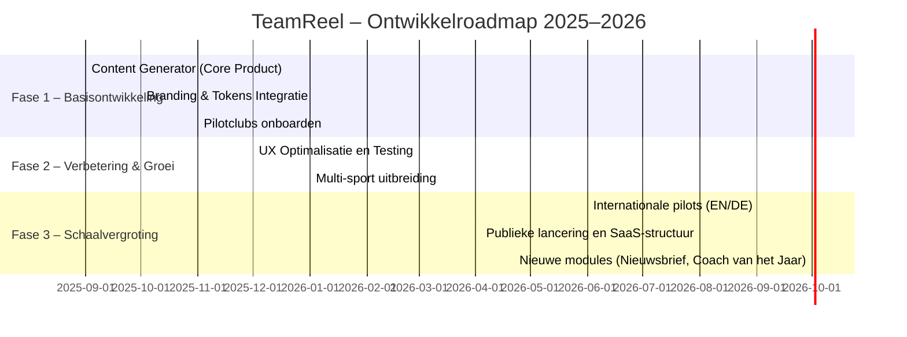

# 💼 Businessplan – TeamReel
> **TeamReel** helpt sportverenigingen hun verhalen zichtbaar te maken met AI-gegenereerde clubvideo’s.
> Dit businessplan beschrijft de visie, strategie en groeifases van het platform, afgestemd op de *TeamReel Style Foundation* en *Brand Identity*.
> De focus ligt op schaalbare waardecreatie: van lokale pilotclub tot internationaal SaaS-platform.
> Versie: Oktober 2025 — Status: Definitieve richtlijn.

## Metadata
| Element | Inhoud |
|--------|--------|
| **Project** | TeamReel |
| **Document** | Businessplan |
| **Datum** | Oktober 2025 |
| **Auteur** | Brian Stokvis |
| **Status** | Definitieve versie |
| **Doel** | Interne richting, markt- en productstrategie |

---
## Inhoudsopgave

1. [Introductie & Samenvatting](#1-introductie--samenvatting)
2. [Probleem & Kansen](#2-probleem--kansen)
3. [Visie & Doelstellingen](#3-visie--doelstellingen)
4. [Doelgroepanalyse](#4-doelgroepanalyse)
5. [De oplossing: TeamReel Content Generator](#5-de-oplossing-teamreel-content-generator)
6. [Verdienmodel & Schaalbaarheid](#6-verdienmodel--schaalbaarheid)
7. [Roadmap & Fases](#7-roadmap--fases)
8. [Concurrentie & Positionering](#8-concurrentie--positionering)
9. [Slot & Strategiecheck](#9-slot--strategiecheck)

---

## 1. Introductie & Samenvatting

Lokale sportverenigingen vormen het kloppende hart van het Nederlandse sportleven. Ze draaien op betrokken leden, vrijwilligers en teamleiders die naast hun werk en gezin het clubgevoel levend houden. Toch worstelen juist deze clubs met een zichtbaar probleem: ze willen hun verhalen delen, maar missen tijd, kennis en continuïteit om dat structureel te doen.

**TeamReel** biedt hiervoor een oplossing. Het is een online platform dat sportverenigingen helpt om eenvoudig en professioneel content te creëren rond wedstrijden, teams en clubmomenten. Via AI-gedreven templates genereert TeamReel automatisch video’s en visuals — afgestemd op de huisstijl van elke club. Zo kan elk teamlid in enkele minuten clubcontent maken die past bij de trots en identiteit van de vereniging.

De kern van het platform is de **TeamReel Content Generator**, die het maken van video’s en visuals automatiseert zonder de persoonlijke stijl te verliezen.
Wat voorheen uren duurde, kost nu slechts enkele minuten.
De tool neemt het technische werk over, terwijl de gebruiker de creatieve controle behoudt.

> **Kernboodschap:**
> *Professionele clubcontent. In vijf minuten. In jouw stijl.*

TeamReel sluit qua toon en ontwerp volledig aan op de *Style Foundation*: sportief, helder en eenvoudig.
De merkidentiteit — beschreven in de *Brand Identity* — zorgt dat alle visuals, AI-output en gebruikersinterfaces herkenbaar één geheel vormen.

---

## 2. Probleem & Kansen

### 2.1 Het probleem voor sportverenigingen

Sportclubs willen professioneel en zichtbaar zijn, maar missen daarvoor de juiste middelen.
De intentie is er vaak wél — teamleden posten line-ups, uitslagen of sfeerbeelden — maar het ontbreekt aan structuur, stijl en tijd. Clubcommunicatie is daarmee kwetsbaar: ze valt stil zodra het ene actieve lid stopt, of blijft steken in losse posts zonder herkenbaarheid.

We onderscheiden drie structurele belemmeringen:

| Belemmering | Gevolg |
|-------------|--------|
| **Gebrek aan kennis** | Veel teamleden weten niet hoe ze aantrekkelijke content maken. |
| **Gebrek aan tijd** | Trainers en clubleden hebben geen ruimte om tools uit te proberen. |
| **Gebrek aan continuïteit** | Eén actief lid verdwijnt → communicatie valt stil of versnippert. |

De combinatie van deze factoren leidt tot inconsistente communicatie. Clubs missen daardoor zichtbaarheid, binding met leden én een professionele uitstraling naar sponsoren en de buitenwereld. Zonder herkenbare, regelmatige content is het moeilijk om een club als merk te positioneren.

---

### 2.2 Kansen in de markt

Juist in deze pijnpunten liggen grote kansen. De context verandert snel:

- 📈 **Clubs worden mediakanalen:** Fans en leden verwachten regelmatige updates op Instagram, WhatsApp of YouTube.
- 🤖 **Generatieve AI is toegankelijk geworden:** Wat eerder onhaalbaar was zonder designers, is nu binnen handbereik.
- 🧩 **Herbruikbare formats zijn efficiënter:** Clubs hoeven niet telkens iets nieuws te verzinnen — slimme sjablonen bieden rust en herkenbaarheid.
- 🏷️ **Clubstijl wordt merkwaarde:** Hoe consistenter de content, hoe sterker de identiteit.

TeamReel speelt in op deze dynamiek. Het platform vertaalt technologische mogelijkheden naar de dagelijkse praktijk van de sportclub, met een focus op snelheid, stijl en eenvoud. Wat vroeger een weektaak was, wordt een vaste handeling in het ritme van de sportweek.

---

## 3. Visie & Doelstellingen

### 3.1 Langetermijnvisie
TeamReel wil uitgroeien tot het digitale content-hart van lokale sportverenigingen. Een plek waar clubs niet alleen content maken, maar ook hun identiteit versterken, hun leden activeren en hun verhalen delen — professioneel, herkenbaar en snel. Binnen vijf jaar is TeamReel een platform waar duizenden clubs in binnen- en buitenland terechtkunnen voor AI-gegenereerde content in hun eigen clubstijl, tools voor video, nieuws en dashboards, en een workflow die aansluit op het ritme van de sportweek.

De kern blijft onveranderd: toegankelijke technologie die mensen verbindt via hun club.

### 3.2 Concrete ambitie
We bouwen een platform dat elk teamlid in staat stelt om zonder training professionele content te maken, automatisch output genereert in de clubstijl en meegroeit met het ritme van wedstrijden, seizoenen en gebeurtenissen.
De **Content Generator** vormt het startpunt van dit ecosysteem. Van daaruit breidt TeamReel modulair uit met nieuwe functies, steeds binnen dezelfde visuele en technische kaders uit de *Style Foundation*.

### 3.3 Strategische ontwerpprincipes
| Principe | Werking |
|-----------|----------|
| **Automatisch waar mogelijk** | Minder handwerk betekent meer output en continuïteit. |
| **Eén club, één stijl** | Alle content volgt dezelfde identiteit, afgestemd op het clublogo en de kleuren. |
| **Modulair ontwerp** | Nieuwe functies passen altijd binnen de bestaande structuur. |
| **Output-agnostisch** | De content past zich automatisch aan per platform (Instagram, WhatsApp, web). |

### 3.4 Doelen (12–24 maanden)
| Doelstelling | Maatstaf |
|--------------|----------|
| **Werkend SaaS-platform** | Live voor voetbalclubs in Nederland. |
| **Product-market fit** | 10–20 clubs actief gebruiker binnen zes maanden. |
| **Herhaalbare formats** | Minstens vijf herbruikbare contenttypes in de generator. |
| **Merkconsistentie** | Alle output voldoet aan vaste clubstijl en tokens. |
| **Visuele consistentie** | Alle UI-componenten en AI-output volgen tokens uit de *Style Foundation*. |

---

## 4. Doelgroepanalyse

### 4.1 Marktcontext en positionering
Nederland telt ruim 3.000 amateurvoetbalverenigingen met meer dan één miljoen leden. Deze clubs vormen een unieke maar onderbediende doelgroep: actief op social media, betrokken bij hun community, maar vaak beperkt in tijd en middelen om hun communicatie professioneel te organiseren. Binnen deze verenigingen ligt de verantwoordelijkheid voor contentproductie vaak bij vrijwilligers of trainers. Zij zoeken naar een manier om herkenbare, aantrekkelijke content te maken zonder extra werk of technische kennis.

Drie trends onderstrepen deze behoefte: (1) digitalisering van clubcommunicatie — online zichtbaarheid is een vast onderdeel geworden van clubcultuur; (2) de snelle opkomst van generatieve AI — technologie maakt professionele output toegankelijk voor iedereen; (3) de groeiende waarde van zichtbaarheid — sponsors en supporters verwachten continuïteit en herkenbaarheid.

TeamReel speelt hierop in met een laagdrempelige oplossing die wél werkt in de praktijk van de sportclub. Geen losse tools of externe bureaus, maar één centrale plek waar herkenbare clubcontent ontstaat in enkele minuten.

### 4.2 Primaire doelgroep
De eerste focus ligt op amateurvoetbalverenigingen in Nederland. Binnen deze clubs richt TeamReel zich op actieve teamleden die nu al berichten delen via Instagram, WhatsApp of clubwebsites, maar daar meer consistentie en stijl in willen brengen.

| Kenmerk | Beschrijving |
|----------|--------------|
| **Type club** | Amateurvoetbal (eerste fase). |
| **Rol binnen club** | Teamleden die zelf content delen. |
| **Gebruiksmotief** | Snel professionele content genereren, zonder technische drempels. |
| **Digitale vaardigheden** | Gemiddeld tot hoog – bekend met stories, templates en social media. |

Deze gebruikers zijn visueel ingesteld, mobiel actief en tijdgebonden. Ze willen geen nieuwe tool leren, maar sneller resultaat uit hun bestaande werkwijze.

### 4.3 Secundaire doelgroepen
| Segment | Potentieel gebruik |
|----------|---------------------|
| **Bestuurders / communicatieteams** | Uniforme uitstraling naar buiten, sponsorwaarde verhogen. |
| **Trainers & coaches** | Line-ups, uitslagen en teamupdates publiceren zonder extra werk. |
| **Jeugdteams & ouders** | Deelbare visuals binnen familie- en supportersnetwerken. |

### 4.4 Persona (voorbeeld)
> **Naam:** Samira
> **Rol:** Aanvoerder Dames 1
> **Wat ze wil:** Elke week een line-up delen zonder Photoshop.
> **Frustratie:** Templates zoeken, logo’s plakken, alles handmatig.
> **Waarom TeamReel past:** Snel, herkenbaar, automatisch in clubstijl.

Deze persona staat symbool voor de doelgroep: digitaal vaardig, betrokken en trots op haar club, maar beperkt in tijd. Elke persona wordt getest binnen de UX-flows zoals beschreven in het *Functional Design*, zodat gebruikservaring en AI-feedback elkaar versterken.

---

## 5. De oplossing: TeamReel Content Generator

### 5.1 Wat is het?
De TeamReel Content Generator is een online tool waarmee clubs in enkele minuten visuele content maken die past bij hun huisstijl. Het platform is ontworpen voor snelheid, herkenbaarheid en gemak. Gebruikers kiezen een template, vullen enkele gegevens in — zoals opstelling of score — en ontvangen direct een publiceerbare visual of video. Alle visuele elementen en kleuren volgen automatisch de tokens uit de *Style Foundation*, zodat de output consistent is met het merk en de gebruikersinterface.

> Geen designkennis. Geen installatie. Wel resultaat.

Beschikbare formats in de eerste fase:
- Line-up visuals
- Matchday video’s
- Doelpuntmeldingen
- Uitslagenkaarten
- Instagram Reels en stories

### 5.2 Hoe werkt het?
1. De gebruiker kiest een format of template.
2. De basisgegevens van het team of de wedstrijd worden ingevuld.
3. AI combineert deze gegevens met clubkleuren, logo’s en tenues.
4. De gebruiker ontvangt een downloadbare video of visual, direct geschikt voor social media.

Het proces werkt volledig in de browser, op mobiel en desktop, zodat teams ook vlak voor of na de wedstrijd content kunnen aanmaken.

### 5.3 Wat maakt TeamReel uniek?
| Aspect | Omschrijving |
|--------|--------------|
| **Volledig in clubstijl** | Elke output volgt automatisch de huisstijl van de vereniging. |
| **Herbruikbare AI-sjablonen** | Eén ontwerp wordt hergebruikt voor meerdere teams en formats. |
| **Snel & schaalbaar** | Klaar in minuten, zonder technische drempel. |
| **Modulair en uitbreidbaar** | Nieuwe contenttypes kunnen eenvoudig worden toegevoegd. |

---

### 5.4 Toekomstmogelijkheden

De architectuur van TeamReel is sport-agnostisch (clubs → teams → spelers), waardoor nieuwe sporten eenvoudig toe te voegen zijn.
Na de validatie binnen voetbal kunnen andere teamsporten snel volgen:

- 🏑 **Hockey en handbal** – vergelijkbare teamsamenstelling
- 🏐 **Volleybal en korfbal** – snelle, visuele sporten met fanbase
- 🏟️ **Futsal en zaalvoetbal** – zelfde doelgroep, nieuwe context

Ook de output groeit mee:

- 📨 **Nieuwsbrief-generator** – automatische wedstrijdverslagen
- 🏆 **Coach van het Jaar** – content op basis van prestaties
- 📊 **Dashboards & statistiekmodules** – inzicht in gebruik en bereik

TeamReel is ontworpen om te groeien zonder complexer te worden. Elke toevoeging past in het bestaande model — visueel afgestemd op de *Brand Identity*, technisch schaalbaar volgens het *Technical Design*, en functioneel consistent met de AI-flows uit het *Functional Design*. Zo blijft het platform herkenbaar, gebruiksvriendelijk en uitbreidbaar.

---
## 6. Verdienmodel & Schaalbaarheid

TeamReel hanteert een hybride verdienmodel dat flexibiliteit biedt voor kleine teams én schaalbaarheid voor grote clubs. Clubs betalen een vast bedrag voor toegang tot het platform en kunnen aanvullende credits aanschaffen voor extra of premium output. Zo blijft het gebruik voorspelbaar in kosten en flexibel in gebruik. Het model sluit aan bij de praktijk van sportverenigingen: lage instap, duidelijk overzicht en ruimte om te groeien.

### 6.1 Hybride verdienstructuur
| Component | Omschrijving |
|------------|--------------|
| **Abonnement per team of club** | Maandelijkse of jaarlijkse toegang tot basisfunctionaliteit. |
| **Credits voor output** | Extra of premium contenttypes worden afgerekend per gebruik. |
| **Clublicentie** | Onbeperkt aantal gebruikers binnen één vereniging. |
| **Upgrades** | Extra sjablonen, langere video’s, exports in hogere kwaliteit. |

Het creditsysteem is direct gekoppeld aan de AI-workflows. Elke video of visual gebruikt een vast aantal credits, afhankelijk van de complexiteit. Deze logica is consistent met de backendstructuur zoals beschreven in het *Technical Design*.

### 6.2 Indicatieve prijsstructuur
| Product | Basis | Uitbreiding |
|----------|--------|-------------|
| **Starterpakket** | €19 / maand | Inclusief 10 credits. |
| **Creditbundel** | – | 25 credits voor €12. |
| **Clublicentie** | €149 / jaar | Onbeperkt aantal gebruikers. |
| **Betaalde upgrades** | – | Premiumformats of meertalige exports. |

### 6.3 Schaalvoordelen
TeamReel is ontworpen voor modulaire groei. Eén template of AI-workflow kan hergebruikt worden door honderden clubs. De infrastructuur volgt dezelfde principes als in het *Technical Design*: modulaire services, cloudopslag en herbruikbare workflows,aangestuurd door de tokens en designrichtlijnen uit de *Style Foundation*.

Belangrijkste schaalvoordelen:
- **Herbruikbare workflows:** één AI-logica, meerdere toepassingen.
- **Internationale uitbreiding:** vertalingen en clubdata worden dynamisch geladen.
- **Licentie-opbouw:** schaalbaar per club, regio of bond.
- **Gebruikstracking:** data-analyse van contentgebruik voor strategische inzichten.

---

## 7. Roadmap & Fases

TeamReel ontwikkelt zich iteratief: eerst valideren met gebruikers, daarna uitbreiden met nieuwe modules. De MVP-fase vormt de eerste productiteratie, gevolgd door verbeteringen in gebruikerservaring, stabiliteit en schaalbaarheid.
Het ontwerp, de UX-flows en de AI-integratie volgen de kaders uit het *Functional Design* en *Technical Design*.

### 7.1 Ontwikkelrichtlijnen

De roadmap volgt dezelfde ontwikkelprincipes als in het *Technical Design*: modulair, veilig en onderhoudbaar.
Elke fase wordt afgerond met een stabiele release, een testmoment en een update van de documentatie.

- **Fase 1 – Basisontwikkeling:** Realisatie van de volledige end-to-end werking van de Content Generator. De nadruk ligt op betrouwbaarheid van de AI-workflows, consistentie van de output en integratie van clubdata in de backend.
- **Fase 2 – Verbetering en groei:** Uitbreiding naar meerdere sporten zoals hockey, handbal en volleybal. Deze uitbreiding heeft prioriteit boven aanvullende modules, zodat de kernarchitectuur wordt gevalideerd in verschillende sportcontexten.
- **Fase 3 – Schaalvergroting:** Internationale uitrol, optimalisatie van hosting, databeveiliging en gebruikersbeheer.
- **Fase 4 – Nieuwe modules:** Introductie van aanvullende functies zoals de Nieuwsbrief-generator en “Coach van het Jaar”. Zodra de multi-sportondersteuning stabiel is, wordt de focus verlegd naar verdiepende toepassingen binnen hetzelfde platform.

De technische uitvoering sluit aan op de stack en API-logica die in het *Technical Design* zijn vastgelegd: **Django REST API** voor de backend, **Next.js** voor de frontend, en **cloudopslag met beveiligde toegangstokens** voor video-output. AI-workflows draaien binnen dezelfde infrastructuur en gebruiken clubdata (logo’s, kleuren, line-ups) om dynamische content te genereren zonder extra handwerk.

De samenwerking tussen ontwerp, ontwikkeling en gebruikers wordt gestuurd via iteratieve releases. Feedback van clubs vormt steeds de basis voor de volgende sprint, waarin UI, AI-flows en contentconsistentie worden getest volgens de *Style Foundation* en *Brand Identity*. Zo groeit TeamReel gecontroleerd, met behoud van eenvoud en herkenbaarheid in elke versie van het product.

---

## 8. Concurrentie & Positionering

### 8.1 Concurrentielandschap
De markt voor sportcommunicatie en contentcreatie groeit snel, maar blijft versnipperd. Er bestaan tools voor ontwerp, data en clubbeheer, maar geen enkel platform dat **AI, video en clubstijl** op een toegankelijke manier combineert. De meeste oplossingen richten zich óf op sportdata, óf op social content, maar zelden op de combinatie van beide binnen één workflow.

| Speler | Type | Zwakte |
|--------|------|--------|
| **Canva** | Ontwerpplatform | Geen sportspecifieke sjablonen of koppeling met clubdata. |
| **Scoreboard** | SaaS voor sportdata | Richt zich op statistieken, niet op storytelling. |
| **Club-assistent.nl** | CMS voor sportclubs | Beperkte visuele mogelijkheden, geen AI. |
| **Socialclubs.nl** | Marketingbureau | Niet schaalbaar, afhankelijk van handmatig werk. |

### 8.2 Positionering van TeamReel
TeamReel vult het gat tussen designplatformen en sportdata-oplossingen. Het biedt één platform waar clubidentiteit, video en automatisering samenkomen —
technisch robuust (volgens het *Technical Design*), functioneel intuïtief (volgens het *Functional Design*) en visueel herkenbaar (volgens de *Brand Identity*).

| Aspect | Wat TeamReel onderscheidt |
|--------|----------------------------|
| **Volledige automatisering** | AI-workflows zetten teaminformatie om in kant-en-klare visuals. |
| **Direct in clubstijl** | Output volgt automatisch kleuren, logo’s en lettertypes van de vereniging. |
| **SaaS-architectuur** | Toegang via webapp met veilige API’s en schaalbare hosting. |
| **Gebruiksgemak** | Ontworpen voor vrijwilligers en trainers, niet voor designers. |
| **Modulaire uitbreiding** | Nieuwe templates of contenttypes zijn eenvoudig toe te voegen. |

De positionering is bewust pragmatisch: TeamReel is geen marketingbureau of designstudio, maar een **praktische tool die de club zelf in handen houdt**. Door automatisering te combineren met herkenbare stijl, krijgt elke vereniging de middelen om zich professioneel te presenteren — zonder extra werk of kosten.

---

## 9. Slot & Strategiecheck

TeamReel is meer dan een product. Het is een manier om de trots, herkenbaarheid en samenwerking binnen sportverenigingen zichtbaar te maken. De visuele stijl, tone-of-voice en technische structuur zijn vastgelegd in de *Style Foundation* en *Brand Identity*, zodat elk document, scherm en AI-resultaat dezelfde eenvoud en energie uitstraalt.

We bouwen aan een schaalbaar platform dat communicatie automatiseert, personaliseert en versterkt. De **Content Generator** vormt het fundament, maar het ecosysteem breidt zich stapsgewijs uit met nieuwe modules en functies. Zo blijft TeamReel relevant voor clubs van elk formaat.

De samenwerking tussen strategie, ontwerp en techniek wordt gewaarborgd door de samenhang van de vijf kern-documenten: *Businessplan*, *Brand Identity*, *Functional Design*, *Technical Design* en *Projectplan*. Samen vormen ze één geïntegreerd raamwerk waarin visie, uitvoering en productontwikkeling op elkaar aansluiten.

### Strategiecheck
| Vraag | Antwoord |
|-------|-----------|
| **Is het probleem urgent en herkenbaar?** | Ja – clubs willen zichtbaar zijn, maar missen tijd en middelen. |
| **Is de oplossing schaalbaar?** | Ja – modulaire opzet en herbruikbare workflows. |
| **Is de doelgroep bereikbaar?** | Ja – via social media, KNVB en lokale sportnetwerken. |
| **Is de techniek haalbaar?** | Ja – bewezen stack (Django REST, Next.js, cloudopslag). |
| **Is er concurrentie?** | Beperkt – geen directe self-service tool met sportspecifieke focus. |
| **Is het verdienmodel houdbaar?** | Ja – hybride systeem met vaste licenties en credits per gebruik. |
| **Is de merkconsistentie geborgd?** | Ja – via Style Foundation en Brand Identity in UI en AI-output. |

### Aanbeveling
Start in Q4 2025 met een gecontroleerde pilotfase bij 5–10 voetbalclubs. Verzamel feedback over gebruiksgemak, performance en herkenbaarheid van de output. Gebruik deze inzichten om de templates, UX en workflows verder te verfijnen. Schaal daarna gefaseerd op naar andere sporten en internationale pilots.

> **Kernboodschap:**
> *TeamReel maakt van elke club een contentmerk — snel, herkenbaar en schaalbaar.*
