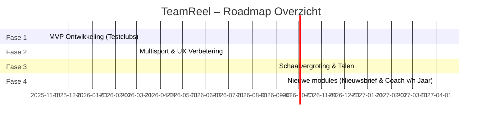

# 🎯 TeamReel Pitchdeck
> **Professionele clubcontent. In vijf minuten. In jouw stijl.**

---

## 🧩 Slide 1 – De Kernboodschap
**TeamReel** helpt sportclubs om automatisch professionele video’s en visuals te maken in hun eigen stijl.
AI doet het technische werk, de club behoudt de trots.

> **Kernzin:** *TeamReel maakt van elke club een mediaclub.*

---

## ⚽ Slide 2 – Het Probleem
Vrijwilligers en communicatiemedewerkers bij sportverenigingen besteden uren aan video’s, posters of socialmedia-posts.
Ze missen tijd, tools en designervaring.
Toch wil elke club wekelijks zichtbaar zijn voor leden, fans en sponsoren.

> **Kort gezegd:** Te weinig tijd, te veel gedoe, te weinig resultaat.

---

## 🤖 Slide 3 – De Oplossing
**TeamReel Content Generator**: één platform dat automatisch clubcontent maakt.
- Gebruiker kiest type moment: *pre-match, during-match, post-match*.
- AI vult data aan uit clubprofiel.
- Output: video of visual in clubstijl, binnen 5 minuten.
- Klaar om te delen op sociale media of clubkanalen.

> **AI in dienst van trots, niet in plaats van mens.**

---

## 💡 Slide 4 – Product in één oogopslag
| Onderdeel | Functie | Technologie |
|------------|----------|--------------|
| **Content Generator** | AI maakt visuals & video’s | LangGraph + OpenAI |
| **Dashboard** | Beheer teams, wedstrijden, credits | Next.js + Tailwind |
| **AI Studio** | Preview & goedkeuring | Django REST API |
| **Creditsysteem** | Betalen per actie of abonnement | PostgreSQL + Stripe |
| **Brand Engine** | Clubstijl via tokens | Style Foundation |

> **Resultaat:** Clubs maken zelf professionele media zonder technische kennis.

---

## 🌍 Slide 5 – Markt & Kansen
De amateurvoetbalmarkt in Nederland:
- 3.000+ verenigingen
- >1 miljoen leden
- 70% actief op social media

Uit te breiden naar hockey, volleybal, handbal en internationaal (DACH, UK, Scandinavië).
Elke sportclub heeft dezelfde behoefte: zichtbaarheid en herkenbaarheid.

> **Markttrend:** AI democratiseert creativiteit. Sport is klaar voor automatisering.

---

## 💰 Slide 6 – Businessmodel
**SaaS + Creditsysteem:**
- Clubs betalen een maandabonnement of per AI-actie.
- Sponsoren kunnen branded templates inkopen.
- Premiumfuncties: analyses, automations, meertalige exports.

| Segment | Prijsindicatie | Kenmerk |
|----------|----------------|----------|
| Club (1 team) | €10–€20 / maand | Basisfunctionaliteit |
| Vereniging (meerdere teams) | €100–€300 / maand | Bundel & sponsoropties |
| Partner / Bond | Op aanvraag | Whitelabel en data-integratie |

> **Schaalbaar, herhaalbaar en voorspelbaar.**

---

## 🚀 Slide 7 – Roadmap

> **Kernboodschap:** *Elk kwartaal een tastbare stap vooruit.*

---

## 🔧 Slide 8 – Technologie & Stack
| Domein | Technologie | Doel |
|---------|--------------|------|
| **Backend** | Django REST + PostgreSQL | API en datamodel |
| **Frontend** | Next.js + Tailwind | UI en dashboard |
| **AI** | LangGraph + OpenAI API | Workflowgeneratie |
| **CI/CD** | GitHub Actions + Railway | Automatische deploys |
| **Design** | Figma + Style Foundation | Visuele consistentie |
| **Monitoring** | Grafana + Sentry | Logging en performance |

> **Architectuur:** modulair, veilig, onderhoudsarm.

---

## 👤 Slide 9 – Team & Structuur
**Brian Stokvis** – Data-analist & Productontwikkelaar
Ervaring met data science, AI, duurzaamheid en projectarchitectuur.
Werkstijl: documentgedreven, schaalbaar en visueel consistent.

Toekomstige rollen:
- AI Engineer (workflows)
- Frontend Developer (UI/UX)
- Communicatiemanager (clubs & partners)

> **Kernboodschap:** *Kleine start, groot potentieel.*

---

## 🏁 Slide 10 – De Vraag & De Kans
TeamReel is klaar om te starten met pilotclubs en partners.
- MVP start: november 2025
- Eerste test: Q1 2026
- Doel: 1.000 clubs binnen 3 jaar

**Gezocht:**
🤝 Partners (sportbonden, softwarebedrijven, sponsoren)
💬 Testclubs voor de eerste pilots
💡 Feedback en zichtbaarheid binnen de sportcommunity

> **Slotboodschap:** *TeamReel brengt trots tot leven — snel, slim en herkenbaar.*
