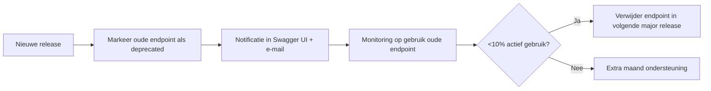
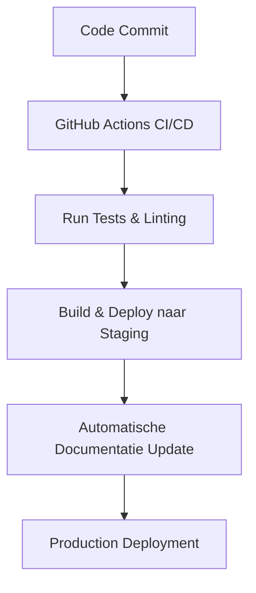

# 🔌 API Reference – TeamReel

> **Eén standaard, vele toepassingen.**

---

## 1. Doel van dit document
Deze API Reference beschrijft de belangrijkste routes van de **TeamReel REST API**.
De API is ontworpen volgens RESTful principes, versiebeheerd (`/api/v1/`), en volledig beveiligd met **JWT-authenticatie**.

> **Kernboodschap:** *De API is voorspelbaar, uitbreidbaar en consistent.*

---

## 2. Basisinformatie

| Element | Waarde |
|----------|---------|
| **Base URL** | `https://api.teamreel.app/api/v1/` |
| **Authenticatie** | Bearer Token (JWT) |
| **Content Type** | `application/json` |
| **Versiebeheer** | `/v1/` (stable), `/v2/` (experimental) |
| **Beveiliging** | HTTPS, CORS-beperkt, throttling op 100 requests/min |

---

## 3. Authenticatie

### 3.1 Magic Link Login
```http
POST /auth/magiclink/
Content-Type: application/json

{
  "email": "user@club.nl"
}
```
Response
```json
{
  "detail": "Magic link sent to user@club.nl"
}
```

### 3.2 Token Exchange (JWT)
Na klikken op de magic link ontvangt de gebruiker een tijdelijk token.

```http
POST /auth/token/
Content-Type: application/json

{
  "uid": "e7e8f3...",
  "token": "abcd1234..."
}
```
Response
```json
{
  "access": "eyJhbGciOiJIUzI1NiIsInR5cCI6IkpXVCJ9...",
  "refresh": "eyJhbGciOiJIUzI1NiIsInR5cCI6IkpXVCJ9..."
}
```

Header voorbeeld:
``` bash
Authorization: Bearer <access_token>
```

> **Kernboodschap:** *Authenticatie zonder wachtwoorden — veilig én gebruiksvriendelijk.*

## 4. Club & Teambeheer

### 4.1 Clubs ophalen
```http
GET /clubs/
Authorization: Bearer <token>
[
  {
    "id": 1,
    "naam": "FC Zwolle",
    "sport": "Voetbal",
    "kleurPrimair": "#0066FF",
    "kleurSecundair": "#FFFFFF",
    "logo": "https://cdn.teamreel.app/logos/fczwolle.png"
  }
]
```
### 4.2 Nieuwe club aanmaken

```http
POST /clubs/
Content-Type: application/json
Authorization: Bearer <token>

{
  "naam": "VV Kampen",
  "sport": "Voetbal",
  "kleurPrimair": "#FFD700",
  "kleurSecundair": "#000000"
}
```

**Response**
```json
{
  "id": 12,
  "naam": "VV Kampen",
  "created_at": "2025-11-10T12:00:00Z"
}
```

> **Tip:** bij het aanmaken van een club worden standaard tokens en stijlen toegepast uit de *Style Foundation*.

---

### 4.3 Teams binnen club ophalen

```http
GET /teams/?club_id=12
Authorization: Bearer <token>
```

**Response**
```json
[
  {
    "id": 101,
    "club": 12,
    "naam": "VV Kampen JO17-1",
    "seizoen": "2025/2026",
    "accentkleur": "#FFD700"
  },
  {
    "id": 102,
    "club": 12,
    "naam": "VV Kampen Dames 1",
    "seizoen": "2025/2026",
    "accentkleur": "#FFD700"
  }
]
```

---

### 4.4 Nieuw team toevoegen

```http
POST /teams/
Content-Type: application/json
Authorization: Bearer <token>

{
  "club": 12,
  "naam": "VV Kampen JO15-1",
  "seizoen": "2025/2026",
  "teamsponsor": "Bakkerij van der Meer",
  "accentkleur": "#FFD700"
}
```

**Response**
```json
{
  "id": 103,
  "club": 12,
  "naam": "VV Kampen JO15-1",
  "seizoen": "2025/2026",
  "created_at": "2025-11-10T12:30:00Z"
}
```

---

### 4.5 Teamdetails bijwerken

```http
PUT /teams/103/
Content-Type: application/json
Authorization: Bearer <token>

{
  "naam": "VV Kampen JO15-1 Selectie",
  "accentkleur": "#FFD700",
  "teamsponsor": "Bakkerij van der Meer"
}
```

**Response**
```json
{
  "detail": "Team succesvol bijgewerkt"
}
```

> **Let op:** PATCH kan worden gebruikt voor gedeeltelijke updates (alleen gewijzigde velden).

---

### 4.6 Team verwijderen

```http
DELETE /teams/103/
Authorization: Bearer <token>
```

**Response**
```json
{
  "detail": "Team verwijderd uit club VV Kampen"
}
```

> **Kernboodschap:** *Eenvoudige, veilige endpoints voor beheer van clubs en teams – volledig in lijn met de TeamReel API-standaard.*

## 5. Spelers & Leden

### 5.1 Spelerslijst ophalen

```http
GET /members/?team_id=103
Authorization: Bearer <token>
```

**Response**
```json
[
  {
    "id": 201,
    "team": 103,
    "naam": "Jens Bakker",
    "rol": "Aanvaller",
    "positie": "Spits"
  },
  {
    "id": 202,
    "team": 103,
    "naam": "Lars Meijer",
    "rol": "Keeper",
    "positie": "Doelman"
  }
]
```

> **Kernboodschap:** *Eenvoudige query – actuele spelersdata binnen één call.*

---

### 5.2 Nieuwe speler toevoegen

```http
POST /members/
Content-Type: application/json
Authorization: Bearer <token>

{
  "team": 103,
  "naam": "Niels Jansen",
  "rol": "Verdediger",
  "positie": "Centraal",
  "foto": null
}
```

**Response**
```json
{
  "id": 203,
  "team": 103,
  "naam": "Niels Jansen",
  "rol": "Verdediger",
  "positie": "Centraal",
  "created_at": "2025-11-10T14:00:00Z"
}
```

---

### 5.3 Spelergegevens bijwerken

```http
PUT /members/203/
Content-Type: application/json
Authorization: Bearer <token>

{
  "rol": "Aanvoerder",
  "positie": "Middenveld"
}
```

**Response**
```json
{
  "detail": "Speler succesvol bijgewerkt"
}
```

> **Let op:** gebruik PATCH voor gedeeltelijke updates.

---

### 5.4 Speler verwijderen

```http
DELETE /members/203/
Authorization: Bearer <token>
```

**Response**
```json
{
  "detail": "Speler verwijderd uit team VV Kampen JO15-1"
}
```

---

### 5.5 Ledenfilter & zoekopties

```http
GET /members/search/?query=jens&team_id=103
Authorization: Bearer <token>
```

**Response**
```json
[
  {
    "id": 201,
    "naam": "Jens Bakker",
    "positie": "Spits",
    "rol": "Aanvaller"
  }
]
```

> **Kernboodschap:** *Het ledenendpoint is flexibel – snel zoeken, eenvoudig beheren.*

## 6. AI Content Generatie

### 6.1 Start AI-workflow

```http
POST /content/
Content-Type: application/json
Authorization: Bearer <token>

{
  "team": 103,
  "type": "pre_match",
  "context": {
    "tegenstander": "SC Heerenveen",
    "datum": "2025-11-15"
  }
}
```

**Response**
```json
{
  "status": "processing",
  "content_id": 901,
  "message": "AI generation started"
}
```

> **Kernboodschap:** *Start een AI-generatie in één call – snel, veilig en consistent.*

---

### 6.2 Resultaat van AI-generatie ophalen

```http
GET /content/901/
Authorization: Bearer <token>
```

**Response**
```json
{
  "id": 901,
  "team": 103,
  "type": "pre_match",
  "status": "completed",
  "output_url": "https://cdn.teamreel.app/generated/fczwolle_vs_heerenveen.mp4",
  "feedback_url": "/content/901/feedback/"
}
```

> **Kernboodschap:** *Elke AI-generatie is traceerbaar en reproduceerbaar.*

---

### 6.3 Herstart of regeneratie van AI-output

```http
POST /content/901/regenerate/
Authorization: Bearer <token>
```

**Response**
```json
{
  "status": "processing",
  "content_id": 902,
  "message": "Regeneration initiated – previous version archived"
}
```

> **Let op:** eerdere versies blijven beschikbaar in het archief voor audit en vergelijking.

---

### 6.4 Download of embed AI-output

```http
GET /content/901/download/
Authorization: Bearer <token>
```

**Response**
```json
{
  "download_url": "https://cdn.teamreel.app/downloads/fczwolle_vs_heerenveen.mp4",
  "expires_in": 3600
}
```

> **Kernboodschap:** *AI-output is altijd beschikbaar, tijdelijk beveiligd en eenvoudig te delen.*

---

### 6.5 Preview in AI Studio

```http
GET /content/901/preview/
Authorization: Bearer <token>
```

**Response**
```json
{
  "preview_url": "https://app.teamreel.app/studio/view/901",
  "status": "ready",
  "generated_at": "2025-11-15T09:32:00Z"
}
```

> **Kernboodschap:** *Preview direct in de AI Studio – één klik, nul vertraging.*

---

### 6.6 Contentgeschiedenis van een team

```http
GET /content/?team_id=103
Authorization: Bearer <token>
```

**Response**
```json
[
  {
    "id": 901,
    "type": "pre_match",
    "status": "completed",
    "created_at": "2025-11-15T09:30:00Z"
  },
  {
    "id": 902,
    "type": "post_match",
    "status": "completed",
    "created_at": "2025-11-16T18:45:00Z"
  }
]
```

> **Kernboodschap:** *Alle AI-output is terug te vinden per team – overzichtelijk en veilig opgeslagen.*

## 7. Feedback & Credits

### 7.1 Feedback geven op AI-resultaat

```http
POST /content/901/feedback/
Content-Type: application/json
Authorization: Bearer <token>

{
  "rating": 4,
  "comment": "Goede kleuren, maar logo iets te klein."
}
```

**Response**
```json
{
  "detail": "Feedback opgeslagen. Dank voor je bijdrage!"
}
```

> **Kernboodschap:** *Feedback helpt de AI verbeteren – elke input telt.*

---

### 7.2 Feedbackgeschiedenis ophalen

```http
GET /content/901/feedback/
Authorization: Bearer <token>
```

**Response**
```json
[
  {
    "id": 1,
    "rating": 4,
    "comment": "Goede kleuren, maar logo iets te klein.",
    "created_at": "2025-11-15T10:00:00Z"
  },
  {
    "id": 2,
    "rating": 5,
    "comment": "Perfecte timing in de video!",
    "created_at": "2025-11-16T18:50:00Z"
  }
]
```

> **Kernboodschap:** *Transparantie: alle feedback blijft traceerbaar per generatie.*

---

### 7.3 Credits controleren

```http
GET /credits/
Authorization: Bearer <token>
```

**Response**
```json
{
  "user": "brian@teamreel.app",
  "credits": 48,
  "last_updated": "2025-11-10T09:00:00Z"
}
```

> **Kernboodschap:** *Credits geven inzicht in verbruik – eerlijk en voorspelbaar.*

---

### 7.4 Credits bijwerken (na aankoop of refill)

```http
PATCH /credits/
Content-Type: application/json
Authorization: Bearer <token>

{
  "add_credits": 100
}
```

**Response**
```json
{
  "user": "brian@teamreel.app",
  "credits": 148,
  "message": "Credits succesvol toegevoegd"
}
```

> **Kernboodschap:** *Creditsysteem koppelt gebruik aan waarde – transparant en schaalbaar.*
---

## 8. Rapportage & Analyse

### 8.1 Gebruiksrapport per club

```http
GET /reports/usage/?club_id=12
Authorization: Bearer <token>
```

**Response**
```json
{
  "club": "VV Kampen",
  "maand": "2025-11",
  "aantal_generaties": 126,
  "gemiddelde_score": 4.5,
  "credits_gebruikt": 630
}
```

> **Kernboodschap:** *In één call inzicht in prestaties en gebruik.*

---

### 8.2 Samenvattend rapport voor alle clubs

```http
GET /reports/summary/
Authorization: Bearer <token>
```

**Response**
```json
[
  {
    "club": "FC Zwolle",
    "maand": "2025-11",
    "generaties": 210,
    "gemiddelde_score": 4.7
  },
  {
    "club": "VV Kampen",
    "maand": "2025-11",
    "generaties": 126,
    "gemiddelde_score": 4.5
  }
]
```

> **Kernboodschap:** *Rapportages zijn realtime en automatisch opgebouwd.*

---

### 8.3 Rapport exporteren

```http
GET /reports/export/?format=csv&club_id=12
Authorization: Bearer <token>
```

**Response**
```json
{
  "export_url": "https://cdn.teamreel.app/reports/VV_Kampen_2025-11.csv",
  "expires_in": 600
}
```

> **Kernboodschap:** *Data-inzichten zijn deelbaar – altijd up-to-date.*

## 9. API Response Codes

### 9.1 Overzicht van statuscodes

| Code | Betekenis | Beschrijving |
|------|------------|---------------|
| **200 OK** | Succesvolle request | Data opgehaald of verwerkt |
| **201 Created** | Nieuw item aangemaakt | POST succesvol uitgevoerd |
| **204 No Content** | Succesvol zonder body | Gebruikt bij DELETE |
| **400 Bad Request** | Ongeldige parameters of input | Validatiefout in payload |
| **401 Unauthorized** | Geen of ongeldig token | Nieuwe login vereist |
| **403 Forbidden** | Geen rechten voor deze actie | Controleer gebruikersrol |
| **404 Not Found** | Endpoint of ID bestaat niet | Controleer URL of ID |
| **409 Conflict** | Data bestaat al of conflict in bewerking | Dubbele invoer of race condition |
| **422 Unprocessable Entity** | Data kon niet verwerkt worden | Fout in AI-output of validatie |
| **429 Too Many Requests** | Rate limit overschreden | Wacht 60 seconden voor retry |
| **500 Server Error** | Interne fout | Automatische melding naar Sentry |

> **Kernboodschap:** *Heldere codes, voorspelbaar gedrag — geen verrassingen voor ontwikkelaars.*

---

### 9.2 Voorbeeld van foutmelding

```json
{
  "detail": "Invalid token or session expired.",
  "code": "authentication_failed",
  "status": 401
}
```

> **Kernboodschap:** *Elke foutmelding is kort, eenduidig en machineleesbaar.*

---

## 10. API Versiebeheer

### 10.1 Richtlijnen voor versiebeheer

| Element | Richtlijn |
|----------|-----------|
| **Nieuwe functionaliteit** | Wordt toegevoegd in `/api/v2/` zonder bestaande routes te breken. |
| **Verouderde endpoints** | Blijven actief tot minimaal één kwartaal na update. |
| **Documentatie** | Swagger UI wordt bij elke CI/CD-run automatisch herbouwd. |
| **Backward compatibility** | Behouden zolang mogelijk, tenzij veiligheidsaanpassing nodig is. |
| **Versie-indicatie** | Altijd zichtbaar in response header (`X-API-Version`). |

---

### 10.2 Voorbeeld van response header

```http
HTTP/1.1 200 OK
Content-Type: application/json
X-API-Version: v1.0.3
X-RateLimit-Remaining: 98
```

> **Kernboodschap:** *Eén standaard, vele iteraties — versiebeheer zonder breuklijnen.*

---

### 10.3 API Deprecation Workflow



> **Kernboodschap:** *Veranderingen verlopen gecontroleerd, niet abrupt.*

---

### 10.4 Samenvatting

Het versiebeheer van de TeamReel API zorgt ervoor dat elke wijziging voorspelbaar en beheersbaar blijft. Ontwikkelaars kunnen altijd vertrouwen op backward compatibility en transparante communicatie via documentatie, changelogs en headers.

> **Kernboodschap:** *Stabiliteit creëert vertrouwen — zelfs bij snelle groei.*

## 11. Samenvatting & Kernprincipes

### 11.1 Overzicht
De **TeamReel API** is gebouwd om consistent, veilig en uitbreidbaar te zijn. Alle routes volgen één uniforme logica — van authenticatie tot AI-output. Dankzij duidelijke structuren, voorspelbare responses en transparante documentatie kunnen ontwikkelaars eenvoudig integreren en uitbreiden.

> **Kernboodschap:** *Eenvoud, voorspelbaarheid en consistentie vormen de basis van TeamReel.*

---

### 11.2 Technische fundamenten

| Domein | Richtlijn | Toelichting |
|---------|------------|-------------|
| **Authenticatie** | JWT + Magic Link | Veilig, wachtwoordloos inloggen |
| **Structuur** | RESTful API | Duidelijke, herbruikbare endpoints |
| **Validatie** | DRF Serializers | Bescherming tegen foutieve input |
| **Versiebeheer** | `/api/v1/`, `/api/v2/` | Beheersbare evolutie van endpoints |
| **Documentatie** | Swagger + Markdown | Altijd synchroon met de code |
| **AI-integratie** | LangGraph workflows | Modulaire, gecontroleerde AI-flows |

---

### 11.3 Kwaliteitsborging

De API wordt continu bewaakt via CI/CD, met automatische tests voor validatie, authenticatie en foutafhandeling.
Iedere commit triggert automatische linting, unittests en visuele documentatie-updates.



> **Kernboodschap:** *Kwaliteit is ingebouwd – niet toegevoegd.*

---

### 11.4 Integratie met AI en datastromen

De API is direct gekoppeld aan de **AI Engine** en de **Content Generator**.
Elke AI-call is reproduceerbaar en gelogd in de backend voor transparantie en optimalisatie.

```http
POST /content/
Authorization: Bearer <token>
Content-Type: application/json

{
  "team": 103,
  "type": "highlight_video",
  "context": {
    "wedstrijd": "VV Kampen - SC Heerenveen",
    "datum": "2025-11-20"
  }
}
```

**Response**
```json
{
  "status": "processing",
  "content_id": 945,
  "ai_version": "v1.3.0",
  "message": "Workflow gestart"
}
```

> **Kernboodschap:** *AI-output is voorspelbaar, controleerbaar en herhaalbaar.*

---

### 11.5 Samenhang met andere documenten

| Document | Relatie |
|-----------|----------|
| **Businessplan** | Bepaalt de strategische richting van de API en modules. |
| **Functional Design** | Beschrijft hoe gebruikers interactie hebben met API-data. |
| **Technical Design** | Bevat architectuur, infrastructuur en datamodel. |
| **Blauwdruk** | Visualiseert de lagen, AI-flows en dataverbindingen. |
| **Projectplan** | Regelt de fasering, releases en kwaliteitsbewaking. |

> **Kernboodschap:** *De API is geen losstaand onderdeel – het is het kloppend hart van het platform.*

---

### 11.6 Samenvattende kernprincipes

1. **Schaalbaar** – gebouwd voor groei zonder complexiteit.
2. **Veilig** – end-to-end beveiliging via encryptie en tokens.
3. **Herbruikbaar** – gestandaardiseerde endpoints en dataformaten.
4. **Traceerbaar** – logging, metrics en feedbackloops op elke laag.
5. **Visueel consistent** – elke UI en AI-output volgt de *Style Foundation*.
6. **Iteratief verbeterbaar** – nieuwe versies zonder breuklijnen.

> **Kernboodschap:** *TeamReel levert één standaard voor alle integraties – stabiel, helder en toekomstgericht.*
