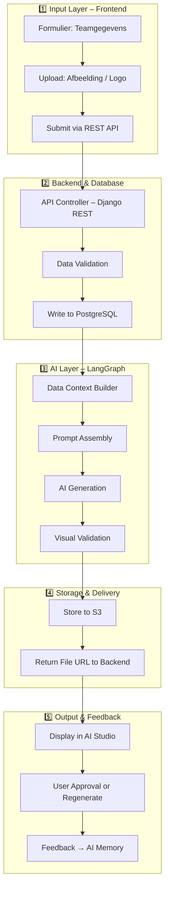

# 💾 TeamReel Data Flow

> **Van input tot impact — zo stroomt data door TeamReel.**

---

## 1. Doel van dit document
Dit document beschrijft hoe gegevens zich door het TeamReel-platform bewegen.
Het legt uit waar data vandaan komt, hoe ze wordt verwerkt door backend en AI, waar validatie plaatsvindt en hoe feedback de volgende generatie verbetert.

> **Kernboodschap:** *Elke datastroom is herleidbaar, gecontroleerd en betekenisvol.*

---

## 2. Overzicht van de datastroom

De basisstroom volgt vijf fasen:
1. **Invoer:** de gebruiker levert team-, wedstrijd- of spelersdata.
2. **Opslag & validatie:** de backend controleert structuur, rechten en volledigheid.
3. **AI-verrijking:** de AI-engine genereert visuals of video’s op basis van context.
4. **Output:** content wordt opgeslagen, gevalideerd en teruggestuurd naar de UI.
5. **Feedbackloop:** gebruikersfeedback en AI-analyse verbeteren volgende generaties.

```mermaid
flowchart LR
    A[User Input Club, Team, Data Upload] --> B[Backend Validation & Auth]
    B --> C[Database Write – PostgreSQL]
    C --> D[AI Trigger – LangGraph Workflow]
    D --> E["AI Generation: Visual or Video"]
    E --> F["Validation Layer: Logo, Color, Ratio"]
    F --> G[Storage – S3 / Railway]
    G --> H[Preview – AI Studio]
    H --> I[User Feedback Approve / Regenerate]
    I --> J[Feedback Log – LangGraph Memory]
    J --> K[Metrics & Logs – Grafana / Sentry]
```

> **Kernboodschap:** *De stroom is lineair voor eenvoud, cyclisch voor verbetering.*

---

## 3. Validatiestappen

| Fase | Controle | Doel |
|------|-----------|------|
| **Inputvalidatie** | Controle op clubrechten, datavorm en duplicaten. | Voorkomt foutieve of ongeautoriseerde data. |
| **AI-validatie** | Controle op kleurconsistentie, logo, beeldverhouding en tekst. | Garandeert merk- en stijlnauwkeurigheid. |
| **Outputvalidatie** | Controle of bestanden correct zijn opgeslagen en toegankelijk zijn. | Zekerheid dat eindgebruiker resultaat kan zien. |
| **Feedbackvalidatie** | Analyse van gebruikersreacties en AI-success rate. | Continue optimalisatie van prompts en workflows. |

> **Kernboodschap:** *Validatie is ingebouwd op elk niveau – automatisch én bewust.*

---

## 4. Detailstroom per subsystem

> **Kernboodschap:** *Van club tot cloud — data blijft logisch, traceerbaar en veilig.*

---

## 5. Data Lifecycle

| Fase | Actie | Systeem | Resultaat |
|------|--------|----------|-----------|
| **Create** | Gebruiker voert data in | UI / API | Nieuwe entiteiten in database |
| **Read** | UI haalt club- en teamdata op | API → PostgreSQL | Actuele weergave in dashboard |
| **Update** | AI genereert nieuwe content | LangGraph → S3 | Nieuwe versie gekoppeld aan team |
| **Delete** | Oude of foutieve data verwijderen | API + Backend | Opschoning en versiebeheer |
| **Feedback** | Gebruiker keurt goed / af | AI Studio | Verbetering van toekomstige output |

> **Kernboodschap:** *De levenscyclus van data is cyclisch en zelfverbeterend.*

---

## 6. Beveiliging & Privacy in de datastroom

| Onderdeel | Beveiliging | Privacymaatregel |
|------------|--------------|------------------|
| **Authenticatie** | JWT / Magic Link | Geen wachtwoorden opgeslagen. |
| **Transport** | HTTPS (TLS 1.3) | Alle dataverkeer versleuteld. |
| **Opslag** | Encryptie-at-rest (S3 / PostgreSQL) | Gevoelige data (namen, e-mails) versleuteld. |
| **Logs** | Toegangsrestrictie op monitoringtools | Alleen geaggregeerde data zichtbaar. |
| **AI-verwerking** | Tijdelijke sessies, geen hergebruik van ruwe data | Bescherming van persoonsgegevens. |

> **Kernboodschap:** *Privacy is standaard — niet optioneel.*

---

## 7. Relatie met andere documenten

| Document | Relevante koppeling |
|-----------|----------------------|
| **System Map** | Beschrijft de visuele lagen en relaties. |
| **Technical Design** | Detailleert API’s, database en tokens. |
| **AI Prompt Library** | Beschrijft welke data wordt gebruikt in AI-prompts. |
| **Projectplan** | Bepaalt wanneer en hoe de datastroom wordt getest. |

> **Kernboodschap:** *Data Flow is het functionele hart van TeamReel.*

---

## 8. Samenvatting
De datastroom binnen TeamReel is eenvoudig te begrijpen maar krachtig in uitvoering. Data beweegt veilig, transparant en gecontroleerd door alle lagen — van input tot AI-output en terug via feedback. Deze structuur zorgt dat groei en innovatie niet leiden tot chaos, maar tot meer precisie.

> **Kernboodschap:** *Helderheid in datastromen is de basis van schaalbare innovatie.*
