# ⚙️ Functioneel Ontwerp – TeamReel
> **TeamReel** combineert sportieve energie met digitale eenvoud.
> Dit functioneel ontwerp beschrijft de gebruikersflows, logica en interacties van de TeamReel-applicatie.
> Het document vertaalt de principes uit de *TeamReel Style Foundation* en *Brand Identity* naar concrete functies, schermen en AI-workflows.
> Versie: Oktober 2025 — Status: Definitieve richtlijn.
er 2025 — Status: Definitieve richtlijn.

## Metadata
| Element | Inhoud |
|----------|---------|
| **Project** | TeamReel |
| **Document** | Functioneel Ontwerp |
| **Datum** | Oktober 2025 |
| **Auteur** | Brian Stokvis |
| **Status** | Definitieve richtlijn |
| **Bronnen** | Gebaseerd op Businessplan, Brand Identity, Technical Design |
| **Doel** | Richtlijn voor implementatie van functies en gebruikerservaring |

---

## Inhoudsopgave

1. [Inleiding & Scope](#1-inleiding--scope)
2. [Gebruikersrollen & Toegang](#2-gebruikersrollen--toegang)
3. [Gebruikersflows (UX Journeys)](#3-gebruikersflows-ux-journeys)
4. [Datamodel & Datastructuur](#4-datamodel--datastructuur)
5. [AI-integratie & Automatisering](#5-ai-integratie--automatisering)
6. [Gebruikersinterface & Interactie](#6-gebruikersinterface--interactie)
7. [Feedback & Notificaties](#7-feedback--notificaties)
8. [Credits & Transactielogica](#8-credits--transactielogica)
9. [Beveiliging & Privacy](#9-beveiliging--privacy)
10. [Samenvatting & Implementatievereisten](#10-samenvatting--implementatievereisten)

---

## 1. Inleiding & Scope

### 1.1 Doel van dit document
Het *Functional Design* beschrijft hoe gebruikers met TeamReel interageren, welke functies beschikbaar zijn en hoe de applicatie deze functies aanbiedt. Het vormt de brug tussen strategie en techniek: waar het *Businessplan* de richting bepaalt en het *Technical Design* de architectuur beschrijft, legt dit document vast **wat** het systeem doet en **hoe** gebruikers het ervaren.

Het document dient als leidraad voor ontwerp, ontwikkeling en toekomstige uitbreiding. Alle onderdelen zijn ontworpen vanuit de merkwaarden en stijlprincipes van de *Brand Identity* — sportief, eenvoudig, herkenbaar en schaalbaar. De visuele en taalkundige richtlijnen volgen de *Style Foundation*, zodat tekst, interface en AI-output dezelfde toon en helderheid hebben.

---

### 1.2 Doel van de applicatie
**TeamReel** is een webapplicatie waarmee sportclubs moeiteloos professionele media kunnen maken in hun eigen stijl. De tool helpt teams om automatisch video’s en visuals te genereren op basis van hun clubdata: logo’s, kleuren, spelers en wedstrijden. Gebruikers kunnen teams beheren, spelers toevoegen en in enkele minuten content creëren die past bij hun clubidentiteit.

De technologie automatiseert repeterende taken, zodat vrijwilligers en coaches zich kunnen richten op het verhaal van hun team. Elke gebruiker houdt creatieve controle, terwijl de applicatie de technische uitvoering overneemt — consistent in stijl en toon dankzij de *Brand Identity*.

> **Kernboodschap:**
> *Professionele clubcontent. In vijf minuten. In jouw stijl.*

---

### 1.3 Kern van de eerste versie
De eerste productversie richt zich op drie momenten binnen de sportweek: vóór, tijdens en na de wedstrijd.
- **Pre-match:** het creëren van line-upvideo’s, flyers en aankondigingen.
- **During-match:** het genereren van doelpunt- of wisselupdates.
- **Post-match:** het maken van uitslagen, hoogtepunten en terugblikken.

De gebruiker kiest een type moment, vult de gegevens in, en TeamReel genereert automatisch de juiste output in de clubstijl. Zo ontstaat een herkenbare, continue stroom van content die het clubgevoel versterkt.

---

### 1.4 Scope en afbakening
De huidige versie omvat alle functies die nodig zijn voor contentcreatie op teamniveau. Het doel is niet om een volledig clubmanagementsysteem te bouwen, maar om media-productie te vereenvoudigen en automatiseren.

Binnen scope:
- Teams aanmaken en beheren.
- Spelers- en stafgegevens toevoegen.
- Wedstrijd- en seizoensdata gebruiken voor AI-content.
- Automatische generatie van visuals en video’s in clubstijl.
- Creditsysteem en toegangsbeheer.

De visuele en interactieve componenten worden aangestuurd via tokens uit de *Style Foundation* (kleuren, typografie, spacing).

Buiten scope (voor latere fases):
- Integraties met externe databronnen (Sportlink, KNVB API).
- Statistische dashboards en datarapportages.
- Modules *Nieuwsbriefgenerator* en *Coach van het Jaar*.
- Multi-tenant beheer voor organisaties met meerdere clubs.

---

### 1.5 Ontwerpprincipes
Het ontwerp van TeamReel is gebaseerd op vijf vaste uitgangspunten:

| Principe | Betekenis |
|-----------|------------|
| **Eenvoud** | Elke handeling is intuïtief en snel uit te voeren. |
| **Herkenbaarheid** | Alle visuals volgen automatisch de clubstijl. |
| **Flexibiliteit** | Ondersteuning voor meerdere sporten en teamsamenstellingen. |
| **Gebruiksgemak** | Ontworpen voor vrijwilligers en spelers zonder technische kennis. |
| **Automatisering** | AI-workflows draaien op de achtergrond, met menselijke goedkeuring op het juiste moment. |

Deze principes zorgen voor een consistente ervaring: herkenbaar voor clubs, eenvoudig voor gebruikers en schaalbaar voor groei. Deze principes sluiten aan op de merkwaarden uit de *Brand Identity*: eenvoud, betrouwbaarheid, samenwerking en trots.

---

### 1.6 Gebruikersgroepen
TeamReel wordt gebruikt door verschillende rollen binnen de sportvereniging:
- **Clubbeheerders** beheren identiteit, huisstijl en rechten.
- **Teambeheerders** organiseren spelers, wedstrijden en content.
- **Makers (spelers, trainers, stafleden)** genereren visuals en video’s.
- **Supporters** volgen of delen de gegenereerde content via openbare links.

De interface en rechtenstructuur passen zich automatisch aan per rol. Zo ziet elke gebruiker alleen wat relevant is voor zijn of haar taak.

---

### 1.7 Relatie met andere documenten
Het *Functional Design* is onderdeel van de documentatieketen van TeamReel. Samen met de andere kernbestanden vormt het één samenhangend geheel:

| Document | Functie |
|-----------|----------|
| **Businessplan** | Strategische richting en productvisie |
| **Brand Identity** | Visuele en verbale identiteit, designregels en tone of voice |
| **Style Foundation** | Design tokens, consistentieprincipes en UI-basis |
| **Technical Design** | Architectuur, API’s en datamodellen |
| **Projectplan** | Planning, kwaliteitsborging en releases |

Het *Functional Design* vertaalt deze strategieën naar de dagelijkse praktijk van de gebruiker: het bepaalt de ervaring, structuur en logica van de applicatie.

---

## 2. Gebruikersrollen & Toegang

### 2.1 Doel en uitgangspunten
De gebruikersstructuur van TeamReel is ontworpen voor clubs van elke omvang — van een enkel team tot verenigingen met tientallen elftallen. Het systeem verdeelt rechten op drie niveaus: **club**, **team** en **gebruiker**. Deze hiërarchie zorgt voor duidelijkheid, veiligheid en flexibiliteit. Rechten worden automatisch toegepast op basis van rol, en de interface toont alleen functies die relevant zijn voor de gebruiker.

---

### 2.2 Authenticatie en registratie
Gebruikers loggen in via een veilige, drempelloze authenticatie:
- **Magic link** per e-mail (standaardoptie).
- **Social login** via Google of Apple.

Na verificatie kiest de gebruiker een rol en koppelt zich aan een club of team. Clubs kunnen openstaan voor directe deelname of een goedkeuringsproces vereisen.
Toegang wordt geregeld via token-gebaseerde authenticatie, zoals beschreven in het *Technical Design*. De rechten vervallen automatisch na inactiviteit.

---

### 2.3 Rollenhiërarchie

| Roltype | Beschrijving | Toegang | Voorbeelden |
|----------|---------------|---------|--------------|
| **Clubbeheerder** | Vertegenwoordigt de club en beheert identiteit, teams, leden en huisstijl. | Volledig clubniveau | Communicatiecoördinator, mediabeheerder |
| **Teambeheerder** | Beheert teams, spelers, wedstrijden en content binnen één club. | Beperkt tot toegewezen teams | Coach, elftalleider |
| **Maker (speler of staflid)** | Creëert visuals en video’s in clubstijl. | Alleen eigen team | Speler, trainer, assistent |
| **Supporter** | Kan content bekijken en delen, maar niet wijzigen. | Alleen publieke content | Fans, ouders, sponsoren |

De hiërarchie *club → team → gebruiker* voorkomt conflicten in rechten en maakt beheer schaalbaar.

---

### 2.4 Teamrollen
Binnen een team heeft elk lid één of meerdere **functionele rollen**. Deze beïnvloeden zowel de toegangsrechten als de visuele weergave in AI-content.

| Teamrol | Functie | Mag content genereren | Wordt gebruikt in visuals |
|----------|----------|------------------------|---------------------------|
| **Coach** | Tactiek, opstelling, begeleiding | ✔️ | Ja |
| **Keeper** | Gespecialiseerde speler | ✔️ | Ja |
| **Speler** | Actief teamlid | ✔️ | Ja |
| **Staf** | Fysio, manager, analist | ❌ | Optioneel |
| **Assistent / vlagger** | Ondersteuning tijdens wedstrijden | ✔️ | Ja |
| **Supporter (team)** | Volger van het team | ❌ | Nee |

De rol bepaalt niet alleen de rechten in de app, maar ook de visuele elementen in gegenereerde content (tenue, positie, naamvermelding).

---

### 2.5 Clubbeleid en goedkeuring
Clubs kunnen bepalen of nieuwe teams zichzelf mogen koppelen of dat goedkeuring vereist is. Bij goedkeuring ontvangt de clubbeheerder automatisch een melding. De instelling geldt clubbreed en voorkomt ongewenste duplicatie of merkafwijkingen. Na goedkeuring worden clubdata — zoals logo, kleuren en sponsor — automatisch toegepast op het team.

---

### 2.6 Data-inheritance en consistentie
Teams erven visuele instellingen (logo, kleur, sponsor) direct van de club. AI-workflows gebruiken deze data bij elke generatie, zodat de content altijd consistent is met de identiteit van de vereniging. Teams kunnen hun eigen sponsor of accentkleur toevoegen, maar de basisstijl blijft onveranderd.

> **Samenvatting:**
> De gebruikersstructuur van TeamReel combineert eenvoud met controle.
> Clubs behouden zeggenschap, teams krijgen vrijheid om content te maken, en spelers werken intuïtief binnen hun eigen rol.

Alle visuele instellingen, kleuren en logo’s volgen automatisch de tokens en richtlijnen uit de *Style Foundation*.

---

## 3. Gebruikersflows (UX Journeys)

### 3.1 Overzicht
De gebruikersflows beschrijven hoe iemand door de applicatie beweegt — van eerste login tot het publiceren van content. Elke flow volgt dezelfde opzet: duidelijke stappen, minimale invoer, en waar mogelijk automatische invulling door AI. De UX is modulair opgebouwd, zodat nieuwe sporttypes en contentformats kunnen worden toegevoegd zonder de basis te wijzigen. De UI gebruikt kleuren, iconen en typografie volgens de *Brand Identity*, zodat elke flow visueel herkenbaar blijft.

---

### 3.2 Flow 1 – Aanmelden en clubselectie
De gebruiker logt in, kiest zijn rol en selecteert een club. Wanneer een club goedkeuring vereist, ontvangt de beheerder automatisch een melding. Na goedkeuring wordt het persoonlijke dashboard geladen met teams, wedstrijden en beschikbare templates.

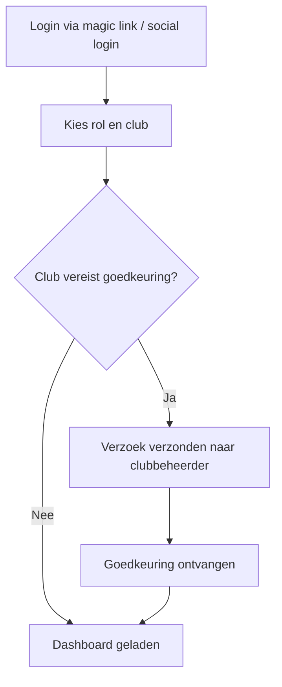
---

### 3.3 Flow 2 – Team aanmaken of dupliceren
Een teambeheerder kan een nieuw team aanmaken of een bestaand team dupliceren. Bij duplicatie worden spelers, rollen en seizoensinstellingen overgenomen, maar clubdata (logo, tenue, sponsor) vernieuwd.

De AI helpt bij het aanmaken van teams door herkende namen en posities uit een upload (zoals een Excel of afbeelding van een opstelling) automatisch in te vullen.

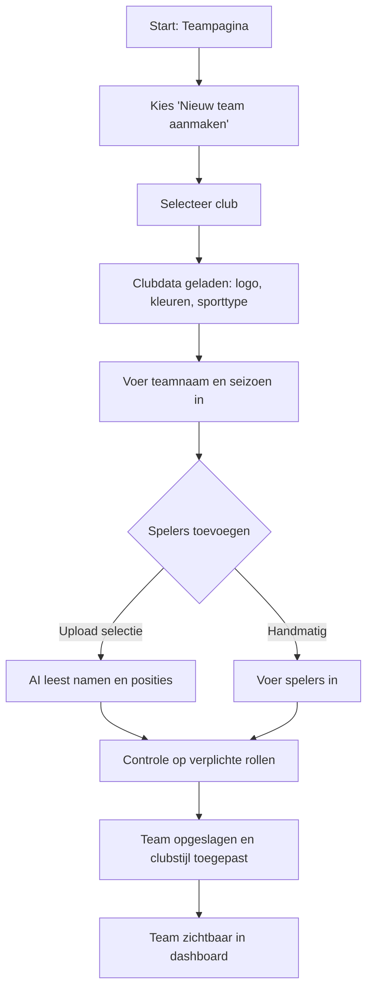
---

### 3.4 Flow 3 – Contentcreatie
Gebruikers maken content vóór, tijdens of na een wedstrijd. Ze kiezen het type moment, vullen enkele velden in, en de applicatie genereert automatisch visuals of video’s in de clubstijl. Alle wedstrijddata (datum, tijd, locatie, tegenstander) worden automatisch ingevuld vanuit het programma.

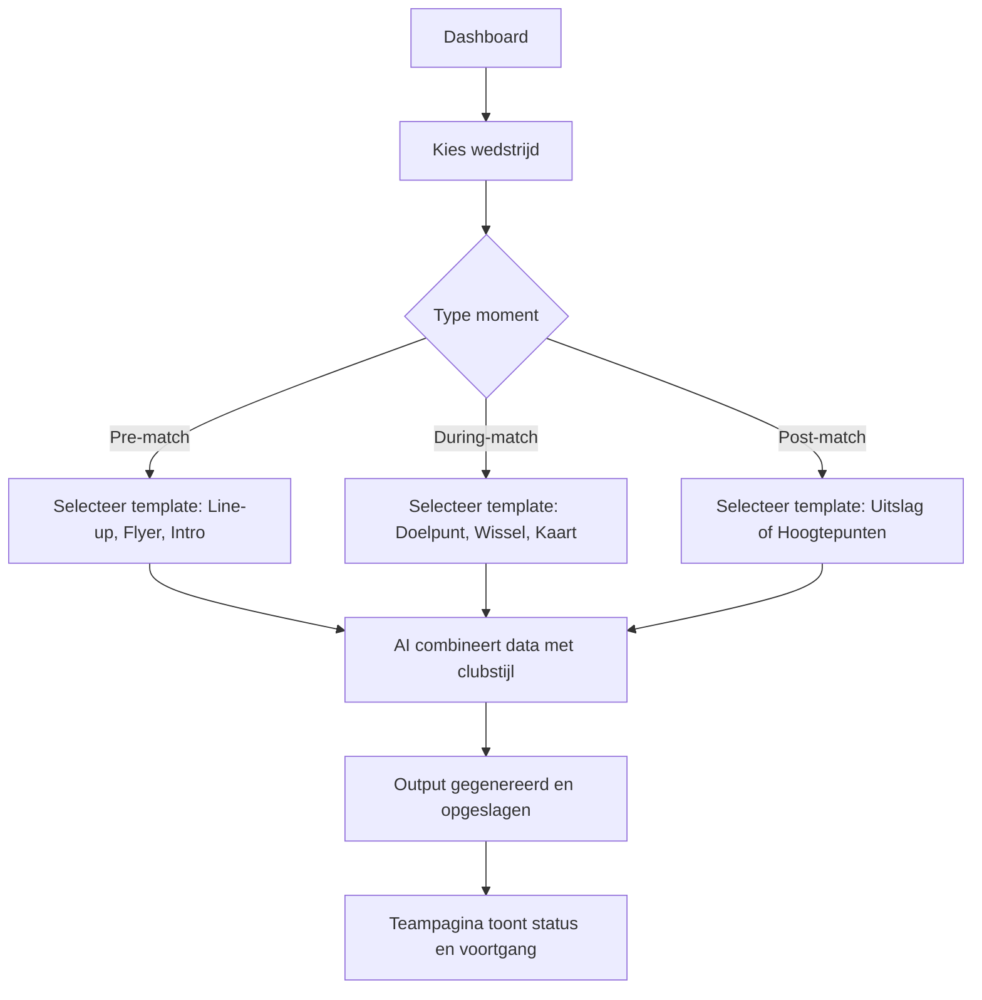

---

### 3.5 Flow 4 – Seizoenen en continuïteit
Bij de start van een nieuw seizoen kan een beheerder de selectie en instellingen van het vorige jaar overnemen. AI controleert of alle verplichte rollen aanwezig zijn en vult ontbrekende spelers automatisch aan met suggesties. Zo blijven teams herkenbaar, maar wordt de jaarlijkse herstart eenvoudig.

---

### 3.6 Flow 5 – Goedkeuring en publicatie
Elke AI-output wordt ter beoordeling aangeboden voordat deze wordt gepubliceerd. De gebruiker ontvangt een melding, bekijkt de preview en keurt goed of vraagt een hergeneratie aan. Na goedkeuring verschijnt de content in het teamarchief en kan deze gedeeld worden op sociale kanalen.

---

### 3.7 Samenvatting
De gebruikersflows zijn ontworpen om de balans te bewaren tussen automatisering en controle. AI neemt repeterend werk over, terwijl de gebruiker de creatieve regie houdt. De app leert van gedrag en verbetert suggesties over tijd — zonder complexiteit voor de eindgebruiker, en met behoud van visuele consistentie uit de *Style Foundation*.

> **Kernboodschap:**
> *TeamReel begeleidt de gebruiker van login tot publicatie in een natuurlijke, logische flow. Elke stap is ontworpen voor snelheid, herkenbaarheid en plezier in gebruik.*

---
## 4. Datamodel & Logica

### 4.1 Doel van dit hoofdstuk
Het datamodel beschrijft hoe TeamReel informatie structureert en hoe entiteiten zoals clubs, teams, spelers en AI-output met elkaar verbonden zijn. Het model sluit aan op de architectuur uit het *Technical Design*, maar richt zich hier op de **functionele samenhang**: welke gegevens de gebruiker invoert, welke relaties automatisch worden gelegd en hoe deze data de basis vormen voor AI-content.

Het model is modulair opgezet, zodat toekomstige uitbreidingen — zoals nieuwe sporten of modules — kunnen worden toegevoegd zonder bestaande data aan te passen. Alle entiteiten en datavelden sluiten aan op de terminologie in het *Technical Design*, zodat er één bron van waarheid is voor data, UI en AI-output.

---

### 4.2 Kernstructuur: Club → Team → Lid → Content
De basis van TeamReel is hiërarchisch opgebouwd:
1. **Clubniveau** – bepaalt identiteit, stijl en huisstijlregels.
2. **Teamniveau** – gebruikt clubinstellingen en voegt spelers, staf en sponsors toe.
3. **Lidniveau** – definieert rollen zoals speler, keeper of coach.
4. **Contentniveau** – genereert output op basis van data uit de vorige lagen.

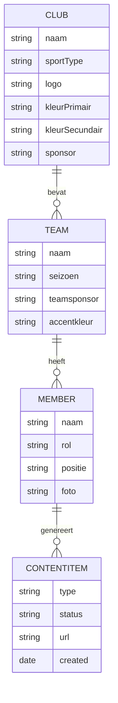

Elke entiteit heeft een duidelijke eigenaar: clubs beheren de identiteit, teams beheren de spelers, en gebruikers beheren hun persoonlijke data. De AI-workflows combineren deze gegevens om automatisch herkenbare visuals en video’s te genereren.

---

### 4.3 Teamrollen en visuele weergave
Elke speler of staflid heeft één of meer **teamrollen**. Deze bepalen zowel de rechten in de app als de visuele representatie in AI-output. De club bepaalt per sport welke rollen verplicht zijn (bijv. keeper bij voetbal, libero bij volleybal).

| Rol | Functie | Visuele representatie |
|------|----------|------------------------|
| **Coach** | Tactiek en begeleiding | Coachoutfit, naamvermelding in line-up |
| **Keeper** | Gespecialiseerde speler | Keeperstenue met aangepaste kleuren |
| **Speler** | Actief teamlid | Standaard wedstrijdtenue |
| **Assistent / staf** | Ondersteuning | Optioneel in visuals |
| **Supporter** | Volger van team | Alleen toegang tot publieke content |

De AI-workflows gebruiken deze rollen om automatisch outfits en posities toe te passen in gegenereerde visuals.

---

### 4.4 Seizoenen, wedstrijden en contentarchief
Elk team werkt binnen één of meerdere seizoenen. Een seizoen bevat zijn eigen spelerslijst, wedstrijden en contenthistorie.

Belangrijkste entiteiten:
- **Season** – groepeert wedstrijden en spelers per sportjaar.
- **Match** – bevat datum, tijd, locatie en tegenstander.
- **ContentItem** – verwijst naar gegenereerde visuals of video’s.
- **AIWorkflow** – beschrijft de gebruikte generatieroute (pre-match, during-match, post-match).

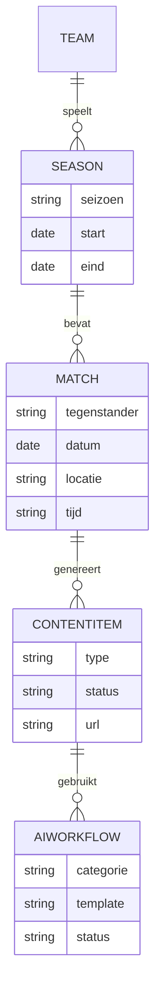

Wanneer een nieuw seizoen wordt gestart, kan de teambeheerder bestaande instellingen dupliceren. AI controleert automatisch of alle vereiste teamrollen aanwezig zijn en of het programma volledig is ingevuld. Hierdoor ontstaat een **continu datamodel**, waarin elk seizoen voortbouwt op de vorige — zonder handmatige invoer.

---

### 4.5 Dataflow en consistentie
De gegevensstromen binnen TeamReel volgen een vast patroon: invoer door gebruiker → validatie → AI-verrijking → output. Clubdata is altijd leidend; teams en leden erven die informatie. Wanneer teamgegevens ontbreken (bijvoorbeeld een sponsor), vult de AI deze automatisch aan met clubinstellingen.

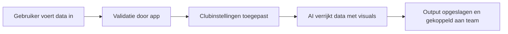

> **Samenvatting:**
> Het datamodel van TeamReel is eenvoudig, herbruikbaar en schaalbaar.
> Alle content is gebaseerd op één bron van waarheid: de club.
> Hierdoor ontstaat een uniforme gegevensstroom waarin elk team dezelfde visuele stijl en datalogica volgt — direct gekoppeld aan de tokens uit de *Style Foundation*.

---

## 5. AI-integratie & Automatisering

### 5.1 Doel van AI-integratie
De AI-integratie is de motor van TeamReel. Zij zorgt ervoor dat elke gebruiker binnen enkele minuten professionele content kan genereren. AI combineert gegevens uit clubs, teams en spelers om visuals en video’s te maken die automatisch voldoen aan de huisstijl.

De gebruiker blijft altijd eindverantwoordelijk voor goedkeuring, terwijl de AI werkt binnen de visuele en toonrichtlijnen van de *Brand Identity*.

---

### 5.2 Soorten AI-workflows
TeamReel gebruikt vier hoofdtypen AI-workflows, die elk een specifieke rol hebben in de contentcreatie.

| Type | Doel | Voorbeeldoutput |
|------|------|-----------------|
| **Clubflows** | Genereren van tenues en logo-integratie op clubniveau. | Basisclubtenue met sponsor |
| **Teamflows** | Aanpassing aan teamkleur en sponsor. | Keepervariant of team-sponsorvisual |
| **Persoonsflows** | Combineren van spelerfoto en tenue. | Spelervisual of close-up |
| **Videoflows** | Compositie van meerdere visuals tot één video. | Line-upvideo of seizoenscompilatie |

De AI-workflows werken modulair: de output van de ene flow is de input van de volgende.

---

### 5.3 Workflowcyclus
Elke AI-flow doorloopt dezelfde cyclus: invoer, validatie, generatie en goedkeuring. De gebruiker levert data of kiest een template, waarna AI het proces start.

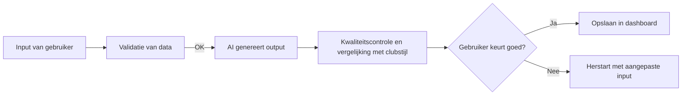

Deze cyclus voorkomt fouten en garandeert dat alle resultaten consistent blijven met de clubidentiteit.

---

### 5.4 Inputverwerking en parsing
Gebruikers kunnen handmatig gegevens invoeren of bestanden uploaden, zoals foto’s van opstellingen of wedstrijdschema’s. AI herkent automatisch namen, nummers en posities en vult deze velden in. Dit versnelt het proces en voorkomt handmatige invoerfouten.

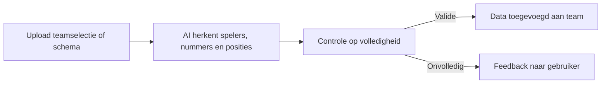

---

### 5.5 Automatisering en triggers
AI-workflows kunnen automatisch starten op basis van tijd, data of gebruikersactie.

| Type trigger | Voorbeeld | Actie |
|---------------|------------|-------|
| **Handmatig** | Gebruiker kiest “Genereer line-up” | Start directe flow |
| **Tijdgestuurd** | 24 uur voor wedstrijd | AI stuurt melding “Maak pre-match content” |
| **Data-gestuurd** | Nieuw team aangemaakt | AI genereert basisvisuals automatisch |

De gebruiker kan de automatisering altijd pauzeren of goedkeuring vereisen.
Zo blijft de balans behouden tussen autonomie en controle.

---

### 5.6 Kwaliteitscontrole
Na elke generatie controleert AI of het resultaat voldoet aan clubstandaarden (logo, kleur, sponsorpositie, resolutie). Bij afwijkingen volgt automatische correctie of een suggestie aan de gebruiker. Correcties worden niet alleen technisch, maar ook visueel gevalideerd tegen de merkregels uit de *Style Foundation* (kleur, contrast, typografie).

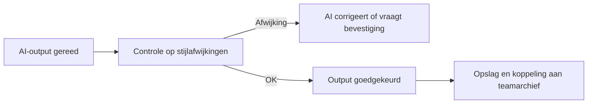

---

### 5.7 Samenvatting
De AI-integratie van TeamReel is ontworpen rond drie principes: **automatisering, controle en consistentie.**
Gebruikers leveren minimale input; AI genereert herhaalbare output in de juiste stijl.
Elke flow wordt bewaakt, gecontroleerd en gevalideerd.

> **Kernboodschap:**
> *AI neemt het werk over, de gebruiker behoudt de regie. Elke video of visual voelt persoonlijk, maar wordt automatisch geproduceerd.*

## 6. Gebruikersinterface & Interactie

### 6.1 Doel en uitgangspunten
De gebruikersinterface (UI) van TeamReel is ontworpen om de kracht van AI toegankelijk te maken voor vrijwilligers, spelers en trainers zonder technische kennis. Elke interactie is gericht op snelheid, eenvoud en herkenbaarheid. De interface is modulair opgebouwd, consistent met de visuele richtlijnen uit de *Brand Identity* en afgestemd op de logica van het datamodel uit het *Technical Design*.

**Ontwerpprincipes:**
1. **Eenvoud** – elke handeling is binnen drie stappen te voltooien.
2. **Transparantie** – gebruikers zien altijd in welke fase een AI-flow zich bevindt.
3. **Controle** – AI genereert automatisch, maar de gebruiker beslist over publicatie.
4. **Consistentie** – kleuren, typografie en iconen zijn uniform en clubafhankelijk.
5. **Motivatie** – visuele feedback en voortgangsindicatoren stimuleren gebruik.

De UI is volledig responsief en ontworpen voor gebruik op desktop, tablet en mobiel. De interface volgt de stijlrichtlijnen en tone-of-voice uit de *Brand Identity*, zodat elke melding, knop en melding dezelfde energie en helderheid heeft.

---

### 6.2 Hoofdstructuur van de applicatie
De webapplicatie bestaat uit vier hoofdsecties. Deze zijn zichtbaar in het hoofdmenu en worden dynamisch aangepast aan de rol van de gebruiker.

| Sectie | Functie | Gebruikersniveau |
|---------|----------|------------------|
| **Dashboard** | Overzicht van teams, lopende AI-flows en status van content | Alle gebruikers |
| **Teams** | Beheer van spelers, staf, seizoenen en wedstrijden | Teambeheerders, coaches |
| **Clubs** | Beheer van identiteit, outfits en huisstijl | Clubbeheerders |
| **AI Studio** | Startpunt voor AI-workflows en goedkeuringen | Makers en beheerders |

De navigatie bestaat uit een zijbalk (hoofdonderdelen) en een bovenbalk (contextuele acties). Op mobiel wordt dit vertaald naar tabbladen met dezelfde structuur.

---

### 6.3 Dashboard en voortgangsvisualisatie
Het dashboard is de centrale toegangspoort. Het toont:
- actieve teams en wedstrijden,
- status van AI-flows (in behandeling, voltooid, wacht op goedkeuring),
- en meldingen over goedkeuringen of ontbrekende data.

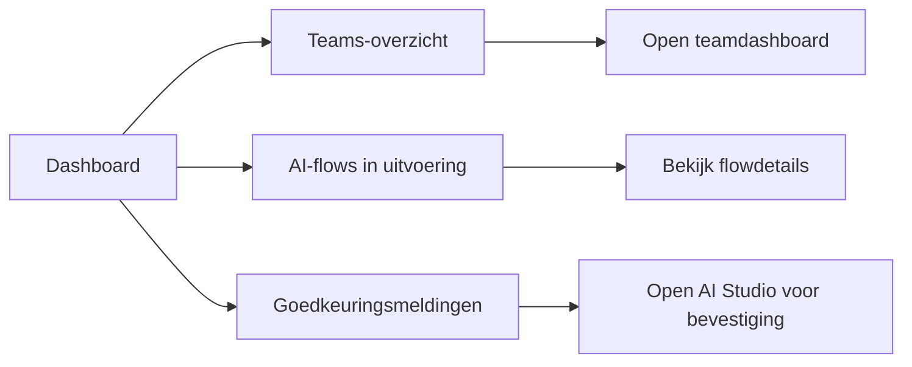

Elk team heeft een voortgangscirkel die aangeeft welk percentage van de beschikbare templates al is gebruikt. Volledige teams worden beloond met badges (“100% compleet”) om gebruik te stimuleren. De dashboards gebruiken tokens (`--color-primary`, `--color-accent`, `--font-heading`) rechtstreeks uit de *Style Foundation*.

---

### 6.4 Teambeheer en Clubbeheer
De schermen voor team- en clubbeheer volgen dezelfde structuur:
- **Linkerkolom:** instellingen en basisinformatie.
- **Middenkolom:** live-preview of spelerslijst.
- **Rechterkolom:** acties (opslaan, dupliceren, genereren).

**Teambeheer**
- Spelers toevoegen of importeren.
- Rollen en seizoenen beheren.
- Wedstrijdprogramma invoeren of uploaden (AI herkent tegenstanders en datums).
- AI-workflows starten voor visuals en video’s.

**Clubbeheer**
- Logo, kleurenschema en sponsor instellen.
- AI-flows voor outfits en branding beheren.
- Rechten toewijzen aan teambeheerders.
- Clubinstellingen goedkeuren of verwerpen.

De interface houdt alle data synchroon: aanpassingen in clubbeheer worden direct zichtbaar in gekoppelde teams.

---

### 6.5 AI Studio
De **AI Studio** is de creatieve kern van de applicatie. Hier starten, volgen en beoordelen gebruikers hun AI-flows. Elke flow is opgebouwd uit drie panelen:

| Paneel | Functie |
|---------|----------|
| **Input** | Gebruiker uploadt of selecteert gegevens. |
| **Verwerking** | AI toont voortgang met statusindicatoren. |
| **Output** | Preview van gegenereerde content met optie tot goedkeuring. |

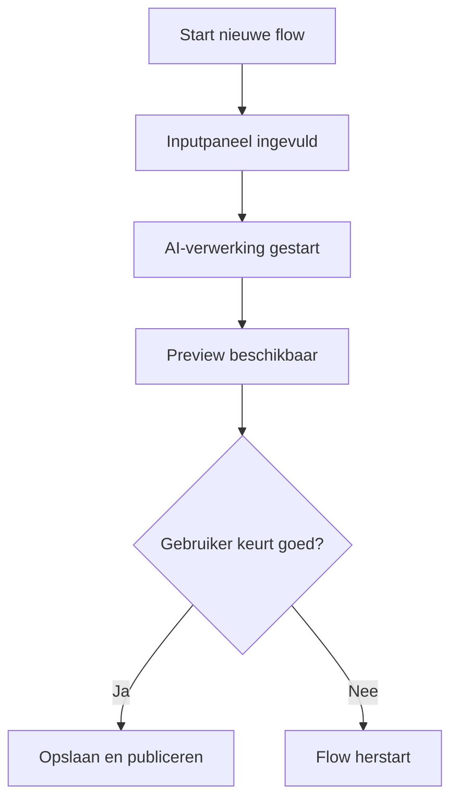

De AI Studio geeft feedback via kleuren en iconen:
- 🟦 **Blauw:** actief
- 🟧 **Oranje:** wacht op goedkeuring
- 🟩 **Groen:** afgerond

Zo weten gebruikers altijd in welke fase hun content zich bevindt.

---

### 6.6 Interactie en feedback
Gebruikers ontvangen feedback bij elke stap in de vorm van meldingen of pop-ups. De toon is vriendelijk en activerend, zoals vastgelegd in de *Brand Identity*.

| Type feedback | Voorbeeldmelding | Actie |
|----------------|------------------|--------|
| **Informatie** | “Je line-upvideo wordt nu gegenereerd.” | Wachten of bekijken |
| **Waarschuwing** | “Er ontbreken 2 spelers in de opstelling.” | Aanvullen |
| **Fout** | “Logo heeft onvoldoende resolutie.” | Nieuwe upload |
| **Succes** | “Video succesvol gegenereerd!” | Downloaden of delen |

Feedback verschijnt contextueel: bij flows in de AI Studio, bij teambeheer of bij het goedkeuren van resultaten.

---

### 6.7 Samenvatting
De gebruikersinterface van TeamReel combineert eenvoud met intelligentie. Gebruikers navigeren intuïtief tussen clubs, teams en AI-flows, terwijl ze steeds feedback krijgen over de status van hun content. De AI werkt op de achtergrond, maar de gebruiker behoudt altijd de controle.

> **Kernboodschap:**
> *TeamReel maakt complexe technologie eenvoudig en herkenbaar. Elke vrijwilliger kan professionele clubcontent creëren — snel, visueel en met plezier.*

---

## 7. Feedback, Notificaties & Credits

### 7.1 Doel en samenhang
Feedback, notificaties en credits vormen samen de communicatielaag van TeamReel. Ze zorgen voor transparantie in het gebruik van AI, stimuleren samenwerking binnen teams en maken verbruik meetbaar. Deze drie onderdelen versterken elkaar: feedback vertelt *wat er gebeurt*, notificaties *wanneer*, en credits *hoe vaak*. De toon van alle feedback en meldingen is afgestemd op de *Brand Identity*: vriendelijk, duidelijk en actiegericht.

---

### 7.2 Feedbackcyclus
Elke AI-flow doorloopt een vaste feedbacklus waarin de gebruiker volledig inzicht krijgt in de voortgang.

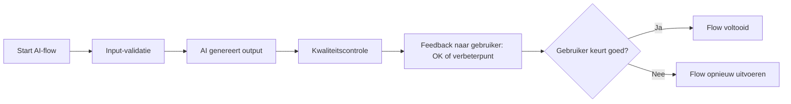

**Belangrijke principes:**
- Feedback is altijd concreet en actiegericht.
- Elke melding bevat context, status en suggestie.
- AI leert van herhaalde correcties (feedback wordt gebruikt om toekomstige generaties te verbeteren).

---

### 7.3 Notificatiesysteem
Notificaties houden gebruikers op de hoogte van relevante gebeurtenissen binnen hun club of team. Meldingen verschijnen in-app en, optioneel, via e-mail of pushbericht.

| Gebeurtenis | Ontvangers | Type melding |
|--------------|-------------|---------------|
| Nieuwe AI-flow gestart | Initiator | In-app |
| Flow gereed voor goedkeuring | Teambeheerder | In-app + e-mail |
| Clubdata gewijzigd | Alle teambeheerders | In-app |
| Fout bij generatie | Gebruiker + systeembeheerder | E-mail |
| Nieuwe credits toegevoegd | Clubbeheerder | In-app + e-mail |

Gebruikers kunnen meldingen filteren op type en status, zodat het overzicht bewaard blijft.

---

### 7.4 Creditsysteem
Credits vertegenwoordigen de waarde van AI-acties en volgen hetzelfde transparante model als beschreven in het *Businessplan* en *Technical Design*. Elke generatie verbruikt een vast aantal credits, afhankelijk van de complexiteit. Het systeem is transparant en werkt op drie niveaus: club, team en gebruiker.

| Niveau | Beheerder | Toepassing |
|---------|-------------|------------|
| **Clubcredits** | Clubbeheerder | Grote generaties of seizoenscontent |
| **Teamcredits** | Teambeheerder | Wedstrijd- en spelerscontent |
| **Gebruikerscredits** | Maker | Persoonlijke visuals of profielcontent |

**Voorbeeld:**
- Een line-upvideo kost 5 credits.
- Een spelersvisual kost 2 credits.
- Parsing van een wedstrijdschema kost 1 credit.

Bij onvoldoende saldo ontvangt de gebruiker een melding met de optie om credits aan te vullen of te verdelen vanuit de clubbundel.

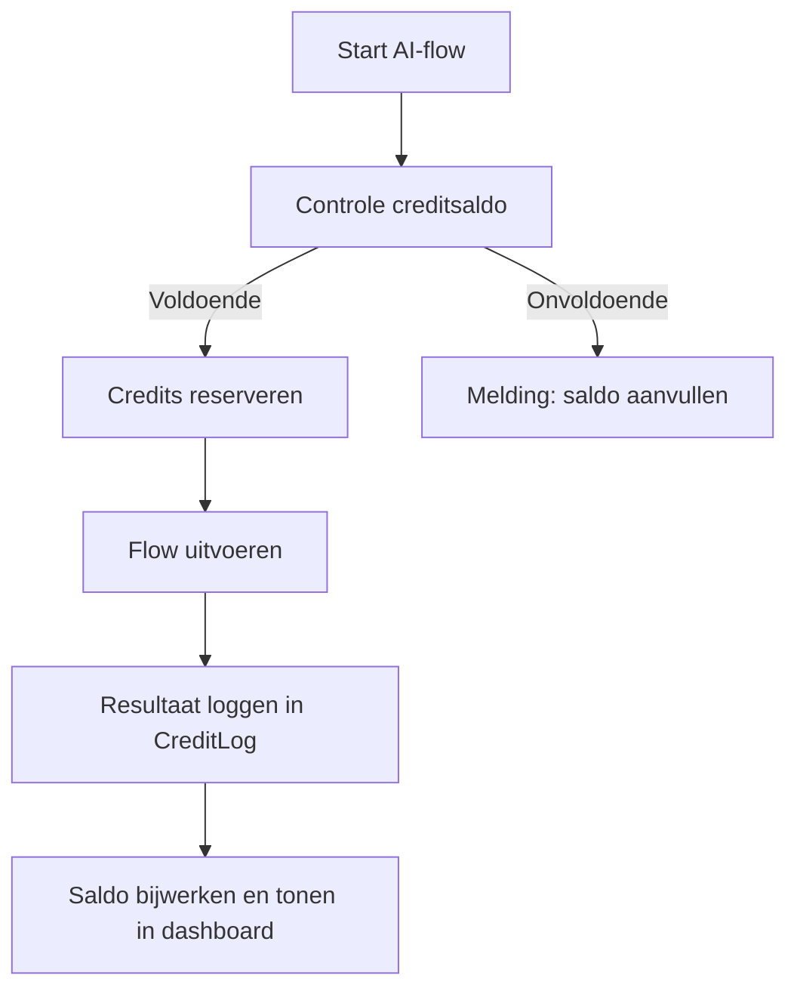

---

### 7.5 Samenhang en transparantie
Alle meldingen, feedback en credittransacties worden centraal gelogd. Clubbeheerders kunnen rapportages genereren om gebruik en verbruik te monitoren. Zo ontstaat inzicht in activiteit, kosten en prestaties van teams.

**Voordelen van deze structuur:**
- Gebruikers weten altijd wat er gebeurt.
- Clubs behouden overzicht over AI-verbruik.
- AI leert van feedback en verbetert zichzelf continu.

---

### 7.6 Samenvatting
Feedback, notificaties en credits vormen de verbindende laag tussen mens en machine. Ze maken het platform transparant, betrouwbaar en motiverend in gebruik. De stijl en toon van meldingen volgen de *Style Foundation* voor consistentie tussen app, e-mail en AI-feedback.

> **Kernboodschap:**
> *TeamReel communiceert met de gebruiker als een teamgenoot — duidelijk, positief en resultaatgericht. AI en mens werken samen aan herkenbare clubcontent.*

---

## 8. Beveiliging & Privacy

### 8.1 Doel en uitgangspunten
Beveiliging en privacy zijn structureel onderdeel van TeamReel — niet als aanvulling, maar als uitgangspunt. Het platform verwerkt gegevens van spelers, teams en clubs en beschermt deze informatie volgens de principes van **veiligheid, transparantie en eigenaarschap**. De technische invulling van deze maatregelen is beschreven in het *Technical Design*; dit hoofdstuk richt zich op de functionele kant: hoe gebruikersrechten, data en zichtbaarheid binnen de app worden beheerd. De gebruikersinterface communiceert privacyinstellingen met duidelijke iconen en kleurcontrasten volgens de *Style Foundation*.

---

### 8.2 Functionele beveiligingsprincipes

| Principe | Toepassing |
|-----------|-------------|
| **Minimale dataopslag** | Alleen noodzakelijke informatie wordt opgeslagen. Geen overbodige metadata. |
| **Scheiding van verantwoordelijkheden** | Club-, team- en gebruikersdata zijn strikt gescheiden. |
| **Rolgebaseerde toegang** | Rechten worden automatisch bepaald op basis van rol (zie hoofdstuk 2). |
| **Encryptie en transportbeveiliging** | Alle uploads en downloads verlopen via versleutelde verbindingen. |
| **Transparantie voor gebruikers** | Gebruikers kunnen altijd zien welke data van hen wordt bewaard. |

---

### 8.3 Toegangscontrole
Het toegangsmodel volgt dezelfde hiërarchie als het datamodel: **club → team → gebruiker**. Elke gebruiker krijgt toegang tot zijn eigen data en relevante teams, afhankelijk van rol en rechten. Authenticatie verloopt via tokens die automatisch verlopen bij inactiviteit.

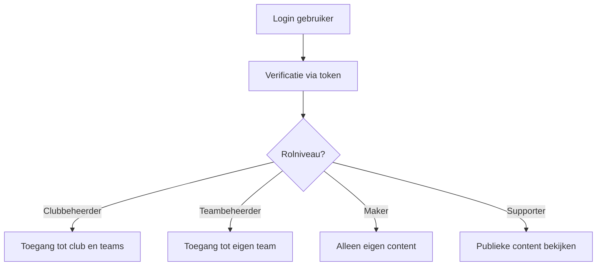

Clubs kunnen zelf instellen of nieuwe teams direct toegang krijgen of eerst goedkeuring vereisen. Hiermee wordt het clubbeleid functioneel afdwingbaar binnen de app.

---

### 8.4 Privacyinstellingen voor gebruikers
Gebruikers en clubs bepalen zelf de zichtbaarheid van hun data.
Elke visual of video heeft drie privacy-niveaus:

| Niveau | Beschrijving | Toegankelijk voor |
|---------|---------------|-------------------|
| **Publiek** | Content zichtbaar op openbare profielen of gedeelde links. | Iedereen |
| **Clubintern** | Content alleen zichtbaar binnen de eigen clubomgeving. | Clubleden |
| **Privé** | Content enkel zichtbaar voor de gebruiker zelf. | Alleen maker |

Bij upload van persoonlijke foto’s wordt toestemming gevraagd.
De gebruiker krijgt een duidelijke melding, zoals:
> “Door deze afbeelding te uploaden bevestig je dat je toestemming hebt van de persoon op de foto.”

De interface maakt privacykeuzes visueel herkenbaar met symbolen:
- 🔓 = Publiek
- 🏟️ = Clubintern
- 🔒 = Privé

Deze iconen zijn gestileerd in lijn met de *Brand Identity* (lineaire stijl, blauw of wit afhankelijk van thema).

---

### 8.5 Incidentbeheer
Bij beveiligings- of privacy-incidenten start automatisch een meld- en herstelproces. Dit proces is conform de AVG/GDPR en vastgelegd in het interne *Security Incident Register*.

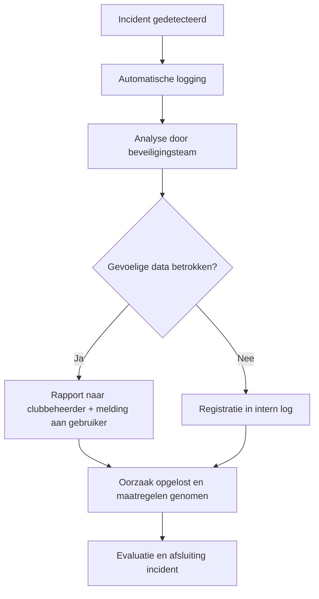

Clubs en gebruikers worden binnen 24 uur geïnformeerd als hun data betrokken is. Het herstelproces wordt vervolgens geëvalueerd en vastgelegd als leerpunt voor toekomstige verbeteringen.

---

### 8.6 Samenvatting
TeamReel garandeert veilige verwerking van club- en spelersgegevens door middel van rolgebaseerde toegang, transparante privacyopties en snelle incidentafhandeling. Alle beveiligingslagen zijn ontworpen vanuit het principe *security by design*.

> **Kernboodschap:**
> *TeamReel beschermt niet alleen content, maar ook vertrouwen.
> Privacy en veiligheid zijn ingebouwd in elke laag van het platform.*

---

## 9. Implementatie & Roadmap

### 9.1 Doel
De implementatie- en roadmapfase beschrijft hoe TeamReel functioneel wordt uitgerold. De focus ligt op iteratieve ontwikkeling: bouwen, testen, verbeteren. Elke fase bouwt voort op de vorige, met behoud van compatibiliteit en consistentie.

---

### 9.2 Fasen en prioriteiten
De roadmap is afgestemd op het *Businessplan* en volgt dezelfde opbouw.

| Fase | Doel | Belangrijkste functies |
|------|------|-------------------------|
| **Fase 1 – Basisontwikkeling** | Eerste werkende versie van de Content Generator. | Teambeheer, spelersbeheer, AI-flows, creditsysteem. |
| **Fase 2 – Meerdere sporten** | Uitbreiding naar hockey, volleybal, handbal en zaalvoetbal. | Sportprofielen, specifieke teamstructuren, flexibele templates. |
| **Fase 3 – Schaalvergroting & internationale uitrol** | Platform uitbreiden naar andere talen en markten. | Meertalige interface, regiofilters, multi-clubbeheer. |
| **Fase 4 – Nieuwe modules** | Toevoegen van verdieping en automatisering. | Nieuwsbriefgenerator, Coach van het Jaar, prestatiecontent. |

De visuele en technische deliverables per fase volgen de structuur van de *Style Foundation* en worden bewaakt via CI/CD-checks (zie *Technical Design* hoofdstuk 10).

---

### 9.3 Functionele mijlpalen

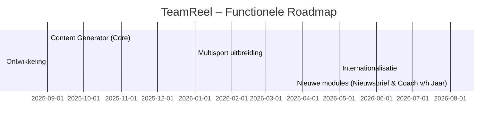

Elke fase bevat visuele consistentiecontroles (tokens, fonts, kleuren), gebruikerstesten en feedbackcycli:
- **Gebruikerstesten** bij pilotclubs.
- **Feedbackcycli** voor UX en AI-workflows.
- **Data-evaluatie** om prestaties en consistentie te verbeteren.

---

### 9.4 Functionele randvoorwaarden
Voor een succesvolle implementatie gelden de volgende randvoorwaarden:
- Stabiele verbinding tussen frontend en API’s.
- Eenduidig rechtenbeheer tussen clubs en teams.
- Volledige logging van AI-activiteiten en creditverbruik.
- Gebruiksvriendelijke interface die ook op mobiel optimaal presteert.
- Meertaligheid voorbereid op uitbreiding buiten Nederland.

---

### 9.5 Samenhang met andere documenten
Het implementatieplan bouwt op de kaders uit de andere kernbestanden:

| Document | Bijdrage aan implementatie |
|-----------|----------------------------|
| **Businessplan** | Strategische richting en prioritering. |
| **Brand Identity** | Consistente visuele uitstraling. |
| **Technical Design** | API’s, dataopslag, AI-integratie. |
| **Projectplan** | Planning, testing en kwaliteitsborging. |

Door deze integrale aanpak blijft TeamReel in elke fase consistent in stijl, werking en technische uitvoering.

---

### 9.6 Samenvatting
De functionele roadmap van TeamReel groeit van kernfunctionaliteit naar verdieping, zonder complexiteit toe te voegen.
Elke uitbreiding versterkt de oorspronkelijke belofte: clubs helpen om snel, eenvoudig en professioneel hun verhaal te vertellen.

> **Kernboodschap:**
> *TeamReel groeit stap voor stap — van lokale tool naar internationaal platform — met behoud van eenvoud en herkenbare clubidentiteit.*

## 10. Samenvatting & Toepassing

### 10.1 Overzicht
Het *Functional Design* beschrijft hoe TeamReel in de praktijk werkt — van gebruikersinteractie tot AI-workflows, van datamodel tot beveiliging. Het document is afgestemd op de *Businessplan*-visie, de *Brand Identity*-stijl en de technische opzet uit het *Technical Design*.

De belangrijkste principes zijn:
- **Eenvoud** – de gebruiker voert minimale input in; AI doet de rest.
- **Herkenbaarheid** – elke output volgt automatisch de clubstijl.
- **Controle** – de gebruiker keurt altijd goed wat de AI maakt.
- **Schaalbaarheid** – het systeem groeit mee met nieuwe sporten en markten.
- **Transparantie** – elke stap, melding en credittransactie is inzichtelijk.

---

### 10.2 Functionele kern

| Onderdeel | Belangrijkste functie | Samenhang met andere documenten |
|------------|----------------------|--------------------------------|
| **Gebruikersrollen & toegang** | Zorgt voor veilige, logische rechtenstructuur per club en team. | Sluit aan op datamodel in *Technical Design*. |
| **Gebruikersflows** | Beschrijft hoe gebruikers content genereren. | Ondersteunt UX-ontwerp en ontwikkelplanning. |
| **Datamodel & logica** | Houdt clubs, teams, spelers en content in één consistent systeem. | Basis voor API-structuur. |
| **AI-integratie & automatisering** | Automatiseert contentcreatie met behoud van controle. | Koppelt functionele input aan AI-workflows. |
| **Gebruikersinterface & interactie** | Maakt AI begrijpelijk en gebruiksvriendelijk. | Visuele uitwerking volgens *Brand Identity*. |
| **Feedback, notificaties & credits** | Zorgt voor transparantie en motivatie. | Onderdeel van gebruikerservaring en data-analyse. |
| **Beveiliging & privacy** | Beschermt gebruikers en clubs tegen datarisico’s. | Functionele vertaling van *Technical Design* beveiligingsmodel. |
| **Implementatie & roadmap** | Geeft richting aan groei en releases. | Geïntegreerd met *Projectplan*. |
| **Stijl en toon** | Waarborgt merkconsistentie tussen UI, AI-output en documentatie. | Gebaseerd op *Style Foundation* en *Brand Identity*. |

---

### 10.3 Praktische toepassing
Het *Functional Design* dient als referentie voor:
- **Ontwikkelaars:** om functionaliteiten te bouwen op basis van logica, flows en datamodellen.
- **Designers:** om interfaces te ontwerpen die passen binnen de gebruikersflows.
- **Projectleiding:** om releases te plannen en testen te structureren.
- **Clubs en testers:** om te begrijpen hoe TeamReel hun dagelijkse werk ondersteunt.

De documentatie is modulair opgezet. Elk hoofdstuk kan zelfstandig gebruikt worden bij ontwerpbeslissingen, QA-tests of toekomstige uitbreidingen.
Door deze structuur blijft TeamReel wendbaar en consistent, ongeacht schaal of complexiteit. Bij elke uitbreiding moet worden gecontroleerd of de UI, tekst en AI-flow voldoen aan de *Style Foundation*.

---

### 10.4 Doorontwikkeling
Toekomstige iteraties bouwen voort op dit functioneel kader.
Nieuwe modules zoals de *Nieuwsbriefgenerator* en *Coach van het Jaar* volgen dezelfde ontwerpprincipes en sluiten direct aan op bestaande data, UI en AI-workflows.
De nadruk ligt op herbruikbaarheid: één systeem, meerdere toepassingen.

---

### 10.5 Samenvattende conclusies
TeamReel maakt professionele clubcommunicatie eenvoudig, herkenbaar en schaalbaar.
De combinatie van AI, duidelijke gebruikersflows en consistente visuele stijl zorgt ervoor dat elke vrijwilliger content kan maken die de trots van de club weerspiegelt.
Het platform is ontworpen om te groeien — technisch, functioneel en creatief — zonder de eenvoud te verliezen die het zo toegankel
