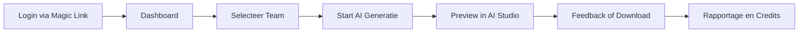

# 🧩 Management Summary – Functional Design

> **Eén platform, vele rollen – eenvoud voor de gebruiker, kracht voor de club.**

---

## 1. Doel van het Functional Design
Het *Functional Design* beschrijft **hoe gebruikers met TeamReel werken**:
welke stappen ze zetten, welke schermen ze zien en hoe data tussen modules stroomt.
Het vormt de blauwdruk voor de gebruikerservaring (UX) en de verbinding met de backend en AI.

> **Kernboodschap:** *Gebruikersgemak bepaalt de technologie, niet andersom.*

---

## 2. Gebruikerstypen en rollen

| Rol | Beschrijving | Voorbeeldacties |
|------|---------------|-----------------|
| **Vrijwilliger / Communicatiebeheerder** | Maakt en beheert clubcontent. | Nieuwe video genereren, berichten delen. |
| **Trainer / Teammanager** | Voert wedstrijddata en teams in. | Uitslagen, spelers en opstellingen beheren. |
| **Clubbeheerder** | Stelt clubstijl, logo en kleuren in. | Templates aanpassen, gebruikers beheren. |
| **Systeembot / AI-engine** | Automatiseert content en validatie. | Analyseert data, genereert visuals en video’s. |

> **Kernboodschap:** *Iedereen kan meedoen — zonder technische kennis.*

---

## 3. Hoofdmodules van het platform

| Module | Functie | Output |
|---------|----------|---------|
| **Dashboard** | Overzicht van teams, wedstrijden en media. | Clubstatistieken en status van AI-output. |
| **AI Studio** | Start en beoordeel AI-generaties. | Video’s, visuals en posts. |
| **Teambeheer** | Voeg teams, spelers en sponsors toe. | Up-to-date clubprofiel. |
| **Contentbibliotheek** | Alle gegenereerde media op één plek. | Doorzoekbare, deelbare AI-content. |
| **Credits & Rapportage** | Volg gebruik, feedback en AI-prestaties. | Data voor groei en sponsorwaarde. |

> **Kernboodschap:** *Eén plek voor alles – van input tot impact.*

---

## 4. Gebruikersflow in beeld

Elke actie is intuïtief en herhaalbaar, met duidelijke feedback vanuit de AI en backend.

> **Kernboodschap:** *De flow is kort, logisch en herkenbaar.*

---

## 5. Integratie met backend en AI
Het Functional Design is volledig afgestemd op de **API Reference** en de **AI-workflows** uit de *Blauwdruk*.
Alle schermen communiceren via gestandaardiseerde endpoints (`/api/v1/`).
Feedback en credits worden direct verwerkt in de backend, zodat gebruikers realtime inzicht houden.

> **Kernboodschap:** *De UX is simpel omdat de logica slim is.*

---

## 6. Samenhang met andere documenten

| Document | Relatie |
|-----------|----------|
| **Businessplan** | Vertrekt vanuit de gebruikersbehoefte. |
| **Technical Design** | Beschrijft de systemen die de functionaliteit mogelijk maken. |
| **API Reference** | Legt vast welke endpoints de modules gebruiken. |
| **Blauwdruk** | Visualiseert datastromen tussen modules. |
| **Projectplan** | Beheert de oplevering per module. |

> **Kernboodschap:** *Het Functional Design is de menselijke kant van de techniek.*

---

## 7. Samenvatting
TeamReel is ontworpen met de gebruiker als uitgangspunt: snel, logisch en plezierig.
Elke module heeft één duidelijk doel, en samen vormen ze een compleet ecosysteem waarin vrijwilligers en AI samenwerken.
Het resultaat is een platform dat tijd bespaart, kwaliteit verhoogt en trots zichtbaar maakt.

> **Kernboodschap:** *TeamReel brengt eenvoud in technologie en kracht in communicatie.*
