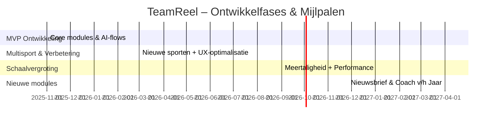
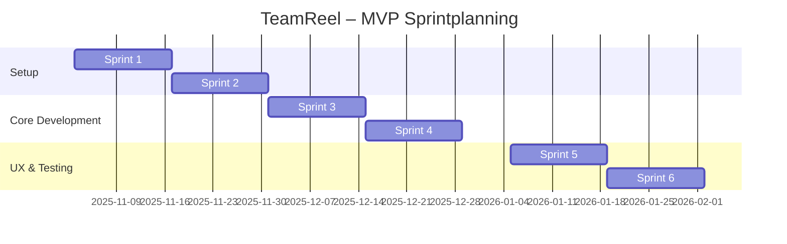
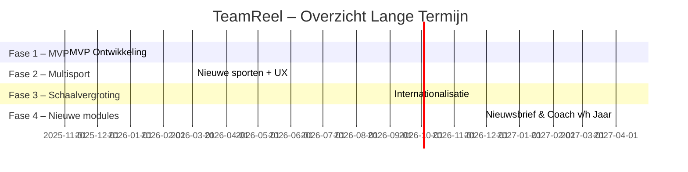
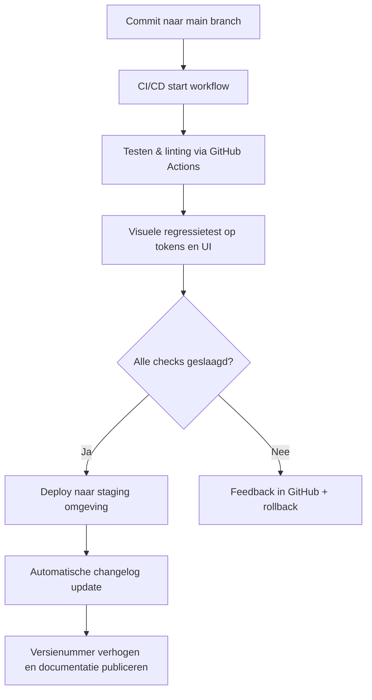
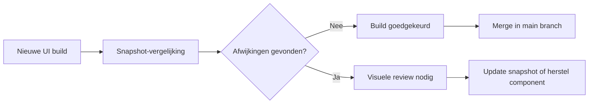
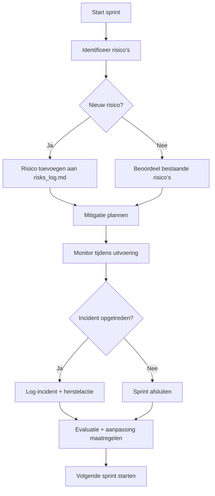
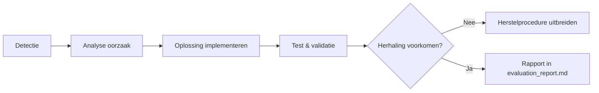
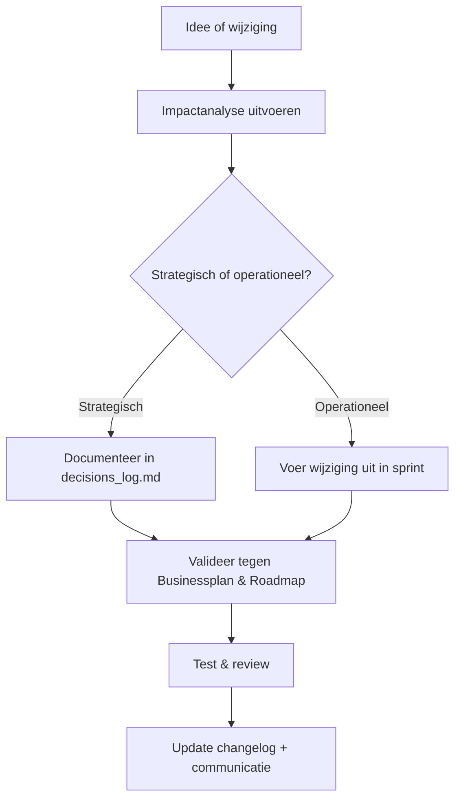
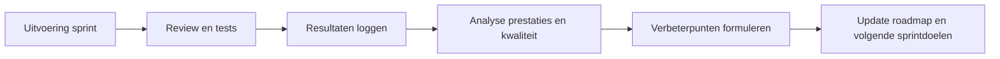
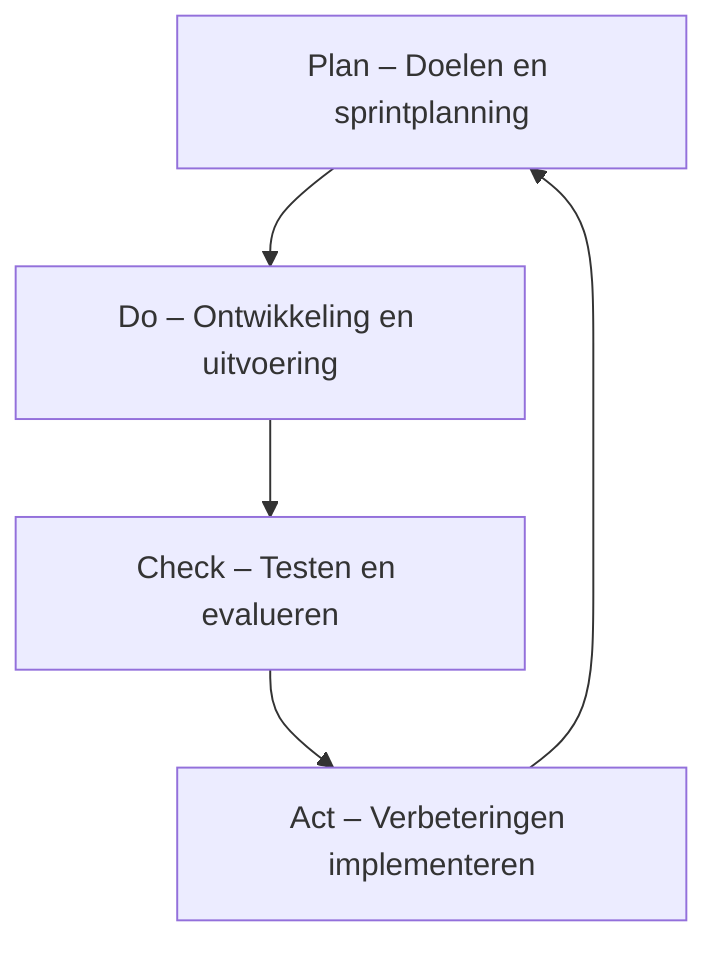

> **TeamReel** werkt iteratief, modulair en met duidelijke mijlpalen.
> Dit projectplan beschrijft de roadmap, epics, kwaliteitscriteria en risico’s
> die de ontwikkeling van de MVP-fase richting geven volgens de *TeamReel Style Foundation (v2)*.
> Versie: Oktober 2025 — Status: Definitieve richtlijn (v2).
# 🚀 Projectplan – TeamReel
> **TeamReel** brengt sportieve energie en digitale helderheid samen.
> Dit projectplan beschrijft hoe de visie uit het *Businessplan* en de ontwerpen uit het *Functional* en *Technical Design* worden omgezet in concrete acties, teams en mijlpalen.
> Het vormt de operationele blauwdruk voor de realisatie van het TeamReel-platform.
> Versie: Oktober 2025 — Status: Werkdocument.

---

## 📘 Metadata
| Element | Inhoud |
|----------|---------|
| **Project** | TeamReel |
| **Document** | Projectplan |
| **Datum** | Oktober 2025 |
| **Auteur** | Brian Stokvis |
| **Status** | Werkdocument |
| **Bronnen** | Businessplan, Functional Design, Technical Design, Brand Identity, Style Foundation |
| **Doel** | Richtlijn voor uitvoering, planning, rollen, risico’s en kwaliteitsborging |

---

## Inhoudsopgave
1. [Inleiding & Doel](#1-inleiding--doel)
2. [Projectstructuur & Rollen](#2-projectstructuur--rollen)
3. [Fases & Mijlpalen](#3-fases--mijlpalen)
4. [Tijdlijn & Sprintplanning](#4-tijdlijn--sprintplanning)
5. [Kwaliteitsborging & Testing](#5-kwaliteitsborging--testing)
6. [Risicobeheersing](#6-risicobeheersing)
7. [Governance & Evaluatie](#7-governance--evaluatie)
8. [Samenvatting](#8-samenvatting)

---

## 1. Inleiding & Doel

### 1.1 Context
**TeamReel** is een AI-gedreven platform waarmee sportverenigingen eenvoudig professionele clubcontent kunnen maken in hun eigen stijl. Na afronding van de ontwerpfase (Businessplan, Functional Design, Technical Design, Brand Identity en Style Foundation) is het platform klaar voor de volgende stap: **implementatie en realisatie**.

Dit projectplan vertaalt de strategische visie naar concrete uitvoer:
- Wie doet wat?
- Wanneer gebeurt het?
- Welke middelen en risico’s spelen een rol?
- En hoe blijft kwaliteit geborgd tijdens groei?

> **Kernboodschap:**
> *Van visie naar uitvoering — dit document beschrijft hoe TeamReel werkelijkheid wordt.*

---

### 1.2 Doel van het projectplan
Het doel van dit document is het bieden van **duidelijkheid en richting** voor alle betrokkenen. Het beschrijft hoe de verschillende disciplines (ontwikkeling, design, AI, communicatie en business) samenwerken binnen één gestructureerde aanpak.

Concreet:
- **Planning** van alle projectfases: MVP, groei, schaalvergroting, internationalisatie.
- **Teamrollen** met verantwoordelijkheden en besluitlijnen.
- **Mijlpalen** en oplevercriteria per fase.
- **Kwaliteitsbewaking** via test- en reviewmomenten.
- **Risicobeheersing** en escalatieprocedures.
- **Governance** en continue evaluatie.

> **Kernboodschap:**
> *Het projectplan zorgt voor overzicht, voortgang en vertrouwen — één team, één richting.*

---

### 1.3 Scope en uitgangspunten
De scope van dit plan omvat de volledige realisatie van de TeamReel MVP en de voorbereidingen voor schaalvergroting. Het document volgt de ontwerpprincipes uit de *Style Foundation*: helder, actiegericht en visueel consistent.

**Binnen scope:**
- Ontwikkeling en livegang van de MVP (Content Generator).
- Integratie van AI-flows, backend en frontend.
- Implementatie van creditsysteem en gebruikersrollen.
- Opzet van CI/CD, logging, beveiliging en testen.
- Voorbereiding op internationale schaalbaarheid.

**Buiten scope (latere fase):**
- Integratie met externe sportdatabronnen (KNVB/Sportlink).
- Eigen AI-modeltraining.
- Native mobiele applicaties (iOS/Android).

> **Kernboodschap:**
> *Eerst bouwen wat werkt — daarna uitbreiden wat waarde toevoegt.*

---

### 1.4 Relatie met andere documenten
Het projectplan vormt de verbindende laag tussen visie, ontwerp en uitvoering. Het vertaalt de strategische richting uit het *Businessplan*, de gebruikerslogica uit het *Functional Design* en de technische kaders uit het *Technical Design* naar praktische uitvoering.

| Document | Relatie met het Projectplan |
|-----------|-----------------------------|
| **Businessplan** | Levert de strategische doelen en marktoriëntatie. |
| **Functional Design** | Bepaalt de gebruikerservaring en kernfunctionaliteit. |
| **Technical Design** | Beschrijft de technische architectuur en API-structuur. |
| **Brand Identity** | Zorgt voor visuele en communicatieve consistentie. |
| **Style Foundation** | Bepaalt toon, typografie en ontwerpprincipes. |

> **Kernboodschap:**
> *Het projectplan brengt alle lijnen samen — van merk tot techniek, van visie tot uitvoering.*

---
### 1.5 Verwachte resultaten
Aan het einde van dit projectplan ligt er een duidelijk, uitvoerbaar pad voor de komende 6–12 maanden.
De verwachte resultaten zijn:
- Een functionerende MVP met alle kernmodules live.
- Een werkend CI/CD- en testproces.
- Een stabiel, veilig en schaalbaar platform.
- Een duidelijk team met heldere rollen en verantwoordelijkheden.
- Een gevisualiseerde roadmap met meetbare voortgang.

> **Kernboodschap:**
> *Succes is meetbaar: een werkend product, een trots team en tevreden clubs.*

## 2. Projectstructuur & Rollen

### 2.1 Doel
De projectstructuur van **TeamReel** zorgt ervoor dat alle disciplines — business, design, techniek en AI — samenwerken binnen één helder kader. Elke rol heeft een duidelijke verantwoordelijkheid en beslisbevoegdheid, zodat voortgang en kwaliteit gewaarborgd blijven.

> **Kernboodschap:** *Heldere rollen creëren snelheid, vertrouwen en eigenaarschap.*

---

### 2.2 Organisatiemodel
TeamReel werkt volgens een **cross-functioneel projectmodel** met drie lagen:

| Laag | Verantwoordelijkheid | Doel |
|------|----------------------|------|
| **Strategisch** | Richting en prioriteiten bepalen | Zorgen dat de visie uit het *Businessplan* bewaakt blijft |
| **Tactisch** | Coördinatie tussen disciplines | Vertalen van ontwerp naar planning |
| **Operationeel** | Uitvoering en oplevering | Bouwen, testen en documenteren |

De lagen communiceren continu via korte feedbackcycli (wekelijkse sprintreviews). Besluitvorming verloopt van onder naar boven: teams signaleren, leads besluiten, strategie valideert.

---

### 2.3 Rollen en verantwoordelijkheden
Elke discipline binnen TeamReel heeft een vaste rol met duidelijke deliverables.

| Rol | Kernverantwoordelijkheden | Rapportage aan |
|------|----------------------------|----------------|
| **Project Owner** | Eindverantwoordelijk voor scope, planning en resultaat; onderhoudt stakeholdercontact. | Stuurgroep / strategie |
| **Product Owner** | Bewaakt visie, prioriteert backlog en vertaalt behoeften van clubs naar features. | Project Owner |
| **Tech Lead** | Beheert architectuur, codekwaliteit en technische beslissingen. | Project Owner |
| **AI Engineer** | Ontwerpt en optimaliseert AI-workflows in LangGraph en borgt prestaties en feedbackloops. | Tech Lead |
| **Frontend Developer** | Bouwt de UI in Next.js + Tailwind volgens de *Style Foundation*. | Tech Lead |
| **Backend Developer** | Implementeert API’s, datamodellen en CI/CD-processen. | Tech Lead |
| **Designer / Brand Lead** | Bewaakt visuele consistentie en past de *Brand Identity* toe in UI en marketing. | Product Owner |
| **QA Engineer** | Test functioneel en technisch, beheert bugtracking en acceptatiecriteria. | Tech Lead |
| **Data Analyst / BI** | Meet gebruik, credits en AI-prestaties voor verbetering. | Project Owner |
| **Community Manager** | Onderhoudt contact met clubs en testgroepen en verzamelt feedback. | Product Owner |
| **DevOps Engineer** | Beheert hosting, CI/CD en monitoring (Railway, AWS, Grafana). | Tech Lead |

> **Kernboodschap:** *Eén team, één taal — iedereen weet wat zijn rol is en waarom die belangrijk is.*

---

### 2.4 Communicatie en besluitvorming
TeamReel werkt met korte communicatielijnen en vaste ritmes.

| Moment | Frequentie | Deelnemers | Doel |
|---------|-------------|-------------|------|
| **Daily Sync** | Dagelijks (15 min) | Alle operationele leden | Status en blokkades bespreken |
| **Sprint Planning** | Elke 2 weken | Product Owner + Tech Lead + team | Backlog prioriteren en taken verdelen |
| **Review & Demo** | Elke 2 weken | Volledig team + stakeholders | Resultaten tonen en feedback ophalen |
| **Retrospective** | Elke 2 weken | Projectteam | Verbeterpunten vastleggen |
| **Stuurgroep** | Maandelijks | Project Owner + strategie | Richting en budget valideren |

Communicatie verloopt primair via **Slack** (team), **Notion** (documentatie) en **GitHub Projects** (ontwikkeling). Belangrijke besluiten worden vastgelegd in `/docs/changelog_project.md`.

> **Kernboodschap:** *Korte lijnen en vaste ritmes houden het project in beweging.*

---

### 2.5 RACI-matrix
De volgende tabel geeft een samenvatting van verantwoordelijkheden (Responsible – Accountable – Consulted – Informed).

| Activiteit | PO | Tech Lead | AI Eng. | Designer | QA | DevOps | Stakeholders |
|-------------|----|-----------|----------|-----------|------|---------|--------------|
| Product-strategie | A | C | I | C | I | I | R |
| Feature-prioritering | A | C | C | C | I | I | R |
| Ontwerp en UX | C | I | I | A | C | I | R |
| Backend/API-ontwikkeling | I | A | C | I | C | C | I |
| AI-workflows en validatie | C | C | A | I | C | I | I |
| Testen en QA | C | C | I | C | A | I | I |
| Deploy & monitoring | I | C | I | I | C | A | I |
| Stakeholderrapportage | A | I | I | I | I | I | R |

> **Kernboodschap:** *Duidelijke verantwoordelijkheden voorkomen misverstanden en versnellen beslissingen.*

---

### 2.6 Samenwerking en tools
TeamReel werkt volledig digitaal en gebruikt tools die elkaar aanvullen.

| Domein | Tool | Doel |
|---------|------|------|
| **Ontwikkeling** | GitHub + Cursor + Copilot | Codebeheer en AI-ondersteunde ontwikkeling |
| **Documentatie** | Notion + Markdown-repo (`/docs`) | Single source of truth voor alle ontwerpen |
| **Design & Branding** | Figma + Tokens (`tokens.json`) | UI-consistentie en componentbeheer |
| **Communicatie** | Slack + Meet / Teams | Dagelijkse afstemming en feedback |
| **Projectmanagement** | GitHub Projects + Linear | Sprintplanning en issue-tracking |
| **Monitoring & CI/CD** | Grafana + Sentry + Railway CI | Automatische tests en foutbewaking |

Alle tools volgen dezelfde principes uit de *Style Foundation*: eenvoud, transparantie en herbruikbaarheid.

> **Kernboodschap:** *De juiste tools versterken samenwerking — niet complexiteit.*

---

### 2.7 Escalatie en besluitvorming
Bij vertragingen, conflicten of risico’s geldt een vaste escalatielijn: 1️⃣ op teamniveau: bespreek direct in de daily sync; 2️⃣ op leadsniveau: Tech Lead en Product Owner bepalen de maatregel; 3️⃣ op strategisch niveau: Project Owner legt het voor aan de stuurgroep. Alle besluiten worden vastgelegd in `/docs/decisions_log.md` met datum, context en impact.

> **Kernboodschap:** *Escalatie is geen storing, maar een signaal om samen te verbeteren.*

---

### 2.8 Samenvatting
De projectstructuur van TeamReel combineert duidelijkheid met wendbaarheid. Iedereen kent zijn rol, de communicatielijnen zijn kort en beslissingen worden snel genomen. Zo blijft de uitvoering net zo consistent en betrouwbaar als het ontwerp.

> **Kernboodschap:** *Een sterke structuur maakt ruimte voor creativiteit — TeamReel werkt als één team met één doel.*

## 3. Fases & Mijlpalen

### 3.1 Doel
De ontwikkeling van **TeamReel** verloopt in duidelijke, afgebakende fases. Elke fase levert een concreet, werkend resultaat op dat getest, verbeterd en hergebruikt kan worden. Door iteratief te werken — klein beginnen en voortdurend verfijnen — groeit TeamReel gecontroleerd uit tot een schaalbaar platform dat ook in de toekomst eenvoudig door een breder team kan worden beheerd.

> **Kernboodschap:** *Kleine stappen, groot resultaat — elke fase levert directe waarde.*

---

### 3.2 Overzicht van fases
TeamReel hanteert vier hoofdfases die elkaar logisch opvolgen. Ze zijn afgeleid van het *Businessplan* en het *Functional Design*, en vormen samen de groeilijn van MVP naar internationaal platform. Omdat het project momenteel door één persoon wordt uitgevoerd, ligt de nadruk op focus, automatisering en documentatie, zodat uitbreiding later eenvoudig mogelijk blijft.

| Fase | Periode | Doel | Belangrijkste Deliverables |
|------|----------|------|-----------------------------|
| **Fase 1 – MVP Ontwikkeling** | Q4 2025 – Q1 2026 | Werkende basisversie van de *Content Generator* met één testclub actief. | Core-modules (clubs, teams, AI-flows, creditsysteem), login, UI en dashboard. |
| **Fase 2 – Multisport & Verbetering** | Q2 – Q3 2026 | Ondersteuning voor meerdere sporten en verbeterde gebruikerservaring. | Extra sportprofielen, flexibele templates, geoptimaliseerde AI-flows. |
| **Fase 3 – Schaalvergroting & Internationalisatie** | Q4 2026 – Q2 2027 | Platform gereed voor meertaligheid en performance op grotere schaal. | Meertalige interface, caching, regiofilters en multi-clubbeheer. |
| **Fase 4 – Nieuwe modules & Automatisering** | Vanaf Q3 2027 | Verdere verdieping en personalisatie van content. | Modules *Nieuwsbriefgenerator* en *Coach van het Jaar*, automatische rapportages en AI-triggers. |

> **Kernboodschap:** *Elke fase vergroot de waarde, maar bewaart eenvoud en herkenbaarheid.*

---

### 3.3 Levercriteria per fase
Om te bepalen of een fase succesvol is afgerond, hanteert TeamReel meetbare criteria. Deze dienen zowel voor technische validatie als persoonlijke voortgangscontrole.

| Categorie | Beschrijving | Succesindicator |
|------------|---------------|-----------------|
| **Technisch** | API’s stabiel en CI/CD actief. | <2% downtime per release. |
| **Functioneel** | Alle hoofdflows werken zelfstandig en foutloos. | 80% succesratio bij eerste tests. |
| **Visueel** | UI volgt alle tokens en stijlen uit de *Style Foundation*. | 100% UI-audit zonder afwijkingen. |
| **AI-prestatie** | Output voldoet aan kwaliteitscriteria (kleur, logo, ratio). | 90% goedkeuring bij eerste generatie. |
| **Feedback** | Gebruikerstesten bij ten minste één club of testgroep. | Positieve beoordeling (≥ 8/10). |

> **Kernboodschap:** *Elke oplevering is pas compleet als techniek, stijl en ervaring samen kloppen.*

---

### 3.4 Gantt-overzicht
Het onderstaande schema toont de globale planning en volgorde van de vier ontwikkelfases.

> **Kernboodschap:** *De roadmap is realistisch en flexibel — groei zonder overbelasting.*

---

### 3.5 Samenhang tussen fases
Elke fase bouwt voort op de vorige en wordt afgesloten met een korte evaluatie. De inzichten uit elke stap (gebruikersfeedback, performance, AI-resultaten) worden vastgelegd in `/docs/evaluation_report.md`. Op basis daarvan worden prioriteiten bijgesteld. Dit maakt het ontwikkelproces wendbaar, persoonlijk en datagedreven, zelfs bij een soloproject.

> **Kernboodschap:** *Voortgang is pas waardevol als het leidt tot verbetering.*

---

### 3.6 Evaluatiemomenten en releases
TeamReel publiceert per fase één **major release**, aangevuld met kleinere **minor updates** voor bugfixes of verbeteringen.

| Type release | Frequentie | Inhoud | Verantwoordelijke |
|---------------|-------------|--------|--------------------|
| **Major release** | Einde van elke fase | Nieuwe functionaliteiten en AI-flows | Project Owner (solo) |
| **Minor release** | Maandelijks | Verbeteringen, documentatie-updates | Project Owner (solo) |
| **Hotfix** | Ad-hoc | Kritieke issues of beveiligingspatches | Project Owner (solo) |

Alle releases worden automatisch gedocumenteerd via CI/CD in `CHANGELOG.md` en voorzien van versienummer (`v1.0.0`, `v1.1.0`, etc.).

> **Kernboodschap:** *Regelmatige releases houden focus, ritme en motivatie hoog.*

---

### 3.7 Samenvatting
De fasering van TeamReel combineert focus met groei. Elke stap levert een tastbaar resultaat, getest in de praktijk en geoptimaliseerd met data en gebruikersfeedback. Het project blijft beheersbaar in solovorm, maar is tegelijk voorbereid op schaalvergroting met een toekomstig team.

> **Kernboodschap:** *TeamReel groeit gecontroleerd — iteratief, datagedreven en met oog voor kwaliteit.*

## 4. Tijdlijn & Sprintplanning

### 4.1 Doel
De sprintplanning vertaalt de fasering uit hoofdstuk 3 naar concrete werkcycli. Elke sprint heeft een duidelijk doel, een tastbaar resultaat en een korte feedbacklus. Omdat het project momenteel door één persoon wordt uitgevoerd, ligt de nadruk op efficiëntie, overzicht en ritme. De planning is modulair opgezet zodat toekomstige teamleden later eenvoudig kunnen instappen.

> **Kernboodschap:** *Structuur zorgt voor rust en focus — ook in een soloproject.*

---

### 4.2 Werkwijze
TeamReel hanteert een **agile sprintaanpak** met cycli van twee weken. Elke sprint bestaat uit drie vaste fasen:
1. **Planning:** bepalen van doelen, deliverables en testcriteria.
2. **Uitvoering:** bouwen, testen, documenteren en visueel afstemmen.
3. **Review:** evalueren, meten en bijstellen voor de volgende sprint.

De sprints worden beheerd in **GitHub Projects** met taken in duidelijke categorieën: `Build`, `Test`, `Docs`, `Design`, `Deploy`. Notion fungeert als logboek voor beslissingen en retrospecties.

> **Kernboodschap:** *Kleine, regelmatige leveringen zorgen voor continue vooruitgang.*

---

### 4.3 MVP-fase – detailplanning
De MVP-fase (Q4 2025 – Q1 2026) vormt de basis van het platform. Hieronder staan de eerste zes sprints met hun belangrijkste doelen.

| Sprint | Periode | Focus | Deliverables |
|---------|----------|--------|--------------|
| **Sprint 1** | Nov 2025 (week 45–46) | Projectsetup & omgeving | Repos, CI/CD, tokenstructuur uit *Style Foundation* |
| **Sprint 2** | Nov 2025 (week 47–48) | Datamodel & API-ontwerp | Entiteiten: Club, Team, Player, Content |
| **Sprint 3** | Dec 2025 (week 49–50) | Auth & gebruikersstructuur | Magic link-login, rollenbeheer |
| **Sprint 4** | Dec 2025 (week 51–52) | Core AI-flows | Pre-match contentgeneratie, AI Studio basis |
| **Sprint 5** | Jan 2026 (week 1–2) | Dashboard & UX | UI-componenten in Next.js, tokens geïntegreerd |
| **Sprint 6** | Jan 2026 (week 3–4) | Testing & documentatie | QA-check, changelog, feedbackronde testclub |

> **Kernboodschap:** *De MVP is de fundering waarop alle toekomstige groei rust.*

---

### 4.4 Sprintcyclus in beeld
Het schema hieronder visualiseert de werkvolgorde en overlap van de sprints binnen de MVP-fase.

> **Kernboodschap:** *Een visuele planning houdt voortgang zichtbaar en tastbaar.*

---

### 4.5 Taken en prioriteiten per rol
Hoewel je het project momenteel alleen uitvoert, blijven de verschillende rollen relevant als denkmodel. Ze helpen bij het structureren van je werk en het evalueren van voortgang.

| Rol | Focus binnen sprint | Taken |
|------|---------------------|--------|
| **Project Owner** | Planning en voortgang | Prioriteiten stellen, roadmap bijwerken |
| **Tech Lead** | Architectuur & kwaliteit | Beheer codebase, CI/CD-checks uitvoeren |
| **AI Engineer** | Workflowontwikkeling | Ontwerp prompts, test output op stijlconsistentie |
| **Frontend Developer** | UX & componenten | Ontwikkel responsive UI volgens tokens |
| **Designer / Brand Lead** | Stijlbewaking | Controleer kleuren, typografie, tone-of-voice |
| **QA Engineer** | Test en controle | Schrijf testcases, valideer AI-output |

> **Kernboodschap:** *Rollen helpen je denken als een team, ook als je solo werkt.*

---

### 4.6 Sprintoutput en meting
Na elke sprint evalueer je de voortgang aan de hand van drie vaste indicatoren:
1. **Functioneel resultaat:** is de geplande feature werkend en getest?
2. **Visuele consistentie:** voldoet alles aan de *Style Foundation*?
3. **Documentatie:** is de code en kennis vastgelegd in `/docs`?

Meetmomenten worden vastgelegd in `progress_log.md` met een korte notitie per sprint: doel, resultaat en verbeterpunten.

> **Kernboodschap:** *Meten is weten — documenteer wat werkt en leer van wat niet werkt.*

---

### 4.7 Lange termijnplanning
De tijdlijn hieronder plaatst de vier projectfases in een bredere context. Ze toont hoe de sprints zich vertalen naar jaarplanning.

> **Kernboodschap:** *Een duidelijke routekaart maakt groei planbaar en beheersbaar.*

---

### 4.8 Samenvatting
De sprintstructuur van TeamReel combineert focus met flexibiliteit. Door in korte, overzichtelijke stappen te werken blijft het project beheersbaar en ontstaat een ritme waarin elke sprint meetbare vooruitgang oplevert. De aanpak is efficiënt voor solo-uitvoering, maar klaar voor schaalvergroting zodra meer mensen aansluiten.

> **Kernboodschap:** *Consistentie in ritme is de motor van duurzame voortgang.*

## 5. Kwaliteitsborging & Testing

### 5.1 Doel
Kwaliteitsborging zorgt ervoor dat TeamReel niet alleen werkt, maar ook betrouwbaar, schaalbaar en consistent blijft. Omdat het project momenteel door één persoon wordt uitgevoerd, ligt de nadruk op **geautomatiseerde controle**, **heldere documentatie** en **periodieke zelfreview**. De kwaliteitsaanpak volgt dezelfde principes als het ontwerp: eenvoudig, transparant en herhaalbaar.

> **Kernboodschap:** *Kwaliteit is geen eindstap — het is ingebouwd in elke handeling.*

---

### 5.2 Kwaliteitsprincipes
De kwaliteitsstrategie van TeamReel rust op vijf vaste pijlers:

| Principe | Toelichting |
|-----------|-------------|
| **Automatiseren waar mogelijk** | CI/CD voert linting, tests en build-checks automatisch uit. |
| **Visuele consistentie** | UI en output worden voortdurend vergeleken met tokens uit de *Style Foundation*. |
| **Documenteer elke wijziging** | Elke commit bevat een duidelijke beschrijving en wordt vastgelegd in `CHANGELOG.md`. |
| **Test vroeg en vaak** | Elke nieuwe functie krijgt directe functionele tests. |
| **Feedback als routine** | Gebruikers- of AI-output wordt periodiek geëvalueerd op duidelijkheid en stijl. |

> **Kernboodschap:** *Kleine, consequente controles bouwen grote betrouwbaarheid.*

---

### 5.3 Testniveaus
TeamReel gebruikt drie testniveaus die elkaar versterken.

| Niveau | Doel | Testtype | Frequentie |
|---------|------|-----------|-------------|
| **Unit-tests** | Controleren of functies correct werken. | Pytest / Jest | Bij elke commit |
| **Integratietests** | Controleren of modules samenwerken. | API & UI simulaties | Wekelijks |
| **Acceptatietests** | Controleren of het geheel logisch werkt voor de eindgebruiker. | Handmatig + scenario’s | Aan het eind van elke sprint |

De teststructuur volgt de “Shift Left”-aanpak: fouten worden zo vroeg mogelijk opgespoord, niet aan het einde van de cyclus.

> **Kernboodschap:** *Testen is een continu proces, geen eindcontrole.*

---

### 5.4 CI/CD en automatische controles
De **CI/CD-pijplijn** is de ruggengraat van de kwaliteitsbewaking. Elke commit triggert automatisch linting, tests, builds en visuele validatie.

De pipeline draait via **Railway CI** en **GitHub Actions** en stuurt automatische meldingen via Slack. De pipelinecheck valideert tevens of design tokens (`tokens.json`) ongewijzigd blijven in kleurcodes of fontwaarden.

> **Kernboodschap:** *Een goede pipeline is je tweede paar ogen — altijd waakzaam.*

---

### 5.5 Codekwaliteit en reviewproces
Hoewel je het project alleen uitvoert, blijft code-review essentieel voor consistentie. TeamReel gebruikt een **tweeledige kwaliteitscontrole**:

1. **Automatische review via tools** zoals *SonarLint*, *ESLint*, *Prettier* en *Black* voor Python.
2. **Handmatige reviewmomenten** waarbij je periodiek je eigen code doorloopt aan de hand van een checklist.

**Review-checklist:**
- Is de code leesbaar en logisch gestructureerd?
- Zijn namen van variabelen en functies consistent met de terminologie uit de documentatie?
- Zijn docstrings aanwezig en begrijpelijk?
- Wordt de *Style Foundation* correct toegepast in de UI?
- Zijn performance- en beveiligingsaspecten getest?

> **Kernboodschap:** *Zelfreview is ook teamwork — alleen tussen jou en je toekomstig zelf.*

---

### 5.6 Visuele en functionele validatie
De visuele consistentie wordt bewaakt via automatische regressietests. Hierbij vergelijkt TeamReel UI-componenten en AI-output met referentiebeelden die zijn opgeslagen in `/frontend/tests/snapshots/`.

Functionele validatie vindt plaats door simulaties van gebruikersflows (login → contentcreatie → publicatie). Zo wordt getest of logica, visuals en creditsysteem correct samenwerken.

> **Kernboodschap:** *Kwaliteit is zichtbaar — letterlijk.*

---

### 5.7 Testdata en sandbox
Om te voorkomen dat echte data beïnvloed wordt, gebruikt TeamReel een **sandbox-omgeving**.
- AI-output, testclubs en spelers worden gegenereerd met fictieve namen en logo’s.
- De sandbox reset elke week automatisch.
- Logs en resultaten worden opgeslagen in `/tests/sandbox_log.md`.

Hiermee kun je veilig experimenteren zonder impact op productie.

> **Kernboodschap:** *Test slim, test veilig, test herhaalbaar.*

---

### 5.8 Documentatie en kennisborging
Documentatie is onderdeel van kwaliteitsborging. Elke belangrijke wijziging wordt direct vastgelegd in Markdown-formaat, zodat kennis overdraagbaar blijft.

| Bestand | Doel |
|----------|------|
| `CHANGELOG.md` | Versiegeschiedenis en belangrijke wijzigingen |
| `progress_log.md` | Sprint- en voortgangsnotities |
| `evaluation_report.md` | Resultaten en leerpunten per fase |
| `decisions_log.md` | Belangrijke ontwerpkeuzes en argumentatie |
| `tests/sandbox_log.md` | Overzicht van testdata en sandboxresultaten |

Alle documenten volgen de schrijfregels uit de *Style Foundation*: korte zinnen, actieve toon, één kernboodschap per paragraaf.

> **Kernboodschap:** *Wat je documenteert, kun je verbeteren.*

---

### 5.9 Evaluatie en kwaliteitsrapportage
Aan het einde van elke fase stel je een kort rapport op met drie onderdelen:
1. **Kwaliteit van de code** (tests, fouten, performance).
2. **Consistentie met merk en stijl** (UI en tone-of-voice).
3. **Leereffect** (wat werkte, wat niet, wat beter kan).

De rapporten worden opgeslagen in `/docs/evaluation_report.md` en vormen de input voor de volgende fase.

> **Kernboodschap:** *Evalueren is leren — consistentie groeit door reflectie.*

---

### 5.10 Samenvatting
Kwaliteitsborging bij TeamReel is geen controle achteraf, maar een geïntegreerd proces. Door CI/CD, testautomatisering en visuele validatie ontstaat een stabiel platform met voorspelbare resultaten. Zelfs in een soloproject blijft de lat hoog, omdat elke stap herleidbaar, meetbaar en consistent is.

> **Kernboodschap:** *Kwaliteit is een gewoonte — niet een mijlpaal.*

## 6. Risicobeheersing

### 6.1 Doel
Risicobeheersing bij **TeamReel** draait om het vroegtijdig herkennen van knelpunten en het treffen van maatregelen voordat ze impact hebben. In een soloproject betekent dat vooral: overzicht behouden, tijd bewaken en automatisch signalen laten genereren via tools. De aanpak is pragmatisch, maar professioneel — risico’s worden geregistreerd, gemonitord en geëvalueerd per fase.

> **Kernboodschap:** *Voorkomen is beter dan herstellen — risico’s vragen om aandacht, niet paniek.*

---

### 6.2 Werkwijze
Elk risico krijgt een vaste classificatie volgens drie dimensies: **impact**, **kans** en **beheersbaarheid**. Per risico wordt een score toegekend (laag, midden, hoog) en een actie vastgelegd. De lijst wordt elke sprint herzien in `risks_log.md`.

| Dimensie | Betekenis | Voorbeeld |
|-----------|------------|------------|
| **Impact** | Mate waarin het risico de voortgang of kwaliteit beïnvloedt. | Serverstoring, AI-fout, dataverlies. |
| **Kans** | Waarschijnlijkheid dat het risico optreedt. | Codebreuk door update. |
| **Beheersbaarheid** | Hoeveel invloed jij hebt op het voorkomen of beperken ervan. | CI/CD-testdekking, back-upbeleid. |

> **Kernboodschap:** *Risico’s worden beheersbaar zodra je ze zichtbaar maakt.*

---

### 6.3 Belangrijkste risico’s
De volgende tabel beschrijft de kernrisico’s voor TeamReel, inclusief preventieve acties en mitigatie.

| Nr | Categorie | Beschrijving | Kans | Impact | Maatregel / Mitigatie |
|----|------------|---------------|-------|---------|------------------------|
| 1 | **Technisch** | Fout in CI/CD-pipeline of buildscript. | Middel | Hoog | Gebruik vaste testpijplijn, rollback en changelog per commit. |
| 2 | **AI-outputkwaliteit** | Inconsistente of irrelevante resultaten uit AI-workflows. | Hoog | Middel | Gebruik vaste promptstructuur en visuele validatie. |
| 3 | **Beveiliging** | Onbeveiligde data of toegangstokens. | Laag | Hoog | Encryptie, secrets in `.env`, automatische tokenrotatie. |
| 4 | **Tijd / capaciteit** | Te weinig tijd voor oplevering van sprints. | Hoog | Middel | Strakke planning en realistische sprintdoelen; prioriteer essentials. |
| 5 | **Scope-creep** | Toevoegen van nieuwe functies zonder planning. | Middel | Middel | Gebruik backlogfilter “later beoordelen”, herzie roadmap maandelijks. |
| 6 | **Data-integriteit** | Verlies van test- of productiegegevens. | Laag | Hoog | Wekelijkse back-up van database + sandbox reset. |
| 7 | **Afhankelijkheid van externe API’s** | Externe service verandert of stopt. | Middel | Hoog | Voeg fallback-routes toe; gebruik eigen cachinglaag. |
| 8 | **Technische schuld** | Complexe code door snelle iteraties. | Middel | Middel | Plan refactor-sprint na elke release. |
| 9 | **Gezondheid / overbelasting** | Hoge werkdruk in soloproject. | Middel | Hoog | Stel duidelijke werktijden, plan rustdagen en reviewmomenten. |

> **Kernboodschap:** *Risico’s horen erbij — discipline en structuur maken ze beheersbaar.*

---

### 6.4 Risico-overzicht in beeld

> **Kernboodschap:** *Risicomanagement is een routine, geen reddingsactie.*

---

### 6.5 Automatische signalering
Om tijdig te reageren op problemen, gebruikt TeamReel een aantal automatische signaleringen:

| Type | Tool | Doel |
|-------|------|------|
| **CI/CD statuscheck** | GitHub Actions | Meldt buildfouten of falende tests direct in Slack. |
| **Error monitoring** | Sentry | Detecteert runtime-fouten en rapporteert ze met stacktrace. |
| **AI-output validatie** | LangGraph feedbackloops | Stuurt notificatie bij afwijkende resultaten of herhaalde fouten. |
| **Serverstatus** | Grafana dashboards | Waarschuwt bij verhoogde responstijden of downtime. |

Elke melding genereert een item in `incident_log.md` met datum, oorzaak en herstelactie.

> **Kernboodschap:** *Automatische waarschuwingen besparen stress en verhogen reactietijd.*

---

### 6.6 Escalatie en herstel
Bij incidenten of structurele fouten geldt een vaste aanpak: detecteren → analyseren → herstellen → leren.

Wanneer een incident zich herhaalt, wordt het risico geherwaardeerd (hogere kans of impact) en krijgt het prioriteit in de eerstvolgende sprint.

> **Kernboodschap:** *Herstel is pas compleet als herhaling is uitgesloten.*

---

### 6.7 Documentatie van risico’s
Alle risico’s en incidenten worden bijgehouden in Markdown-bestanden binnen `/docs/`.

| Bestand | Doel |
|----------|------|
| `risks_log.md` | Overzicht van alle geïdentificeerde risico’s en hun status |
| `incident_log.md` | Registratie van gebeurtenissen en herstelacties |
| `evaluation_report.md` | Analyse van trends en verbeterpunten per fase |

Deze bestanden volgen de principes uit de *Style Foundation*: kort, actief en overzichtelijk.

> **Kernboodschap:** *Wat je vastlegt, kun je verbeteren — en herhalen wat werkt.*

---

### 6.8 Samenvatting
Risicobeheersing binnen TeamReel is pragmatisch maar grondig. Door risico’s vroeg te signaleren, automatisch te monitoren en direct te documenteren, blijft het project voorspelbaar en beheersbaar. Deze aanpak past bij een soloproject, maar vormt ook een solide basis voor samenwerking zodra het team groeit.

> **Kernboodschap:** *Rust, overzicht en structuur zijn de beste verzekering tegen risico’s.*
## 7. Governance & Evaluatie

### 7.1 Doel
Governance bij **TeamReel** gaat over het behouden van richting, transparantie en continu leren. Ook als soloproject is het belangrijk om beslissingen, resultaten en verbeteringen systematisch te documenteren. Zo blijft het project schaalbaar en overdraagbaar zodra meer mensen aansluiten.

> **Kernboodschap:** *Goede governance is geen controlemechanisme — het is een kompas.*

---

### 7.2 Structuur van besluitvorming
Alle beslissingen worden genomen volgens drie niveaus van invloed: **strategisch**, **tactisch** en **operationeel**. In de huidige fase vervul jij al deze rollen, maar de structuur blijft relevant voor groei of samenwerking.

| Niveau | Beslissingstype | Voorbeelden | Documentatie |
|--------|------------------|-------------|---------------|
| **Strategisch** | Richting, visie, roadmapwijzigingen | Nieuwe module, marktfocus | `decisions_log.md` |
| **Tactisch** | Ontwerp- of technische keuzes | API-aanpassing, datamodelwijziging | `changelog_project.md` |
| **Operationeel** | Dagelijkse keuzes tijdens uitvoering | Sprinttaken, kleine bugfixes | `progress_log.md` |

> **Kernboodschap:** *Duidelijke niveaus voorkomen dat kleine keuzes grote gevolgen hebben.*

---

### 7.3 Besluitvormingsproces

Alle beslissingen worden kort gedocumenteerd: *wat is veranderd, waarom, en wat is het verwachte effect*. Dit zorgt voor transparantie en traceerbaarheid — cruciaal bij toekomstige groei.

> **Kernboodschap:** *Een goed besluit is pas waardevol als het vastgelegd en gedeeld wordt.*

---

### 7.4 Evaluatiestructuur
Evaluatie is een vast onderdeel van elke sprint en elke fase. De cyclus volgt het principe: **doen – meten – leren – verbeteren**.

| Type evaluatie | Frequentie | Doel | Output |
|----------------|-------------|------|--------|
| **Sprintreview** | Elke 2 weken | Controleren of deliverables werken en getest zijn | Update `progress_log.md` |
| **Fase-evaluatie** | Na afronding van elke hoofd­fase | Beoordelen van prestaties, risico’s en voortgang | Rapport in `evaluation_report.md` |
| **Kwaliteitsreview** | Per release | Toetsen van code, UX en AI-output aan *Style Foundation* | Auditresultaten in `qa_log.md` |
| **Reflectie / retro** | Maandelijks | Verbeterpunten formuleren voor volgende periode | Notities in `retrospective_log.md` |

> **Kernboodschap:** *Leren is geen losse activiteit — het is een proces.*

---

### 7.5 Evaluatieproces in beeld

Deze cyclus maakt verbetering continu en meetbaar. Kleine observaties worden direct vertaald naar concrete acties voor de volgende sprint.

> **Kernboodschap:** *Kleine aanpassingen, grote vooruitgang.*

---

### 7.6 Feedback en transparantie
Feedback wordt systematisch verzameld via drie kanalen:
1. **Automatische signalen** uit CI/CD, AI-validatie en monitoring (objectieve data).
2. **Zelfevaluaties** na elke sprint (subjectieve reflectie).
3. **Gebruikersfeedback** van testclubs of reviewers (praktische inzichten).

Alle feedback wordt samengevat in het maandelijkse *TeamReel Feedback Snapshot* (`feedback_log.md`).

| Bron | Type feedback | Actie |
|-------|----------------|-------|
| CI/CD | Build- of teststatus | Directe correctie in workflow |
| Sandbox tests | Functionele validatie | Snapshot bijwerken of herstelactie |
| Gebruiker | Gebruiks- of UI-ervaring | Verbetering in backlog opnemen |

> **Kernboodschap:** *Transparantie is de brandstof van vertrouwen.*

---

### 7.7 Governance-tools
TeamReel gebruikt lichte, herhaalbare tools om besluitvorming en voortgang te borgen.

| Domein | Tool | Functie |
|---------|------|---------|
| **Documentatie** | Notion + Markdown (`/docs`) | Centrale opslag van besluiten en evaluaties |
| **Versiebeheer** | GitHub | Transparante commitgeschiedenis en reviews |
| **Projectmanagement** | GitHub Projects + Linear | Sprints, issues en releases bijhouden |
| **Communicatie** | Slack / Mail | Notificaties en updates (automatisch via CI/CD) |

Deze tools sluiten aan op de *Style Foundation*: overzichtelijk, eenvoudig en toegankelijk.

> **Kernboodschap:** *De juiste tools ondersteunen ritme en focus.*

---

### 7.8 Verbetercyclus
Verbeteringen worden niet ad-hoc doorgevoerd, maar volgens een vaste PDCA-cyclus (Plan – Do – Check – Act).

Deze cyclus sluit aan op de iteratieve structuur van het projectplan en zorgt voor voortdurende kwaliteitsgroei.

> **Kernboodschap:** *Verbetering is cyclisch — niet incidenteel.*

---

### 7.9 Samenvatting
De governance-structuur van TeamReel maakt elke stap herleidbaar, elke beslissing uitlegbaar en elke verbetering meetbaar. Zelfs als soloproject biedt deze werkwijze houvast, rust en vertrouwen. Wanneer het team later groeit, ligt er al een stevig raamwerk klaar voor gezamenlijke besluitvorming en kwaliteitsbeheer.

> **Kernboodschap:** *Governance is de lijm tussen visie, uitvoering en groei.*

## 8. Samenvatting & Afronding

### 8.1 Doel van dit hoofdstuk
Dit slothoofdstuk vat het volledige projectplan samen en markeert het startpunt van de uitvoeringsfase. De vorige hoofdstukken hebben het **wat**, **hoe** en **waarom** van TeamReel beschreven. Dit hoofdstuk bevestigt dat alle randvoorwaarden, rollen en processen zijn vastgesteld zodat het project efficiënt, beheersbaar en toekomstgericht kan worden uitgevoerd.

> **Kernboodschap:** *Een goed plan is pas waardevol als het leidt tot actie.*

---

### 8.2 Samenvatting van de kern
**TeamReel** is ontworpen als een modulair, schaalbaar en visueel consistent AI-platform voor sportverenigingen. De projectaanpak is bewust licht en wendbaar gehouden, passend bij de huidige situatie waarin jij het project zelfstandig uitvoert. Tegelijk is de structuur robuust genoeg om later moeiteloos uit te breiden met meerdere rollen en disciplines.

| Domein | Kernpunt | Resultaat |
|---------|-----------|-----------|
| **Visie & Strategie** | Helpt sportclubs eenvoudig professionele clubcontent maken. | Strategisch kader vastgelegd in *Businessplan*. |
| **Ontwerp & Functionaliteit** | Duidelijke gebruikersflows en AI-workflows. | Functioneel uitgewerkt in *Functional Design*. |
| **Techniek & Architectuur** | Schaalbare backend en modulaire AI-structuur. | Gedefinieerd in *Technical Design*. |
| **Merk & Stijl** | Helder, sportief, toegankelijk. | Geborgd via *Brand Identity* en *Style Foundation*. |
| **Projectaanpak** | Agile, iteratief en meetbaar. | Vastgelegd in dit *Projectplan*. |

> **Kernboodschap:** *TeamReel heeft één visie, één stijl en één structuur — van idee tot uitvoering.*

---

### 8.3 Resultaat van de voorbereidingsfase
Alle voorbereidende documenten vormen samen een solide fundament:
1. De **Businessstrategie** bepaalt de koers en groeifases.
2. De **Functionele structuur** beschrijft wat gebruikers ervaren.
3. De **Technische opzet** maakt uitvoering voorspelbaar en schaalbaar.
4. De **Merk- en stijlgidsen** zorgen voor herkenbare consistentie.
5. Dit **Projectplan** koppelt alles aan tijd, rollen en uitvoering.

De volgende stap is het daadwerkelijk realiseren van de MVP volgens de eerste sprintplanning uit hoofdstuk 4.

> **Kernboodschap:** *De denkfase is voltooid — de bouwfase kan beginnen.*

---

### 8.4 Overgang naar uitvoering
De bouwfase start met de MVP: de *TeamReel Content Generator* met basisfunctionaliteiten (clubs, teams, AI-flows, creditsysteem en dashboard).
De eerste weken staan in het teken van:
- het opzetten van de ontwikkelomgeving en CI/CD,
- het implementeren van de datamodellen en API’s,
- het testen van de eerste AI-flows en UI-componenten,
- het verzamelen van feedback uit de testclub.

Documentatie en kwaliteit blijven integraal onderdeel van de uitvoering. Elke sprint levert werkende software én een geactualiseerde documentatieversie op.

> **Kernboodschap:** *De uitvoeringsfase begint waar voorbereiding en discipline samenkomen.*

---

### 8.5 Reflectie en leerpunten
De voorbereidende fase heeft drie belangrijke inzichten opgeleverd:
1. **Structuur creëert rust:** een helder plan voorkomt versnippering.
2. **Documentatie is kracht:** elke keuze vastleggen verhoogt herhaalbaarheid.
3. **Kleine stappen werken:** iteratief bouwen houdt motivatie en focus hoog.

Deze principes vormen de leidraad voor de komende maanden van ontwikkeling.

> **Kernboodschap:** *Discipline, eenvoud en consistentie vormen de sleutel tot succes.*

---

### 8.6 Koppeling met Style Foundation
Net als de andere documenten blijft ook dit projectplan gekoppeld aan de *TeamReel Style Foundation*. Dat betekent: korte zinnen, actieve toon, visuele helderheid en consequente terminologie. Deze stijl zorgt ervoor dat TeamReel niet alleen technisch, maar ook communicatief één geheel blijft.

> **Kernboodschap:** *De stijl is de lijm tussen techniek en merk.*

---

### 8.7 Slotwoord
Met dit projectplan is de eerste fase van TeamReel afgerond. De visie is scherp, de structuur helder en de uitvoering startklaar. De komende periode draait alles om doen, testen, verbeteren en groeien — in de geest van sport: met energie, focus en plezier.

> **Kernboodschap:** *TeamReel is klaar voor de aftrap — van plan naar praktijk.*
