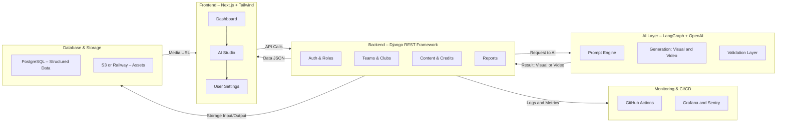

# 🧭 TeamReel System Map

> **Eén ecosysteem – van clubdata tot AI-content.**

---

## 1. Doel van dit document
De *TeamReel System Map* geeft een overzicht van alle systeemonderdelen, hun interacties en de datastromen daartussen.
Het dient als visueel startpunt voor samenwerking, onboarding en technische besluitvorming.

> **Kernboodschap:** *TeamReel is ontworpen als één samenhangend geheel – overzichtelijk, schaalbaar en herkenbaar.*

---

## 2. Hoofdoverzicht

> **Kernboodschap:** *Alles is verbonden – elke laag versterkt de volgende.*

---

## 3. Beschrijving per systeemlaag

| Laag | Technologie | Functie | Verantwoordelijkheden |
|------|--------------|----------|-----------------------|
| **Frontend** | Next.js, Tailwind, Tokens | Gebruikersinterface, interactie en visuele output. | Dashboard, AI Studio, instellingen. |
| **Backend / API** | Django REST Framework | Datamanagement, authenticatie, credits en AI-communicatie. | API-routes, logica en CI/CD. |
| **AI Layer** | LangGraph + OpenAI API | Verwerking van prompts, contentgeneratie en validatie. | AI-workflows en feedbackloops. |
| **Database & Storage** | PostgreSQL + S3 / Railway | Persistente opslag van data en media. | Clubs, teams, spelers, assets. |
| **Monitoring & Infra** | GitHub Actions, Grafana, Sentry | CI/CD, testresultaten en performancebewaking. | Incidentbeheer en kwaliteitscontrole. |

> **Kernboodschap:** *Elke laag is autonoom, maar afgestemd op dezelfde standaard.*

---

## 4. Datastroom in het kort

1. Gebruiker logt in via de frontend (Magic Link).
2. Frontend haalt team- en clubdata op via API.
3. Gebruiker start een AI-flow → backend verstuurt data naar de AI-engine.
4. AI genereert content, valideert kleuren en logo’s en stuurt terug.
5. Resultaat wordt opgeslagen in S3 en getoond in de AI Studio.
6. Gebruiker keurt goed of vraagt hergeneratie.
7. Logging, metrieken en changelogs worden automatisch bijgewerkt.

> **Kernboodschap:** *De gebruiker staat centraal – de techniek ondersteunt, de AI levert.*

---

## 5. Samenhang met andere documenten

| Document | Relatie |
|-----------|----------|
| **Technical Design** | Beschrijft de interne werking van elke laag. |
| **Blauwdruk** | Diepere uitleg van AI-workflows en datamodel. |
| **Functional Design** | Gebruikersflows en UI-logica. |
| **Projectplan** | Fases, releases en implementatievolgorde. |
| **AI Prompt Library** | De bouwstenen van de AI-laag. |

> **Kernboodschap:** *De System Map is het visuele ankerpunt van alle TeamReel-documentatie.*
