# 🧩 Technical Design – TeamReel
> **TeamReel** combineert sportieve energie met digitale helderheid.
> Dit technisch ontwerp beschrijft de architectuur, API’s, datamodellen en infrastructuur van het TeamReel-platform.
> Het document volgt de visuele en structurele richtlijnen uit de *Style Foundation* en de *Brand Identity* en sluit direct aan op het *Functional Design* en *Businessplan*.
> Versie: Oktober 2025 — Status: Definitieve richtlijn.


---

## 📘 Metadata
| Element | Inhoud |
|----------|---------|
| **Project** | TeamReel |
| **Document** | Technisch Ontwerp |
| **Datum** | Oktober 2025 |
| **Auteur** | Brian Stokvis |
| **Status** | Definitieve richtlijn |
| **Bronnen** | Businessplan, Brand Identity, Functioneel Ontwerp, Technical Design |
| **Doel** | Richtlijn voor technische implementatie, infrastructuur en AI-architectuur |

---
# 📑 Inhoudsopgave – Technisch Ontwerp

1. [Inleiding & Doel](#1-inleiding--doel)
2. [Architectuur (Systeemoverzicht)](#2-architectuur-systeemoverzicht)
3. [Backendstructuur & API-design](#3-backendstructuur--api-design)
4. [Frontendarchitectuur & UI-componenten](#4-frontendarchitectuur--ui-componenten)
5. [Database & Datamodellering](#5-database--datamodellering)
6. [AI-infrastructuur & Workflow-engine](#6-ai-infrastructuur--workflow-engine)
7. [Integraties & Externe API’s](#7-integraties--externe-apis)
8. [Beveiliging & Autorisatie](#8-beveiliging--autorisatie)
9. [Logging, Monitoring & Performance](#9-logging-monitoring--performance)
10. [Deploy & Hostingstrategie](#10-deploy--hostingstrategie)
11. [Samenvatting & Technische richtlijnen](#11-samenvatting--technische-richtlijnen)

---

## 1. Inleiding & Doel

### 1.1 Context
**TeamReel** is een AI-gedreven platform waarmee sportclubs eenvoudig professionele clubcontent kunnen maken in hun eigen stijl. Vrijwilligers, teamleiders en spelers kunnen binnen enkele minuten visuals of video's genereren — zonder technische kennis of dure software.

De eerste technische versie (MVP) richtte zich uitsluitend op de **Content Generator**.
In deze nieuwe versie staat de **volledige architectuur van het platform** centraal: van backend en AI-infrastructuur tot beveiliging en schaalbaarheid. Het doel is om een robuuste basis te leggen die vandaag betrouwbaar werkt en morgen kan groeien naar duizenden clubs, meerdere sporten en complexe AI-workflows.

De technische richtlijnen in dit document volgen de *Style Foundation* voor kleur, typografie en consistentie, zodat ontwikkelaars, AI-workflows en gebruikersinterfaces dezelfde stijl en terminologie hanteren. De *Brand Identity* bepaalt de visuele laag; dit document richt zich op de logica, API’s en infrastructuur die die stijl mogelijk maken.


> **Kernboodschap:** TeamReel brengt sportieve eenvoud en technologische kracht samen in één schaalbare infrastructuur.

---

### 1.2 Doel van het document
Het *Technisch Ontwerp (Main)* beschrijft hoe het TeamReel-platform technisch wordt gerealiseerd. Het document vertaalt de gebruikersflows, datamodellen en AI-logica uit het *Functioneel Ontwerp* naar een uitvoerbare, schaalbare structuur.

Belangrijkste functies van dit document:
- Richtlijn voor ontwikkelaars bij het bouwen van backend, frontend en AI-services.
- Onderbouwing voor technische keuzes, zodat teams consistent ontwikkelen.
- Naslagwerk voor beheer, beveiliging, CI/CD en infrastructuur.

De uitleg combineert tekst, tabellen en schema’s, zodat de inhoud zowel leesbaar is voor stakeholders als direct toepasbaar door ontwikkelaars.

> **Kernboodschap:** Dit document vormt de technische blauwdruk van TeamReel — praktisch, begrijpelijk en direct uitvoerbaar.

---

### 1.3 Ontwerpprincipes
De architectuur van TeamReel rust op vijf vaste principes:

| Principe | Toelichting |
|-----------|-------------|
| **Consistentie** | Code, data en AI volgen dezelfde ontwerptaal en structuur. |
| **Modulariteit** | Elke module — zoals Club, Team, Content of Workflow — is zelfstandig te ontwikkelen en te testen. |
| **AI-first** | De AI-laag is geen toevoeging, maar het hart van het platform. |
| **Veiligheid** | Gegevens worden verwerkt volgens AVG / GDPR-normen. |
| **Schaalbaarheid** | De architectuur groeit van lokale pilot naar internationaal SaaS-platform. |

> **Kernboodschap:** Elk ontwerpbesluit ondersteunt hergebruik, transparantie en gecontroleerde groei.

---

### 1.4 Relatie met andere documenten
Het *Technisch Ontwerp* is één onderdeel van een samenhangende documentatie-set. De technische keuzes sluiten direct aan op de strategische en functionele richtlijnen uit de andere TeamReel-documenten.

| Document | Relatie met dit ontwerp |
|-----------|--------------------------|
| **Businessplan** | Beschrijft visie, waardepropositie en roadmap. |
| **Functional Design** | Legt gebruikersflows, logica en interactie vast. |
| **Brand Identity** | Bepaalt visuele stijl, toon en toegankelijkheid. |
| **Style Foundation** | Levert design tokens, typografie en consistentieprincipes. |
| **Projectplan** | Organiseert implementatie, testing en kwaliteitsborging. |

> **Kernboodschap:** De kracht van TeamReel zit in de samenhang — strategie, design en techniek vormen één doorlopend systeem.

---

### 1.5 Architectuurstrategie
De ontwikkeling verloopt in twee complementaire fasen:
**Fase 1** richt zich op stabiliteit en validatie (MVP),
**Fase 2** op schaalbaarheid en cloud-modulariteit.
Beide fasen gebruiken dezelfde codebasis, zodat kennis en infrastructuur behouden blijven.

| Fase | Doel | Kerntechnologie | Kenmerk |
|------|------|----------------|----------|
| **Fase 1 – MVP-stabiliteit** | Werkend prototype voor pilotclubs | Django REST + Next.js + n8n + S3 | Eenvoudig en snel te deployen |
| **Fase 2 – Cloud-schaalbaarheid** | Microservices met AI-orkestratie | Django Core + FastAPI (LangGraph) + Redis + AWS | Modulair, robuust en uitbreidbaar |

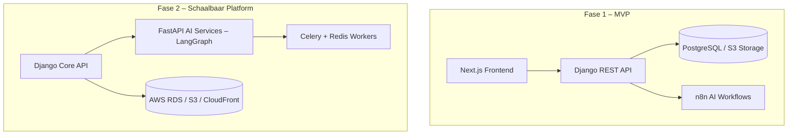
### 1.6 Doelgroep en gebruik

Het *Technisch Ontwerp (Main)* is bedoeld voor drie doelgroepen met verschillende behoeften:

| Doelgroep | Doel | Gebruik van het document |
|------------|------|--------------------------|
| **Ontwikkelaars** | Implementatie van backend, frontend en AI-workflows | Richtlijn voor architectuur, API’s en CI/CD. |
| **Product- en designteams** | Consistente vertaalslag van visuele en functionele elementen | Toepassing van tokens, UI-componenten en AI-logica. |
| **Stakeholders** | Inzicht in technische haalbaarheid en schaalbaarheid | Referentie voor investeringen en besluitvorming. |

De documentatie is **praktisch uitvoerbaar**: elke sectie kan rechtstreeks worden toegepast binnen ontwikkeltools zoals **Cursor**, **GitHub Copilot** en **LangGraph Studio**. De codevoorbeelden en datamodellen sluiten aan op moderne frameworks en kunnen direct worden gegenereerd of getest via deze AI-ondersteunde tools.

> **Kernboodschap:** Dit document is geschreven om niet alleen te lezen, maar ook direct te gebruiken — het vormt de werkbasis voor elke technische beslissing binnen TeamReel.
---

### 1.7 Scope

**In scope:**
- Backend- en frontendarchitectuur
- AI-orkestratie en workflowmanagement
- Databasemodellering en relationele structuur
- Authenticatie, autorisatie en AVG-conforme beveiliging
- CI/CD, logging, monitoring en foutafhandeling

**Out of scope:**
- Integratie met externe sportdatabronnen (KNVB, Sportlink)
- Native mobiele apps (iOS / Android)
- Training van eigen AI-modellen (alleen inference en workflow-compositie)

De scope richt zich op een *werkende, schaalbare en onderhoudbare basisarchitectuur* — een platform dat vandaag eenvoudig inzetbaar is, en morgen eenvoudig uitbreidbaar.

> **Kernboodschap:** De focus van dit document ligt op het bouwbare fundament; uitbreidingen volgen pas zodra de basis stabiel is.
---

### 1.8 Samenvatting

Het *Technisch Ontwerp (Main)* vormt de **ruggengraat** van TeamReel.
Het document vertaalt de visie van eenvoud en trots in concrete, schaalbare technologie. De architectuur is AI-first, veilig, modulair en gericht op duurzame groei.
Alle componenten — van backend tot AI-engine — volgen dezelfde taal, structuur en governance.

> **Kernboodschap:**
> *TeamReel is gebouwd op eenvoud, schaalbaarheid en herhaalbaarheid — één technische basis voor een wereld van clubverhalen.*

## 2. Architectuur (Systeemoverzicht)

### 2.1 Overzicht
De architectuur van **TeamReel (Main)** is opgebouwd rond drie hoofdcomponenten:
- de **frontend** (gebruikersinteractie),
- de **backend** (logica en data),
- de **AI-laag** (orkestratie en contentgeneratie).

Elke laag is modulair, API-first en cloud-native, zodat het platform schaalbaar blijft bij groei naar duizenden clubs. De frontend en backend gebruiken gedeelde design tokens uit de *Style Foundation* (`/frontend/styles/tokens.json`), zodat kleur, typografie en spacing in UI en documentatie exact overeenkomen.

De technische principes:
1. **API-first:** elke component communiceert via REST of async queues.
2. **AI-driven:** alle visuele output komt voort uit AI-workflows in LangGraph.
3. **Secure by design:** data en media zijn standaard versleuteld en traceerbaar.
4. **Reusable:** dezelfde codebasis ondersteunt meerdere sporten, talen en regio’s.

---

### 2.2 Lagenmodel van het platform
TeamReel werkt volgens een driedelig lagenmodel. De lagen zijn onafhankelijk te ontwikkelen, maar delen dezelfde datastandaarden en design tokens.

| Laag | Belangrijkste technologieën | Functie |
|------|------------------------------|----------|
| **Frontend (Interactie)** | Next.js, Tailwind, ShadCN, tokens.json, locales.json | Gebruikerservaring, vertalingen en theming |
| **Backend (Applicatie)** | Django REST Framework, Celery, PostgreSQL | Dataopslag, autorisatie, credits, logging |
| **AI-laag (Orchestratie)** | LangGraph, FastAPI, Redis, S3 | AI-workflows, validatie, generatie, publicatie |

De communicatie verloopt via beveiligde HTTPS-verzoeken of asynchrone taakqueues. AI-output (beelden, video’s) wordt opgeslagen op S3 en ontsloten via CloudFront.

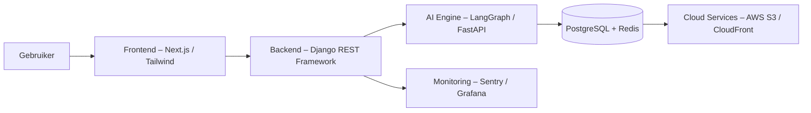


> **Kernboodschap:**
> *De architectuur is eenvoudig in gebruik, maar krachtig in structuur — één ecosysteem dat AI, data en design verenigt.*

---

### 2.3 Fase 1 – Monolithische MVP
In de startfase draait TeamReel als één applicatie (monoliet). Backend, AI-taken en dataverwerking delen één omgeving.

**Kenmerken:**
- **Backend:** Django REST Framework met SimpleJWT.
- **AI:** uitgevoerd via n8n-workflows met externe API’s (Gemini, Placid).
- **Opslag:** PostgreSQL en S3.
- **Frontend:** Next.js op Vercel.

Voordeel: snelle implementatie, lage complexiteit.
Nadeel: beperkte foutisolatie — één intensieve AI-run kan de hele app vertragen.

> **Kernboodschap:**
> *De monoliet is een springplank: bedoeld om te leren, niet om op te blijven.*

---

### 2.4 Fase 2 – Microservicearchitectuur
De tweede fase verdeelt het platform in microservices.
Elke service kan afzonderlijk worden gedeployed en geschaald.

| Component | Technologie | Functie |
|------------|-------------|----------|
| **Core API-service** | Django REST | Gebruikers, clubs, teams, credits, autorisatie |
| **AI-service** | FastAPI + LangGraph | Verwerking van AI-workflows |
| **Worker-service** | Celery + Redis | Achtergrondtaken en logging |
| **Gateway-service** | Nginx / Traefik | Routering, beveiligde toegang |
| **Opslaglaag** | PostgreSQL (RDS), S3 | Data en mediaopslag |

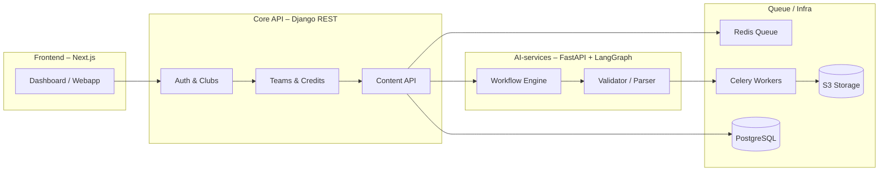

> **Kernboodschap:**
> *De microservice-architectuur maakt TeamReel wendbaar, schaalbaar en onderhoudbaar — zonder in te boeten op eenvoud.*

---

### 2.5 Cloudstrategie en infrastructuur
De hostingstrategie combineert **lage instap** met **groeipotentieel**:
- **Railway / Vercel:** snelle setup en automatische CI/CD.
- **AWS ECS / CloudFront:** schaalbaar voor grotere load.
- **RDS:** beheerde PostgreSQL-database.
- **Redis cache:** versnelt AI-taken en creditcontroles.
- **Sentry + Grafana:** realtime inzicht in fouten en prestaties.

> **Kernboodschap:**
> *Start lean, scale clean — TeamReel groeit mee met gebruik en ambitie.*

---

### 2.6 Samenvatting
De architectuur van TeamReel is ontworpen als een **evoluerend ecosysteem**: één codebasis, meerdere lagen, volledige traceerbaarheid. De cloudstrategie ondersteunt groei zonder complexiteit te verhogen.

> **Kernboodschap:**
> *Eenvoud in ontwerp, kracht in uitvoering — dat is de basis van TeamReel’s technische identiteit.*


## 3. Backendstructuur & API-design

### 3.1 Overzicht
De backend is het logische hart van TeamReel. Ze beheert alle data, autorisatie, transacties en AI-triggers. De architectuur is **API-first** en gebouwd in **Django REST Framework (DRF)** met uitbreidingen in **FastAPI** voor AI-taken. Elke endpoint retourneert data in een uniform JSON-formaat, inclusief status- en foutmeldingen die worden gelogd volgens de toon en structuur uit de *Style Foundation*.


> **Kernboodschap:**
> *De backend vormt de ruggengraat van TeamReel — betrouwbaar, uitbreidbaar en klaar voor automatisering.*

---

### 3.2 Kernmodules

De backend van TeamReel bestaat uit vier kernmodules die samen de logische motor van het platform vormen. Elke module heeft een duidelijke verantwoordelijkheid en communiceert via interne API-calls. Zo blijft de architectuur overzichtelijk, uitbreidbaar en eenvoudig te onderhouden.

| Module | Functie | Belangrijkste componenten |
|---------|----------|---------------------------|
| **Core API** | Beheer van gebruikers, clubs, teams en authenticatie. | Django REST Framework, SimpleJWT |
| **Content Engine** | Regelt de aanmaak, opslag en goedkeuring van visuals en video’s. | Django ORM, Celery Tasks |
| **Credit Service** | Verwerkt alle credittransacties en abonnementen. | PostgreSQL, Redis cache |
| **AI Gateway** | Koppeling tussen backend en AI-laag (LangGraph). | FastAPI, REST webhooks |

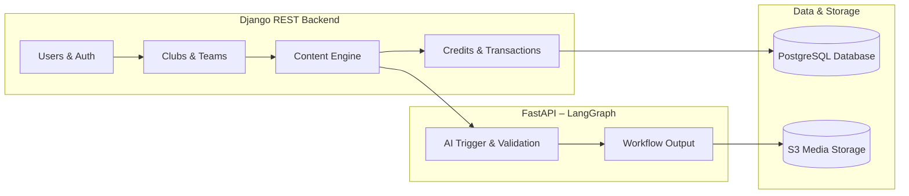


> **Kernboodschap:**
> *De backend van TeamReel is opgebouwd als een modulair geheel: helder, onderhoudbaar en ontworpen voor groei.*
---

### 3.3 API-principes

De API-architectuur van TeamReel volgt het principe *API-first*: alle communicatie tussen frontend, backend en AI loopt via goed gedefinieerde, versieerbare endpoints. Dit maakt het platform betrouwbaar, voorspelbaar en eenvoudig te integreren met externe systemen.

#### Richtlijnen

1. **RESTful structuur:** consistente URL-patronen per resource (`/api/v1/...`).
2. **JSON standaard:** alle requests en responses gebruiken JSON.
3. **Versiebeheer:** backward compatibility via versienummers (`v1`, `v2`).
4. **Beveiliging:** JWT-token in headers (`Authorization: Bearer <token>`).
5. **Filterbaarheid:** dynamische queries via `django-filter`.
6. **Documentatie:** automatische Swagger/Redoc-generatie (`/api/docs/`).
7. **Validatie:** uniforme error responses volgens HTTP-standaardcodes.

#### Responseformaat

Succesvolle response:
```json
{ "status": "success", "data": {...} }
```
Foutmelding:
```json
{ "status": "error", "message": "Not authorized" }
```
#### API-versiebeheer

| Element | Richtlijn |
|----------|------------|
| **Nieuwe functionaliteit** | Wordt toegevoegd in `/api/v2/` zonder bestaande endpoints te breken. |
| **Deprecated routes** | Blijven actief tot minimaal één kwartaal na update. |
| **Automatische documentatie** | Wordt bij elke CI/CD-run herbouwd via Swagger. |

> **Kernboodschap:**
> *De API van TeamReel is voorspelbaar, veilig en schaalbaar — één standaard, vele toepassingen.*


### 3.4 Belangrijkste endpoints

De backend biedt een set van duidelijke en goed beveiligde API-endpoints. Alle endpoints volgen dezelfde structuur: voorspelbare routes, consistente responses en toegangscontrole via JWT-tokens.

| Endpoint | Methode | Doel | Authenticatie | Opmerking |
|-----------|----------|------|----------------|------------|
| `/api/v1/auth/login/` | POST | Inloggen via Magic Link | JWT | Retourneert access + refresh token |
| `/api/v1/auth/logout/` | POST | Gebruiker uitloggen | JWT | Vernietigt actieve sessie |
| `/api/v1/clubs/` | GET/POST | Clubs weergeven of aanmaken | JWT | Alleen clubbeheerders |
| `/api/v1/teams/` | GET/POST | Teams binnen een club beheren | JWT | Filter op `club_id` |
| `/api/v1/members/` | GET/POST | Leden toevoegen of beheren | JWT | Alleen clubbeheerder |
| `/api/v1/content/` | POST | Start nieuwe AI-generatie (visual/video) | JWT | Activeert workflow |
| `/api/v1/credits/` | GET | Creditverbruik en saldo ophalen | JWT | Alleen eigen of teamaccount |
| `/api/v1/ai/trigger/` | POST | Start AI-workflow in LangGraph | JWT | JSON-payload met workflow_id |

**Responseformaten:**
Succes:
```json
{ "status": "success", "data": {...} }
```
Fout:
```json
{ "status": "error", "message": "Not authorized" }
```

> **Kernboodschap:**
> *Eén API-standaard, vele functies — TeamReel’s backend blijft eenvoudig te begrijpen en consistent te gebruiken.*
---

### 3.5 Authenticatie en autorisatie

Authenticatie verloopt via **Magic Link**: gebruikers ontvangen een beveiligde link per e-mail en loggen in zonder wachtwoord. Na inloggen krijgt de gebruiker een tijdelijk JWT-token voor sessiebeheer. Autorisatie wordt bepaald door scopes in het token op basis van de gebruikersrol.

| Rol | Toegang | Voorbeelden van acties |
|------|----------|------------------------|
| **Clubbeheerder** | Volledige rechten binnen de club | Teams beheren, credits toewijzen |
| **Teambeheerder** | Toegang tot eigen team | Line-up invullen, AI-output goedkeuren |
| **Maker / Speler** | Alleen eigen content | AI-generatie, feedback geven |
| **Supporter** | Publieke data | Content bekijken en delen |

**Scopes in JWT:**
- `club:*` – volledige toegang tot clubresources
- `team:*` – toegang tot teamresources
- `content:generate` – AI-content genereren
- `content:public` – publieke endpoints

Tokens verlopen automatisch na 24 uur inactiviteit en kunnen worden vernieuwd via `/api/v1/auth/refresh/`.

> **Kernboodschap:**
> *Eenvoudig voor de gebruiker, robuust voor het systeem — beveiliging is ingebouwd in de architectuur.*
---

### 3.6 Versiebeheer en stabiliteit

Het API-ecosysteem is ontworpen voor gecontroleerde groei. Nieuwe functionaliteit breekt nooit bestaande integraties en wordt altijd versieerbaar toegevoegd.

| Element | Richtlijn |
|----------|------------|
| **Nieuwe functionaliteit** | Wordt toegevoegd in `/api/v2/` zonder bestaande endpoints te breken. |
| **Deprecated routes** | Blijven actief tot minimaal één kwartaal na update. |
| **Automatische documentatie** | Wordt bij elke CI/CD-run herbouwd via Swagger. |

De API-documentatie gebruikt kleuren, iconen en typografie uit de *Style Foundation* om consistentie te behouden tussen technische en visuele communicatie.

Alle endpoints worden getest via geautomatiseerde pipelines (Pytest en Postman). Elke wijziging wordt automatisch gelogd in GitHub-changelogs en zichtbaar gemaakt in de Swagger-interface.

> **Kernboodschap:**
> *Stabiliteit is geen toeval — versiebeheer en automatisering houden de API gezond.*
---

### 3.7 Samenvatting

De backend van TeamReel combineert stabiliteit met flexibiliteit. Heldere API-principes, moderne authenticatie en versiebeheer zorgen ervoor dat het platform betrouwbaar en toekomstvast blijft. De combinatie van **Django REST** en **FastAPI** biedt het beste van twee werelden: robuustheid voor data, snelheid voor AI-integratie.

> **Kernboodschap:**
> *De backend is de stabiele motor onder TeamReel — gebouwd om vandaag te presteren en morgen te groeien.*


## 4. Frontendarchitectuur & UI-componenten

### 4.1 Overzicht

De frontend van **TeamReel** is het gezicht van het platform. Ze vertaalt datastromen uit de backend en AI-engine naar een intuïtieve, herkenbare en toegankelijke gebruikerservaring. De interface is gebouwd in **Next.js** met **Tailwind CSS** en **ShadCN**-componenten. Alle stijlelementen worden aangestuurd via centrale design tokens uit `tokens.json`, conform de *TeamReel Style Foundation*.

**Belangrijkste ontwerpprincipes:**
1. **Responsiviteit:** één codebase voor desktop, tablet en mobiel.
2. **Theming:** automatische omschakeling tussen licht en donker thema.
3. **Meertaligheid:** dynamische interface via `locales.json`.
4. **Toegankelijkheid:** voldoet aan WCAG 2.1 AA-standaarden.

Alle datavelden en entiteiten volgen dezelfde naamgeving als in het *Functional Design* en worden visueel gerepresenteerd via tokens en layoutregels uit de *Style Foundation*.

> **Kernboodschap:**
> *De frontend maakt TeamReel zichtbaar — herkenbaar, snel en toegankelijk voor iedere gebruiker.*
---

### 4.2 Architectuur

De frontend is opgebouwd volgens een **component-based architectuur** met duidelijke scheiding tussen presentatie, data en interactie. Elke laag heeft een eigen verantwoordelijkheid maar deelt dezelfde tokens en vertaalstructuur.

| Laag | Technologie | Functie |
|------|--------------|----------|
| **UI / View Layer** | ShadCN, Tailwind, tokens.json | Opmaak, layout, visuele consistentie |
| **Logic Layer** | React Hooks, Zustand | State management en interactielogica |
| **Data Layer** | Axios / SWR | Communicatie met backend en AI-service |
| **Localization Layer** | locales.json, i18next | Vertalingen en taalwissel |

De frontend communiceert met twee backends:
- `/api/v1/...` voor data en authenticatie (Django REST)
- `/ai/v1/...` voor AI-workflows (LangGraph via FastAPI)

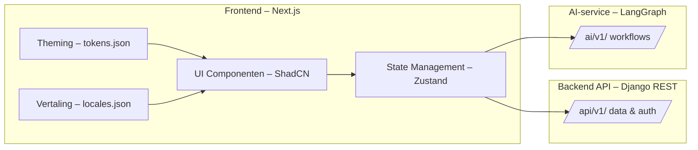

> **Kernboodschap:**
> *De frontend-architectuur is modulair en toekomstvast — één ontwerp, vele toepassingen.*
---

### 4.3 Tokens en theming
De frontend haalt alle visuele tokens rechtstreeks uit `/frontend/styles/tokens.json`, de primaire export van de *Style Foundation*.
Deze tokens definiëren kleuren, typografie, spacing en radiuswaarden voor alle UI-componenten.
- **Kleurgebruik**: `--color-primary`, `--color-accent`, `--color-neutral`
- **Typografie**: `--font-heading`, `--font-primary`, `--font-display`
- **Layout**: `--radius-card`, `--spacing-base`, `--shadow-soft`

Het gebruik van tokens zorgt ervoor dat elk onderdeel van de applicatie — van dashboard tot AI-preview — dezelfde visuele identiteit behoudt. De tokens zijn gekoppeld aan de *Brand Identity* en worden automatisch bijgewerkt bij elke CI/CD-release.

Het thema (licht of donker) wordt automatisch bepaald via `prefers-color-scheme` in de browserinstellingen, maar kan handmatig worden overschreven in het gebruikersprofiel.

> **Kernboodschap:**
> *Eén bron van waarheid voor kleur, typografie en toon — de tokens zijn de bouwstenen van visuele consistentie.*
---

### 4.4 Lokalisatie en meertaligheid

De frontend ondersteunt meerdere talen via `locales.json`. Vertalingen worden asynchroon geladen met *i18next* en gecachet via SWR. Nieuwe talen kunnen eenvoudig worden toegevoegd door het toevoegen van een nieuw object in `locales.json`.

**Voorbeeld:**
```json
{
  "nl": {
    "welcome": "Welkom bij TeamReel",
    "generate_video": "Genereer video",
    "logout": "Afmelden"
  },
  "en": {
    "welcome": "Welcome to TeamReel",
    "generate_video": "Generate video",
    "logout": "Logout"
  }
}
```

Taalkeuze wordt opgeslagen in `User.language_code`. De interface past zich direct aan zonder herladen van de pagina. Lokalisatie strekt zich ook uit tot datumformaten, valutaweergave en sporttermen.

> **Kernboodschap:**
> *TeamReel spreekt de taal van elke gebruiker — letterlijk en figuurlijk.*
---

### 4.5 Componentenbibliotheek

De componentenbibliotheek bestaat uit herbruikbare elementen die de visuele identiteit van TeamReel bewaken. Ze zijn ontwikkeld met **ShadCN UI** en **Tailwind** en gebruiken tokens voor kleur en spacing.

| Component | Beschrijving | Voorbeeldgebruik |
|------------|---------------|------------------|
| **Card** | Container voor content of visuals | Spelersprofielen, previews |
| **Button** | Gestandaardiseerde CTA met drie varianten (primary, secondary, ghost) | Interactie-elementen |
| **Modal** | Dialoogvenster voor acties of bevestiging | Goedkeuring AI-output |
| **Badge** | Statusaanduiding (nieuw, actief, concept) | Feedback, workflows |
| **Alert** | Foutmeldingen en succesberichten | Notificaties, validatie |

Alle componenten worden automatisch getest op toegankelijkheid (ARIA-attributen, focusvolgorde, contrast).

> **Kernboodschap:**
> *Consistentie in componenten zorgt voor herkenning, snelheid en vertrouwen bij de gebruiker.*
---

### 4.6 Toegankelijkheid en performance

De frontend voldoet aan **WCAG 2.1 AA**. Contrast, focus, toetsenbordnavigatie en animaties zijn getest voor gebruikers met visuele of motorische beperkingen. Animaties zijn beperkt en worden uitgeschakeld bij ‘reduced motion’-instellingen.

**Performanceprincipes:**
- Lazy loading van afbeeldingen en niet-essentiële componenten.
- Statische pre-rendering (Next.js ISR) voor snelle laadtijden.
- SWR caching voor realtime API-data.
- Core Web Vitals (LCP, CLS, TBT) worden automatisch gemonitord.

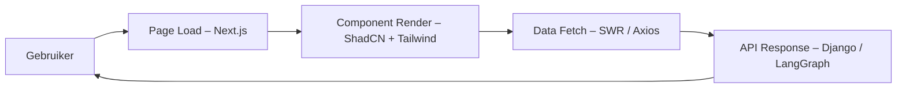

> **Kernboodschap:**
> *Toegankelijkheid en performance zijn geen toevoeging — ze zijn een integraal onderdeel van de gebruikerservaring.*
---

### 4.7 Samenvatting

De frontend van TeamReel combineert design, performance en schaalbaarheid. Door het gebruik van tokens, modulaire componenten en meertalige ondersteuning is het platform toekomstbestendig en consistent met de merkidentiteit.

> **Kernboodschap:**
> *De frontend vertaalt technologie naar beleving — snel, betrouwbaar en volledig in de stijl van TeamReel.*

## 5. Database & Datamodellering

### 5.1 Overzicht

De database vormt de ruggengraat van **TeamReel**.
Ze slaat alle gegevens op over clubs, teams, leden, wedstrijden, content, credits en AI-workflows. De structuur is **relationeel** (PostgreSQL) en ontworpen volgens drie principes:

1. **Normalisatie:** elk gegeven wordt slechts één keer opgeslagen.
2. **Traceerbaarheid:** elke wijziging is herleidbaar via logging.
3. **Uitbreidbaarheid:** het model ondersteunt meerdere sporten, seizoenen en clubs.

De database is geoptimaliseerd voor schaalbaarheid en AVG-conforme verwerking van persoonsgegevens.

> **Kernboodschap:**
> *De database is niet alleen opslag — het is het geheugen en de ruggengraat van TeamReel.*
---

### 5.2 Datalaag en structuur

Het datamodel is opgebouwd uit zes clusters die samen de volledige werking van TeamReel ondersteunen.

| Cluster | Beschrijving |
|----------|---------------|
| **Referentie & Dimensies** | Stamdata zoals sport, competitie, seizoenen en locatie. |
| **Organisatie & Wedstrijden** | Clubs, teams, spelers en wedstrijden. |
| **Gebruikers & Rollen** | Authenticatie, leden, teamlidmaatschappen. |
| **Content & AI** | Templates, workflows, varianten, feedback. |
| **Financieel & Credits** | Creditaccounts, transacties en abonnementen. |
| **Audit & Logging** | Volledige historie van systeemacties. |

> **Kernboodschap:**
> *Elke dataset ondersteunt een specifieke taak, maar samen vormen ze één coherent platform.*
---

### 5.3 Referentie- en dimensietabellen

Deze tabellen bevatten vaste waarden die zelden wijzigen. Ze dienen voor filtering, rapportage en historische analyses.

| Tabel | Doel | Belangrijkste velden |
|--------|------|----------------------|
| **Sport** | Stamgegevens van sporten | `id`, `name`, `federation`, `active` |
| **Competition** | Competitieniveau binnen een sport | `id`, `sport_id`, `name`, `region`, `level` |
| **Season** | Jaar of periode van competitie | `id`, `competition_id`, `name`, `start_date`, `end_date`, `active` |
| **DimLocation** | Gemeente- en plaatsdimensie | `id`, `plaats`, `gemeente`, `provincie`, `land` |
| **DimDate** | Tijdsdimensie voor analyses | `date_key`, `jaar`, `maand`, `week`, `dagnaam` |

> **Kernboodschap:**
> *Referentiedata geven context — ze maken analyses en vergelijkingen mogelijk over tijd en regio.*
---

### 5.4 Organisatiestructuur

De organisatiestructuur koppelt clubs, teams, spelers en wedstrijden. Elke entiteit bevat unieke identifiers en relaties die seizoensgebonden zijn.

| Tabel | Doel | Belangrijkste velden |
|--------|------|----------------------|
| **Club** | De hoofdentiteit: sportvereniging of organisatie | `id`, `sport_id`, `name`, `logo_asset_id`, `theme_color`, `location_id` |
| **Team** | Eenheid binnen een club | `id`, `club_id`, `season_id`, `competition_id`, `name`, `division` |
| **Player** | Speler gekoppeld aan team | `id`, `team_id`, `name`, `position`, `number`, `photo_asset_id` |
| **Match** | Wedstrijd tussen teams | `id`, `home_team_id`, `away_team_id`, `season_id`, `date`, `score_home`, `score_away` |
| **MatchEvent** | Gebeurtenissen binnen een wedstrijd | `id`, `match_id`, `player_id`, `event_type`, `minute`, `description` |

> **Kernboodschap:**
> *De organisatiestructuur verbindt spelers, teams en clubs — de basis voor sportieve storytelling.*
---

### 5.5 Gebruikers & Rollen

Authenticatie en autorisatie worden geregeld via drie tabellen: `User`, `Member` en `TeamMembership`. Hiermee kan één gebruiker meerdere rollen vervullen binnen verschillende teams of clubs.

| Tabel | Doel | Belangrijkste velden |
|--------|------|----------------------|
| **User** | Authenticatie via Magic Link | `id`, `email`, `name`, `language_code`, `last_login` |
| **Member** | Koppeling van gebruiker aan club | `id`, `user_id`, `club_id`, `joined_at`, `role_default` |
| **TeamMembership** | Rollen binnen teams | `id`, `member_id`, `team_id`, `role`, `active` |

> **Kernboodschap:**
> *De gebruikersstructuur maakt flexibiliteit mogelijk — één identiteit, meerdere rollen, volledige traceerbaarheid.*
---

### 5.6 Content & AI-workflows

Alle gegenereerde content wordt vastgelegd via een hiërarchie van templates, varianten en workflows. Zo is elke AI-output herleidbaar tot de brondata en het gebruikte model.

| Tabel | Doel | Belangrijkste velden |
|--------|------|----------------------|
| **ContentType** | Type content (line-up, uitslag, seizoensoverzicht) | `id`, `sport_id`, `name`, `description` |
| **Template** | Ontwerp binnen contenttype | `id`, `content_type_id`, `name`, `style_token`, `aspect_ratio` |
| **AIWorkflow** | Uitvoering van LangGraph-workflow | `id`, `template_id`, `workflow_name`, `run_id`, `state`, `started_at`, `completed_at` |
| **ContentVariant** | Output van AI-workflow | `id`, `template_id`, `team_id`, `context_phase`, `file_asset_id`, `status`, `created_at` |
| **ApprovalLog** | Goedkeuring door gebruiker | `id`, `content_variant_id`, `reviewer_id`, `decision`, `comment`, `timestamp` |
| **FeedbackLog** | Feedback of beoordeling | `id`, `content_variant_id`, `rating`, `comment`, `timestamp` |
| **Asset** | Opslag van media en bestanden | `id`, `owner_type`, `owner_id`, `file_url`, `type`, `size`, `created_at` |

> **Kernboodschap:**
> *Elke visual of video is een datagedreven verhaal — volledig traceerbaar van template tot publicatie.*
---

### 5.7 Financieel model: Credits & Abonnementen

Credits vormen het betaalmiddel binnen TeamReel. Ze worden verbruikt per team, maar kunnen worden gekocht door een gebruiker of club. Abonnementen vullen automatisch saldo aan, terwijl losse aankopen handmatig verlopen.

| Tabel | Doel | Belangrijkste velden |
|--------|------|----------------------|
| **CreditAccount** | Rekening op club-, team- of lidniveau | `id`, `owner_type`, `owner_id`, `balance`, `currency`, `created_at` |
| **CreditTransaction** | Registratie van mutaties | `id`, `account_id`, `change`, `reason`, `source`, `timestamp` |
| **Subscription** | Automatische creditaanvulling | `id`, `owner_type`, `owner_id`, `plan_name`, `interval`, `credits_per_period`, `price_per_period`, `start_date`, `status` |
| **Sponsor** | Externe financier van credits of exposure | `id`, `name`, `logo_url`, `sector`, `website` |
| **SponsorTransaction** | Toewijzing van sponsorkredieten aan clubs of teams | `id`, `sponsor_id`, `club_id`, `team_id`, `credits`, `timestamp` |

> **Kernboodschap:**
> *Het financieel model is flexibel — credits, abonnementen en sponsors versterken elkaar in één ecosysteem.*
---

### 5.8 Audit & Logging

Elke wijziging, goedkeuring of foutmelding wordt vastgelegd in auditlogs. Zo blijft elke actie herleidbaar, van gebruiker tot AI-run.

| Tabel | Doel | Belangrijkste velden |
|--------|------|----------------------|
| **ChangeLog** | Audittrail van alle wijzigingen | `id`, `entity_type`, `entity_id`, `user_id`, `change_type`, `timestamp`, `old_value`, `new_value` |
| **Notification** | Meldingen naar gebruikers | `id`, `recipient_id`, `type`, `message`, `status`, `created_at` |

> **Kernboodschap:**
> *Transparantie is ingebouwd — elke handeling, wijziging of feedback is controleerbaar.*
---

### 5.9 Relatieschema (ERD)

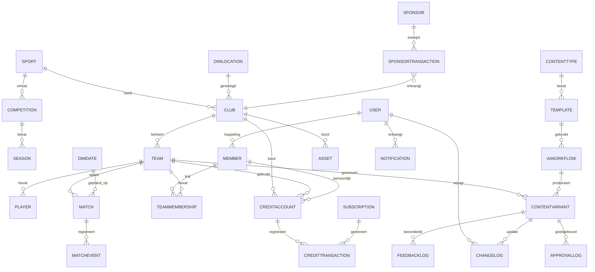

> **Kernboodschap:**
> *Het ERD toont hoe sport, AI, financiën en gebruik samenkomen — één systeem, vele relaties.*
---

### 5.10 Data-integriteit & performance

- **Referentiële integriteit:** alle foreign keys voorzien van `ON DELETE CASCADE` of `RESTRICT`.
- **Indexering:** primaire indexen op `club_id`, `team_id`, `content_variant_id` en `owner_id`.
- **Caching:** Redis voor saldi, workflows en frequente queries.
- **Archivering:** AI-output na 90 dagen gearchiveerd; metadata blijft behouden.
- **Encryptie:** persoonlijke gegevens (e-mails, tokens) versleuteld met AES-256.

> **Kernboodschap:**
> *Snel, veilig en betrouwbaar — de database is gebouwd voor dagelijkse prestaties en groei op lange termijn.*
---

### 5.11 Samenvatting

Het datamodel van TeamReel verenigt sportieve, creatieve en commerciële data in één samenhangend systeem. Het ondersteunt meerdere sporten, teams en workflows — en is voorbereid op verdere groei met sponsors, rapportages en AI-optimalisatie.

> **Kernboodschap:**
> *TeamReel’s database verbindt sport, data en AI tot één logisch, schaalbaar geheel.*

## 6. AI-infrastructuur & Workflow-engine

### 6.1 Overzicht

De AI-infrastructuur vormt het kloppende hart van **TeamReel**. Elke video, visual of tekstuele output wordt gegenereerd via gedefinieerde workflows die draaien in **LangGraph**. De AI-engine is modulair: elke stap — input, analyse, generatie, review — is een afzonderlijke node binnen een workflow. Zo blijft het proces controleerbaar, reproduceerbaar en transparant.

**Belangrijkste eigenschappen:**
- **AI-first ontwerp:** alle contentgeneratie verloopt via een orkestratielaag.
- **Traceerbaarheid:** elke AI-run heeft een unieke ID (`run_id`).
- **Herbruikbaarheid:** workflows kunnen per sport of team opnieuw gebruikt worden.
- **Beheersbaarheid:** foutdetectie, herstart en logging zijn ingebouwd.

> **Kernboodschap:**
> *De AI-laag is geen zwarte doos — het is een transparante, modulaire motor voor creativiteit en efficiëntie.*
---

### 6.2 Workflow-opbouw in LangGraph

Elke workflow bestaat uit vijf vaste fasen. Elke fase heeft een eigen verantwoordelijkheid en output die door de volgende fase wordt gebruikt.

| Fase | Beschrijving | Uitvoer |
|------|---------------|---------|
| **1. Input** | Gebruiker levert data aan (namen, uitslag, logo’s). | JSON-payload |
| **2. Analyse** | LangGraph controleert en valideert input. | Workflow-state |
| **3. Generatie** | AI-model genereert visual of video. | Media-bestand |
| **4. Review** | Gebruiker keurt resultaat goed of wijzigt details. | Status: `approved` / `retry` |
| **5. Publicatie** | Output wordt opgeslagen of gedeeld via integraties. | URL of API-response |

```mermaid
flowchart LR
A[Input – Data & Instellingen] --> B[Analyse – Validatie & Modelselectie]
B --> C[Generatie – AI Output (LangGraph)]
C --> D[Review – Gebruikersgoedkeuring]
D --> E[Publicatie – Opslag of Social Post]
D -->|Afgekeurd| B
```

> **Kernboodschap:**
> *Elke AI-output is het resultaat van een reproduceerbare keten van stappen — volledig inzichtelijk voor gebruiker en beheerder.*
---

### 6.3 Workflow-architectuur

De technische uitvoering van AI-workflows is opgebouwd uit drie lagen:

| Laag | Functie | Technologie |
|------|----------|-------------|
| **Trigger Layer** | Start handmatig of in batch na goedkeuring | API / Celery Task |
| **Execution Layer** | Verwerkt nodes en voert AI-taken uit | LangGraph + FastAPI |
| **Review Layer** | Slaat resultaten op, registreert feedback en status | PostgreSQL + Redis Cache |

Bij fouten wordt de workflow automatisch opnieuw geprobeerd (maximaal twee keer). De status (`pending`, `running`, `failed`, `completed`) wordt real-time bijgehouden in `AIWorkflow`.

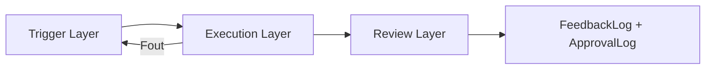

> **Kernboodschap:**
> *De workflow-engine is ontworpen voor betrouwbaarheid — fouten worden opgevangen, hersteld en gelogd zonder dat het systeem stopt.*
---

### 6.4 Modelselectie en configuratie

TeamReel maakt gebruik van **open AI-modellen** die per taak of sporttype worden gekozen. Het systeem selecteert automatisch het optimale model voor elke node in de workflow.

| Doel | Model / Service | Toepassing |
|------|------------------|------------|
| **Tekst & Script** | Gemini / GPT-4 | Tekst, samenvattingen en captions |
| **Beeldgeneratie** | Placid / Canva API | Line-ups, uitslagen, visuals |
| **Video & Motion** | RunwayML | Korte animaties en overgangen |
| **Audio & Voice** | ElevenLabs | Voice-overs (optioneel, Fase 2) |
| **Validatie** | OpenAI Tools / Custom LangChain Parsers | Beeld- en tekstcontrole |

De keuze per node is configureerbaar via `workflow_config.json`, waarin parameters als model, stijl en resolutie zijn vastgelegd.

> **Kernboodschap:**
> *De AI blijft flexibel: elk model is verwisselbaar, elke workflow configureerbaar.*
---

### 6.5 Context en sportafhankelijkheid

Elke workflow wordt uitgevoerd binnen een **context**. De context bepaalt hoe de data en templates worden geïnterpreteerd — bijvoorbeeld een wedstrijd, seizoen of sport.

| Context | Omschrijving | Voorbeeld |
|----------|---------------|------------|
| **Pre-match** | Voorbereidende content (line-up, aankondiging) | “Startopstelling zondag 14:00” |
| **During-match** | Live updates en scorevisuals | “Goal TeamReel — 2-1 in minuut 67” |
| **Post-match** | Nabeschouwingen en resultaten | “Eindstand 3-2 – TeamReel wint opnieuw” |
| **Seasonal** | Seizoensgebonden visuals | “Topscorer van het seizoen” |

De context wordt opgeslagen in `ContentVariant.context_phase` en bepaalt welke templates en AI-nodes worden geactiveerd.

> **Kernboodschap:**
> *Context bepaalt betekenis — dezelfde template levert een ander verhaal op afhankelijk van het moment.*
---

### 6.6 Feedback & optimalisatie

Na elke generatie kan de gebruiker feedback geven via de frontend. Deze feedback wordt vastgelegd in `FeedbackLog` en gelinkt aan de betreffende AI-run (`run_id`).

**Soorten feedback:**
- **Positief (rating 4–5):** markeert workflow als succesvol.
- **Negatief (rating 1–2):** trigger voor herziening of retry.
- **Opmerking:** tekstuele toelichting op afwijking of fout.

Feedbackdata wordt niet gebruikt voor automatische retraining van modellen, maar helpt het TeamReel-team om instellingen en templates te verbeteren.

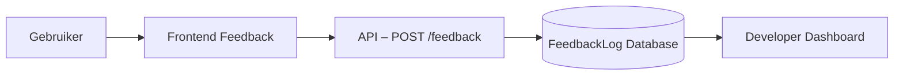

> **Kernboodschap:**
> *Feedback voedt verbetering — niet via zelflering, maar via menselijke optimalisatie en versiebeheer.*
---

### 6.7 Logging & monitoring van AI-taken

Elke AI-run wordt gemonitord van start tot voltooiing. De status wordt real-time opgeslagen in Redis en gelogd in de `AIWorkflow`-tabel. Kritieke fouten worden automatisch doorgestuurd naar **Sentry** en zichtbaar in **Grafana**.

| Logtype | Inhoud | Doel |
|----------|--------|------|
| **Execution Log** | Starttijd, duur, model, succes/fout | Performanceanalyse |
| **Validation Log** | Inputcontrole en modelselectie | Kwaliteitsbewaking |
| **Feedback Log** | Gebruikersreacties per run | Procesverbetering |

> **Kernboodschap:**
> *AI zonder toezicht is blind — monitoring en logging houden de engine transparant en beheersbaar.*
---

### 6.8 Samenvatting

De AI-infrastructuur van TeamReel is ontworpen als een **slim maar controleerbaar ecosysteem**. Elke stap — van input tot publicatie — is inzichtelijk, getest en geoptimaliseerd. De workflows combineren menselijke goedkeuring met geautomatiseerde precisie.

> **Kernboodschap:**
> *TeamReel’s AI-engine maakt creatie schaalbaar zonder controle te verliezen — de perfecte balans tussen mens en machine.*


> **Kernboodschap:**
> *Data-invoer is hybride — handmatig waar nodig, automatisch waar mogelijk.*
---

## 7. Integraties & Externe API’s

### 7.1 Overzicht

Integraties verbinden **TeamReel** met de buitenwereld. Ze maken het mogelijk om data te importeren (clubs, teams, wedstrijden) en content te exporteren (visuals, video’s, posts). Het systeem hanteert een **modulaire integratiestrategie**: elke koppeling is optioneel, versieerbaar en kan los worden gedeployed.

Er zijn drie hoofdcategorieën van integraties:
1. **Data-invoer:** sport- en teamdata ophalen.
2. **Content-uitvoer:** publicatie naar sociale media en websites.
3. **Systeemintegraties:** betalingen, notificaties en monitoring.

> **Kernboodschap:**
> *Integraties maken TeamReel onderdeel van het sportecosysteem — van data tot distributie.*
---

### 7.2 Data-invoer

De data-invoer voorziet het systeem van actuele sport- en teaminformatie. In Fase 1 gebeurt dit handmatig; in Fase 2 grotendeels automatisch via API’s of scraping.

| Bron | Methode | Doel | Status |
|-------|----------|------|---------|
| **Handmatige invoer** | Upload CSV/Excel | Clubs, teams, spelers | Actief |
| **TeamReel Dataset (scraping)** | Eigen dataset | Automatisch aanvullen van clubs en logo’s | Actief |
| **Sportlink / KNVB API** | Externe koppeling | Wedstrijdschema’s en uitslagen | Fase 2 |
| **OpenLigaDB / LocalSportAPI** | Optioneel | Resultaten van niet-KNVB-competities | Fase 2 |

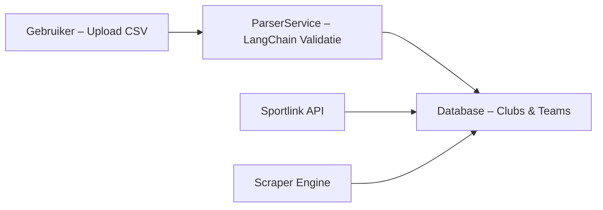

### 7.3 Content-uitvoer

De AI-output van TeamReel wordt automatisch gedeeld met de gewenste kanalen. De eerste koppeling is met **Instagram**, later gevolgd door **YouTube Shorts**, **Facebook Pages** en clubwebsites.

| Platform | Type integratie | Methode | Fase |
|-----------|------------------|----------|------|
| **Instagram** | Directe publicatie | Instagram Graph API | Actief |
| **Facebook** | Crossposting | Meta Business API | Fase 2 |
| **YouTube Shorts** | Video-upload | YouTube Data API v3 | Fase 2 |
| **Clubwebsites** | Embed of RSS-feed | XML / JSON endpoint | Fase 2 |

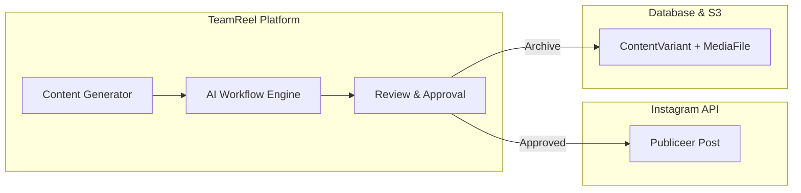

> **Kernboodschap:**
> *Publicatie is onderdeel van de flow — zodra content goedgekeurd is, kan het direct gedeeld worden.*
---

### 7.4 Notificaties en betalingen

TeamReel gebruikt notificaties om gebruikers te informeren over statusupdates, en integreert betalingen voor credits en abonnementen. De infrastructuur is voorbereid op schaalbare verwerking via betrouwbare providers.

| Functie | Provider | Technologie | Fase |
|----------|-----------|--------------|------|
| **E-mailmeldingen** | SendGrid / AWS SES | SMTP + Webhooks | Actief |
| **In-app notificaties** | TeamReel UI | WebSockets + Redis Pub/Sub | Actief |
| **Pushmeldingen** | WebPush / Firebase | Service Workers | Fase 2 |
| **Betalingen** | Stripe / Mollie | REST + Webhook Events | Fase 2 |

**Voorbeeld: betalingsflow**

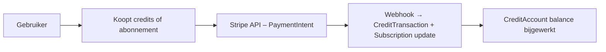

> **Kernboodschap:**
> *Notificaties houden gebruikers betrokken, betalingen houden het platform draaiende.*
---

### 7.5 AI- en contentservices

TeamReel maakt gebruik van meerdere AI- en mediaservices voor het genereren, verwerken en opslaan van content. Deze integraties draaien in de backend (LangGraph) en worden asynchroon aangeroepen.

| Service | Functie | Technologie | Fase |
|----------|----------|--------------|------|
| **LangGraph** | AI-workflow engine | FastAPI + Redis | Actief |
| **Placid / Canva API** | Beeldgeneratie | REST / OAuth2 | Actief |
| **RunwayML** | Videocompositie | Webhooks | Fase 2 |
| **ElevenLabs** | Voice-overs | Audio API | Fase 2 |
| **AWS S3 / CloudFront** | Media-opslag & CDN | Object Storage | Actief |

> **Kernboodschap:**
> *TeamReel combineert open modellen en betrouwbare tools — elke integratie is vervangbaar zonder systeemimpact.*
---

### 7.6 Logging van integraties

Elke externe verbinding wordt bewaakt via een logging- en retrymechanisme. Verbindingen worden gelogd in de tabel `IntegrationLog`, zodat fouten of vertragingen traceerbaar zijn.

| Veld | Beschrijving |
|------|---------------|
| `id` | Uniek log-ID |
| `integration_name` | Naam van API of provider |
| `request_url` | Endpoint dat werd aangeroepen |
| `status_code` | HTTP-status |
| `response_time_ms` | Duur van de call |
| `error_message` | Eventuele foutmelding |
| `timestamp` | Tijdstip van aanroep |

> **Kernboodschap:**
> *Elke externe call wordt gelogd — fouten zijn geen verrassing maar een signaal voor verbetering.*
---

### 7.7 Integratiestrategie

TeamReel hanteert een iteratieve integratie-aanpak. Nieuwe koppelingen worden eerst lokaal getest, daarna opgeschaald naar staging en tenslotte uitgerold naar productie. Versiebeheer en beveiliging zijn standaard onderdeel van elke integratie.

| Integratie | Fase 1 | Fase 2 | Beveiliging |
|-------------|--------|--------|--------------|
| **Handmatige invoer (upload)** | ✔ | – | JWT + validatie |
| **Sportlink / KNVB API** | – | ✔ | API key + IP-restrictie |
| **Instagram / Facebook API** | ✔ | ✔ | OAuth2 + refresh token |
| **Stripe / Mollie** | – | ✔ | Webhook signature validation |
| **RunwayML / ElevenLabs** | – | ✔ | Auth key + HTTPS |
| **CloudFront CDN** | ✔ | ✔ | Private URL tokens |

> **Kernboodschap:**
> *Elke integratie wordt toegevoegd als bouwsteen — getest, beveiligd en schaalbaar.*
---

### 7.8 Samenvatting

De integraties van TeamReel verbinden data, AI en publicatie in één naadloze keten. Het platform begint met eenvoudige handmatige invoer en groeit richting volledige automatisering met API’s en real-time distributie.

> **Kernboodschap:**
> *TeamReel’s kracht ligt in verbinding — tussen clubs, tools en technologieën.*

## 8. Beveiliging & Autorisatie

### 8.1 Overzicht

Beveiliging vormt de ruggengraat van **TeamReel**. Het platform verwerkt persoonsgegevens, mediabestanden en financiële data van clubs en leden — allemaal onder de AVG (GDPR). Daarom is security niet alleen een technische laag, maar een **ontwerpprincipe**: *security by design*.

Het beveiligingsmodel van TeamReel rust op drie pijlers:
1. **Identiteit:** wie heeft toegang?
2. **Toegang:** wat mag die persoon doen?
3. **Verantwoording:** wat is er precies gebeurd?

> **Kernboodschap:**
> *Beveiliging is ingebouwd vanaf het eerste ontwerp — niet toegevoegd achteraf.*
---

### 8.2 Authenticatie

TeamReel gebruikt een **Magic Link-systeem** voor veilige, wachtwoordloze toegang. Gebruikers ontvangen via e-mail een tijdelijke link die toegang geeft tot hun account. Hiermee wordt het risico op zwakke wachtwoorden en hergebruik geëlimineerd.

| Functie | Beschrijving | Status |
|----------|---------------|--------|
| **Magic Link-login** | Tijdelijke token via e-mail | Actief |
| **JWT-authenticatie** | Beveiligde sessie na login | Actief |
| **Twee-factorauthenticatie (2FA)** | Extra beveiliging via code | Fase 2 |
| **Sessieverval** | Automatische afmelding na 24 uur | Altijd actief |

Tokens worden versleuteld opgeslagen en alleen uitgelezen door de backend-API.
Authenticatieverzoeken verlopen uitsluitend via HTTPS met TLS 1.3.

> **Kernboodschap:**
> *Magic Link maakt toegang eenvoudig voor gebruikers, maar ondoordringbaar voor onbevoegden.*
---

### 8.3 Autorisatie en rollen

Toegang tot functies en data wordt geregeld via een **rolgebaseerd autorisatiemodel (RBAC)**. Elke rol bepaalt wat een gebruiker mag doen binnen een club of team. De rollen worden technisch vertaald naar *scopes* binnen de JWT-token.

| Rol | Scope | Toegang | Voorbeelden |
|------|--------|----------|--------------|
| **Clubbeheerder** | `club:*` | Volledige clubrechten | Leden toevoegen, credits beheren |
| **Teambeheerder** | `team:*` | Beperkt tot eigen team | Line-ups beheren, AI-content goedkeuren |
| **Maker / Speler** | `content:generate` | Alleen eigen content | AI-output genereren |
| **Supporter / Publiek** | `content:public` | Alleen publieke endpoints | Content bekijken, delen |

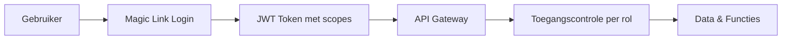


> **Kernboodschap:**
> *Autorisatie is helder en schaalbaar — elke actie is expliciet toegestaan of geblokkeerd.*
---

### 8.4 Encryptie en databeveiliging

Alle communicatie en opslag binnen TeamReel is versleuteld. De infrastructuur voldoet aan moderne standaarden voor transport- en rustbeveiliging.

| Domein | Technologie | Doel |
|---------|--------------|------|
| **Transport** | TLS 1.3 | Beveiligde verbinding tussen client en server |
| **Data in rust** | AES-256 | Encryptie van gevoelige velden (e-mail, tokens) |
| **Media-opslag** | AWS S3 Signed URLs | Tijdelijke toegangslinks voor bestanden |
| **Geheime sleutels** | ENV-variabelen | Gescheiden opslag binnen CI/CD |

De backend valideert elke API-aanroep via tokenhandtekening en requestheader.
Sleutels worden automatisch vernieuwd bij release via GitHub Actions.

> **Kernboodschap:**
> *Gegevensbeveiliging is geen optie — het is de standaardinstelling van het systeem.*
---

### 8.5 Privacy en AVG

TeamReel voldoet aan de **Algemene Verordening Gegevensbescherming (AVG)**. De rechten van gebruikers zijn ingebouwd in de applicatiefunctionaliteit.

| Recht | Beschrijving | Technische uitvoering |
|--------|---------------|-----------------------|
| **Inzage** | Gebruiker kan zijn eigen data bekijken | Profielinstellingen |
| **Correctie** | Aanpassing van onjuiste gegevens | Beheerpaneel |
| **Verwijdering** | Gegevens wissen op verzoek | Soft delete → purge na 30 dagen |
| **Overdraagbaarheid** | Exporteerbare data in JSON/CSV | Download in profiel |
| **Beperking van verwerking** | Tijdelijke blokkering van data | Flag in database |

Logs worden standaard 90 dagen bewaard, tenzij wettelijk anders vereist. Persoonsdata wordt niet gedeeld met derden zonder expliciete toestemming.

> **Kernboodschap:**
> *Privacy by default — gebruikers houden regie over hun eigen gegevens.*
---

### 8.6 Incidentbeheer

TeamReel beschikt over een **incident response plan** voor datalekken of ongeautoriseerde toegang. Monitoringtools detecteren afwijkingen automatisch; alerts worden direct verstuurd naar het beheerteam.

| Fase | Actie | Tijdslimiet |
|------|--------|-------------|
| **Detectie** | Sentry / Grafana detecteert incident | Realtime |
| **Melding** | Intern securityteam wordt gewaarschuwd | Binnen 1 uur |
| **Analyse** | Oorzaakonderzoek en risico-inschatting | Binnen 24 uur |
| **Rapportage** | Interne documentatie en AVG-melding indien nodig | Binnen 72 uur |

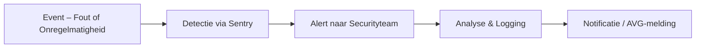

> **Kernboodschap:**
> *Autorisatie is helder en schaalbaar — elke actie is expliciet toegestaan of geblokkeerd.*
---

## 9. Logging, Monitoring & Performance

### 9.1 Overzicht

**TeamReel** monitort continu de gezondheid van het platform. Logging en monitoring zijn ingebouwd in elke laag — van frontend tot AI-engine. Ze zorgen voor inzicht, foutdetectie en optimalisatie.

Het systeem onderscheidt drie observatieniveaus:
1. **Functioneel:** gebruikersacties, AI-workflows, creditverbruik.
2. **Technisch:** fouten, responstijden, serverbelasting.
3. **Beveiliging:** toegangspogingen, dataveranderingen, incidenten.

> **Kernboodschap:**
> *Wat gemeten wordt, kan verbeterd worden — observability is onderdeel van de architectuur.*
---

### 9.2 Loggingstructuur

Alle logs worden opgeslagen in een centrale omgeving met gestandaardiseerd formaat. Er is onderscheid tussen **systeemlogs** en **functionele logs**.

| Type log | Doel | Opslaglocatie | Bewaartermijn |
|-----------|------|----------------|----------------|
| **Gebruikersacties** | Registratie van UI-interacties en events | PostgreSQL (`user_log`) | 90 dagen |
| **API-verkeer** | Monitoring van endpoints en responstijden | Grafana Loki | 60 dagen |
| **AI-workflows** | Volgstatus en performance van LangGraph-runs | Redis + LangSmith | 30 dagen |
| **Systeemfouten (Errors)** | Analyse van bugs en crashes | Sentry | 90 dagen |
| **Beveiligingslogs** | Inlogpogingen, toegangsfouten | PostgreSQL (`access_log`) | 180 dagen |

> **Kernboodschap:**
> *Structuur in logging betekent grip op het systeem — elke gebeurtenis heeft zijn plaats.*
---

### 9.3 Monitoring & observability

TeamReel gebruikt moderne observability-tools om het gedrag van applicatie, AI en infrastructuur te volgen. Er wordt onderscheid gemaakt tussen **real-time monitoring** (alerts) en **analytische monitoring** (dashboards).

| Niveau | Tooling | Wat wordt gemonitord | Doel |
|---------|----------|----------------------|------|
| **Frontend** | Google Lighthouse, Vercel Analytics | Core Web Vitals (LCP, CLS, TBT) | Performance en UX |
| **Backend** | Prometheus + Grafana | API-latentie, CPU, geheugen | Systeembelasting |
| **AI-workflows** | LangSmith + Redis Metrics | Workflowduur, fouten, modelkeuze | AI-prestaties |
| **Beveiliging** | Sentry + PostgreSQL AccessLog | Inlogpogingen, API-errors | Detectie incidenten |

Waarschuwingen worden automatisch verstuurd naar Slack en e-mail bij overschrijding van drempelwaarden (bijv. responstijd > 2s of foutpercentage > 5%).

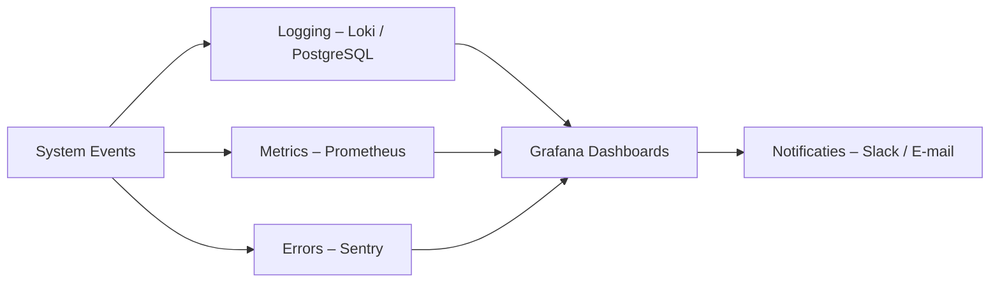

> **Kernboodschap:**
> *Monitoring is het zenuwstelsel van TeamReel — waarnemen, analyseren en reageren in één cyclus.*
---

### 9.4 Performance-optimalisatie

Performance is een ontwerpeis, geen nazorgtaak. De optimalisatie richt zich op drie niveaus: database, API en frontend.

#### Backend & database
- **Asynchrone verwerking:** Celery-taken voorkomen API-blokkades.
- **Caching:** Redis voor API-responses, AI-staten en saldi.
- **Indexering:** primaire sleutels op `club_id`, `team_id`, `content_variant_id`.
- **Query-analyse:** automatische detectie van trage queries via Django Debug Toolbar.
- **Connection pooling:** beheerde sessies met PostgreSQL RDS.

#### Frontend
- **Lazy loading:** afbeeldingen en componenten laden pas wanneer zichtbaar.
- **Code-splitting:** via Next.js dynamic imports.
- **Pre-rendering:** statische content via ISR (Incremental Static Regeneration).
- **Cache-control:** browser caching voor niet-dynamische assets.

#### AI-layer
- **Parallel processing:** meerdere workflows tegelijk via Redis queues.
- **Retry logic:** automatische herstart bij timeouts of netwerkfouten.
- **Batch execution:** verwerkingscapaciteit schaalt automatisch bij grotere loads.

> **Kernboodschap:**
> *Snelheid is de standaard — niet de uitzondering.*
---

### 9.5 Uptime & SLA

De beschikbaarheid van TeamReel wordt actief gemeten. Health checks monitoren elke minuut de status van API, database en AI-engine.

| Component | Controlefrequentie | Drempelwaarde | Actie bij overschrijding |
|------------|--------------------|----------------|--------------------------|
| **API Gateway** | Elke minuut | Responstijd > 2s | Slack-alert + auto-scale |
| **Database (RDS)** | Elke 5 minuten | CPU > 80% | Query-optimalisatie |
| **Frontend (Vercel)** | Continue | LCP > 2,5s | Lighthouse audit |
| **AI-service** | Per workflow | Foutpercentage > 5% | Retry + incidentmelding |

Doelstelling:
- **Uptime:** ≥ 99,5% per maand
- **Gemiddelde responstijd API:** < 300ms
- **Gemiddelde AI-runtime:** < 15s

> **Kernboodschap:**
> *Beschikbaarheid is meetbaar — en bij TeamReel altijd boven verwachting.*
---

### 9.6 Samenvatting

TeamReel heeft een volledig observability-ecosysteem waarin logging, monitoring en performance-optimalisatie geïntegreerd zijn. Fouten worden automatisch gesignaleerd, prestaties continu gemeten, en verbeteringen iteratief doorgevoerd.

> **Kernboodschap:**
> *TeamReel logt niet alleen wat er gebeurt — het begrijpt waarom het gebeurt en handelt ernaar.*

## 10. Deploy & Hostingstrategie

### 10.1 Overzicht

De hostingstrategie van **TeamReel** is gericht op eenvoud in de opstartfase en schaalbaarheid op de lange termijn. Het platform gebruikt moderne cloudtools die continu integratie, automatische builds en veilige deployments mogelijk maken.

Het uitgangspunt is: *één codebase, meerdere omgevingen, volledig geautomatiseerd via CI/CD.*

> **Kernboodschap:**
> *TeamReel is gebouwd om te groeien — wat vandaag lokaal werkt, draait morgen wereldwijd in de cloud.*
---

### 10.2 Omgevingen

TeamReel maakt gebruik van drie standaardomgevingen. In de eerste fase wordt gewerkt met één gecombineerde omgeving, maar de structuur is al voorbereid op volledige scheiding van development, staging en productie.

| Omgeving | Doel | Hosting | Status |
|-----------|------|----------|--------|
| **Development** | Lokale testomgeving voor nieuwe features | Docker / Railway | Actief |
| **Staging** | Preproductieomgeving voor interne tests | Railway Cloud | Fase 2 |
| **Production** | Liveomgeving voor gebruikers | Railway (backend) + Vercel (frontend) | Actief |

**Database:** PostgreSQL via RDS of Railway-managed DB
**Bestanden:** AWS S3 + CloudFront CDN
**Caching & queues:** Redis via Railway of AWS ElasticCache

> **Kernboodschap:**
> *Drie lagen, één pipeline — elke commit kent zijn eigen levenscyclus.*
---

### 10.3 CI/CD-pipeline

De CI/CD-architectuur van TeamReel automatiseert build-, test- en releaseprocessen. Elke wijziging in de `main`-branch triggert automatisch een workflow in **GitHub Actions**.

| Fase | Actie | Tooling | Resultaat |
|------|--------|----------|------------|
| **Build** | Installatie en linting van dependencies | GitHub Actions | Code consistent en schoon |
| **Test** | Unit- en integratietests (Pytest / Jest) | GitHub Actions | Validatie voor release |
| **Deploy** | Nieuwe versie naar Railway / Vercel | GitHub Actions | Automatische live-update |
| **Notify** | Slack-bericht bij succes of fout | Webhook | Realtime feedback |

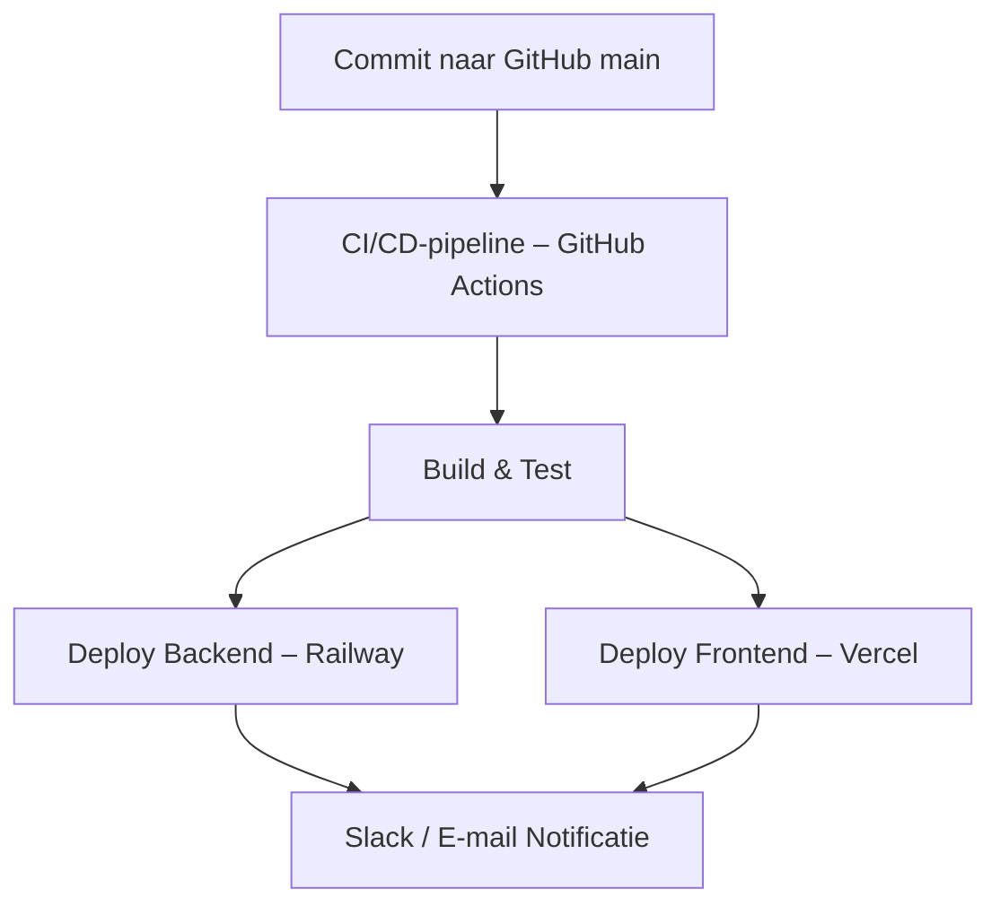

> **Kernboodschap:**
> *Van commit tot productie in minuten — CI/CD maakt continu verbeteren vanzelfsprekend.*
---

### 10.4 Containerisatie

Alle onderdelen van TeamReel draaien in **Docker-containers**. Hiermee zijn ontwikkel-, test- en productieomgevingen identiek en reproduceerbaar. Docker Compose wordt gebruikt voor lokale orkestratie van backend, frontend, Redis en database.

| Component | Container | Opmerkingen |
|------------|------------|-------------|
| **Backend (API)** | `teamreel-api` | Django + Gunicorn |
| **Frontend (UI)** | `teamreel-ui` | Next.js + Tailwind |
| **Database** | `teamreel-db` | PostgreSQL |
| **Cache / Queue** | `teamreel-redis` | Redis voor Celery-taken |
| **AI-service** | `teamreel-ai` | FastAPI + LangGraph |

> **Kernboodschap:**
> *Docker zorgt voor voorspelbaarheid — als het lokaal werkt, werkt het overal.*
---

### 10.5 Schaalbaarheid en cloudmigratie

De infrastructuur groeit mee met de vraag. De eerste fase draait op **Railway** (backend) en **Vercel** (frontend), met automatische migratie naar **AWS ECS** of **GCP Cloud Run** zodra het gebruik toeneemt.

| Component | Startfase | Schaalfase |
|------------|------------|------------|
| **Backend API** | Railway | AWS ECS / GCP Cloud Run |
| **Frontend UI** | Vercel | AWS Amplify / CloudFront |
| **Database** | Railway PostgreSQL | AWS RDS |
| **Media Storage** | S3 Standard | S3 Intelligent-Tiering + CDN |
| **Redis / Queue** | Railway Redis | AWS ElasticCache |
| **AI-engine** | FastAPI Container | Kubernetes (LangGraph microservices) |

**Auto-scaling** wordt beheerd via container load metrics (CPU, geheugen en request time). CI/CD past automatisch de resources aan op basis van traffic.

> **Kernboodschap:**
> *TeamReel groeit modulair — van één container tot een volledig microservices-ecosysteem.*
---

### 10.6 Backups & herstel

Backups zijn geautomatiseerd en getest. Data en mediabestanden worden dagelijks veiliggesteld en zijn binnen minuten herstelbaar.

| Type | Frequentie | Locatie | Bewaartermijn |
|------|-------------|----------|----------------|
| **Database** | Dagelijks om 02:00 | AWS S3 | 30 dagen |
| **Mediafiles** | Continue replicatie | AWS S3 cross-region | 90 dagen |
| **Logs & Configs** | Dagelijks | GitHub / S3 | 14 dagen |

**Disaster recovery-procedure:**
1. Database herstellen vanaf laatste snapshot.
2. Mediafiles synchroniseren met S3-backup.
3. Nieuwe containers deployen vanuit laatste succesvolle build.

> **Kernboodschap:**
> *Geen data blijft achter — elke bit is beveiligd en herstelbaar.*
---

### 10.7 Kostenbeheer

Kosten worden continu bewaakt via dashboards in **Railway** en **AWS Billing**. Bij overschrijding van drempels (bijv. > €150/maand) wordt een alert gestuurd via Slack.

**Optimalisaties:**
- Automatische uitschakeling van inactieve containers.
- CDN caching voor mediabestanden.
- Gedeelde rekenkracht via serverless functies voor AI-taken.

> **Kernboodschap:**
> *Schaalbaarheid mag nooit verspilling betekenen — TeamReel groeit slim, niet duur.*
---

### 10.8 Samenvatting

De hosting- en deploymentstrategie van TeamReel is volledig geautomatiseerd, veilig en schaalbaar. Van commit tot productie is het proces reproduceerbaar, transparant en snel. Containerisatie en CI/CD zorgen voor continuïteit, terwijl cloudintegratie ruimte biedt voor groei.

> **Kernboodschap:**
> *Deploy once, scale forever — TeamReel’s infrastructuur is gebouwd voor snelheid en zekerheid.*


## 11. Samenvatting & Technische richtlijnen

### 11.1 Overzicht

Het *Technisch Ontwerp (Main)* beschrijft hoe **TeamReel** functioneert als AI-first SaaS-platform voor sportverenigingen. Het document vormt de brug tussen visie (businessplan), gebruikerservaring (functioneel ontwerp) en uitvoering (technische implementatie).

TeamReel combineert eenvoud, schaalbaarheid en veiligheid in één architectuur — ontworpen om vandaag te werken en morgen te groeien.

> **Kernboodschap:**
> *De kracht van TeamReel ligt in zijn eenvoud — een slimme basis die meebeweegt met groei, zonder complex te worden.*
---

### 11.2 Kernprincipes

| Domein | Richtlijn | Belangrijkste technologieën |
|---------|------------|-----------------------------|
| **Architectuur** | Modulair en API-first | Django REST, FastAPI, LangGraph |
| **AI-infrastructuur** | Transparant, controleerbaar en configureerbaar | LangGraph, Redis, Celery |
| **Frontend** | Toegankelijk, meertalig, thematisch consistent | Next.js, Tailwind, ShadCN |
| **Database** | Relationeel, schaalbaar en traceerbaar | PostgreSQL, RDS |
| **Beveiliging** | Security by design, AVG-conform | Magic Link, JWT, AES-256 |
| **Hosting** | Cloud-native, geautomatiseerde CI/CD | Railway, Vercel, AWS |
| **Monitoring** | Volledige observability | Grafana, Prometheus, Sentry |

> **Kernboodschap:**
> *Elk onderdeel van TeamReel werkt als één geheel — één architectuur, één taal, één standaard.*
---

### 11.3 Checklist voor ontwikkelaars

✅ 1. Alle endpoints zijn versieerbaar (`/api/v1/`, `/api/v2/`).
✅ 2. Tokens en vertalingen zijn centraal beheerd (`tokens.json`, `locales.json`).
✅ 3. Magic Link-authenticatie is actief en getest.
✅ 4. API-responses volgen het vaste JSON-schema (`status`, `data`, `error`).
✅ 5. AI-workflows zijn configureerbaar via `workflow_config.json`.
✅ 6. Logging en metrics draaien via Sentry + Grafana.
✅ 7. Backups en herstelplan zijn ingesteld.
✅ 8. CI/CD-pipeline is actief en gecontroleerd.
✅ 9. Toegankelijkheid voldoet aan WCAG 2.1 AA.
✅ 10. Documentatie wordt bij elke release automatisch vernieuwd.

> **Kernboodschap:**
> *Consistentie is de snelste weg naar kwaliteit — deze checklist houdt iedereen op één lijn.*
---

### 11.4 Ethisch en verantwoord AI-gebruik

TeamReel gebruikt AI om sportcommunicatie eenvoudiger en inclusiever te maken.
Daarom gelden de volgende ethische richtlijnen:

| Richtlijn | Toepassing |
|------------|-------------|
| **Transparantie** | AI-content wordt altijd als zodanig gemarkeerd. |
| **Controle** | Gebruikers houden altijd de laatste goedkeuring. |
| **Data-eigendom** | Clubs blijven eigenaar van hun data en media. |
| **Privacy** | Geen data wordt gebruikt voor modeltraining zonder toestemming. |
| **Inclusie** | Templates en taal zijn neutraal en respectvol. |

> **Kernboodschap:**
> *AI versterkt menselijke creativiteit — nooit andersom.*
---

### 11.5 Governance & onderhoud

Technische governance zorgt dat alle beslissingen transparant en herhaalbaar zijn. Elke wijziging aan de architectuur, datamodel of API wordt geregistreerd in GitHub.

| Rol | Verantwoordelijkheid |
|------|----------------------|
| **Product Owner** | Prioritering van functies en releases |
| **Tech Lead** | Beheer van architectuur en codekwaliteit |
| **AI Engineer** | Workflowbeheer, modelselectie en optimalisatie |
| **Frontend Lead** | Implementatie van tokens, UI en toegankelijkheid |
| **DevOps Engineer** | CI/CD, cloudbeheer, logging en beveiliging |

Alle technische beslissingen worden geëvalueerd per kwartaal en vastgelegd in een changelog.

> **Kernboodschap:**
> *Governance houdt de groei beheersbaar — innovatie zonder chaos.*
---

### 11.6 Visuele samenvatting van het platform

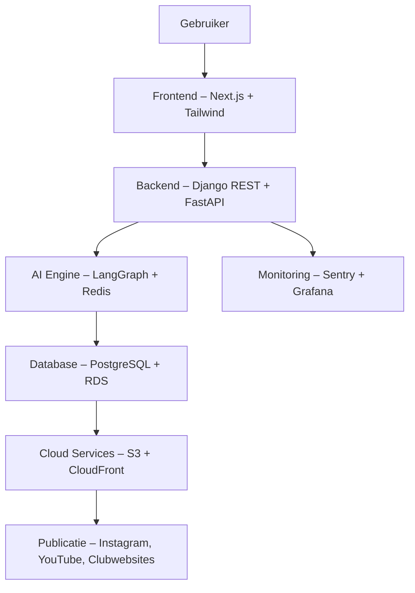


> **Kernboodschap:**
> *Eén platform, vele stromen — TeamReel verbindt mens, data en AI tot een harmonieus geheel.*
---

### 11.7 Slot

TeamReel combineert betrouwbare technologie met een herkenbare visuele stijl. De *Technical Design*-structuur borgt niet alleen prestaties en veiligheid, maar ook consistentie met de *Style Foundation* en *Brand Identity*. Zo blijft elk onderdeel van het platform — van API tot AI-video — trouw aan dezelfde belofte: *Professionele clubcontent. In vijf minuten. In jouw stijl.*

> **Eindboodschap:**
> *TeamReel verbindt sport, data en creativiteit — veilig, schaalbaar en mensgericht.*
