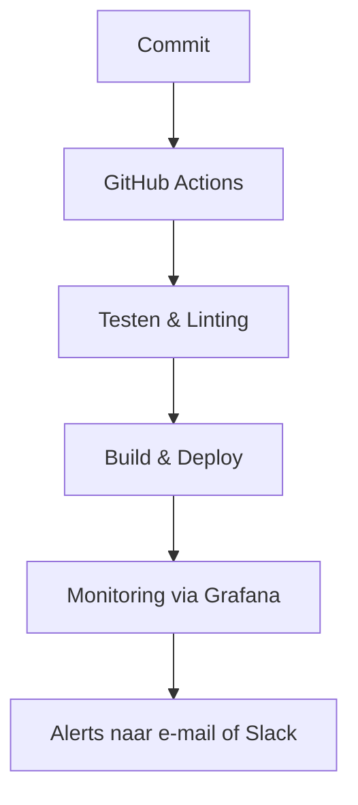

# 🧰 Maintenance Manual – TeamReel

> **Goed onderhoud houdt het tempo hoog.**

---

## 1. Doel van dit document
Het *Maintenance Manual* beschrijft hoe TeamReel wordt onderhouden na oplevering.
Het doel is continuïteit: een platform dat stabiel, veilig en actueel blijft — ook als de ontwikkeling tijdelijk op een lager pitje staat.

> **Kernboodschap:** *Onderhoud is niet spannend, maar wel doorslaggevend.*

---

## 2. Onderhoudsfilosofie

| Principe | Betekenis |
|-----------|------------|
| **Kleine stappen** | Regelmatig onderhoud voorkomt grote incidenten. |
| **Automatisch waar mogelijk** | CI/CD voert tests en updates automatisch uit. |
| **Documenteer altijd** | Elke wijziging hoort in `CHANGELOG.md` of `progress_log.md`. |
| **Veilig boven snel** | Geen updates of releases zonder back-up en test. |

> **Kernboodschap:** *Consistentie wint het altijd van snelheid.*

---

## 3. Onderhoudstaken per frequentie

### 🗓️ Wekelijks
| Taak | Tool / Locatie | Doel |
|------|-----------------|------|
| Codecommit en test run | GitHub Actions | Zorgen dat de pipeline blijft werken. |
| Databasecontrole | Railway Dashboard | Check of data correct wordt opgeslagen. |
| Visuele AI-check | AI Studio | Controleer of AI-output consistent blijft. |
| Sandbox-reset | `/tests/sandbox_log.md` | Houd testdata schoon en herhaalbaar. |

> **Tip:** Plan een vast onderhoudsmoment (bijv. vrijdagmiddag) om dit te doen.

---

### 🗓️ Maandelijks
| Taak | Tool / Locatie | Doel |
|------|-----------------|------|
| Dependency updates | `pip`, `npm` | Houd libraries up-to-date. |
| Databaseback-up downloaden | Railway → PostgreSQL | Extra kopie bewaren lokaal of in cloud. |
| Security review | GitHub Dependabot | Controleren op kwetsbaarheden. |
| Loganalyse | Sentry + Grafana | Fouten of trage queries detecteren. |
| Evaluatienota schrijven | `evaluation_report.md` | Reflectie op prestaties en verbeterpunten. |

> **Kernboodschap:** *Maandelijks onderhoud is een investering in rust.*

---

### 🗓️ Elk kwartaal
| Taak | Locatie / Tool | Doel |
|------|-----------------|------|
| Technische audit | Review API + CI/CD logs | Controleren op structurele issues. |
| Clean-up oude data | Database + Storage | Opschonen van ongebruikte assets of logs. |
| Herzien Style Tokens | `teamreel_style_foundation.md` | Controleren op visuele consistentie. |
| Back-up validatie | Railway / S3 | Test of back-up kan worden teruggezet. |
| Projectreview | `progress_log.md` | Bepalen van nieuwe prioriteiten en doelen. |

> **Kernboodschap:** *Regelmatige audits voorkomen verrassingen.*

---

## 4. Automatische controles

### Geautomatiseerde controles
| Controle | Frequentie | Tool |
|-----------|-------------|------|
| Buildstatus | Per commit | GitHub Actions |
| AI-outputvalidatie | Per generatie | LangGraph feedbackloop |
| Securityscan | Maandelijks | Dependabot |
| Monitoring | Continu | Grafana / Sentry |

> **Kernboodschap:** *Automatisering bespaart tijd en voorkomt fouten.*

---

## 5. Back-upbeleid

| Type | Inhoud | Frequentie | Opslaglocatie |
|------|---------|-------------|----------------|
| **Database** | Clubs, teams, gebruikers, contentmetadata | Wekelijks | Railway PostgreSQL + lokale export |
| **Assets** | Beelden, video’s, AI-output | Maandelijks | S3 of lokale drive |
| **Documentatie** | `/docs/` + changelogs | Elk kwartaal | GitHub repo + lokale kopie |

> **Kernboodschap:** *Back-ups zijn pas waardevol als ze getest zijn.*

---

## 6. Incidentbeheer

### Wanneer er iets misgaat:

1. **Detecteer:** Controleer Grafana, Sentry of API-log op foutmeldingen.
2. **Analyseer:** Noteer fout in `incident_log.md` met datum, oorzaak en gevolg.
3. **Herstel:** Voer rollback uit via Railway (vorige deployment).
4. **Documenteer:** Update `evaluation_report.md` met leerpunten.

> **Kernboodschap:** *Incidenten zijn lessen, geen mislukkingen.*

---

## 7. Evaluatie en verbetering

Aan het einde van elk kwartaal wordt een onderhoudsevaluatie gedaan:

| Evaluatiepunt | Vraag |
|----------------|-------|
| **Betrouwbaarheid** | Hoeveel downtime was er de afgelopen maanden? |
| **AI-kwaliteit** | Blijft output consistent en logisch? |
| **Snelheid** | Laden de UI en API binnen 1s? |
| **Beveiliging** | Zijn alle libraries nog veilig en up-to-date? |
| **Documentatie** | Zijn alle veranderingen vastgelegd? |

De resultaten worden toegevoegd aan `evaluation_report.md` en besproken bij de volgende planning.

> **Kernboodschap:** *Een goed systeem verbetert zichzelf.*

---

## 8. Samenvatting
Onderhoud is een doorlopend proces van kleine, regelmatige handelingen.
Door een vaste structuur, automatische controles en duidelijke documentatie blijft TeamReel veilig, stabiel en schaalbaar — ook op de lange termijn.

> **Kernboodschap:** *Onderhoud is de stille kracht achter duurzaamheid.*
