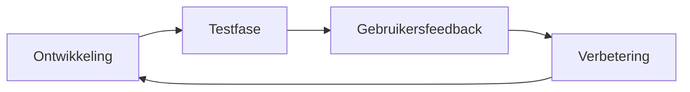

# 🗂️ Project Summary – TeamReel

> **Van plan naar praktijk — bouwen met focus en ritme.**

---

## 1. Doel
Het *Project Summary* biedt een beknopt overzicht van hoe het TeamReel-project wordt uitgevoerd, gemonitord en verbeterd.
Het dient als leidraad voor de belangrijkste mijlpalen, verantwoordelijkheden en kwaliteitsmomenten.

> **Kernboodschap:** *Een goed projectplan is pas waardevol als het in actie komt.*

---

## 2. Projectoverzicht

| Element | Beschrijving |
|----------|--------------|
| **Naam** | TeamReel – AI voor sportcommunicatie |
| **Doel** | Clubs en vrijwilligers helpen om automatisch clubvideo’s en visuals te genereren in hun eigen stijl. |
| **Fasering** | MVP → Multisport → Internationalisatie → Automatisering |
| **Aanpak** | Iteratief, datagedreven en modulair (solo-uitvoering met uitbreidingsoptie) |
| **Startdatum** | November 2025 |
| **Projectduur** | 24 maanden (initiële uitrol) |
| **Eindproduct** | Werkend AI-platform met dashboard, API en communitycomponenten |

> **Kernboodschap:** *Heldere richting, beheersbare stappen.*

---

## 3. Belangrijkste mijlpalen

| Fase | Periode | Deliverables |
|------|----------|---------------|
| **MVP-ontwikkeling** | Q4 2025 – Q1 2026 | Werkende kernmodules: Clubbeheer, AI-generator, Dashboard. |
| **Multisport & UX** | Q2 – Q3 2026 | Ondersteuning voor meerdere sporten, betere gebruikerservaring. |
| **Schaalvergroting & Internationalisatie** | Q4 2026 – Q2 2027 | Meertalige UI, prestatie-optimalisatie, API v2. |
| **Nieuwe modules & Automatisering** | Vanaf Q3 2027 | Nieuwsbriefgenerator, Coach van het Jaar, geautomatiseerde rapportages. |

> **Kernboodschap:** *Elk kwartaal levert zichtbare vooruitgang.*

---

## 4. Rollen en verantwoordelijkheden

| Rol | Verantwoordelijke | Taken |
|------|--------------------|--------|
| **Project Owner** | Brian Stokvis | Ontwerp, uitvoering, testing, documentatie. |
| **AI Engine** | Automatisch (LangGraph) | Generatie, validatie en logging van AI-content. |
| **Gebruikers / Testclubs** | Beta-partners | Feedback, gebruikerstests en kwaliteitsinput. |
| **Toekomstige ontwikkelaars** | N.t.b. | Uitbreiding modules, CI/CD-onderhoud. |

> **Kernboodschap:** *Eén bouwer, maar gebouwd voor samenwerking.*

---

## 5. Kwaliteitscontrole

| Domein | Methode | Tool |
|---------|----------|------|
| **Codekwaliteit** | Automatische linting en tests | GitHub Actions |
| **Documentatie** | Versiebeheer & updates per release | `CHANGELOG.md` |
| **AI-output** | Handmatige en automatische validatie | LangGraph feedbackloops |
| **Gebruikerservaring** | Korte iteratieve feedbackrondes | Clubtests, demo’s |
| **Prestatie & stabiliteit** | Monitoring en logging | Grafana + Sentry |

> **Kernboodschap:** *Kwaliteit wordt ingebouwd, niet toegevoegd.*

---

## 6. Risicobeheersing

| Risico | Impact | Maatregel |
|---------|---------|------------|
| **Tijdgebrek (solo)** | Hoog | Strakke weekplanning en prioritering per sprint. |
| **Scope-creep** | Middel | Focus op MVP + documentatie van uitbreidingen. |
| **Technische issues** | Middel | CI/CD-tests en rollback via Railway. |
| **Gebrek aan gebruikersfeedback** | Middel | Actieve samenwerking met testclubs. |

> **Kernboodschap:** *Beheers risico’s door structuur, niet door geluk.*

---

## 7. Communicatie en updates

| Activiteit | Frequentie | Doel |
|-------------|-------------|------|
| **Projectlog (`progress_log.md`)** | Wekelijks | Overzicht voortgang en blokkades. |
| **Evaluatierapport (`evaluation_report.md`)** | Per kwartaal | Reflectie op prestaties en leerpunten. |
| **Documentatie-update (`/docs/`)** | Doorlopend | Actuele versie van alle plannen en ontwerpen. |
| **Release-notes (`CHANGELOG.md`)** | Per release | Samenvatting van nieuwe functies en fixes. |

> **Kernboodschap:** *Transparantie voorkomt herhaling.*

---

## 8. Evaluatiecyclus

> **Kernboodschap:** *Elke cyclus maakt TeamReel slimmer.*

---

## 9. Samenvatting
Het TeamReel-project combineert visie, techniek en discipline in één iteratief proces.
Door kleine, meetbare stappen en automatische kwaliteitsbewaking groeit het platform gecontroleerd — zonder complexiteit of chaos.

> **Kernboodschap:** *Van idee naar impact — stap voor stap, met stijl.*
