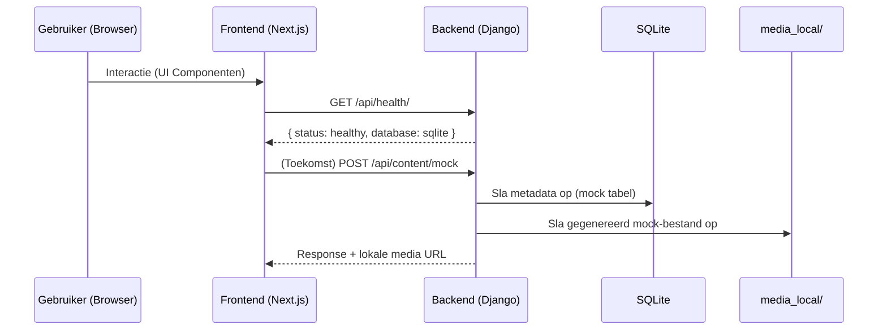

# 🧪 TeamReel Sandbox – Technisch Overzicht

> Doel: Een volledig lokaal uitvoerbare omgeving (geen Railway, geen S3, geen externe AI calls) voor experiment, refactor, tests en documentatie.

---
## 1. Architectuur Overzicht (Sandbox)

```mermaid
flowchart LR
    FE[Frontend – Next.js] --> API[Django API]
    API --> DB[(SQLite DB)]
    API --> MEDIA[(media_local/ opslag)]
    FE --> MEDIA
    subgraph AI[AI Mock Layer]
        WF[Workflow Orchestrator (mock)] --> VAL[Validator]
        VAL --> OUT[Mock Output]
    end
    API --> AI
```

### Kernprincipes Sandbox
- Lokaal: Alle persistence via `db.sqlite3` + `media_local/`.
- Geen externe netwerkaanroepen (AI / opslag / deployment).
- Mock AI workflows (structureel, geen echte generatie).
- Simpele endpoints, uitbreidbaar zonder infrastructuurwijziging.

---
## 2. Backend (Django) – Structuur

| Aspect | Sandbox Implementatie |
|--------|------------------------|
| Framework | Django 4.2 + DRF |
| Apps | `api` (enkel basis endpoints) |
| Database | SQLite fallback (`db.sqlite3`) |
| Auth | Session/Token (in DRF instellingen) |
| Static Files | `staticfiles/` via Whitenoise lokaal |
| Media | `media_local/` (toe te voegen) |
| CORS | Toegang voor `http://localhost:3000` |

### Belangrijk uit `settings.py`
- Conditionele database: PostgreSQL alleen als `DATABASE_URL` bestaat (sandbox gebruikt dat NIET).
- Productie beveiliging genegeerd in sandbox (DEBUG=True toegestaan).

### Aanbevolen Aanvulling (Sandbox)
Voeg toe aan `settings.py`:
```python
MEDIA_URL = "/media/"
MEDIA_ROOT = BASE_DIR / "media_local"
```
En zorg voor een URL-configuratie voor mediabestanden (alleen in DEBUG).

---
## 3. Frontend (Next.js)

| Aspect | Sandbox Implementatie |
|--------|------------------------|
| Framework | Next.js + React |
| Styling | `styles/tokens.json` (design tokens) |
| State | React `useState` (optioneel uitbreidbaar met Zustand) |
| Iconen | `lucide-react` |
| Pages | `pages/index.js` (status + style showcase) |
| API Base | `http://localhost:8000` |

### Design Tokens Voorbeeld
Uit `tokens.json` (kleuren & typografie) – consistent herbruikbaar in componenten.

### Toekomstige Uitbreidingen (Sandbox)
- `src/lib/api.js` voor fetch wrappers met local error handling.
- `__mocks__/` voor simulatie van AI responses.
- `locales.json` voor meertaligheid (mock).

---
## 4. AI Mock Layer

| Onderdeel | Beschrijving (Sandbox) |
|-----------|-------------------------|
| `flows/` | (Nog leeg) – definieer JSON flow templates. |
| `configs/` | (Nog leeg) – mock configuraties (modelnaam, versie). |
| `tests/` | Unit tests die logica en volgorde valideren. |
| Doel | Structuur nabootsen zonder echte AI-call. |

### Voorbeeld Mock Workflow Definities
```json
{
  "id": "pre_match_visual_v1",
  "stappen": [
    "input_validatie",
    "template_selectie",
    "mock_generatie",
    "kleur_logo_validatie",
    "output_registratie"
  ],
  "output_type": "image",
  "status": "design"
}
```

---
## 5. Datastromen (Sandbox)



### Flow Kenmerken
- Geen externe opslag – alles lokaal reproduceerbaar.
- AI output = mock file (bv. placeholder PNG).
- Herhaalbaar testscenario met vaste input.

---
## 6. Modules – Fase 1 t/m 6 (Sandbox Interpretatie)
| Fase | Doel (Sandbox) | Uitvoer |
|------|-----------------|--------|
| 1 Fundament | Repo structuur, lokale draai | `backend/`, `frontend/`, `ai/` skeleton |
| 2 AI Basisflows | Mock workflow JSON + tests | `ai/flows/pre_match_visual_v1.json` |
| 3 Eerste Contentflows | Extra mock endpoints | `/api/content/mock/` (plan) |
| 4 Integratie & MVP | Frontend component + fetch | `src/components/ContentMock.js` |
| 5 Realtime Contentflows | (Uitgesteld) – geen realtime in sandbox | N.v.t. |
| 6 Storytelling & Realtime | UI verbeteringen + mock analytics | `tests/` rapportage |

---
## 7. Data Structuur (Huidig + Gepland)

Momenteel GEEN eigen Django modellen. Aanbevolen minimaal model voor sandbox contentmock:
```python
from django.db import models

class ContentMock(models.Model):
    created_at = models.DateTimeField(auto_now_add=True)
    input_context = models.JSONField()
    output_path = models.CharField(max_length=255)
    status = models.CharField(max_length=32, default="generated")
```

### Mogelijke Uitbreiding
- `Team` (naam, niveau)
- `WorkflowRun` (workflow_id, status, duration_ms)

---
## 8. API Samenvatting (Sandbox)
| Endpoint | Methode | Doel | Auth | Status |
|----------|---------|------|------|--------|
| `/api/` | GET | Root info | Public | Actief |
| `/api/health/` | GET | Status + DB type | Public | Actief |
| `/api/content/mock/` | POST | (Gepland) Start mock workflow | Public/TBD | Ontwerp |
| `/api/content/mock/<id>/` | GET | (Gepland) Haal mock output | Public/TBD | Ontwerp |

### Sandbox Response Patronen
Succes:
```json
{ "status": "success", "data": { ... } }
```
Fout:
```json
{ "status": "error", "error": { "code": "VALIDATION", "message": "Ongeldige input" } }
```

---
## 9. Developer Onboarding (Windows / PowerShell)

### Vereisten
- Python 3.11+
- Node.js 18+
- Git

### Setup Backend
```powershell
cd backend
python -m venv venv
venv\Scripts\activate
pip install -r requirements.txt
python manage.py migrate
python manage.py runserver 0.0.0.0:8000
```

### Setup Frontend
```powershell
cd frontend
npm install
npm run dev
```

### (Optioneel) AI Mock Structuur
```powershell
mkdir ai\flows
mkdir ai\configs
mkdir ai\tests
"{`"id`": `"pre_match_visual_v1`", `"stappen`": [ `"input_validatie`", `"template_selectie`" ] }" > ai\flows\pre_match_visual_v1.json
```

### Test Ideeën (Sandbox)
- Health endpoint: `Invoke-WebRequest http://localhost:8000/api/health/`.
- Mock workflow: POST JSON naar gepland endpoint (na implementatie).

---
## 10. Kwaliteitsrichtlijnen Sandbox
| Domein | Richtlijn |
|--------|-----------|
| Netwerk | Geen externe calls – alles mock of lokaal |
| Opslag | Alleen `db.sqlite3`, `media_local/` |
| Secrets | Geen gevoelige sleutels nodig |
| Tests | Focus op pure functies + endpoint responses |
| Logging | Simpel: `print()` of basis Python logging |

---
## 11. Roadmap (Sandbox)
1. Voeg `ContentMock` model toe + migrations.
2. Implementeer `/api/content/mock/`.
3. Frontend component voor workflow trigger.
4. Mock output genereren (placeholder afbeelding in `media_local/`).
5. Unit tests voor model + view.

---
## 12. Validatie Checklist
- [ ] Geen Railway/S3 referenties in deze file.
- [ ] Database = SQLite gecontroleerd.
- [ ] Media storage voorgesteld = lokaal.
- [ ] AI = mock only.

---
**Kernboodschap:** Deze sandbox versnelt veilige iteratie zonder afhankelijkheden van cloud infrastructuur. Alles is lichtgewicht, uitbreidbaar en lokaal reproduceerbaar.
