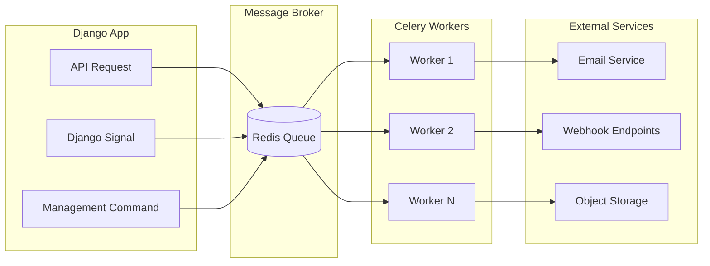
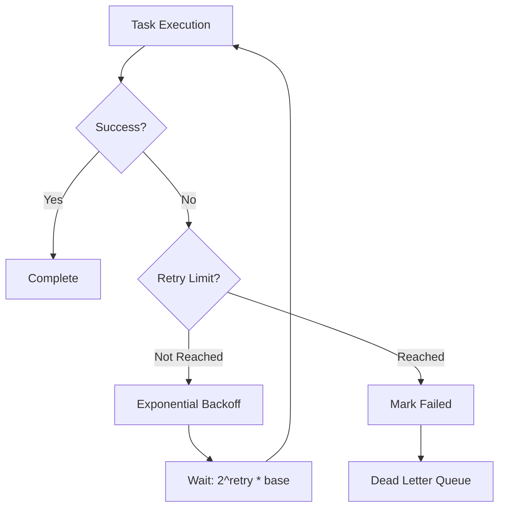

# Async Patterns

This document describes asynchronous processing patterns in Django Core-App using Celery.

## Architecture Overview



## Task Types

### 1. Fire-and-Forget Tasks

Tasks that don't need result tracking:

```python
# src/notifications/tasks/delivery_tasks.py
from celery import shared_task

@shared_task
def send_email_notification(notification_id: int) -> None:
    """Send email notification asynchronously."""
    notification = Notification.objects.get(id=notification_id)
    email_channel = EmailChannel()
    email_channel.send(notification)
```

**Usage:**
```python
# In view or service
send_email_notification.delay(notification.id)
```

### 2. Tracked Tasks

Tasks with result storage:

```python
@shared_task(bind=True)
def process_bulk_import(self, file_path: str, org_id: int) -> dict:
    """Process bulk import with progress tracking."""
    total_rows = count_rows(file_path)
    processed = 0
    
    for row in read_csv(file_path):
        process_row(row, org_id)
        processed += 1
        
        # Update progress
        self.update_state(
            state='PROGRESS',
            meta={'current': processed, 'total': total_rows}
        )
    
    return {
        'status': 'completed',
        'processed': processed,
        'total': total_rows,
    }
```

**Result retrieval:**
```python
result = process_bulk_import.delay(file_path, org.id)

# Check status
if result.ready():
    print(result.result)  # Final result
else:
    print(result.info)    # Progress info
```

### 3. Scheduled Tasks

Periodic tasks using Celery Beat:

```python
# src/tasks/scheduled.py
from celery import shared_task
from celery.schedules import crontab

@shared_task
def cleanup_expired_tokens():
    """Clean up expired refresh tokens daily."""
    from accounts.models import RefreshToken
    count, _ = RefreshToken.objects.filter(
        expires_at__lt=timezone.now()
    ).delete()
    return {'deleted': count}

# In celery.py
app.conf.beat_schedule = {
    'cleanup-expired-tokens': {
        'task': 'tasks.scheduled.cleanup_expired_tokens',
        'schedule': crontab(hour=3, minute=0),  # Daily at 3 AM
    },
}
```

---

## Task Configuration

### Retry Strategies



```python
@shared_task(
    bind=True,
    autoretry_for=(TransientError, ConnectionError),
    retry_backoff=True,           # Exponential backoff
    retry_backoff_max=3600,       # Max 1 hour between retries
    retry_jitter=True,            # Random jitter to prevent thundering herd
    max_retries=5,
    default_retry_delay=60,       # Start at 1 minute
)
def deliver_webhook(self, webhook_id: int) -> dict:
    """Deliver webhook with automatic retry."""
    try:
        webhook = Webhook.objects.get(id=webhook_id)
        response = requests.post(
            webhook.url,
            json=webhook.payload,
            timeout=30,
        )
        response.raise_for_status()
        return {'status': 'delivered', 'code': response.status_code}
    except requests.Timeout:
        raise TransientError('Webhook timeout')
    except requests.ConnectionError:
        raise  # Will be retried automatically
```

### Queue Routing

```python
# celery.py
app.conf.task_routes = {
    # High priority - notifications
    'notifications.*': {'queue': 'notifications'},
    
    # Low priority - cleanup
    'tasks.scheduled.*': {'queue': 'scheduled'},
    
    # Default
    '*': {'queue': 'default'},
}

# Run workers per queue
# celery -A config worker -Q notifications --concurrency=4
# celery -A config worker -Q scheduled --concurrency=2
# celery -A config worker -Q default --concurrency=8
```

### Time Limits

```python
@shared_task(
    time_limit=300,        # Hard limit: 5 minutes
    soft_time_limit=240,   # Soft limit: 4 minutes (raises exception)
)
def generate_report(org_id: int) -> dict:
    """Generate organization report with time limits."""
    try:
        # Long-running operation
        data = gather_report_data(org_id)
        return generate_pdf(data)
    except SoftTimeLimitExceeded:
        # Cleanup and return partial result
        return {'status': 'timeout', 'partial': True}
```

---

## Task Patterns

### 1. Task Chains

Sequential task execution:

```python
from celery import chain

# Execute tasks in sequence, passing results
workflow = chain(
    validate_import.s(file_path),     # Returns validated_path
    process_import.s(org_id),          # Receives validated_path
    notify_completion.s(user_id),      # Receives result
)

result = workflow.delay()
```

### 2. Task Groups

Parallel task execution:

```python
from celery import group

# Send notifications to multiple channels in parallel
notification_group = group([
    send_email.s(notification_id),
    send_webhook.s(notification_id),
    send_push.s(notification_id),
])

result = notification_group.delay()
# result.get() returns list of results
```

### 3. Chord Pattern

Parallel tasks with a callback:

```python
from celery import chord

# Process all items, then summarize
workflow = chord(
    [process_item.s(item_id) for item_id in item_ids],
    summarize_results.s()
)

result = workflow.delay()
```

### 4. Task Signatures

Lazy task invocation:

```python
# Create signature without executing
task_sig = process_data.s(data_id)

# Pass to another task
orchestrator_task.delay(task_sig)

# In orchestrator
def orchestrator_task(subtask):
    result = subtask.apply_async()
    return result.get()
```

---

## Error Handling

### Custom Error Classes

```python
# src/tasks/exceptions.py
class TaskError(Exception):
    """Base exception for task errors."""
    pass

class TransientError(TaskError):
    """Temporary error - should be retried."""
    pass

class PermanentError(TaskError):
    """Permanent error - should not be retried."""
    pass

class RateLimitError(TransientError):
    """Rate limit hit - retry with longer delay."""
    pass
```

### Error Callbacks

```python
@shared_task(bind=True)
def on_task_failure(self, exc, task_id, args, kwargs, einfo):
    """Handle task failure."""
    audit_log.record(
        'task.failed',
        metadata={
            'task_id': task_id,
            'task_name': self.name,
            'exception': str(exc),
            'args': args,
        }
    )

# Apply to task
@shared_task(on_failure=on_task_failure)
def important_task(data_id: int):
    pass
```

### Dead Letter Queue

```python
# Handle permanently failed tasks
@shared_task
def process_dead_letter(task_info: dict) -> None:
    """Process tasks that exhausted all retries."""
    notification = Notification.objects.get(
        id=task_info['notification_id']
    )
    notification.mark_failed(
        reason=task_info['exception'],
        retry_count=task_info['retries'],
    )
    
    # Alert operations team
    alert_ops_team(
        f"Task {task_info['task_name']} permanently failed",
        details=task_info,
    )
```

---

## Monitoring

### Task Metrics

```python
# Prometheus metrics for tasks
from prometheus_client import Counter, Histogram

task_total = Counter(
    'celery_task_total',
    'Total tasks by name and status',
    ['task_name', 'status']
)

task_duration = Histogram(
    'celery_task_duration_seconds',
    'Task execution duration',
    ['task_name'],
    buckets=[0.1, 0.5, 1, 5, 10, 30, 60, 300]
)
```

### Task Signals

```python
from celery.signals import task_prerun, task_postrun, task_failure

@task_prerun.connect
def task_started(task_id, task, *args, **kwargs):
    task._start_time = time.time()

@task_postrun.connect
def task_completed(task_id, task, *args, **kwargs):
    duration = time.time() - task._start_time
    task_duration.labels(task_name=task.name).observe(duration)
    task_total.labels(task_name=task.name, status='success').inc()

@task_failure.connect
def task_failed(task_id, exception, *args, **kwargs):
    task_total.labels(task_name=task.name, status='failure').inc()
```

---

## Best Practices

### Do's

1. **Pass IDs, not objects**: Serialize task arguments properly
   ```python
   # Good
   process_user.delay(user.id)
   
   # Bad - object may be stale
   process_user.delay(user)
   ```

2. **Make tasks idempotent**: Safe to retry
   ```python
   @shared_task
   def process_order(order_id: int):
       order = Order.objects.get(id=order_id)
       if order.status != 'pending':
           return  # Already processed
       order.process()
   ```

3. **Set appropriate timeouts**: Prevent stuck tasks
4. **Use acknowledgment late**: Don't lose tasks on worker crash

### Don'ts

1. **Don't pass large data**: Use object storage + reference
2. **Don't depend on task order**: Unless using chains
3. **Don't use global state**: Workers are stateless
4. **Don't ignore errors**: Always handle or propagate

---

## Related Documentation

- [Request Flow](request-flow.md) - Synchronous request handling
- [Observability](../observability.md) - Metrics and monitoring
- [ADR-016: Notification Retry Policies](../adr/016-notification-retry-policies.md)
