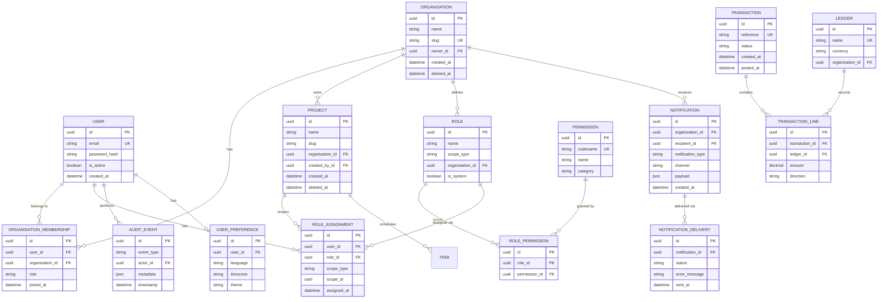

# Data Model

This document describes the core entity relationships in Django Core-App.

## Entity Relationship Diagram



## Core Models

### Authentication & Users

| Model | App | Description |
|-------|-----|-------------|
| `User` | accounts | Custom user with email authentication |
| `UserPreference` | i18n_preferences | User locale and theme settings |

**Key decisions:**
- Email as primary identifier (no username)
- UUID primary keys for security
- Soft-delete via `deleted_at` timestamp

### Organizations & Projects

| Model | App | Description |
|-------|-----|-------------|
| `Organisation` | organisations | Multi-tenant organization |
| `OrganisationMembership` | organisations | User membership in org |
| `Project` | projects | Project workspace within org |

**Relationships:**
- User → Organisation: Many-to-Many via Membership
- Organisation → Project: One-to-Many
- Project scopes permissions and resources

### Permissions & Roles

| Model | App | Description |
|-------|-----|-------------|
| `Permission` | permissions | System permission definition |
| `Role` | permissions | Role grouping permissions |
| `RolePermission` | permissions | Permission assignment to role |
| `RoleAssignment` | permissions | Role assignment to user |

**Hierarchy:**
```
Organisation
    └── Role (org-level)
        └── Project
            └── Role (project-level)
                └── Resource
```

### Audit & Compliance

| Model | App | Description |
|-------|-----|-------------|
| `AuditEvent` | audit | Immutable audit log entry |

**Features:**
- Append-only (no updates/deletes)
- JSON metadata for flexibility
- GIN index for metadata queries
- Partitioned by timestamp

### Notifications

| Model | App | Description |
|-------|-----|-------------|
| `Notification` | notifications | Notification record |
| `NotificationDelivery` | notifications | Delivery attempt tracking |

**Channels:**
- Email, Webhook, In-App
- Retry tracking per delivery

### Transactions & Credits

| Model | App | Description |
|-------|-----|-------------|
| `Ledger` | transactions | Named ledger account |
| `Transaction` | transactions | Transaction header |
| `TransactionLine` | transactions | Double-entry line item |

**Invariant:** Transaction lines must sum to zero (balanced).

---

## Indexes & Performance

### Critical Indexes

```python
# User lookups
models.Index(fields=['email'])
models.Index(fields=['is_active', 'email'])

# Organisation multi-tenancy
models.Index(fields=['slug'])
models.Index(fields=['deleted_at'])

# Permission evaluation
models.Index(fields=['user_id', 'scope_type', 'scope_id'])
models.Index(fields=['role_id'])

# Audit queries
models.Index(fields=['event_type', 'timestamp'])
models.Index(fields=['actor_id', 'timestamp'])
GinIndex(fields=['metadata'])  # JSONB queries

# Notification processing
models.Index(fields=['status', 'created_at'])
models.Index(fields=['recipient_id', 'created_at'])
```

### Query Patterns

| Query | Optimization |
|-------|-------------|
| User's permissions | Cache in Redis, 5 min TTL |
| Organisation members | Prefetch with `select_related` |
| Audit history | Cursor pagination, timestamp index |
| Pending notifications | Status + created_at composite index |

---

## Multi-Tenancy

All tenant-scoped models include `organisation_id`:

```python
class TenantScopedMixin(models.Model):
    """Mixin for organisation-scoped models."""
    
    organisation = models.ForeignKey(
        'organisations.Organisation',
        on_delete=models.CASCADE,
        related_name='%(class)ss',
    )
    
    class Meta:
        abstract = True
```

### Query Isolation

```python
# All queries automatically scoped
class TenantManager(models.Manager):
    def for_organisation(self, org_id):
        return self.filter(organisation_id=org_id)

# In views
def get_queryset(self):
    org = self.request.user.current_organisation
    return Project.objects.for_organisation(org.id)
```

---

## Soft Delete

Models supporting soft delete:

| Model | Soft Delete Field | Manager Method |
|-------|-------------------|----------------|
| User | `is_active=False` | `.active()` |
| Organisation | `deleted_at` | `.active()` |
| Project | `deleted_at` | `.active()` |

```python
class SoftDeleteMixin(models.Model):
    deleted_at = models.DateTimeField(null=True, blank=True)
    
    def soft_delete(self):
        self.deleted_at = timezone.now()
        self.save(update_fields=['deleted_at'])
    
    class Meta:
        abstract = True
```

---

## Related Documentation

- [Layers](layers.md) - Architecture layers
- [Request Flow](request-flow.md) - How requests access data
- [ADR-002: Role-Based Access Control](../adr/002-role-based-access-control.md)
