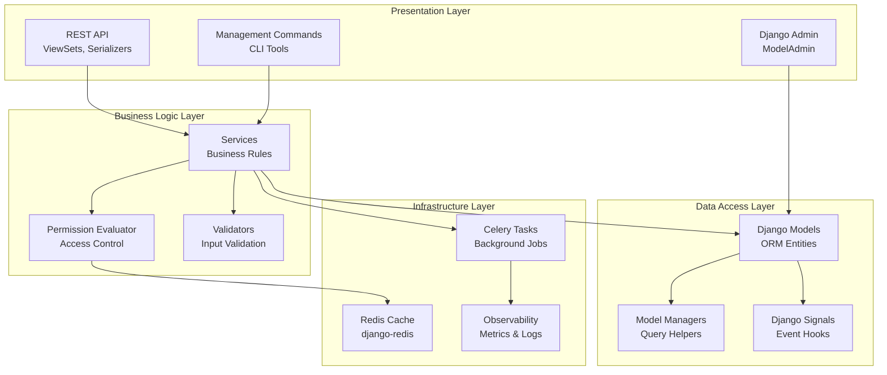
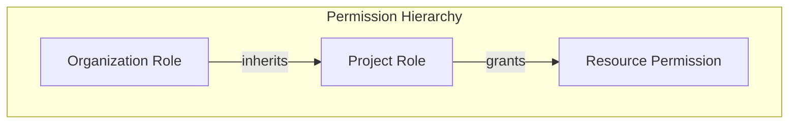

# Layered Architecture

Django Core-App follows a layered architecture pattern that separates concerns and enables maintainability.

## Layer Overview



## Layer Responsibilities

### 1. Presentation Layer

The presentation layer handles all external communication.

#### REST API (DRF)

```python
# src/permissions/api/views.py
class RoleViewSet(viewsets.ModelViewSet):
    """ViewSet for Role CRUD operations."""
    queryset = Role.objects.all()
    serializer_class = RoleSerializer
    permission_classes = [permissions.IsAuthenticated, IsOrgAdmin]
    
    def get_queryset(self):
        """Filter by user's organizations."""
        return self.queryset.filter(
            organization__in=self.request.user.organisations.all()
        )
```

**Components:**
- **ViewSets**: Handle HTTP requests and responses
- **Serializers**: Validate input, serialize output
- **Permissions**: DRF permission classes
- **Pagination**: Cursor-based pagination

#### Django Admin

```python
# src/audit/admin.py
@admin.register(AuditEvent)
class AuditEventAdmin(admin.ModelAdmin):
    list_display = ['event_type', 'actor', 'timestamp']
    list_filter = ['event_type', 'timestamp']
    search_fields = ['actor__email', 'metadata']
    readonly_fields = ['__all__']  # Immutable
```

#### Management Commands

```python
# src/audit/management/commands/audit_cleanup.py
class Command(BaseCommand):
    help = 'Clean up old audit events'
    
    def add_arguments(self, parser):
        parser.add_argument('--days', type=int, default=365)
    
    def handle(self, *args, **options):
        # Implementation
```

---

### 2. Business Logic Layer

The business logic layer contains domain rules and orchestration.

#### Services

Services encapsulate business logic and coordinate between layers:

```python
# src/permissions/evaluator.py
class PermissionEvaluator:
    """Evaluate permissions with hierarchical inheritance."""
    
    def __init__(self, cache_backend=None):
        self.cache = cache_backend or get_cache()
    
    def check_permission(
        self,
        user: User,
        permission: str,
        resource: Optional[Model] = None,
    ) -> bool:
        """Check if user has permission on resource."""
        cache_key = self._build_cache_key(user, permission, resource)
        
        # Check cache first
        cached = self.cache.get(cache_key)
        if cached is not None:
            return cached
        
        # Evaluate permission
        result = self._evaluate(user, permission, resource)
        
        # Cache result
        self.cache.set(cache_key, result, timeout=300)
        
        # Audit the check
        audit_log.record(
            'permission.check',
            user=user,
            metadata={'permission': permission, 'result': result}
        )
        
        return result
```

#### Permission Evaluator

The permission system follows hierarchical inheritance:



#### Validators

Custom validators enforce business rules:

```python
# src/accounts/validators.py
class PasswordStrengthValidator:
    """Validate password meets strength requirements."""
    
    def validate(self, password: str, user=None) -> None:
        if len(password) < 12:
            raise ValidationError('Password must be at least 12 characters')
        
        if not self._has_mixed_case(password):
            raise ValidationError('Password must have mixed case')
```

---

### 3. Data Access Layer

The data access layer manages persistence and data retrieval.

#### Django Models

Models define the data schema:

```python
# src/organisations/models.py
class Organisation(models.Model):
    """Multi-tenant organization."""
    
    name = models.CharField(max_length=200)
    slug = models.SlugField(unique=True)
    owner = models.ForeignKey(
        settings.AUTH_USER_MODEL,
        on_delete=models.PROTECT,
        related_name='owned_organisations',
    )
    created_at = models.DateTimeField(auto_now_add=True)
    deleted_at = models.DateTimeField(null=True, blank=True)
    
    objects = OrganisationManager()
    
    class Meta:
        ordering = ['name']
        indexes = [
            models.Index(fields=['slug']),
            models.Index(fields=['deleted_at']),
        ]
```

#### Model Managers

Custom managers encapsulate query logic:

```python
# src/organisations/managers.py
class OrganisationManager(models.Manager):
    """Manager for Organisation model."""
    
    def active(self):
        """Return non-deleted organizations."""
        return self.filter(deleted_at__isnull=True)
    
    def for_user(self, user):
        """Return organizations the user belongs to."""
        return self.active().filter(
            Q(owner=user) | Q(members=user)
        ).distinct()
```

#### Django Signals

Signals handle cross-cutting concerns:

```python
# src/audit/signals.py
@receiver(post_save, sender=RoleAssignment)
def log_role_assignment(sender, instance, created, **kwargs):
    """Log role assignment changes."""
    if created:
        audit_log.record(
            'permission.role_assigned',
            user=instance.user,
            metadata={
                'role': instance.role.name,
                'scope': instance.scope_type,
            }
        )
```

---

### 4. Infrastructure Layer

The infrastructure layer provides cross-cutting services.

#### Redis Cache

```python
# src/permissions/cache.py
from django.core.cache import caches

class PermissionCache:
    """Cache for permission lookups."""
    
    def __init__(self):
        self.cache = caches['permissions']
        self.ttl = 300  # 5 minutes
    
    def get_user_permissions(self, user_id: int) -> Optional[set]:
        key = f'perms:user:{user_id}'
        return self.cache.get(key)
    
    def invalidate_user(self, user_id: int) -> None:
        key = f'perms:user:{user_id}'
        self.cache.delete(key)
```

#### Celery Tasks

```python
# src/notifications/tasks/delivery_tasks.py
@shared_task(
    bind=True,
    autoretry_for=(TransientError,),
    retry_backoff=True,
    max_retries=5,
)
def deliver_notification(self, notification_id: int) -> dict:
    """Deliver a notification via its configured channel."""
    notification = Notification.objects.get(id=notification_id)
    channel = get_channel(notification.channel)
    
    try:
        result = channel.send(notification)
        notification.mark_delivered()
        return {'status': 'delivered', 'id': notification_id}
    except TransientError:
        raise  # Will be retried
    except PermanentError as e:
        notification.mark_failed(str(e))
        return {'status': 'failed', 'error': str(e)}
```

#### Observability

```python
# src/observability/metrics.py
from prometheus_client import Counter, Histogram

http_requests_total = Counter(
    'http_requests_total',
    'Total HTTP requests',
    ['method', 'endpoint', 'status']
)

request_duration_seconds = Histogram(
    'request_duration_seconds',
    'HTTP request duration',
    ['method', 'endpoint']
)
```

---

## Layer Interaction Rules

### Allowed Dependencies

```
Presentation → Business Logic → Data Access → Infrastructure
     ↓              ↓               ↓              ↓
   Views         Services         Models         Cache
   Serializers   Validators       Managers       Tasks
   Commands      Evaluators       Signals        Logging
```

### Forbidden Dependencies

- ❌ Data Access → Presentation (no model importing views)
- ❌ Infrastructure → Business Logic (no cache importing services)
- ❌ Presentation → Data Access (views shouldn't query directly)

### Best Practices

1. **Keep views thin**: Delegate to services
2. **Use managers for queries**: Don't scatter QuerySet logic
3. **Signals for side effects**: Keep models focused on data
4. **Cache at service level**: Not in views or models

## Related Documentation

- [Overview](overview.md) - High-level architecture
- [Data Model](data-model.md) - Entity relationships
- [Request Flow](request-flow.md) - Request lifecycle
