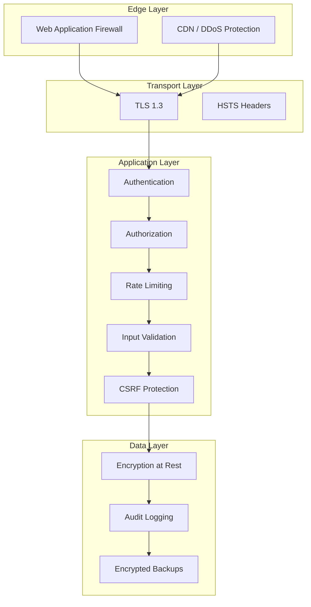
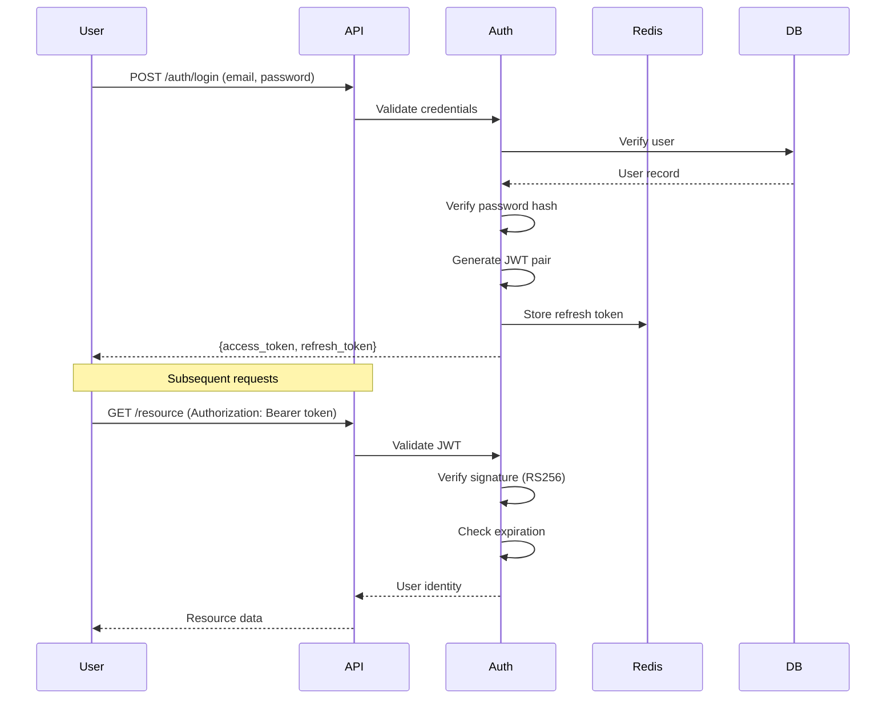
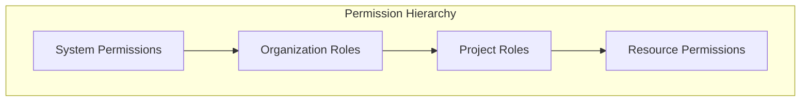
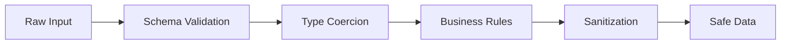

# Security Model

This document describes the security architecture of Django Core-App.

## Security Layers



## Authentication

### JWT-Based Authentication



### Token Configuration

```python
JWT_SETTINGS = {
    'ACCESS_TOKEN_LIFETIME': timedelta(minutes=15),
    'REFRESH_TOKEN_LIFETIME': timedelta(days=7),
    'ALGORITHM': 'RS256',
    'SIGNING_KEY': env('JWT_PRIVATE_KEY'),
    'VERIFYING_KEY': env('JWT_PUBLIC_KEY'),
    'TOKEN_TYPE_CLAIM': 'token_type',
    'JTI_CLAIM': 'jti',
}
```

### Password Security

Following [ADR-001: Password Validation Strategy](../adr/001-password-validation-strategy.md):

| Requirement | Value |
|-------------|-------|
| Minimum length | 12 characters |
| Complexity | Mixed case, numbers, symbols |
| History | Last 5 passwords blocked |
| Breach check | HaveIBeenPwned integration |
| Hashing | Argon2id |

```python
AUTH_PASSWORD_VALIDATORS = [
    {'NAME': 'django.contrib.auth.password_validation.MinimumLengthValidator',
     'OPTIONS': {'min_length': 12}},
    {'NAME': 'accounts.validators.PasswordStrengthValidator'},
    {'NAME': 'accounts.validators.BreachCheckValidator'},
    {'NAME': 'accounts.validators.PasswordHistoryValidator',
     'OPTIONS': {'history_length': 5}},
]
```

---

## Authorization

### Role-Based Access Control (RBAC)

Following [ADR-002: Role-Based Access Control](../adr/002-role-based-access-control.md):



### Permission Model

```python
class Permission(models.Model):
    codename = models.CharField(max_length=100, unique=True)
    name = models.CharField(max_length=255)
    category = models.CharField(max_length=50)
    
    # Example: 'project.create', 'project.view', 'project.delete'

class Role(models.Model):
    name = models.CharField(max_length=100)
    organisation = models.ForeignKey(Organisation, on_delete=CASCADE)
    permissions = models.ManyToManyField(Permission)
    scope_type = models.CharField(choices=SCOPE_CHOICES)
    
    # scope_type: 'organisation', 'project'
```

### Permission Checking

```python
# In views
class ProjectViewSet(viewsets.ModelViewSet):
    permission_classes = [IsAuthenticated, HasPermission]
    required_permission = 'project.view'
    
    def create(self, request):
        self.check_permission('project.create', request.user, org)
        # ...

# Permission evaluator
class PermissionEvaluator:
    def check(self, user, permission, scope=None):
        # 1. Check cache
        cached = self.cache.get(user.id, permission, scope)
        if cached is not None:
            return cached
        
        # 2. Check superuser
        if user.is_superuser:
            return True
        
        # 3. Check role assignments
        result = self._evaluate_roles(user, permission, scope)
        
        # 4. Cache result
        self.cache.set(user.id, permission, scope, result)
        
        return result
```

---

## Security Headers

### HTTP Security Headers

```python
SECURE_HEADERS = {
    'X-Content-Type-Options': 'nosniff',
    'X-Frame-Options': 'DENY',
    'X-XSS-Protection': '1; mode=block',
    'Strict-Transport-Security': 'max-age=31536000; includeSubDomains',
    'Content-Security-Policy': "default-src 'self'",
    'Referrer-Policy': 'strict-origin-when-cross-origin',
    'Permissions-Policy': 'geolocation=(), camera=(), microphone=()',
}
```

### Middleware Configuration

```python
# Django settings
SECURE_BROWSER_XSS_FILTER = True
SECURE_CONTENT_TYPE_NOSNIFF = True
SECURE_HSTS_INCLUDE_SUBDOMAINS = True
SECURE_HSTS_SECONDS = 31536000
SECURE_HSTS_PRELOAD = True
SECURE_SSL_REDIRECT = True
SESSION_COOKIE_SECURE = True
CSRF_COOKIE_SECURE = True
```

---

## Rate Limiting

### Rate Limit Tiers

| Endpoint Category | Limit | Window |
|------------------|-------|--------|
| Authentication | 5 requests | 1 minute |
| Password reset | 3 requests | 1 hour |
| API (authenticated) | 1000 requests | 1 hour |
| API (unauthenticated) | 100 requests | 1 hour |
| Webhook delivery | 100 requests | 1 minute |

### Implementation

```python
# Using django-redis for distributed rate limiting
class RateLimiter:
    def check(self, key: str, limit: int, window: int) -> bool:
        """Check if request is within rate limit."""
        current = self.redis.incr(key)
        
        if current == 1:
            self.redis.expire(key, window)
        
        return current <= limit
    
    def get_remaining(self, key: str, limit: int) -> int:
        current = self.redis.get(key) or 0
        return max(0, limit - int(current))
```

---

## Input Validation

### Defense in Depth



### Validation Layers

1. **API Schema Validation (DRF Serializers)**
   ```python
   class UserSerializer(serializers.Serializer):
       email = serializers.EmailField(max_length=255)
       password = serializers.CharField(min_length=12, write_only=True)
   ```

2. **Model Validation (Django Validators)**
   ```python
   class User(models.Model):
       email = models.EmailField(validators=[EmailValidator()])
   ```

3. **Business Rule Validation**
   ```python
   def validate_email(self, value):
       if User.objects.filter(email=value).exists():
           raise ValidationError('Email already registered')
       return value
   ```

### SQL Injection Prevention

- Always use ORM or parameterized queries
- Never use raw SQL with user input
- Use `extra()` and `raw()` with extreme caution

```python
# Good - parameterized
User.objects.filter(email=user_input)

# Bad - SQL injection risk
User.objects.raw(f"SELECT * FROM users WHERE email = '{user_input}'")
```

---

## Audit Logging

### What Gets Logged

| Event Type | Data Captured |
|------------|---------------|
| Authentication | Login, logout, failed attempts |
| Authorization | Permission checks, denials |
| Data Access | Resource reads (sensitive) |
| Data Modification | Creates, updates, deletes |
| Admin Actions | User management, config changes |

### Audit Event Structure

```python
class AuditEvent(models.Model):
    id = models.UUIDField(primary_key=True)
    event_type = models.CharField(max_length=100)
    actor = models.ForeignKey(User, on_delete=models.SET_NULL, null=True)
    timestamp = models.DateTimeField(auto_now_add=True)
    ip_address = models.GenericIPAddressField(null=True)
    user_agent = models.TextField(blank=True)
    metadata = models.JSONField(default=dict)
    
    class Meta:
        indexes = [
            models.Index(fields=['event_type', 'timestamp']),
            models.Index(fields=['actor_id', 'timestamp']),
            GinIndex(fields=['metadata']),
        ]
```

### Immutability

- No UPDATE or DELETE operations on audit table
- Database-level triggers prevent modification
- Retention policy: 7 years minimum

---

## Secrets Management

### Secret Storage

| Secret Type | Storage Method |
|-------------|----------------|
| Database credentials | Environment variables |
| JWT signing keys | Vault / AWS Secrets Manager |
| API keys (external) | Encrypted settings |
| Encryption keys | HSM / KMS |

### Configuration

```python
# settings.py
import os

SECRET_KEY = os.environ['DJANGO_SECRET_KEY']
DATABASE_URL = os.environ['DATABASE_URL']

# Never commit secrets to code
# Use .env files only for local development
```

---

## Security Modes

Following [ADR-004: Security Enforcement Modes](../adr/004-security-enforcement-modes.md):

| Mode | Behavior | Use Case |
|------|----------|----------|
| `strict` | Enforce all policies, block violations | Production |
| `permissive` | Log violations, allow requests | Staging/Debug |
| `disabled` | No enforcement | Local dev only |

```python
SECURITY_MODE = env('SECURITY_MODE', default='strict')

class SecurityMiddleware:
    def check_policy(self, request):
        violation = self.evaluate(request)
        
        if violation:
            if settings.SECURITY_MODE == 'strict':
                raise SecurityViolation(violation)
            elif settings.SECURITY_MODE == 'permissive':
                logger.warning(f'Security violation: {violation}')
                # Allow request to continue
```

---

## Dependency Security

Following [ADR-003: pip-audit for Dependency Scanning](../adr/003-pip-audit-for-dependency-scanning.md):

### Automated Scanning

```yaml
# CI pipeline
security-scan:
  script:
    - pip-audit --strict
    - bandit -r src/
    - safety check
```

### Update Policy

| Severity | Response Time |
|----------|--------------|
| Critical | 24 hours |
| High | 7 days |
| Medium | 30 days |
| Low | Next release |

---

## Related Documentation

- [Request Flow](request-flow.md) - Request lifecycle
- [ADR-001: Password Validation Strategy](../adr/001-password-validation-strategy.md)
- [ADR-002: Role-Based Access Control](../adr/002-role-based-access-control.md)
- [ADR-004: Security Enforcement Modes](../adr/004-security-enforcement-modes.md)
- [ADR-013: JWT Authentication Strategy](../adr/013-jwt-authentication-strategy.md)
