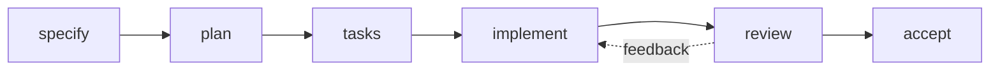

# Spec Kitty Workflow

Spec Kitty is Django Core-App's feature specification and implementation workflow. It provides a structured approach to developing new features with clear stages, documentation, and review gates.

## What is Spec Kitty?

Spec Kitty is a methodology for:

- **Specifying features** before implementation
- **Breaking down work** into manageable tasks
- **Tracking progress** through implementation
- **Ensuring quality** through structured reviews

Every significant feature goes through the Spec Kitty lifecycle, resulting in comprehensive documentation and tested code.

---

## The Lifecycle



### 1. Specify (`/spec-kitty.specify`)

Create the feature specification document.

**What happens:**
- Creates `kitty-specs/<feature-id>/spec.md`
- Defines user stories and acceptance criteria
- Lists functional requirements
- Documents non-functional requirements
- Identifies risks and dependencies

**Output:** A complete `spec.md` that answers "What are we building and why?"

**Example:**
```markdown
# B21: Docs and Examples

## User Stories
- US1: As a new developer, I want a quickstart guide...

## Functional Requirements
- FR-001: Documentation structure uses MkDocs format
- FR-002: Examples include smoke tests
```

---

### 2. Plan (`/spec-kitty.plan`)

Create the implementation plan.

**What happens:**
- Creates `kitty-specs/<feature-id>/plan.md`
- Defines architecture and technical approach
- Lists files to create or modify
- Identifies dependencies and blockers
- Estimates effort and timeline

**Output:** A detailed `plan.md` that answers "How will we build it?"

**Example:**
```markdown
# Implementation Plan: B21

## Architecture
- Documentation in `docs/` with MkDocs structure
- Examples in `examples/` as Django apps

## Work Packages
- WP01: Documentation structure (P0)
- WP02: Getting Started docs (P1)
```

---

### 3. Tasks (`/spec-kitty.tasks`)

Generate work packages and subtasks.

**What happens:**
- Creates `kitty-specs/<feature-id>/tasks.md`
- Breaks plan into work packages (WP01, WP02, ...)
- Creates subtasks within each work package (T001, T002, ...)
- Generates prompt files in `tasks/planned/`
- Identifies parallel execution opportunities

**Output:** Actionable `tasks.md` with granular work items.

**Example:**
```markdown
## WP01: Documentation Structure (P0)

- [ ] T001 Create docs/getting-started/ directory
- [ ] T002 [P] Create docs/architecture/ directory  
- [ ] T003 [P] Create docs/modules/ directory
```

---

### 4. Implement (`/spec-kitty.implement`)

Execute work packages following the task plan.

**What happens:**
- Moves task prompt from `tasks/planned/` to `tasks/doing/`
- Implements each subtask following the prompt
- Updates activity log with progress
- Commits changes with conventional commits
- Moves completed prompt to `tasks/for_review/`

**Workflow:**
```bash
# 1. Move to doing lane
tasks/planned/WP01.md → tasks/doing/WP01.md

# 2. Implement subtasks
git add .
git commit -m "feat(docs): create documentation structure (T001-T008)"

# 3. Move to for_review lane
tasks/doing/WP01.md → tasks/for_review/WP01.md
```

---

### 5. Review (`/spec-kitty.review`)

Review implementation against specifications.

**What happens:**
- Validates work against Definition of Done
- Checks code quality (tests, coverage, types)
- Reviews documentation accuracy
- Either approves or provides feedback

**Outcomes:**
- **Approved** → Move prompt to `tasks/done/`, mark task complete
- **Needs Changes** → Add feedback to prompt, return to `tasks/planned/`

---

### 6. Accept (`/spec-kitty.accept`)

Finalize and merge the feature.

**What happens:**
- Validates all work packages are complete
- Runs final integration tests
- Updates checklists and requirements
- Prepares merge to main branch
- Archives completed specification

---

## Directory Structure

Each feature has a standardized directory structure:

```
kitty-specs/<feature-id>/
├── spec.md              # Feature specification
├── plan.md              # Implementation plan
├── tasks.md             # Work packages and subtasks
├── research.md          # Research findings (optional)
├── constitution.md      # Security constraints (optional)
├── checklists/          # Verification checklists
│   └── requirements.md  # FR/NFR checklist
└── tasks/               # Work package prompts
    ├── planned/         # Not yet started
    ├── doing/           # Currently being implemented
    ├── for_review/      # Awaiting review
    └── done/            # Completed and approved
```

### Feature Naming

Features follow the pattern: `<number>-<short-name>`

| Pattern | Example | Description |
|---------|---------|-------------|
| `00x-*` | `005-core-accounts` | Foundation features (1-10) |
| `01x-*` | `015-tasks-scheduling` | Core features (11-20) |
| `02x-*` | `021-docs-examples` | Extensions (21+) |

---

## Templates

Spec Kitty uses templates from `.kittify/templates/`:

| Template | Purpose |
|----------|---------|
| `spec.md` | Feature specification template |
| `plan.md` | Implementation plan template |
| `tasks.md` | Work packages template |
| `prompt.md` | Work package prompt template |

Templates include:
- Required sections
- Example content
- Placeholder markers
- Review guidance

---

## Example Walkthrough

Let's walk through creating a simple feature: "Add User Avatars"

### Step 1: Specify

```bash
# Create specification
/spec-kitty.specify "Add user avatar upload and display"
```

Creates `kitty-specs/022-user-avatars/spec.md`:
```markdown
# B22: User Avatars

## User Stories
- US1: As a user, I want to upload a profile picture

## Functional Requirements
- FR-001: Upload JPEG, PNG, or WebP images
- FR-002: Display 64x64 avatar in header
- FR-003: Store avatars in S3 bucket
```

### Step 2: Plan

```bash
# Create implementation plan
/spec-kitty.plan
```

Creates `plan.md`:
```markdown
## Work Packages

| WP | Title | Priority |
|----|-------|----------|
| WP01 | Avatar Model & Storage | P0 |
| WP02 | Upload API | P1 |
| WP03 | Display Components | P1 |
```

### Step 3: Generate Tasks

```bash
# Generate work packages
/spec-kitty.tasks
```

Creates `tasks.md` and `tasks/planned/WP01.md`, etc.

### Step 4: Implement

```bash
# Implement first work package
/spec-kitty.implement
```

Agent moves WP01 to doing, implements, and moves to for_review.

### Step 5: Review

```bash
# Review completed work
/spec-kitty.review
```

Reviewer checks code, approves or returns with feedback.

### Step 6: Accept

```bash
# Accept feature when all WPs complete
/spec-kitty.accept
```

Feature is merged and spec archived.

---

## Parallel Work

Spec Kitty supports parallel execution for efficiency:

### Within a Work Package

Subtasks marked `[P]` can run in parallel:
```markdown
- [ ] T001 Create database model
- [ ] T002 [P] Write model tests
- [ ] T003 [P] Create serializer
```

### Across Work Packages

Independent work packages can run simultaneously:
```markdown
WP01 (docs) ─────────┐
WP07 (example) ──────┼─── WP10 (integration)
WP08 (example) ──────┘
```

---

## Activity Logs

Every prompt file includes an activity log tracking all changes:

```markdown
## Activity Log

- 2025-12-05T09:00:00Z – claude – lane=planned – Prompt created
- 2025-12-05T10:00:00Z – claude – lane=doing – Started implementation
- 2025-12-05T11:00:00Z – claude – lane=for_review – Ready for review
- 2025-12-05T12:00:00Z – reviewer – lane=done – Approved
```

This provides full traceability of who did what and when.

---

## Best Practices

### Specification

- **Be specific**: Include concrete examples in requirements
- **Define scope**: Clearly state what's NOT included
- **Link dependencies**: Reference related features
- **Include acceptance criteria**: How do we know it's done?

### Planning

- **Small work packages**: 2-4 hours each
- **Clear dependencies**: Draw the execution graph
- **Risk mitigation**: Identify blockers early
- **Incremental value**: Each WP delivers something usable

### Implementation

- **One WP at a time**: Complete before starting next
- **Follow the prompt**: It contains review criteria
- **Update activity logs**: Track your progress
- **Commit frequently**: Small, focused commits

### Review

- **Check Definition of Done**: Every criterion must pass
- **Run the tests**: Don't skip quality checks
- **Provide actionable feedback**: Specific, not vague
- **Be timely**: Unblock implementers quickly

---

## Tools and Scripts

### Helper Scripts

| Script | Purpose |
|--------|---------|
| `tasks-move-to-lane.sh` | Move prompt between lanes |
| `check-prerequisites.ps1` | Verify environment |
| `validate-task-workflow.sh` | Check workflow state |

### VS Code Integration

The `.github/prompts/` directory contains VS Code prompt files:
- `spec-kitty.specify.prompt.md`
- `spec-kitty.plan.prompt.md`
- `spec-kitty.tasks.prompt.md`
- `spec-kitty.implement.prompt.md`
- `spec-kitty.review.prompt.md`
- `spec-kitty.accept.prompt.md`

---

## FAQ

### When should I use Spec Kitty?

Use Spec Kitty for:
- New features with multiple components
- Changes affecting multiple modules
- Features requiring design decisions
- Work that needs coordination

Skip Spec Kitty for:
- Single-file bug fixes
- Documentation typos
- Dependency updates
- Simple refactors

### What if requirements change mid-implementation?

1. Update `spec.md` with the change
2. Document the reason in an ADR if significant
3. Update affected work packages in `tasks.md`
4. Continue implementation

### How do I handle blocked work packages?

1. Mark the blocker in `tasks.md`
2. Move to another unblocked work package
3. Document the blocker in the activity log
4. Return when unblocked

---

## Next Steps

- Read [Code Style](code-style.md) for formatting guidelines
- Understand [Testing](testing.md) requirements
- Review [PR Guidelines](pr-guidelines.md) for submissions
