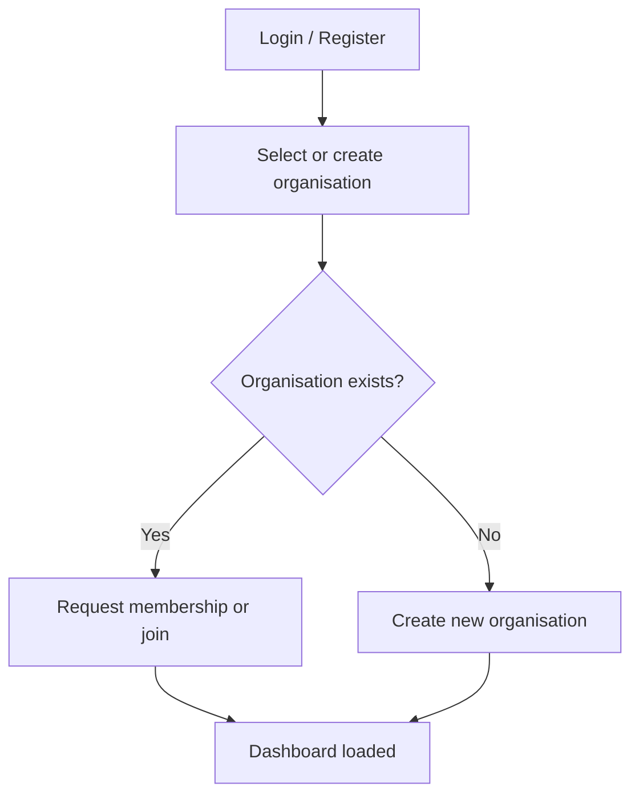
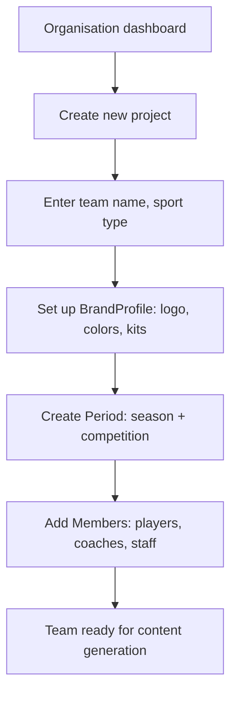
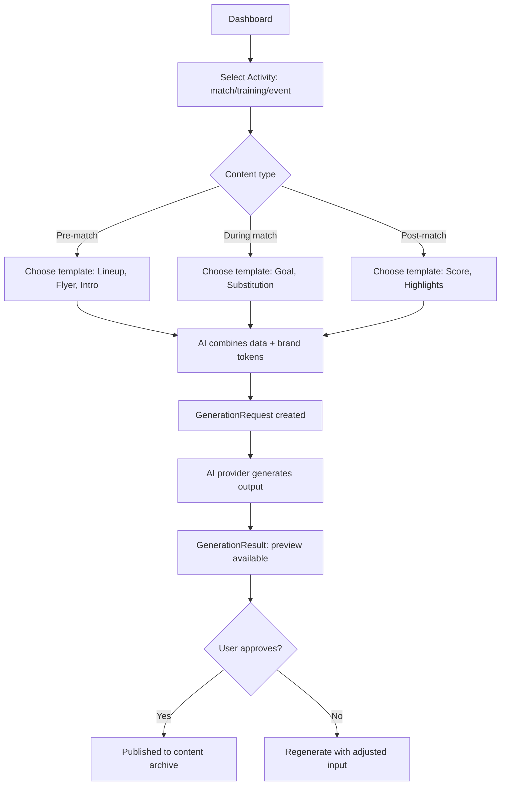
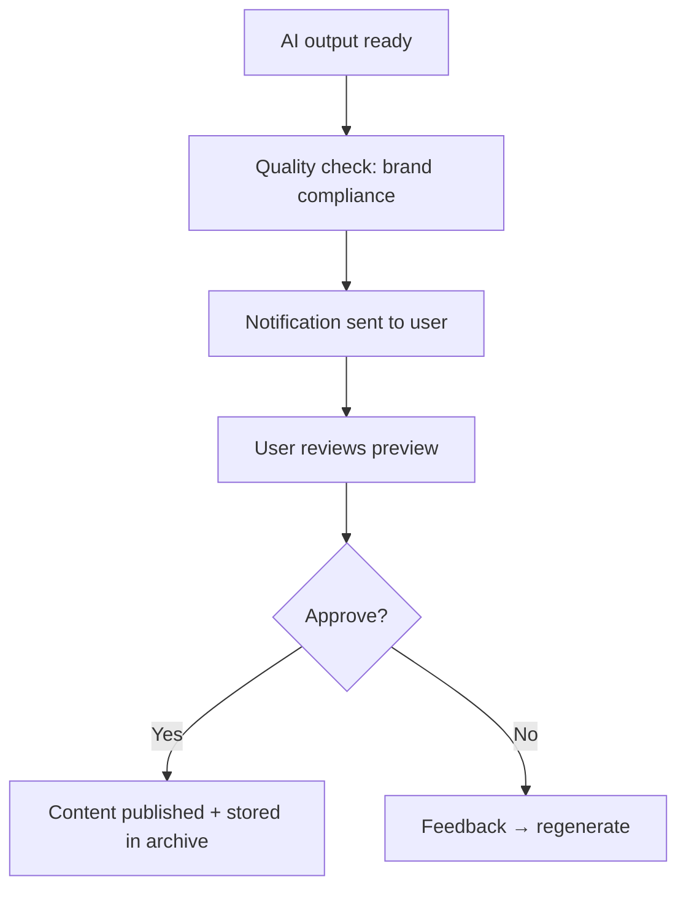

# Functional Design — TeamReel

> Last updated: 2026-03-30

## Purpose

This document describes the **user-facing functionality** of TeamReel: what users do, how they experience the product, and which flows the application supports. It bridges the business vision and the technical implementation.

For technical architecture, see [architecture.md](../architecture/overview.md). For API details, see [api-reference.md](api-reference.md).

---

## Core Concept: The Sports Content Week

TeamReel organizes content creation around three match phases:

| Phase | Content types | Examples |
|-------|--------------|----------|
| **Pre-match** | Announcements, line-ups, previews | Line-up video, matchday flyer, team intro reel |
| **During match** | Live updates | Goal alerts, substitution cards |
| **Post-match** | Results, highlights | Score cards, highlight reels, season recaps |

Users pick a moment type, fill in minimal data, and TeamReel generates branded output automatically.

---

## User Roles & Access

### Role Hierarchy

The system uses hierarchical access: **Organisation → Project → User**.

| Role | Scope | Capabilities |
|------|-------|-------------|
| **Organisation Admin** | Full org | Manage identity, projects, members, brand settings |
| **Project Admin** | Assigned project(s) | Manage team, members, activities, content |
| **Member (Maker)** | Own project | Generate content, view team data |
| **Viewer** | Public content only | View and share published content |

> **Implementation:** RBAC via `Membership` (org level) and `ProjectMembership` (project level) with `RoleAssignment` and `Permission` registry. See [rbac-permissions.md](rbac-permissions.md).

### Team Roles (Sport-Specific)

Within a project (team), each member has a **functional role** that affects both permissions and visual representation in AI output.

| Team Role | Visual representation | Can generate content |
|-----------|----------------------|---------------------|
| **Coach** | Coach outfit, name in lineup | Yes |
| **Goalkeeper** | GK kit with custom colors | Yes |
| **Player** | Match kit | Yes |
| **Staff** | Optional in visuals | No |

> **Implementation:** `Member.position`, `ActivityParticipation.role` in the `members` and `activities` apps.

### Authentication

- Email/password login with JWT tokens
- Session-based auth for web app
- Token refresh flow
- Organisation context switching via `UserActiveContext`

> See [active-context.md](active-context.md) for the 8-FK navigation state system.

---

## User Flows

### Flow 1 — Registration & Organisation Selection



After authentication, the user selects their organisation and project. The `UserActiveContext` remembers their last selection.

### Flow 2 — Project Setup (Team Creation)



**Data inheritance:** Projects inherit the organisation's BrandProfile tokens. Teams can override with their own accent color or sponsor, but the base identity stays consistent.

> **Implementation:** `BrandProfile` with `get_merged_tokens()` — project tokens override org tokens. See [branding-tokens.md](branding-tokens.md).

### Flow 3 — Content Creation



**Key principle:** AI generates, user decides. Every output gets a preview before publication.

> **Implementation:** `GenerationRequest` → `GenerationResult` pipeline in the `generative` app. See [generative-pipeline.md](generative-pipeline.md).

### Flow 4 — Season Continuity

At the start of a new season:
1. Admin creates a new `Period` (season)
2. Optionally copies member list from previous season
3. AI checks for required roles (goalkeeper, coach)
4. Activities (matches) are created within the new period

> **Implementation:** `Period` with `parent_period` for nesting (season → competition). See [project-hierarchy.md](project-hierarchy.md).

### Flow 5 — Approval & Publication



> **Implementation:** Workflow engine with state machine transitions. See [workflow-engine.md](workflow-engine.md). Notifications via [notification-routing.md](notification-routing.md).

---

## AI Integration

### Workflow Types

| Type | Scope | Example output |
|------|-------|---------------|
| **Club flows** | Organisation-level branding | Base kit renders with sponsor |
| **Team flows** | Project-level customization | Team-specific kit variants, accent colors |
| **Person flows** | Individual member | Player visual with photo + kit composite |
| **Video flows** | Multi-asset composition | Lineup video, season compilation |

Workflows are **modular**: output of one flow feeds into the next (club kit → player composite → lineup video).

### Generation Lifecycle

```
User input → Validation → GenerationRequest (queued)
→ AI Provider (OpenAI / Gemini / MiniMax / Runway)
→ GenerationResult (stored)
→ VideoJob (if video) → FFmpeg processing → Export
```

Credits are deducted per generation based on complexity.

> **Implementation:** See [generative-pipeline.md](generative-pipeline.md), [video-processing.md](video-processing.md), [credits-transactions.md](credits-transactions.md).

### Automation & Triggers

| Trigger | Example | Action |
|---------|---------|--------|
| **Manual** | User clicks "Generate lineup" | Immediate generation |
| **Data-driven** | New team created | Auto-generate base branding visuals |
| **Scheduled** | Via Celery Beat | Periodic tasks (cleanup, reminders) |

---

## Application Structure

### Main Sections

| Section | Function | Users |
|---------|----------|-------|
| **Dashboard** | Overview: teams, active generations, status | All |
| **Projects** | Manage members, activities, seasons | Project admins, coaches |
| **Brand Studio** | Manage identity: logo, colors, kits | Organisation admins |
| **Content** | Browse, approve, and share generated content | All makers |

Navigation: sidebar (main sections) + top bar (context actions). Mobile: bottom tab bar with same structure.

> **Implementation:** React app with `react-router-dom`, context-switcher package. See [ux-flows.md](../frontend/ux-flows.md).

### Dashboard

Shows:
- Active projects and upcoming activities
- AI generation status (queued, processing, ready for approval)
- Notifications for pending approvals or missing data
- Media readiness indicators per club/team/member

> See [media-readiness-card.md](media-readiness-card.md) for the completeness tracking system.

---

## Data Model (Functional View)

```mermaid
erDiagram
    Organisation ||--o{ Project : contains
    Project ||--o{ Member : has
    Project ||--o{ Period : has
    Project ||--o{ BrandProfile : has
    Period ||--o{ Activity : contains
    Activity ||--o{ ActivityParticipation : links
    Member ||--o{ ActivityParticipation : participates
    BrandProfile ||--o{ BrandAsset : owns
    BrandProfile ||--o{ DesignToken : defines

    Organisation {
        string name
        string sport_type
    }
    Project {
        string name
        FK parent_project
        string project_type
    }
    Member {
        string name
        string position
        string role
        FK photo
    }
    Activity {
        string type
        date date
        string opponent
        string location
    }
    BrandProfile {
        string name
        bool is_active
    }
```

### Key Relationships
- **Organisation → Project:** A club (top-level project) can have nested teams (child projects via `parent_project`)
- **Project → BrandProfile:** Each project has its own brand, inheriting from the organisation
- **Period → Activity:** Seasons and competitions contain matches, trainings, and events
- **Activity → ActivityParticipation:** Links members to activities with specific roles

> For the complete 67-model schema, see [architecture.md](../architecture/overview.md) and [data-model.md](../architecture/data-model.md).

---

## Content Types (Built)

25+ content subtypes are available via `ContentTemplate`:

| Category | Types |
|----------|-------|
| **Lineups** | Starting XI, bench, full squad |
| **Match graphics** | Score cards, goal alerts, substitutions |
| **Videos** | Lineup reveal, season recap, highlight reel |
| **Social** | Instagram story, Reel, feed post |
| **Flyers** | Matchday announcement, training schedule |

Each template defines required `ContentField` values and maps to specific AI providers and video presets.

> See [content-templates.md](content-templates.md) for the full template system.

---

## Future Scope

Planned but not yet built:
- External data integrations (Sportlink, KNVB API)
- Statistical dashboards
- Newsletter generator
- Multi-language support
- Self-service onboarding for new clubs
