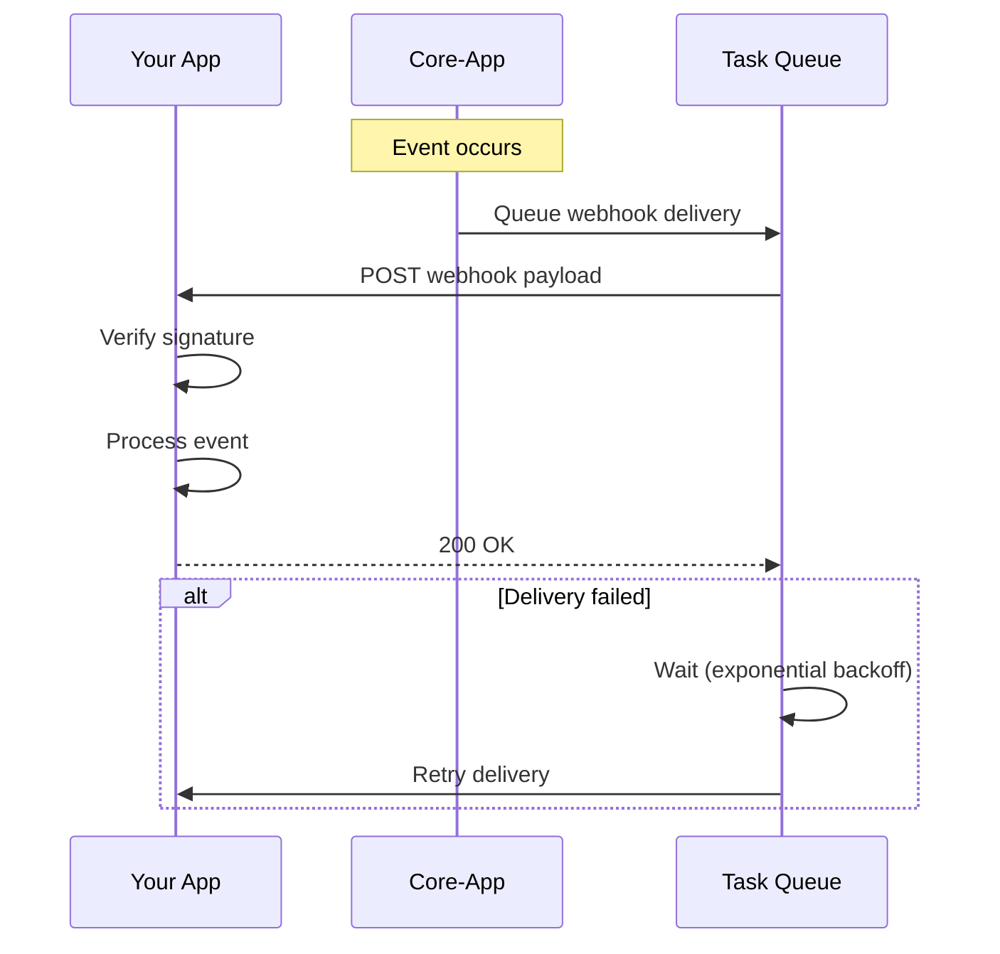

# Webhook Integration Guide

This guide explains how to receive and process webhooks from Django Core-App.

## Overview

Webhooks deliver real-time event notifications to your application. When events occur (user created, project updated, etc.), the system sends HTTP POST requests to your configured endpoint.

## Webhook Flow



## Setting Up Webhooks

### Register Webhook Endpoint

```bash
curl -X POST https://api.example.com/api/v1/webhooks/ \
  -H "Authorization: Bearer {token}" \
  -H "Content-Type: application/json" \
  -d '{
    "url": "https://your-app.com/webhooks/core-app",
    "events": ["user.created", "project.created", "project.updated"],
    "secret": "your-webhook-secret"
  }'
```

### List Registered Webhooks

```bash
curl https://api.example.com/api/v1/webhooks/ \
  -H "Authorization: Bearer {token}"
```

## Webhook Payload

### Request Headers

| Header | Description |
|--------|-------------|
| `Content-Type` | `application/json` |
| `X-Webhook-ID` | Unique delivery ID |
| `X-Webhook-Timestamp` | Unix timestamp |
| `X-Webhook-Signature` | HMAC signature |

### Payload Structure

```json
{
  "id": "evt_abc123",
  "type": "project.created",
  "timestamp": "2024-01-15T10:30:00Z",
  "data": {
    "id": "proj_xyz789",
    "name": "New Project",
    "organisation_id": "org_456",
    "created_by": "user_123"
  }
}
```

## Signature Verification

Verify webhook signatures to ensure authenticity:

### Python Example

```python
import hmac
import hashlib
from flask import Flask, request, abort

app = Flask(__name__)
WEBHOOK_SECRET = 'your-webhook-secret'

def verify_signature(payload, signature, timestamp):
    """Verify webhook signature."""
    message = f'{timestamp}.{payload}'
    expected = hmac.new(
        WEBHOOK_SECRET.encode(),
        message.encode(),
        hashlib.sha256
    ).hexdigest()
    
    return hmac.compare_digest(f'sha256={expected}', signature)

@app.route('/webhooks/core-app', methods=['POST'])
def handle_webhook():
    payload = request.data.decode('utf-8')
    signature = request.headers.get('X-Webhook-Signature')
    timestamp = request.headers.get('X-Webhook-Timestamp')
    
    if not verify_signature(payload, signature, timestamp):
        abort(401)
    
    event = request.json
    
    # Process event
    if event['type'] == 'project.created':
        handle_project_created(event['data'])
    
    return '', 200
```

### Node.js Example

```javascript
const crypto = require('crypto');
const express = require('express');

const app = express();
const WEBHOOK_SECRET = 'your-webhook-secret';

function verifySignature(payload, signature, timestamp) {
  const message = `${timestamp}.${payload}`;
  const expected = crypto
    .createHmac('sha256', WEBHOOK_SECRET)
    .update(message)
    .digest('hex');
  
  const expectedSignature = `sha256=${expected}`;
  return crypto.timingSafeEqual(
    Buffer.from(signature),
    Buffer.from(expectedSignature)
  );
}

app.post('/webhooks/core-app', express.raw({ type: 'application/json' }), (req, res) => {
  const payload = req.body.toString();
  const signature = req.headers['x-webhook-signature'];
  const timestamp = req.headers['x-webhook-timestamp'];
  
  if (!verifySignature(payload, signature, timestamp)) {
    return res.status(401).send('Invalid signature');
  }
  
  const event = JSON.parse(payload);
  
  // Process event
  console.log(`Received ${event.type}:`, event.data);
  
  res.status(200).send('OK');
});
```

## Event Types

### User Events

| Event | Description |
|-------|-------------|
| `user.created` | New user registered |
| `user.updated` | User profile updated |
| `user.activated` | User account activated |
| `user.deactivated` | User account deactivated |

### Organisation Events

| Event | Description |
|-------|-------------|
| `organisation.created` | New organisation created |
| `organisation.updated` | Organisation details updated |
| `organisation.deleted` | Organisation deleted |
| `organisation.member_added` | Member added to org |
| `organisation.member_removed` | Member removed from org |

### Project Events

| Event | Description |
|-------|-------------|
| `project.created` | New project created |
| `project.updated` | Project details updated |
| `project.archived` | Project archived |
| `project.restored` | Project restored from archive |

## Retry Behavior

Failed deliveries are automatically retried:

| Attempt | Delay |
|---------|-------|
| 1 | Immediate |
| 2 | 1 minute |
| 3 | 5 minutes |
| 4 | 30 minutes |
| 5 | 2 hours |

After 5 failed attempts, the webhook is marked as failed.

### Handling Failures

Return appropriate status codes:

| Status | Interpretation |
|--------|----------------|
| 2xx | Success, no retry |
| 4xx | Permanent failure, no retry |
| 5xx | Temporary failure, will retry |
| Timeout | Temporary failure, will retry |

## Best Practices

### 1. Respond Quickly

Process webhooks asynchronously:

```python
from celery import shared_task

@app.route('/webhooks/core-app', methods=['POST'])
def handle_webhook():
    # Verify signature...
    
    event = request.json
    
    # Queue for async processing
    process_webhook_event.delay(event)
    
    # Respond immediately
    return '', 200

@shared_task
def process_webhook_event(event):
    # Handle event asynchronously
    if event['type'] == 'project.created':
        sync_project(event['data'])
```

### 2. Handle Duplicates

Webhooks may be delivered multiple times. Use the event ID for idempotency:

```python
def handle_webhook(event):
    # Check if already processed
    if WebhookLog.objects.filter(event_id=event['id']).exists():
        return  # Already handled
    
    # Process event
    process_event(event)
    
    # Mark as processed
    WebhookLog.objects.create(event_id=event['id'])
```

### 3. Validate Timestamp

Reject old webhooks to prevent replay attacks:

```python
import time

def verify_timestamp(timestamp, max_age=300):
    """Reject webhooks older than max_age seconds."""
    now = int(time.time())
    webhook_time = int(timestamp)
    return abs(now - webhook_time) <= max_age
```

## Testing Webhooks

### Local Development

Use a tunnel service to receive webhooks locally:

```bash
# Using ngrok
ngrok http 8000

# Register webhook with ngrok URL
curl -X POST https://api.example.com/api/v1/webhooks/ \
  -H "Authorization: Bearer {token}" \
  -d '{
    "url": "https://abc123.ngrok.io/webhooks/core-app",
    "events": ["*"]
  }'
```

### Test Endpoint

Trigger a test webhook:

```bash
curl -X POST https://api.example.com/api/v1/webhooks/{id}/test/ \
  -H "Authorization: Bearer {token}"
```

## Related Documentation

- [Webhook Signature Verification](../webhook-signature-verification.md)
- [ADR-016: Notification Retry Policies](../architecture/adr/index.md#notifications)
- [Notifications Module](../modules/notifications.md)
