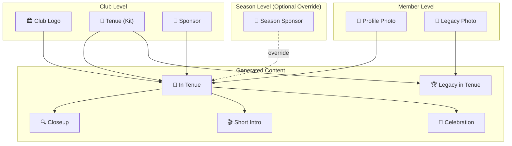
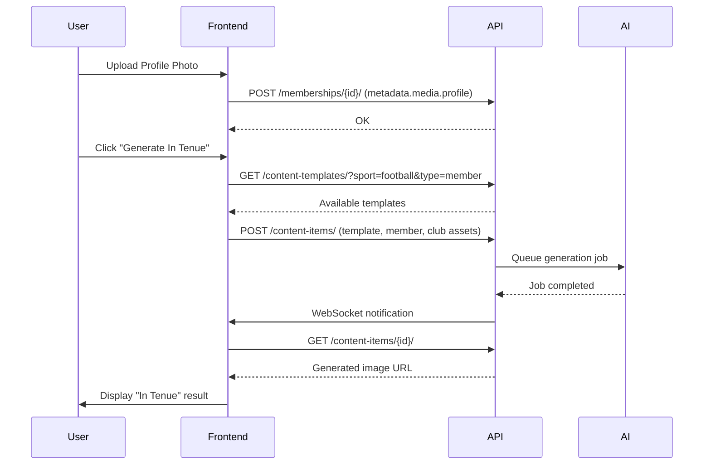

# TeamReel Templates & Content Generation Architecture

**Last Updated:** 2026-02-01
**Status:** ✅ Active
**Related Docs:**
- [TeamReel Data Structure](teamreel-data-structure.md) - Hierarchy overview
- [TeamReel Webapp Hierarchy](teamreel-webapp-hierarchy.md) - UI/Data mapping
- [TeamReel Navigation Model](teamreel-navigation-model.md) - Panel A/B structure

---

## 📋 Overview

TeamReel uses a **three-tier asset system** combined with **content templates** to generate personalized media content for clubs, seasons, and members.



---

## 1. Asset Hierarchy

### 1.1 Club Assets (Project Level)

**Location:** `/[org]/[club]?tab=assets`
**Storage:** `Project.metadata.teamreel_assets`

| Asset | Key | Required | Description |
|-------|-----|----------|-------------|
| 🏛️ Club Logo | `logo` | ✅ | Official club crest |
| 👕 Tenue (Kit) | `tenue` | ✅ | Kit/jersey template for photo generation |
| 💼 Sponsor | `sponsor` | ❌ | Main sponsor logo |

**Metadata Schema:**
```json
{
  "teamreel_assets": {
    "logo": { "url": "https://...", "caption": "Ajax logo" },
    "tenue": { "url": "https://...", "caption": "Home kit 2024/25" },
    "sponsor": { "url": "https://...", "caption": "Ziggo" }
  }
}
```

### 1.2 Season Assets (Period Level)

**Location:** Season Overview page
**Storage:** `Period.metadata.teamreel_assets`

| Asset | Key | Required | Description |
|-------|-----|----------|-------------|
| 💼 Season Sponsor | `sponsor` | ❌ | Override sponsor for this season (inherits from club if empty) |

**Inheritance Rule:** If `season.metadata.teamreel_assets.sponsor` is empty, use `club.metadata.teamreel_assets.sponsor`.

### 1.3 Member Assets (Membership Level)

**Location:** `/[org]/[club]/[team]/[season]/[member]`
**Storage:** `ProjectMembership.metadata.teamreel_assets.media`

| Slot | Key | Type | Description |
|------|-----|------|-------------|
| 👤 Profile Photo | `profile` | Input | Headshot or portrait |
| 📸 Legacy Photo | `legacy_photo` | Input | Historical photo of player |
| 👕 In Tenue | `kit` | Generated | Profile + Tenue → AI Generated |
| 🔍 Closeup | `closeup` | Generated | In Tenue → AI Generated image |
| 🎬 Short Intro | `intro` | Generated | In Tenue → AI Generated video |
| 🎉 Celebration | `celebration` | Generated | In Tenue → AI Generated video |
| 🏆 Legacy in Tenue | `legacy` | Generated | Legacy Photo + Legacy Tenue → AI Generated |

---

## 2. Content Templates

### 2.1 Database Model

**Table:** `content_generation_contenttemplate`

```python
class ContentTemplate(models.Model):
    # Identification
    name = CharField(max_length=200)
    description = TextField(null=True)

    # Categorization
    template_type = CharField(choices=TemplateType)      # WHEN: pre_match, post_match, member, etc.
    template_subtype = CharField(choices=TemplateSubtype) # WHAT: lineup, goal, intro, etc.

    # Sport filtering
    sport = ForeignKey(Sport)              # Filter by sport (null = universal)
    formation = ForeignKey(Formation)      # For lineup templates
    style_variant = CharField()            # Visual style: Modern, Classic, Neon

    # Ownership
    organisation = ForeignKey(Organisation)  # null = global template
    project = ForeignKey(Project)            # null = org-wide

    # AI Configuration
    ai_workflow_id = CharField()           # External AI pipeline ID
    template_settings = JSONField()        # AI-specific config
    input_requirements = JSONField()       # Required inputs schema

    # Cost & Status
    credits_required = PositiveIntegerField(default=1)
    is_active = BooleanField(default=True)
```

### 2.2 Template Types (WHEN)

| Type | Value | Description |
|------|-------|-------------|
| Pre-Match | `pre_match` | Content generated before a match |
| During Match | `during_match` | Real-time content during match |
| Post-Match | `post_match` | Content after match completion |
| Season | `season` | Season-level content |
| Member | `member` | Individual member content |
| Custom | `custom` | Custom/one-off templates |

### 2.3 Template Subtypes (WHAT)

| Category | Subtype | Description |
|----------|---------|-------------|
| **Pre-Match** | `flyer` | Match announcement flyer |
| | `lineup` | Lineup announcement |
| | `walkon` | Walk-on video |
| | `anthem` | Anthem video |
| **During Match** | `goal` | Goal celebration |
| | `score_update` | Score update graphic |
| **Post-Match** | `end_score` | Final score graphic |
| | `match_summary` | Match summary |
| | `highlights` | Highlights reel |
| **Season** | `transformation` | Then vs Now comparison |
| | `season_recap` | Season recap video |
| **Member** | `member_intro` | Short intro video |
| | `member_closeup` | Closeup video |
| | `member_celebration` | Personal celebration video |

---

## 3. Template ↔ Entity Relationships

### 3.1 Sport Filtering

Templates can be filtered by sport to ensure only relevant templates appear:

```
ContentTemplate.sport → Sport (e.g., Football 11v11)
                      ↓
Team.sport (inherited from Club if not set)
                      ↓
Competition.sport (sport variant, e.g., Futsal 5v5)
```

**Rule:** A template is available if:
- `template.sport` is NULL (universal), OR
- `template.sport` matches `competition.sport` OR `team.sport`

### 3.2 Formation Templates

For lineup templates, formations provide the player positions:

```
ContentTemplate (Lineup - 4-3-3 Modern)
       ↓
    formation → Formation (4-3-3)
                    ↓
                positions: [
                  {slot: 1, position: 'GK', x: 50, y: 90},
                  {slot: 2, position: 'LB', x: 15, y: 70},
                  ...
                ]
```

### 3.3 Organisation Scope

Templates have a hierarchical availability:

| Scope | `organisation` | `project` | Availability |
|-------|----------------|-----------|--------------|
| Global | NULL | NULL | All organisations (superadmin only) |
| Org-wide | Set | NULL | All projects in organisation |
| Project-specific | Set | Set | Only that project |

---

## 4. Content Generation Flow

### 4.1 In Tenue Generation Flow



### 4.2 Required Inputs for Member Content

| Content Type | Required Inputs | Optional Inputs |
|--------------|-----------------|-----------------|
| In Tenue | Profile Photo, Tenue, Logo | Sponsor |
| Closeup | In Tenue | - |
| Short Intro | In Tenue | - |
| Celebration | In Tenue | - |
| Legacy in Tenue | Legacy Photo, Legacy Tenue | Logo, Sponsor |

---

## 5. Frontend Implementation

### 5.1 Pages & Routes

| Page | Route | Purpose |
|------|-------|---------|
| Club Assets | `/[org]/[club]?tab=assets` | Upload club logo, tenue, sponsor |
| Season Overview | `/[org]/[club]/[team]/[season]` | View season sponsor override |
| Member Detail | `/[org]/[club]/[team]/[season]/[member]` | Upload photos, view generated content |
| Content Templates (Admin) | `/content-templates` | Manage templates (org admin) |
| Content Library | `/content-library` | Browse generated content |

### 5.2 Key Components

| Component | Location | Purpose |
|-----------|----------|---------|
| `ClubAssetsTab` | `pages/identity/detail/ClubAssetsTab.tsx` | Upload/view club assets |
| `SeasonAssetsCard` | `components/SeasonAssetsCard.tsx` | Season sponsor override |
| `ContentGenerationModal` | `pages/identity/ContentGenerationModal.tsx` | Template selection & generation |
| `MemberMediaForm` | Member detail page | Media slot management |

### 5.3 Constants

| File | Purpose |
|------|---------|
| `constants/clubAssets.ts` | Club & Season asset slot definitions |
| `constants/mediaSlots.ts` | Member media slot definitions (7 slots) |

---

## 6. API Endpoints

### 6.1 Templates

| Method | Endpoint | Description |
|--------|----------|-------------|
| GET | `/api/content-templates/` | List templates (filtered by org, sport, type) |
| POST | `/api/content-templates/` | Create template (org admin) |
| PATCH | `/api/content-templates/{id}/` | Update template |
| DELETE | `/api/content-templates/{id}/` | Delete template |

### 6.2 Content Items

| Method | Endpoint | Description |
|--------|----------|-------------|
| GET | `/api/content-items/` | List generated content |
| POST | `/api/content-items/` | Request new generation |
| GET | `/api/content-items/{id}/` | Get generation status/result |

---

## 7. Current Implementation Status

### ✅ Implemented

- [x] ContentTemplate model with all fields
- [x] TemplateType & TemplateSubtype enums
- [x] Sport ↔ Template relationship
- [x] Formation ↔ Template relationship
- [x] Club Assets tab (frontend)
- [x] Season Assets card (frontend)
- [x] Member media slots (7 slots)
- [x] Media Completion Matrix (Squad tab)
- [x] Content Templates admin page
- [x] Template API endpoints (CRUD)

### 🚧 In Progress

- [ ] AI pipeline integration (B34/B35)
- [ ] Content generation queue
- [ ] Real-time status updates (WebSocket)

### ❌ Not Started

- [ ] Batch generation (all squad members)
- [ ] Template preview
- [ ] Custom template builder
- [ ] Export/download generated content

---

## 8. Database Verification

### Template Count (Production)

```sql
SELECT template_type, COUNT(*)
FROM content_generation_contenttemplate
WHERE is_active = true
GROUP BY template_type;
```

### Templates with Formations

```sql
SELECT ct.name, f.code as formation, s.name as sport
FROM content_generation_contenttemplate ct
LEFT JOIN sport_configuration_formation f ON ct.formation_id = f.id
LEFT JOIN sport_configuration_sport s ON ct.sport_id = s.id
WHERE ct.formation_id IS NOT NULL;
```

---

## Appendix: Metadata JSON Schemas

### A. Club/Project Metadata

```json
{
  "teamreel_assets": {
    "logo": { "url": "string", "caption": "string" },
    "tenue": { "url": "string", "caption": "string" },
    "sponsor": { "url": "string", "caption": "string" }
  },
  "team_type": "field_11v11",
  "gender": "male"
}
```

### B. Season/Period Metadata

```json
{
  "teamreel_assets": {
    "sponsor": { "url": "string", "caption": "string" }
  }
}
```

### C. Membership Metadata

```json
{
  "position": "Midfielder",
  "shirt_number": 10,
  "functional_roles": ["Captain"],
  "teamreel_assets": {
    "media": {
      "profile": { "url": "string", "caption": "string" },
      "legacy_photo": { "url": "string", "caption": "string" },
      "kit": { "url": "string", "caption": "string" },
      "closeup": { "url": "string", "caption": "string" },
      "intro": { "url": "string", "caption": "string" },
      "celebration": { "url": "string", "caption": "string" },
      "legacy": { "url": "string", "caption": "string" }
    }
  }
}
```
