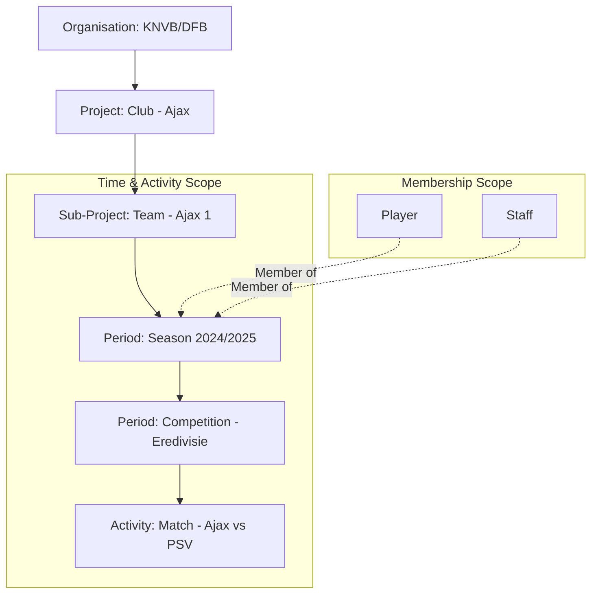

# TeamReel Data Structure Reference

**Last Updated:** 2026-01-08
**Purpose:** Document the hierarchical data model used in the TeamReel demo
**Related Docs:**
- [TeamReel Data Strategy](teamreel-data-strategy.md) - Architecture & Design Decisions
- [TeamReel Database Audit](teamreel-db-audit.md) - Current Database State
- [TeamReel Seeding Plan](teamreel-seeding-plan.md) - Seeding Procedures
- [index.md](index.md) - Documentation Overview

---

## 📋 Overview

TeamReel follows a **Club → Team → Season → Competition → Match** hierarchy, matching real-world football league management structures. This model applies to all seeded federations (KNVB, DFB, FIGC, The FA).

---

## 1. Hierarchy Overview

The structure follows a **Club → Team → Season → Competition → Match** hierarchy.



---

## 2. Detailed Structure

### Level 1: Organisation
The top-level container for the federation or league association.
*   **Model:** `Organisation`
*   **Examples:** `KNVB` (Netherlands), `DFB` (Germany), `FIGC` (Italy), `The FA` (England).
*   **Role:** Administrative root.

### Level 2: Club (Project)
Represents the main institutional entity.
*   **Model:** `Project`
*   **Parent:** `None` (Root Project)
*   **Examples:** `Ajax`, `Bayern München`, `Manchester City`.
*   **Key Characteristics:**
    *   Acts as an umbrella container.
    *   Typically has **0 members** directly assigned.
    *   Has **0 periods/seasons** directly assigned.

### Level 3: Team (Sub-Project)
Represents the specific squad or functional unit (e.g., First Team, U21, Women's Team).
*   **Model:** `Project` (with `parent_project` set to Club)
*   **Parent:** Club Project
*   **Examples:** `Ajax 1`, `Bayern München 1. Mannschaft`, `Inter Milan 1a Squadra`.
*   **Key Characteristics:**
    *   This is the primary "Work Unit".
    *   Seasons and Memberships are attached here.

### Level 4: Season (Team-Scoped Period)
The main time-bound container for a yearly campaign.
*   **Model:** `Period`
*   **Scope:** `project = Team` (e.g., Ajax 1)
*   **Examples:** `Season 2024/2025`.
*   **Key Characteristics:**
    *   **Players are Members here**: `ProjectMembership` links a `User` to the `Team` Project, but scoped to this specific `Period`.
    *   This ensures players are only active for that specific season.

### Level 5: Competition (Sub-Period)
Specific contexts within a season (League, Cup, Friendly).
*   **Model:** `Period` (with `parent_period` set to Season)
*   **Parent:** Season Period
*   **Examples:** `Eredivisie` (NL), `Bundesliga` (DE), `KNVB Beker`.
*   **Metadata:**
    *   `type`: `"league"`, `"cup"`, `"friendly"`.
*   **Key Characteristics:**
    *   Matches are linked to this specific period context.

### Level 6: Match (Activity)
The actual event.
*   **Model:** `Activity`
*   **Linked Project:** The Team (e.g., Ajax 1)
*   **Linked Period:** The Competition (e.g., Eredivisie)
*   **Key Fields:**
    *   `title`: `"Ajax vs PSV"`
    *   `activity_type`: `"match"`
    *   `start_time`: Timezone-aware datetime.
    *   `metadata`: Contains scores, home/away flags, etc.

---

## 3. Example Data Trace (Ajax)

| Level | Name | Details / Metadata |
| :--- | :--- | :--- |
| **Org** | `KNVB` | Federation |
| **Club** | `Ajax` | Parent Project (Container) |
| **Team** | `Ajax 1` | Child Project (The Squad) |
| **Season** | `Season 2024/2025` | **Period** on `Ajax 1`. Contains 22 Members (Players). |
| **Comp** | `Eredivisie` | **Sub-Period** of Season. `type: league`. |
| **Match** | `Ajax vs Feyenoord` | **Activity** linked to `Ajax 1` (Project) and `Eredivisie` (Period). |

## 4. Example Data Trace (Bayern München)

| Level | Name | Details / Metadata |
| :--- | :--- | :--- |
| **Org** | `DFB` | Federation |
| **Club** | `Bayern München` | Parent Project (Container) |
| **Team** | `1. Mannschaft` | Child Project (The Squad) |
| **Season** | `Season 2024/2025` | **Period** on `1. Mannschaft`. Contains 25 Members (Players). |
| **Comp** | `Bundesliga` | **Sub-Period** of Season. `type: league`. |

---

## 5. Technical Implementation Notes

### A. Database Table Names

The actual PostgreSQL table names differ from model names:

| Django Model | Database Table | App |
| :--- | :--- | :--- |
| `Organisation` | `organisations_organisation` | organisations |
| `Project` | `projects_project` | projects |
| `ProjectMembership` | `projects_membership` | projects |
| `Period` | `activities_period` | activities |
| `Activity` | `activities_activity` | activities |
| `AuditEvent` | `audit_events` | audit |

**Important:** When writing raw SQL queries or debugging FK constraints, use the database table names, not the model names.

### B. Seeding & Query Patterns

When seeding or querying:
1.  **Find the Team**: Don't dump members on the Club project (`parent_project=None`). Always look for the child project (`Ajax 1`).
2.  **Create Scope**: Create a `Period` tied to `project=team` (the Season).
3.  **Assign Members**: `ProjectMembership.objects.create(project=team, period=season, ...)`
4.  **Create Activities**: `Activity.objects.create(project=team, period=competition, ...)` where `competition.parent = season`.

### C. Temporal Membership Model

Users can be members of different teams over time, but **always one active membership** at any moment:

```python
# Example: Player transfers from Ajax to Feyenoord
# Season 2024/2025 at Ajax
ProjectMembership.objects.create(
    user=player,
    project=ajax_team,
    period=season_2024_2025,
    role="player",
    joined_at="2024-07-01"
)

# Season 2025/2026 at Feyenoord (new membership)
ProjectMembership.objects.create(
    user=player,
    project=feyenoord_team,
    period=season_2025_2026,
    role="player",
    joined_at="2025-07-01"
)
```

Each membership is scoped to:
- **Project (Team)**: The squad they belong to
- **Period (Season)**: The timeframe they're active
- **Organisation**: Derived from `project.organisation`

### D. Foreign Key Constraints & Deletion Order

When deleting entities with dependencies, respect this cascading order to avoid FK violations:

1. **Activities** (references `period_id` and `project_id`)
2. **Periods** (references `project_id` and `parent_period_id`)
3. **ProjectMemberships** (references `project_id` and `period_id`)
4. **Audit Events** (references `project_id`)
5. **Child Projects** (references `parent_project_id`)
6. **Parent Projects** (root level)

Example deletion command:
```sql
-- 1. Delete activities
DELETE FROM activities_activity WHERE period_id IN (SELECT id FROM activities_period WHERE project_id = <team_id>);
DELETE FROM activities_activity WHERE project_id = <team_id>;

-- 2. Delete periods
DELETE FROM activities_period WHERE project_id = <team_id>;

-- 3. Delete memberships
DELETE FROM projects_membership WHERE project_id = <team_id>;

-- 4. Delete audit events
DELETE FROM audit_events WHERE project_id = <team_id>;

-- 5. Delete the project
DELETE FROM projects_project WHERE id = <team_id>;
```

**Note:** Django signals (e.g., for search indexing via Celery) are bypassed when using raw SQL deletion.

---

## 6. Data Retrieval & Aggregation Guide

This section defines how to retrieve the counts and overviews required for dashboard views (like Organisation List).

### A. Membership Counts ("Why are Org members 0?")
There are two types of membership in the system. When building simple counters, specific queries are needed.

1.  **Direct Organisation Membership** (Admin Layer)
    *   **What:** Users with global roles (Federation Admin) or specific generic roles at the top level.
    *   **Query:** `OrganisationMembership.objects.filter(organisation=org)`
    *   **Typical Count:** Low (1-5 per federation).
    *   **Usage:** Access Control, Federation Management.

2.  **Project Membership** (The Data Layer)
    *   **What:** Players, Coaches, and Staff assigned to specific Teams.
    *   **Query:** `ProjectMembership.objects.filter(project__organisation=org)`
    *   **Typical Count:** High (Hundreds/Thousands).
    *   **Usage:** Rosters, Team assignments.
    *   **To Count "Total Players":** Count distinct Users in ProjectMemberships where `project__organisation=org`.

### B. Project Hierarchy Counts
Since Clubs and Teams share the `Project` model, they are distinguished by the `parent` field and depth.

| Metric | Query Logic | Description |
| :--- | :--- | :--- |
| **Total Clubs** | `Project.objects.filter(organisation=org, parent=None)` | Root-level projects only. |
| **Total Teams** | `Project.objects.filter(organisation=org, parent__isnull=False)` | Sub-projects (the actual squads). |

### C. Operational Volume (Seasons & Matches)
These metrics indicate the "activeness" of the organisation.

| Metric | Query Strategy | Performance Note |
| :--- | :--- | :--- |
| **Seasons** | `Period.objects.filter(project__organisation=org, type='season').count()` | Filter by `type` to exclude Competitions/Rounds. |
| **Matches** | `Activity.objects.filter(project__organisation=org, activity_type='match').count()` | Use index on `project__organisation`. |

### D. Frontend Integration Strategy
To show these stats on `OrganisationListPage` without N+1 queries:

1.  **Backend:** Ensure the `OrganisationSerializer` includes annotated counts (using `Count` and `Subquery`).
    *   `clubs_count`
    *   `teams_count`
    *   `total_members_count` (aggregated sub-projects)
    *   `matches_count`
2.  **Frontend:** Display "Members" as the `total_members_count` (reach), not just the admin count.

---

## 7. Audit Events & Observability

Every significant action (project creation, membership changes, activity updates) generates an **Audit Event**:

*   **Model:** `AuditEvent`
*   **Table:** `audit_events`
*   **Links To:** `project_id` (optional), `user_id`, `organisation_id`
*   **Purpose:** Compliance, debugging, activity feeds

### Audit Event Structure

```python
{
    "id": "uuid",
    "event_type": "project.created",
    "actor": "user@example.com",
    "project_id": "project-uuid",
    "organisation_id": "org-uuid",
    "timestamp": "2026-01-08T10:00:00Z",
    "metadata": {
        "project_name": "Ajax 1",
        "parent_project": "Ajax"
    }
}
```

**FK Constraint:** Audit events must be deleted before deleting the referenced project.

---

## 8. Common Pitfalls & Solutions

### Problem 1: "Why do Organisations show 0 members?"

**Cause:** Querying `OrganisationMembership` instead of `ProjectMembership`.

**Solution:**
```python
# ❌ Wrong (only shows admins)
member_count = OrganisationMembership.objects.filter(organisation=org).count()

# ✅ Correct (shows all players/staff)
member_count = ProjectMembership.objects.filter(project__organisation=org).values('user').distinct().count()
```

### Problem 2: "Users not appearing in Users list"

**Cause:** No `ProjectMembership` records exist linking users to teams.

**Solution:** Run membership seeding:
```bash
python manage.py seed_org_memberships
```

### Problem 3: "FK Constraint violation on deletion"

**Cause:** Django ORM cascades trigger signals (Celery tasks) that fail without Redis.

**Solution:** Use raw SQL deletion in correct order (see Section 5D).

### Problem 4: "Clubs have members but Teams don't"

**Cause:** Members assigned to Club (parent) instead of Team (child).

**Solution:** Always assign to **Team** (the Project with `parent_project_id != None`):
```python
# ❌ Wrong
club = Project.objects.get(name="Ajax", parent_project=None)
ProjectMembership.objects.create(project=club, ...)

# ✅ Correct
team = Project.objects.get(name="Ajax 1", parent_project__name="Ajax")
ProjectMembership.objects.create(project=team, period=season, ...)
```
