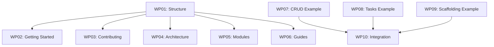

# Work Packages: B21 Docs and Examples

**Inputs**: Design documents from `kitty-specs/021-docs-examples/`
**Prerequisites**: plan.md ✓, spec.md ✓, research.md ✓

**Organization**: Fine-grained subtasks (`Txxx`) roll up into work packages (`WPxx`). Each work package is independently deliverable.

**Prompt Files**: Each work package references a matching prompt file in `kitty-specs/021-docs-examples/tasks/planned/`.

---

## Summary

| WP | Title | Priority | Subtasks | Effort | Dependencies |
|----|-------|----------|----------|--------|--------------|
| WP01 | Documentation Structure & Navigation | P0 | T001-T008 | 2-3h | None |
| WP02 | Getting Started Documentation | P1 | T009-T016 | 3-4h | WP01 |
| WP03 | Contributing Documentation | P1 | T017-T024 | 2-3h | WP01 |
| WP04 | Architecture Documentation | P2 | T025-T033 | 4-5h | WP01 |
| WP05 | Module Documentation | P2 | T034-T046 | 4-5h | WP01 |
| WP06 | API Guides & Troubleshooting | P2 | T047-T058 | 3-4h | WP01 |
| WP07 | CRUD API Example | P1 | T059-T068 | 3-4h | None |
| WP08 | Background Tasks Example | P2 | T069-T077 | 3-4h | None |
| WP09 | Scaffolding Demo Example | P2 | T078-T085 | 2-3h | None |
| WP10 | Integration & Polish | P3 | T086-T094 | 2-3h | WP07-09 |

**Total Subtasks**: 94
**Estimated Effort**: 25-35 hours

---

## Work Package WP01: Documentation Structure & Navigation (Priority: P0) 🎯 MVP ✅ DONE

**Goal**: Create MkDocs-compatible directory structure and reorganize existing docs.
**Independent Test**: `docs/` has all required section folders with index.md files; nav.yml exists.
**Prompt**: `tasks/done/WP01-docs-structure.md`

### Included Subtasks
- [x] T001 Create `docs/getting-started/` directory with `index.md`
- [x] T002 [P] Create `docs/architecture/` directory with `index.md`
- [x] T003 [P] Create `docs/guides/` directory with `index.md`
- [x] T004 [P] Create `docs/modules/` directory with `index.md`
- [x] T005 [P] Create `docs/contributing/` directory with `index.md`
- [x] T006 [P] Create `docs/troubleshooting/` directory with `index.md`
- [x] T007 Create `docs/assets/` directory for images
- [x] T008 Create `docs/nav.yml` navigation structure and placeholder `mkdocs.yml`

### T008 mkdocs.yml Content Specification

The placeholder `mkdocs.yml` MUST include:
```yaml
# Placeholder for future MkDocs deployment
# Uncomment and configure when ready to publish
# site_name: Django Core-App Documentation
# theme:
#   name: material
# nav: !include nav.yml
# plugins:
#   - search
# markdown_extensions:
#   - pymdownx.superfences:
#       custom_fences:
#         - name: mermaid
#           class: mermaid
```

### Implementation Notes
- Move existing loose files to appropriate folders (see research.md section 1.3)
- Keep `docs/adr/`, `docs/deployment/`, `docs/scaffolding/`, `docs/tasks/` as-is
- Create landing `docs/index.md` linking to all sections

### Parallel Opportunities
- T002-T006 can all proceed in parallel (different directories)

### Dependencies
- None (starting package)

### Risks & Mitigations
- Broken links after reorganization → Update relative links in moved files

---

## Work Package WP02: Getting Started Documentation (Priority: P1) 🎯 MVP ✅ DONE

**Goal**: Write onboarding documentation for new developers.
**Independent Test**: New developer follows quickstart.md and has working environment in 30 minutes.
**Prompt**: `tasks/done/WP02-getting-started.md`

### Included Subtasks
- [x] T009 Write `docs/getting-started/quickstart.md` (< 15 min to first run)
- [x] T010 [P] Write `docs/getting-started/prerequisites.md` (required tools list)
- [x] T011 [P] Write `docs/getting-started/first-contribution.md` (first PR workflow)
- [x] T012 [P] Write `docs/getting-started/project-structure.md` (directory layout)
- [x] T013 Update `docs/getting-started/index.md` with section overview
- [x] T014 Extract relevant content from `README.md` to getting-started docs
- [x] T015 Update `README.md` to link to getting-started docs
- [x] T016 Validate quickstart by following it on clean environment

### Implementation Notes
- Extract Getting Started section from README.md
- Include Docker and non-Docker setup options
- Add screenshots or command output examples where helpful

### Parallel Opportunities
- T010-T012 can proceed in parallel

### Dependencies
- WP01 (directory structure must exist)

### Risks & Mitigations
- Outdated commands → Test all commands before finalizing

---

## Work Package WP03: Contributing Documentation (Priority: P1) 🎯 MVP ✅ DONE

**Goal**: Document contribution workflow including Spec Kitty process.
**Independent Test**: Contributor reads spec-kitty-workflow.md and creates valid feature spec.
**Prompt**: `tasks/done/WP03-contributing-docs.md`

### Included Subtasks
- [x] T017 Write `docs/contributing/spec-kitty-workflow.md` (full lifecycle)
- [x] T018 [P] Write `docs/contributing/code-style.md` (Python conventions)
- [x] T019 [P] Write `docs/contributing/testing.md` (pytest patterns, coverage)
- [x] T020 [P] Write `docs/contributing/pr-guidelines.md` (PR process)
- [x] T021 Write `docs/contributing/updating-features.md` (modifying existing features)
- [x] T022 Update `docs/contributing/index.md` with section overview
- [x] T023 Consolidate `docs/testing.md` and `docs/TESTING_GUIDE.md` into contributing/testing.md
- [x] T024 Extract Development section from `README.md` to contributing docs

### Implementation Notes
- Document the full Spec Kitty workflow: specify → plan → tasks → implement → review → accept
- Reference `.kittify/` templates and scripts
- Include example spec snippets

### Parallel Opportunities
- T018-T020 can proceed in parallel

### Dependencies
- WP01 (directory structure must exist)

### Risks & Mitigations
- Workflow changes → Keep docs close to tooling, update together

---

## Work Package WP04: Architecture Documentation (Priority: P2) ✅ DONE

**Goal**: Document system architecture with Mermaid diagrams.
**Independent Test**: Tech lead reads overview.md and understands layering and extension points.
**Prompt**: `tasks/done/WP04-architecture-docs.md`

### Included Subtasks
- [x] T025 Write `docs/architecture/overview.md` with high-level Mermaid diagram
- [x] T026 [P] Write `docs/architecture/layers.md` (API/service/model layering)
- [x] T027 [P] Write `docs/architecture/data-model.md` (entity relationships)
- [x] T028 [P] Write `docs/architecture/request-flow.md` (request lifecycle)
- [x] T029 Write `docs/architecture/async-patterns.md` (Celery patterns)
- [x] T030 Write `docs/architecture/security-model.md` (security architecture)
- [x] T031 [P] Create `docs/architecture/adr/index.md` (ADR index)
- [x] T032 Update `docs/architecture/index.md` with section overview
- [x] T033 Link architecture docs from existing ADRs location (preserved backward compatibility)

### Implementation Notes
- Mermaid diagrams must render on GitHub
- Reference existing ADRs in docs/adr/
- Document constitutional principles and their enforcement

### Parallel Opportunities
- T026-T027 can proceed in parallel
- T029-T031 can proceed in parallel (different diagrams)

### Dependencies
- WP01 (directory structure must exist)

### Risks & Mitigations
- Diagrams too complex → Keep one concept per diagram

---

## Work Package WP05: Module Documentation (Priority: P2) ✅ DONE

**Goal**: Create consolidated documentation for each Core module.
**Independent Test**: Developer finds module doc and understands purpose, API, configuration.
**Prompt**: `tasks/done/WP05-module-docs.md`

### Included Subtasks
- [x] T034 Create `docs/modules/_template.md` (module documentation template)
- [x] T035 Write `docs/modules/accounts.md` (user auth, JWT, role system)
- [x] T036 [P] Write `docs/modules/organisations.md` (multi-tenancy, memberships)
- [x] T037 [P] Write `docs/modules/projects.md` (workspaces, archival)
- [x] T038 [P] Write `docs/modules/permissions.md` (RBAC, role assignments)
- [x] T039 [P] Write `docs/modules/audit.md` (event logging, immutability)
- [x] T040 [P] Write `docs/modules/settings.md` (feature flags, configuration)
- [x] T041 [P] Write `docs/modules/transactions.md` (ledgers, credits, double-entry)
- [x] T042 [P] Write `docs/modules/notifications.md` (multi-channel delivery)
- [x] T043 [P] Write `docs/modules/tasks.md` (Celery patterns, scheduling)
- [x] T044 [P] Write `docs/modules/api.md` (DRF standards, versioning)
- [x] T045 [P] Write `docs/modules/i18n.md` (locale management, translations)
- [x] T046 Update `docs/modules/index.md` with module overview and dependency diagram

### Implementation Notes
- Each module doc includes: Purpose, Key Concepts, Models, API Endpoints, Usage Examples, Configuration
- Link to Swagger UI for API details
- Reference relevant ADRs

### Parallel Opportunities
- T034-T045 can all proceed in parallel (different modules)

### Dependencies
- WP01 (directory structure must exist)

### Risks & Mitigations
- Module README drift → Consider automation later

---

## Work Package WP06: API Guides & Troubleshooting (Priority: P2)

**Goal**: Write conceptual API guides and troubleshooting documentation.
**Independent Test**: Developer reads auth guide and successfully makes authenticated request.
**Prompt**: `tasks/planned/WP06-guides-troubleshooting.md`

### Included Subtasks
- [ ] T047 Write `docs/guides/authentication.md` (JWT flow, token refresh)
- [ ] T048 [P] Write `docs/guides/permissions.md` (RBAC model)
- [ ] T049 [P] Write `docs/guides/pagination.md` (cursor pagination)
- [ ] T050 [P] Write `docs/guides/error-handling.md` (error response format)
- [ ] T051 Update `docs/guides/index.md` with section overview
- [ ] T052 Write `docs/troubleshooting/local-dev.md` (common local issues)
- [ ] T053 [P] Write `docs/troubleshooting/migrations.md` (migration problems)
- [ ] T054 [P] Write `docs/troubleshooting/auth.md` (auth debugging)
- [ ] T055 [P] Write `docs/troubleshooting/tasks.md` (Celery issues)
- [ ] T056 Update `docs/troubleshooting/index.md` with section overview
- [ ] T057 Move `docs/notifications-troubleshooting.md` to troubleshooting/
- [ ] T058 Move `docs/observability-troubleshooting.md` to troubleshooting/

### Implementation Notes
- Guides link to Swagger UI, don't duplicate API reference
- Include code examples with requests and responses
- Troubleshooting: common problems with step-by-step solutions

### Parallel Opportunities
- T048-T050 can proceed in parallel
- T053-T055 can proceed in parallel

### Dependencies
- WP01 (directory structure must exist)

### Risks & Mitigations
- API changes → Keep guides high-level, link to Swagger for details

---

## Work Package WP07: CRUD API Example (Priority: P1) 🎯 MVP ✅ DONE

**Goal**: Create minimal but realistic CRUD API example demonstrating Core patterns.
**Independent Test**: Run example smoke tests; copy example and adapt to new entity in <1 hour.
**Prompt**: `tasks/done/WP07-crud-api-example.md`

### Included Subtasks
- [x] T059 Create `examples/crud-api/` directory structure
- [x] T060 Create `examples/crud-api/models.py` (Note model with ForeignKey)
- [x] T061 [P] Create `examples/crud-api/serializers.py` (DRF serializers with validation)
- [x] T062 [P] Create `examples/crud-api/views.py` (ViewSet with permissions)
- [x] T063 Create `examples/crud-api/urls.py` (URL routing)
- [x] T064 Create `examples/crud-api/apps.py` (Django app config)
- [x] T065 Write `examples/crud-api/README.md` (walkthrough)
- [x] T066 Create `tests/examples/test_crud_api_smoke.py` (smoke tests)
- [x] T067 Create `tests/examples/__init__.py` and `conftest.py`
- [x] T068 CI smoke tests for example validation

### Implementation Notes
- Use Core auth and permissions
- Demonstrate cursor pagination
- Include proper error handling
- Smoke tests verify CRUD operations work

### Parallel Opportunities
- T061-T062 can proceed in parallel

### Dependencies
- None (can start immediately)

### Risks & Mitigations
- Example becomes too complex → Strict "minimal but realistic" principle

---

## Work Package WP08: Background Tasks Example (Priority: P2) ✅ DONE

**Goal**: Create example demonstrating Celery tasks with observability.
**Independent Test**: Run smoke tests; task executes and logs appear.
**Prompt**: `tasks/done/WP08-background-tasks-example.md`

### Included Subtasks
- [x] T069 Create `examples/background-tasks/` directory structure
- [x] T070 Create `examples/background-tasks/pyproject.toml` (Celery dependencies)
- [x] T071 Create `examples/background-tasks/tasks.py` (async tasks with retries, chains)
- [x] T072 Create `examples/background-tasks/scheduler.py` (periodic tasks, health checks)
- [x] T073 Create `examples/background-tasks/apps.py` (Django app config)
- [x] T074 Create `examples/background-tasks/models.py` (EmailLog model with status)
- [x] T075 Create `tests/examples/test_background_tasks_smoke.py` (smoke tests)
- [x] T076 Create `examples/background-tasks/tests/conftest.py` (Celery fixtures)
- [x] T077 Write `examples/background-tasks/README.md` (walkthrough)

### Implementation Notes
- Use B15 Celery setup
- Demonstrate ObservableTask from B18
- Show health check integration
- Smoke tests verify task execution

### Parallel Opportunities
- T071-T072 can proceed in parallel

### Dependencies
- None (can start immediately, assumes B15/B18 exist)

### Risks & Mitigations
- Redis unavailable in tests → Use Redis availability check from conftest.py

---

## Work Package WP09: Scaffolding Demo Example (Priority: P2)

**Goal**: Demonstrate Core Scaffolding CLI usage.
**Independent Test**: Run scaffolding commands and verify generated output.
**Prompt**: `tasks/planned/WP09-scaffolding-demo-example.md`

### Included Subtasks
- [ ] T078 Create `examples/scaffolding-demo/` directory structure
- [ ] T079 Write `examples/scaffolding-demo/README.md` (CLI walkthrough)
- [ ] T080 Document scaffolding commands with examples
- [ ] T081 Create `examples/scaffolding-demo/demo-output/` (sample generated app)
- [ ] T082 Create `tests/examples/test_scaffolding_demo_smoke.py` (smoke tests, `@pytest.mark.timeout(30)`)
- [ ] T083 Smoke test: CLI list templates
- [ ] T084 Smoke test: CLI generate minimal app
- [ ] T085 Smoke test: validate generated code passes Ruff

### Implementation Notes
- Use B20 scaffolding CLI
- Show all 4 built-in templates
- Demonstrate validation

### Parallel Opportunities
- Limited (sequential CLI operations)

### Dependencies
- None (assumes B20 exists)

### Risks & Mitigations
- CLI changes → Update demo when CLI changes

---

## Work Package WP10: Integration & Polish (Priority: P3)

**Goal**: Integrate examples with docs, finalize CI, validate all links.
**Independent Test**: All smoke tests pass in CI; no broken links.
**Prompt**: `tasks/planned/WP10-integration-polish.md`

### Included Subtasks
- [ ] T086 Write `docs/examples/index.md` (examples overview)
- [ ] T087 [P] Write `docs/examples/crud-api.md` (CRUD walkthrough in docs)
- [ ] T088 [P] Write `docs/examples/background-tasks.md` (tasks walkthrough in docs)
- [ ] T089 [P] Write `docs/examples/scaffolding-demo.md` (scaffolding walkthrough in docs)
- [ ] T090 Create `examples/README.md` (examples overview)
- [ ] T091 Add example smoke tests to CI pipeline
- [ ] T092 Add link validation check to CI
- [ ] T093 Update main `README.md` with docs reference
- [ ] T094 Final review: validate all success criteria from spec

### Implementation Notes
- CI should run `pytest tests/examples/` as separate job
- Consider markdown-link-check for link validation
- Update README.md to be concise with links to docs/

### Parallel Opportunities
- T087-T089 can proceed in parallel

### Dependencies
- WP07, WP08, WP09 (examples must exist)

### Risks & Mitigations
- CI flakiness → Use proper pytest markers and stable fixtures

---

## Dependency & Execution Summary



### Execution Sequence

**Phase 1 - Foundation (can start immediately)**:
- WP01 (structure) - FIRST
- WP07 (CRUD example) - parallel with WP01

**Phase 2 - Documentation (after WP01)**:
- WP02, WP03 (getting started, contributing) - parallel
- WP04, WP05, WP06 (architecture, modules, guides) - parallel

**Phase 3 - Examples (can start in Phase 1)**:
- WP08 (background tasks) - parallel with WP07
- WP09 (scaffolding demo) - parallel with WP08

**Phase 4 - Integration (after Phase 2 & 3)**:
- WP10 (integration, CI, polish) - LAST

### MVP Scope

**Minimum Viable Release**: WP01 + WP02 + WP03 + WP07
- Documentation structure in place
- Getting started docs complete
- Contributing docs complete
- One working example with smoke tests

---

## Subtask Index

| ID | Summary | WP | Priority | Parallel |
|----|---------|-------|----------|----------|
| T001 | Create getting-started directory | WP01 | P0 | No |
| T002 | Create architecture directory | WP01 | P0 | Yes |
| T003 | Create guides directory | WP01 | P0 | Yes |
| T004 | Create modules directory | WP01 | P0 | Yes |
| T005 | Create contributing directory | WP01 | P0 | Yes |
| T006 | Create troubleshooting directory | WP01 | P0 | Yes |
| T007 | Create assets directory | WP01 | P0 | No |
| T008 | Create nav.yml and mkdocs.yml | WP01 | P0 | No |
| T009 | Write quickstart.md | WP02 | P1 | No |
| T010 | Write prerequisites.md | WP02 | P1 | Yes |
| T011 | Write first-contribution.md | WP02 | P1 | Yes |
| T012 | Write project-structure.md | WP02 | P1 | Yes |
| T013 | Update getting-started index | WP02 | P1 | No |
| T014 | Extract README content | WP02 | P1 | No |
| T015 | Update README with links | WP02 | P1 | No |
| T016 | Validate quickstart | WP02 | P1 | No |
| T017 | Write spec-kitty-workflow.md | WP03 | P1 | No |
| T018 | Write code-style.md | WP03 | P1 | Yes |
| T019 | Write testing.md | WP03 | P1 | Yes |
| T020 | Write pr-guidelines.md | WP03 | P1 | Yes |
| T021 | Write updating-features.md | WP03 | P1 | No |
| T022 | Update contributing index | WP03 | P1 | No |
| T023 | Consolidate testing docs | WP03 | P1 | No |
| T024 | Extract README Development | WP03 | P1 | No |
| T025 | Write architecture overview | WP04 | P2 | No |
| T026 | Write layers.md | WP04 | P2 | Yes |
| T027 | Write extension-points.md | WP04 | P2 | Yes |
| T028 | Create ADR index | WP04 | P2 | No |
| T029 | Mermaid: system components | WP04 | P2 | Yes |
| T030 | Mermaid: request flow | WP04 | P2 | Yes |
| T031 | Mermaid: module dependencies | WP04 | P2 | Yes |
| T032 | Update architecture index | WP04 | P2 | No |
| T033 | Link from docs index | WP04 | P2 | No |
| T034 | Write accounts.md | WP05 | P2 | Yes |
| T035 | Write organisations.md | WP05 | P2 | Yes |
| T036 | Write projects.md | WP05 | P2 | Yes |
| T037 | Write permissions.md | WP05 | P2 | Yes |
| T038 | Write audit.md | WP05 | P2 | Yes |
| T039 | Write tasks.md | WP05 | P2 | Yes |
| T040 | Write notifications.md | WP05 | P2 | Yes |
| T041 | Write transactions.md | WP05 | P2 | Yes |
| T042 | Write settings.md | WP05 | P2 | Yes |
| T043 | Write observability.md | WP05 | P2 | Yes |
| T044 | Write security-baseline.md | WP05 | P2 | Yes |
| T045 | Write scaffolding.md | WP05 | P2 | Yes |
| T046 | Update modules index | WP05 | P2 | No |
| T047 | Write authentication.md | WP06 | P2 | No |
| T048 | Write permissions guide | WP06 | P2 | Yes |
| T049 | Write pagination.md | WP06 | P2 | Yes |
| T050 | Write error-handling.md | WP06 | P2 | Yes |
| T051 | Update guides index | WP06 | P2 | No |
| T052 | Write local-dev troubleshooting | WP06 | P2 | No |
| T053 | Write migrations troubleshooting | WP06 | P2 | Yes |
| T054 | Write auth troubleshooting | WP06 | P2 | Yes |
| T055 | Write tasks troubleshooting | WP06 | P2 | Yes |
| T056 | Update troubleshooting index | WP06 | P2 | No |
| T057 | Move notifications-troubleshooting | WP06 | P2 | No |
| T058 | Move observability-troubleshooting | WP06 | P2 | No |
| T059 | Create crud-api directory | WP07 | P1 | No |
| T060 | Create models.py | WP07 | P1 | No |
| T061 | Create serializers.py | WP07 | P1 | Yes |
| T062 | Create views.py | WP07 | P1 | Yes |
| T063 | Create urls.py | WP07 | P1 | No |
| T064 | Create apps.py | WP07 | P1 | No |
| T065 | Write example README | WP07 | P1 | No |
| T066 | Create smoke tests | WP07 | P1 | No |
| T067 | Create test init/conftest | WP07 | P1 | No |
| T068 | Register in test settings | WP07 | P1 | No |
| T069 | Create background-tasks directory | WP08 | P2 | No |
| T070 | Create tasks.py | WP08 | P2 | No |
| T071 | Create health.py | WP08 | P2 | Yes |
| T072 | Create signals.py | WP08 | P2 | Yes |
| T073 | Create apps.py | WP08 | P2 | No |
| T074 | Write example README | WP08 | P2 | No |
| T075 | Create smoke tests | WP08 | P2 | No |
| T076 | Demonstrate logging/metrics | WP08 | P2 | No |
| T077 | Register in test settings | WP08 | P2 | No |
| T078 | Create scaffolding-demo directory | WP09 | P2 | No |
| T079 | Write demo README | WP09 | P2 | No |
| T080 | Document CLI commands | WP09 | P2 | No |
| T081 | Create demo output | WP09 | P2 | No |
| T082 | Create smoke tests | WP09 | P2 | No |
| T083 | Smoke: list templates | WP09 | P2 | No |
| T084 | Smoke: generate app | WP09 | P2 | No |
| T085 | Smoke: validate generated code | WP09 | P2 | No |
| T086 | Write examples index in docs | WP10 | P3 | No |
| T087 | Write crud-api walkthrough | WP10 | P3 | Yes |
| T088 | Write background-tasks walkthrough | WP10 | P3 | Yes |
| T089 | Write scaffolding walkthrough | WP10 | P3 | Yes |
| T090 | Create examples README | WP10 | P3 | No |
| T091 | Add tests to CI | WP10 | P3 | No |
| T092 | Add link validation to CI | WP10 | P3 | No |
| T093 | Update main README | WP10 | P3 | No |
| T094 | Final validation | WP10 | P3 | No |

---

**End of Tasks**
